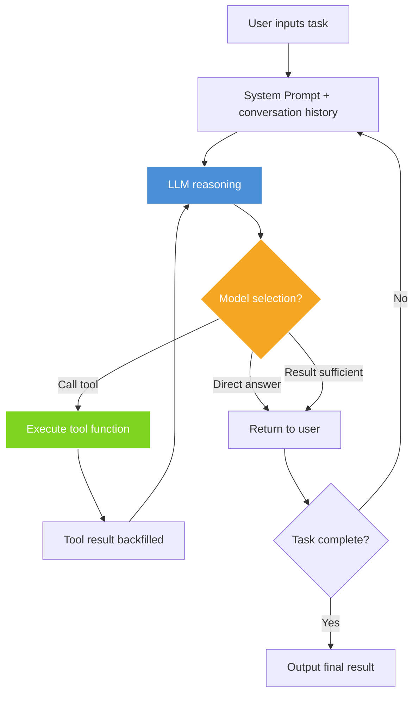

## Three People Can't Beat One Agent

March 2025. Yason stared at last month's payroll and the freelance invoices, speechless.

Three people on the team, nearly ¥100k in monthly spend. But the actual useful code and business output boiled down to maybe 1.5 people's worth. Not that anyone was slacking — meetings, alignment, requirement confirmation, design reviews, waiting on dependencies, fixing environments, waiting for approvals... the time those ate up, nobody dared put it in the weekly report.

What's deadlier: **the bigger the team, the exponentially worse the communication overhead.**

With three people, the communication paths are 3 (A↔B, B↔C, A↔C). But the gaps in knowledge go far beyond that — A assumes B knows, B assumes C did it, C assumes A is handling it. The whole day leaks away in those "assumes."

> Human attention is finite; an Agent's attention only depends on its token window. That's the most fundamental efficiency gap.

## The Sleepless Night

At the time, Yason was managing three servers (Rex, Robot, Neo), with day-to-day ops watched by humans. One night at 2 a.m., a server's disk filled up. The monitoring alert fired, but nobody was on call. It wasn't until 10 a.m., when users reported "can't open it," that anyone noticed.

That night Yason couldn't sleep — lying in bed he thought: **what if there were an Agent watching 24/7, fixing problems the moment it finds them, without even needing a human to get out of bed?**

The next day, he got to work.

## Agent != Tool

A lot of people treat Agents like tools: write a script for a cron job, set up an automation flow. That's fine, but it's thinking small.

A tool moves only when you poke it. An Agent is given a goal and figures out the how itself.

The first time Yason realized the difference was when he gave Kai (his first Agent) a task: "Go figure out why Rex's memory keeps climbing."

Kai didn't just check the memory — it also found a log file with rotation (log rotation) not enabled, **on the side** wrote a fix script, and added a section to its next report: "Rex server health-check recommendations."

> Human work style: wait for instructions → finish the task
> Agent work style: understand the goal → break it down autonomously → execute → proactively report back → suggest optimizations

There's a classic software-engineering law — Conway's Law: the architecture of a system mirrors the communication structure of the organization that built it. This law holds for Agent teams too: the structure of your Agent team determines the shape of the system it can deliver. If you manage Agents the way you manage people (give orders, wait for results, chase progress), you just get a cheaper labor pool. Only if you manage Agents the way you'd manage a CEO (give goals, give resources, give boundaries) do you get a truly self-driven team.

That's the essence of "Agent != Tool."

## Real Data: 70% vs 60%

Three months later, Yason did the math (based on actual operating data from his three servers, full-month February stats):

| Item | Human team | Agent team |
|-|-|-|
| Monthly spend | ~¥100k | ~¥30k |
| Delivery speed | 5–7 days/feature | 2–3 days/feature |
| Coverage hours | 9 hours/day | 24 hours/day |
| Parallel capacity | 1–2 tasks | 5–8 tasks |
| Turnover risk | High | Zero |

Cost down ~70%, delivery ~60% faster. Note these numbers are based on Yason's own team comparison; your reality may differ. The point isn't the precise numbers — it's that **Agents free up human bandwidth, letting people do the 30% only humans can do.**

June 2026. At Fortune Brainstorm Tech, Boris Cherny, head of Anthropic's Claude Code, said something that silenced the entire developer community — he hadn't written a single line of code by hand in 8 straight months. Instead, every morning he launches hundreds to tens of thousands of Agents from his phone to work while he sleeps. These Agents call each other, review each other's code, auto-fix bugs, even write Agents to manage other Agents. This isn't the future — it's the reality of 2026. This book teaches you exactly how to build your own Agent team from scratch, even if you start from a single laptop.

In that same month (May 20, 2026), Tencent released Marvis, an OS-level AI assistant, with 6 Agent teams built in: 1 supervisor Agent + 5 specialized Agents (file, system, app, browser, search), giving away 10 million tokens a day. Domestic users can fire up a multi-Agent collaboration system the moment they open their computer — this is no longer a niche technology. The architecture philosophy of this book mirrors Marvis — except we use a more flexible, more controllable hand-built approach.

Also worth noting: at Google I/O 2026, Google announced Gemini would soon get "autonomous Agent capability" — users can directly have Gemini run cross-app tasks in the background, no real-time watching needed. Cognition Labs' Devin evolved from "an AI programmer" into an "AI dev team" between 2025–2026, where in a single session Devin auto-spawns Sub-Agents to handle different modules. On the open-source side, Microsoft's AutoGen 0.4 introduced an event-driven inter-Agent communication protocol, supporting cross-process, cross-machine Agent orchestration. Kimi's Moonshot also launched Swarm mode in 2026, allowing free-form topology Agent fleets — tree decomposition, broadcast aggregation, multi-round debate, all defined in a single Config file.

Three trends converge into one direction: **Agent teams are evolving from a handcraft workshop into an industrial standard.**

## You Don't Need to Be a Programmer's Boss

You've probably run into Yason's situation: you understand the business, have ideas, know what should be done — but you depend on programmers to make it real. You talk through a requirement for ages, and what comes back still isn't what you wanted. Change it? They say "the code doesn't support that." Pivot? They say "this needs a full architecture redesign."

Agents have no such problem.

Agents won't argue back (unless you tell them to), won't slack off, won't say "this can't be done" and then go play games. An Agent will say: "I tried three implementations of this approach, I recommend the third, because..."

> You don't need to become a programmer. You need to become the CEO of your Agents.

## But That Doesn't Mean Zero Cost

If the data above has you fired up and ready to start, take a few seconds to cool down.

Building an Agent team means climbing two mountains:

1. **Technical threshold**: lower than writing business code, but you still need a basic grasp of APIs, Prompts, Git, and the command line
2. **Mindset shift**: going from "managing people" to "managing Agents" is a completely different management philosophy

The first you can patch up in a few days. The second — some people never make it in a lifetime.

This book's 21 days is meant to help you climb both mountains.

## Which Stage Are You At?

After extensive practice, the industry has reached a consensus on Agent-team maturity:

| Stage | Traits | Implementation notes | Typical tools/frameworks |
|-|-|-|-|
| L1: Single Agent | One Agent does fixed automation tasks, maintained by 1 person | Single-turn or short conversation loop, fixed System Prompt + 2–3 tool functions, no state persistence | OpenAI Assistants API / Claude API + MCP |
| L2: Multi-Agent collaboration | 2–3 Agents with division of labor, manually coordinated, managed by 1 person | Each Agent in its own process/thread, exchanging results via files or message queue; human handles forwarding and arbitration | Claude Code + shell scripts / LangGraph passthrough |
| L3: Supervisor-Worker | One supervisor Agent schedules multiple Workers, supervised by 1 person | Supervisor has routing logic (LLM-as-router), Workers register by capability, results aggregated | LangGraph Supervisor / CrewAI hierarchical |
| L4: Agent fleet | 10+ Agents in parallel, with Inspector, auto-review, semi-supervised by 1 person | Checkpoint persistence, audit logs, auto-Review Agent as a quality gate on output, cost tracking | AutoGen / Kimi Swarm + Agent Monitor |
| L5: Self-organizing | Agents auto-break-down tasks, assign, execute, post-mortem, unattended | Task graph auto-generated, Agents self-register/self-deregister, post-mortem written to experience base after execution, dynamic optimization | LangGraph + Checkpoint + Custom Replay Engine |

Goal of this book: take you from L0 to L3 in 21 days. L4 and L5 are your evolution path beyond.



## Hands-On: A Production-Grade Agent

Before diving into the main content, let me give you a taste of how simple defining an Agent is. The Python script below is an Agent you can take straight from dev to production — it has a system prompt, tool definition, error retry, log tracing, and a full decision loop:

```python
import json
import logging
import subprocess
import time
from datetime import datetime
from typing import Any

import openai

logging.basicConfig(
    level=logging.INFO,
    format="%(asctime)s [%(name)s] %(levelname)s: %(message)s",
)
log = logging.getLogger("agent")

class RetryError(Exception):
    """Exception raised after all retries are exhausted."""

def with_retry(fn, max_retries=3, base_delay=1.0):
    """Exponential-backoff retry decorator."""
    for attempt in range(1, max_retries + 1):
        try:
            return fn()
        except Exception as e:
            log.warning("Attempt %d/%d failed: %s", attempt, max_retries, e)
            if attempt == max_retries:
                raise RetryError(f"All {max_retries} retries exhausted") from e
            time.sleep(base_delay * (2 ** (attempt - 1)))

def run_cmd(cmd: str, timeout: int = 30) -> dict:
    """Safely execute a shell command (high-risk ops blocked)."""
    forbidden = ["rm -rf", "mkfs", "dd if=", "> /dev/"]
    if any(kw in cmd for kw in forbidden):
        return {"status": "rejected", "reason": "High-risk command blocked"}
    try:
        r = subprocess.run(
            cmd.split(), capture_output=True, text=True, timeout=timeout
        )
        return {
            "status": "ok" if r.returncode == 0 else "error",
            "stdout": r.stdout[-2000:],
            "stderr": r.stderr[-1000:],
            "returncode": r.returncode,
        }
    except subprocess.TimeoutExpired:
        return {"status": "error", "stdout": "", "stderr": f"Command timed out ({timeout}s)"}
    except FileNotFoundError:
        return {"status": "error", "stdout": "", "stderr": f"Command not found: {cmd}"}

TOOLS = [
    {
        "type": "function",
        "function": {
            "name": "run_cmd",
            "description": "Execute a shell command and return its output",
            "parameters": {
                "type": "object",
                "properties": {
                    "cmd": {"type": "string", "description": "Command to execute"},
                    "timeout": {"type": "integer", "description": "Timeout in seconds", "default": 30},
                },
                "required": ["cmd"],
            },
        },
    }
]

def agent_loop(task: str, model: str = "gpt-4o", max_turns: int = 10) -> str:
    """Multi-turn Agent decision loop."""
    messages = [
        {
            "role": "system",
            "content": (
                "You are YasonBot, an ops Agent. Your way of working:\n"
                "1. Analyze the user's problem\n"
                "2. If a command needs to run, call run_cmd\n"
                "3. Analyze the command output, decide next action\n"
                "4. When the problem is solved or no action needed, give a summary\n"
                "⚠️ Never run destructive operations like rm -rf, mkfs"
            ),
        },
        {"role": "user", "content": task},
    ]

    for turn in range(max_turns):
        log.info("Turn %d, messages=%d", turn + 1, len(messages))

        def _call():
            return openai.chat.completions.create(
                model=model, messages=messages, tools=TOOLS
            )

        resp = with_retry(_call, max_retries=2)
        msg = resp.choices[0].message
        messages.append(msg)

        if not msg.tool_calls:
            return msg.content  # Agent decides to reply directly

        for tc in msg.tool_calls:
            args = json.loads(tc.function.arguments)
            log.info("Tool call: %s(%s)", tc.function.name, args)
            result = run_cmd(**args)
            log.info("Tool result: %s", result["status"])
            messages.append({
                "role": "tool",
                "tool_call_id": tc.id,
                "content": json.dumps(result, ensure_ascii=False),
            })

    return messages[-1].content or "Max turns reached without final answer."

# Test
if __name__ == "__main__":
    print(agent_loop("The server's disk usage hit 92%, what do I do?"))
```

This code has several production-grade designs you'll see repeatedly in later chapters:

| Concern | Implementation |
|-|-|
| Security control | `run_cmd()` has a built-in high-risk command filter, rejecting operations like `rm -rf` |
| Error handling | Retry mechanism (exponential backoff), command timeout guard, unified `FileNotFoundError` capture |
| Observability | Python logging module outputs per-turn time, call content, result status |
| Configurability | `max_turns` caps loop count to prevent runaway; `model` parameter selects different models |
| Tool signature | Complete JSON Schema (with `description`), so the model knows when to use which parameter |

Within 5 minutes, you already have your first **near production-ready** Agent prototype — system prompt + safe tool + retry and logging + decision loop. That's the entire starting point of an Agent. The next 20 chapters layer real-world complexity on top of this foundation.

## Don't Reinvent the Wheel

Before you start building, one line that might change how you read this book: **this book is not about building an Agent framework from scratch.**

GitHub already has plenty of ready-to-use Agent skill packs, System Prompt templates, and tool plugins. For example, Awesome System Prompt collects over a hundred battle-tested Agent role definitions; OpenAI's and Anthropic's Playgrounds have complete Agent config examples; the community-maintained MCP Server list covers integrations for nearly every common service from GitHub to Slack to Postgres. Want to save tokens? The community has mature context-compaction libraries (context-compactor). Want your Agent to behave better? The community has Prompt optimization tools (promptfoo, DeepEval).

This book teaches **how to assemble these parts into an efficiently running Agent team**, not how to build the parts yourself. At every specific scenario, I'll tell you where to find ready-made tools, when to write your own, and when to just use the community's.

## Chapter Summary

- Small-team communication overhead is far larger than you imagine; Agents eliminate it
- Agents are goal-driven, self-motivated entities, not passively executing tools
- Real deployment can save a team 50–70% in cost and speed delivery 40–60%
- Your role shifts: from team boss → CEO of the Agent team

---

> **Next chapter preview**: What Agent teams can and can't do — the story of Yason facepalming over "redesigned the whole UI," and why boundary management matters.

*This article is from the column 'Being the Boss of AI', the full series is continuously updated:*[*GitHub - VokoForge/ai-prism*](https://github.com/VokoForge/ai-prism)
