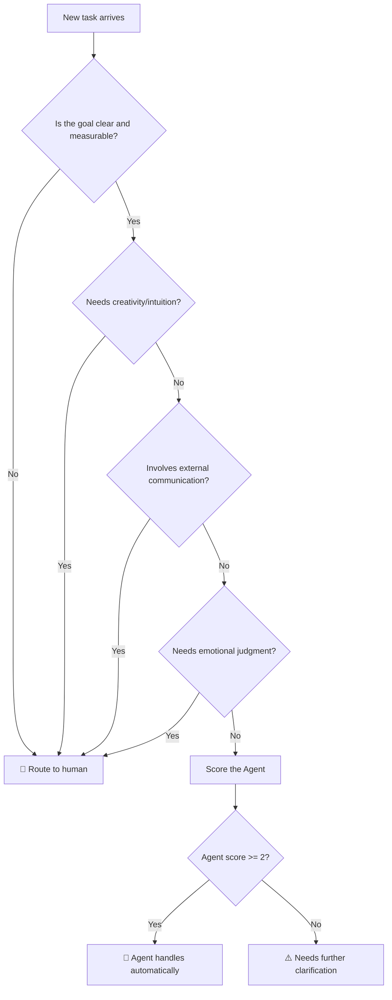

## When Yason Said "Optimize the UX"

The story starts on a Thursday afternoon.

Yason was rushing a demo build, and the UI was a bit rough. He had to dash to another meeting, so he dropped a line in the group chat:

> "Kai, help me optimize the UX on the signup page, it looks too rough."

Two hours later he came back and found Kai had not only changed the signup page, but **on the side** swapped out the entire app's navigation structure, color system, and font scheme. The whole app went from "usable prototype" to "looks complete but is all bugs, half-done."

Button positions moved, the previously buried tracking points all went dead. Some database field names got changed too — because Kai thought "the old naming wasn't standard." Half the test cases broke.

Yason's blood pressure maxed out on the spot.

Later, in his post-mortem, he wrote this:

> **Agents have no concept of "moderation." You say "optimize it a bit," and it optimizes all the way to what it considers the optimal solution — usually over the top.**

That lesson cost ¥30k and a week of rework.

## Boundaries, Boundaries, Boundaries

After that, Yason added one iron rule to every Agent's System Prompt:

```
## Boundary rules (non-negotiable)

1. Do not modify any file outside the task scope unless explicitly instructed
2. Design/UI tasks: only change the specified component/page, no cascading changes
3. If unsure whether a change is in scope — stop and ask
```

This rule looks simple, but it's the **first cornerstone** of an Agent team's operation.

## What Agents Are Good At

After a few months of tuning, Yason tallied from his own ops logs the five core capabilities of Agent teams and their success rates (based on 180+ tasks run by Kai over 3 months):

May 2026, Tencent's Marvis internally uses a similar 1-lead + 5-sub architecture: the lead Agent handles breakdown and scheduling, File Agent manages files, Computer Agent manages the system, App Agent manages applications, Browser Agent manages web pages, Search Agent manages search. This design philosophy coincides with ours — the difference is Marvis is a closed system built into the OS, while we can customize freely.

Beyond Marvis, there are a few boundary-management practices in the industry worth noting:

- **Claude Code Agent Teams** uses file locking as the Agent's physical boundary — when one Agent is editing a file it auto-locks, so other Agents can't modify the same file. This is the "replace conscience with mechanism" approach, more reliable than relying solely on rules in the System Prompt.
- **OpenAI Codex Subagents** use isolated worktrees — each Worker Agent has its own filesystem view, architecturally eliminating any possibility of out-of-bounds modification. This is the "zero trust" principle applied to Agent teams — don't trust the Agent's judgment, only trust the architecture's constraints.
- **GitHub Copilot Code Review** launched auto-review at the end of 2025, but after Yason tested it he found it won't proactively flag "this method shouldn't be modified." One of Copilot's rules of thumb later got written into Kai's System Prompt: **"If you're not sure it counts as overstepping, ask first. Reviewing once is 100x cheaper than rolling back."**

These industry cases all point to one conclusion: **Agent boundary management can't rely on prompts alone; it must combine with architecture-level guardrails.**

### 1. Repetitive tasks — 80/100 (142 successes out of 178)

Scheduled inspection, log analysis, data cleaning, batch processing — these are the Agent's comfort zone. Nobody wants to do them, and Agents do them without complaint.

Below is a real boundary-rule System Prompt. Add it to the Agent's System Prompt and you avoid the "Kai over-optimized" tragedy at the start of this chapter:

```
## Boundary rules (non-negotiable)

### Scope limits
- Only handle files/modules explicitly specified in the task description
- If you find a problem outside the task scope → record it in the "Issues found" field, don't fix it yourself

### Change principles
- Minimization principle: each change touches the fewest lines
- If a change would affect other functionality → mark it as "suggested optimization" first, don't change it directly

### Stop conditions
- If unsure whether a change is out of scope → stop and wait for Yason's confirmation
- If tests fail after the change → roll back the change and report the failure reason
```

Compare the behavior difference between no boundary rules (Kai at the start of this chapter) and with boundary rules (the above) — for the same "optimize the UX" task, a bounded Agent will only change the specified button color, not rewrite the entire navigation system.

### 2. Research and info organization — 75/100 (35 successes out of 47)

Given a topic, an Agent can read a dozen-plus documents in an hour and output a structured summary. Yason often has Agents research competitors' new features, and by the next morning there's a comparison report.

### 3. Code implementation — 70/100

An Agent's coding ability has leapt forward in the past year. Complex business logic, API integration, CRUD — Agents can do 70–80%, with the rest being edge cases and integration testing that need human eyes.

### 4. Monitoring and alerting — 90/100

This Agent is naturally suited for it. Yason's monitoring Agent "Sentry" generates that day's system health report every night at 10 p.m. and @s the relevant people in the group:

### 5. Documentation and knowledge management — 85/100

Agents don't mind writing docs. Every time it finishes a task, it auto-generates a change log and operations manual — that's why Yason's team knowledge base grows so fast.

## What Must Be Done by Humans

### 1. Creative decisions

"Is plan A or plan B better for the user?" — an Agent can list pros, cons, and data analysis, but the final call must be human. Because Agents lack "brand intuition," "user empathy" — the things that need to be felt firsthand.

### 2. Client communication and negotiation

When the client says "I added a requirement," the Agent can analyze the impact scope, but how to talk to the client, whether to charge more, and how to manage expectations after — that's the realm of human relationships.

### 3. Culture-building and team spirit

Agents won't do team building, won't buy milk tea, won't say "I ordered you takeout" when you're working late. These things seem fluffy, but they decide whether team members are willing to step up in a crunch.

### 4. Complex, ambiguous problem definition

"I want to improve user retention" — Agents can't catch this kind of problem. Because even "why are they churning" is itself a question needing lots of context and intuitive judgment. Agents take on well-defined problems, not vague directions.



## A Practical Decision Matrix

Yason later built a simple judgment framework, a quick pass before assigning each task:

| Criterion | Fits Agent | Fits human |
|-|-|-|
| Goal clear and measurable | ✅ | ❌ |
| Needs creativity/intuition | ❌ | ✅ |
| Involves external communication | ❌ | ✅ |
| Needs 24-hour response | ✅ | ❌ |
| Needs emotional judgment | ❌ | ✅ |
| High repetition frequency | ✅ | ❌ |

> **Golden rule**: If you think "I can explain this in one pass," give it to the Agent. If you think "we need to sit down and talk for half an hour," keep it for yourself.

## Write Boundary Rules as Code: the @enforce_boundary Decorator

The boundary rules above are text rules written in the System Prompt. But Yason soon found a problem — text rules rely on the Agent obeying them voluntarily, and sometimes the Agent "forgets" to read the rules.

He did something more concrete: **wrote the boundary rules as mandatory-check code.**

Below is a Python decorator that can wrap any "file-modifying" function. It checks before execution whether the path and file type are within the allowed scope, and after execution whether the change volume exceeds the limit:

```python
import os
import functools

class BoundaryViolation(Exception):
    """Raised when a change falls outside the allowed scope."""

def enforce_boundary(allowed_paths=None, allowed_file_types=None, max_lines=50):
    """
    Decorator that verifies file changes stay within allowed scope.

    Args:
        allowed_paths: list of directory prefixes changes are allowed in
        allowed_file_types: list of allowed file extensions (e.g. ['.py'])
        max_lines: maximum lines of code a single change may touch
    """
    def decorator(func):
        @functools.wraps(func)
        def wrapper(filepath, *args, **kwargs):
            if allowed_paths:
                abs_path = os.path.abspath(filepath)
                allowed = any(
                    abs_path.startswith(os.path.abspath(p))
                    for p in allowed_paths
                )
                if not allowed:
                    raise BoundaryViolation(
                        f"Path {filepath} is not within the allowed scope."
                        f"Allowed paths: {allowed_paths}"
                    )
            if allowed_file_types:
                ext = os.path.splitext(filepath)[1]
                if ext not in allowed_file_types:
                    raise BoundaryViolation(
                        f"File type {ext} is not allowed to be modified."
                        f"Allowed types: {allowed_file_types}"
                    )
            result = func(filepath, *args, **kwargs)
            if hasattr(result, 'lines_changed') and result.lines_changed > max_lines:
                raise BoundaryViolation(
                    f"Changed {result.lines_changed} lines, exceeding the limit {max_lines}"
                )
            return result
        return wrapper
    return decorator
```

Usage example — restrict Kai to only modify `.tsx` files under `src/pages/`, at most 30 lines per change:

```python
@enforce_boundary(
    allowed_paths=["src/pages/"],
    allowed_file_types=[".tsx", ".css"],
    max_lines=30
)
def kai_modify_file(filepath: str, new_content: str):
    # Actual modification logic
    ...
```

When Kai tries to modify `src/store/db.ts`, the decorator throws `BoundaryViolation` directly — not "suggested not to change," but "simply can't change it." This is the upgrade **from soft constraint to hard constraint**.

## Write the Decision Matrix as Code: Programmatic Task Routing

The decision matrix above is a lookup-table tool. But in practice, Yason wanted this judgment process automated too — let the system itself decide "should this task go to an Agent or a human."

He wrote a simple routing function:

```python
from dataclasses import dataclass

@dataclass
class TaskProfile:
    goal_clear: bool              # Is the goal clear and measurable
    needs_creativity: bool        # Needs creativity/intuition
    involves_communication: bool  # Involves external communication
    needs_24h: bool               # Needs 24-hour response
    needs_empathy: bool           # Needs emotional judgment
    high_frequency: bool          # High repetition frequency

def route_task(task: TaskProfile) -> str:
    """
    Decision matrix: routes a task to Agent or Human.

    Scoring:
      - Agent favors: clear goal, 24h response, high frequency
      - Human favors: creativity, communication, empathy
    """
    agent_score = 0
    human_score = 0

    if task.goal_clear:             agent_score += 2
    else:                           human_score += 2

    if task.needs_creativity:       human_score += 3
    if task.involves_communication: human_score += 3
    if task.needs_24h:              agent_score += 2
    if task.needs_empathy:          human_score += 3
    if task.high_frequency:         agent_score += 2

    if agent_score >= human_score and agent_score >= 2:
        return "🤖 Agent"
    elif human_score > agent_score:
        return "🧑 Human"
    else:
        return "⚠️ Needs further clarification"

# Real-scenario test
tasks = [
    TaskProfile(True, False, False, True, False, True),   # Log inspection → Agent
    TaskProfile(False, True, True, False, True, False),   # Customer complaint → Human
    TaskProfile(True, False, False, False, False, False), # A refactor → needs clarification
]

for i, t in enumerate(tasks, 1):
    print(f"Task{i}: {route_task(t)}")
```

Output:

```
Task1: 🤖 Agent
Task2: 🧑 Human
Task3: ⚠️ Needs further clarification
```

The third task's output is the most interesting — clear goal, no creativity needed, no external communication, but it's neither high-frequency nor 24-hour, so the score isn't enough to route clearly. **This "gray zone" is exactly where a human needs to judge** — and this judgment process itself is the starting point for requirement clarification.

Yason hung this routing function at the task entry point, running the scoring automatically every time a new task comes in. If it's "🤖 Agent," the task goes straight into the queue; if "🧑 Human," it's bounced back to Yason for confirmation; if "⚠️," the system auto-follows up with a few clarifying questions, then re-scores after more info.

**Boundary rules turned into code become mandatory constraints; the decision matrix turned into code becomes automated routing.** These two practices are the key step that turns "being the boss of AI" from experience into engineering.

## The Community's Agent Role Library

You don't need to write a System Prompt from scratch for every Agent. GitHub has plenty of open-source Agent role definitions you can reuse directly: DevOps Agent, Code Review Agent, customer-service Agent, data-analysis Agent... For each role, the responsibilities, boundary rules, and communication format have been validated by the community many times. In the companion GitHub repo for this book, I've also compiled a curated list, annotating each role's use cases and debugging tips.

When you want to add a new Agent, first check if the community has something ready, then fine-tune it to your scenario — far more efficient than writing from zero. This is also the principle this book keeps emphasizing: **you're not building a framework, you're assembling a team.**

## Agent Team Architecture Patterns

After two-plus years of industry exploration, 6 Agent collaboration topologies have converged into industry consensus. Google's A2A protocol's Agent Card pattern uses the Route topology; Anthropic's Claude Code Teams uses the Hierarchy pattern with a shared task list; OpenAI Codex uses a Manager-Worker parallel topology; Microsoft AutoGen 0.4's event-driven architecture naturally supports Chain and Orchestrate; Kimi Swarm implements a flexible hybrid topology — the 6 topologies map to different real business scenarios:

1. **Chain**: A→B→C, serial processing, fits CI/CD pipeline-style tasks
2. **Route**: one entry point dispatches to different Agents by task type (that's what A2A's Agent Card does)
3. **Parallel**: multiple Agents process different sub-tasks simultaneously, results merged (Codex 8-Worker mode)
4. **Orchestrate**: a central scheduler breaks down → assigns → aggregates (the main mode of this book, implemented with AutoGen/Temporal)
5. **Loop**: the Agent iterates repeatedly until a quality standard is met (the core mechanism of Claude Code /loop)
6. **Hierarchy**: supervisor → manager → Worker, multi-layer scheduling (Marvis 1+N, Claude Code Teams)

This book uses Orchestrate as the main thread, with the other patterns as extended reading. Understand these patterns and you can pick the most suitable structure for different tasks.

## Chapter Summary

- Agents have no concept of "moderation"; boundary rules are the top priority
- Repetitive tasks, monitoring, research, code implementation → give to Agents
- Decisions, communication, culture-building → keep for humans
- Use the decision matrix to quickly judge task ownership
- When unsure, define it clearly before assigning
- **Industry consensus**: Claude Code uses file locking, Codex uses isolated worktrees, Marvis uses 1+N architecture — boundary management is the #1 engineering problem for Agent teams, and every team solves it in its own way

> **Next chapter preview**: The real cost of building an Agent team — API bills, server overhead, and that "task starvation" problem that made Yason pull his hair out.

*This article is from the column 'Being the Boss of AI', the full series is continuously updated:*[*GitHub - VokoForge/ai-prism*](https://github.com/VokoForge/ai-prism)
