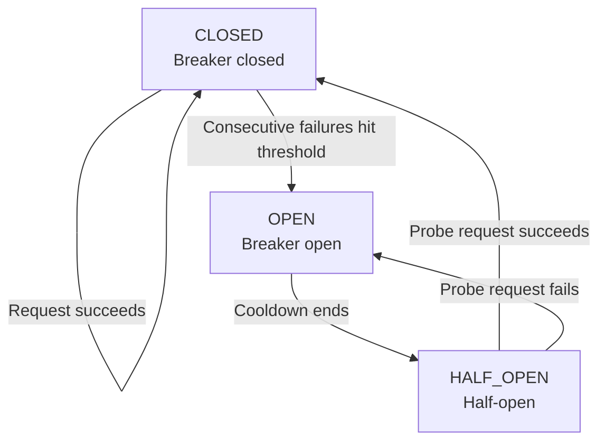

![Image showing the real cost of building an Agent team. On the left is API/Token consumption, including inference models (Claude/GPT) $0.15–$0.90/M tokens, fast models (Haiku/GPT-4o-mini) 0.03–0.15/M, Embedding/vector 0.02/M, plus vector DB/storage and CI/CD/deploy costs. On the right is time investment, covering build phase (2–4 weeks), early incubation (1–2 months), ongoing incubation (2–4h/week), etc. At the bottom is the text '$200–800'. This image is closely related to the context and intuitively presents the specific cost composition of building an Agent team.](assets/diagrams/en_03_1.svg)

## When Your API Key "Blew Up"

Yason will never forget that day.

He was out for dinner on the weekend when his phone started vibrating like crazy — an Agent on the Rex server called "qclaw" kept erroring out. He opened the terminal and saw: **qclaw's bound API Key had run out of balance, but the Agent didn't know it was out of money.**

What did it do?

It kept retrying. Every 30 seconds. 120 times an hour. From 3 a.m. to noon — a full 9 hours, thousands of failed requests.

Even more absurd: Yason had clearly posted in the group at 4 a.m. saying "stop qclaw for now," but the Agent never read that message. Because nobody had designed it to read group messages.

By the time he noticed, the bill had shot from $50 to $230.

> **Hidden cost #1: failed retries aren't free. Rate limits, timeouts, auth errors — every failure burns money.**

This bug was easy to fix: add a circuit breaker. Here's the protective layer Yason added afterward — had he added it one day earlier, he'd have saved $180:



```python
class CircuitBreaker:
    """Circuit breaker: prevents the Agent from retrying infinitely on failure and burning money"""
    def __init__(self, max_retries=3, cooldown=300, budget_limit=50):
        self.max_retries = max_retries
        self.cooldown = cooldown       # Cooldown time (seconds)
        self.budget_limit = budget_limit  # Per-task budget cap (USD)
        self.failures = 0
        self.open = False

    def call(self, func, *args, **kwargs):
        if self.open:
            raise Exception("⛔ Breaker is open: please retry later")

        for attempt in range(self.max_retries):
            try:
                result = func(*args, **kwargs)
                self.failures = 0  # Reset on success
                return result
            except (APIError, RateLimitError) as e:
                self.failures += 1
                if self.failures >= self.max_retries:
                    self.open = True
                    threading.Thread(target=self._cooldown).start()
                    raise Exception(f"Tripped! {self.failures} consecutive failures, waiting {self.cooldown}s")
                time.sleep(2 ** attempt)  # Exponential backoff

    def _cooldown(self):
        time.sleep(self.cooldown)
        self.open = False
        self.failures = 0

# Usage: breaker = CircuitBreaker(max_retries=3, budget_limit=50)
# result = breaker.call(api.chat.completions.create, ...)
```

But the lesson was deep — an Agent's "persistence" becomes a "suicide attack" when it's out of money.

![Image showing the real cost of building an Agent team. On API/Token consumption: inference models (Claude/GPT) are $0.15–$0.90/M tokens, arrow pointing to its 0.15–0.90 value; fast models (Haiku/GPT-4o-mini) are $0.03–$0.15/M, arrow to its 0.03–0.15 value; Embedding/vector is $0.02/M, arrow to its 0.02 value. In infrastructure, vector DB/storage is $20–200/month, CI/CD/deploy is $10–50/month. Time investment includes build phase, early incubation, ongoing incubation. Also lists opportunity cost, hidden cost, trial-and-error cost, etc.](assets/diagrams/en_03_2.svg)

## Breaking Down the Cost Structure

### 1. API call fees — the biggest visible cost

Using Yason's three-server (Rex, Robot, Neo) config as an example, his hybrid-model strategy:

| Model | Use | Cost/M tokens | Monthly consumption (in/out) | Monthly cost (est.) |
|-|-|-|-|-|
| Claude Sonnet | Core code generation | $3 / $15 (in/out) | 100M in + 20M out | ~$600 |
| GPT-4o | Complex reasoning | $5 / $15 | 40M in + 20M out | ~$500 |
| Local model (DeepSeek) | Simple tasks/formatting | electricity | ~500M tokens | ~$50 (electricity) |
| Embedding model | Memory retrieval | ~$0.13/1M | ~20M tokens | ~$3 |

> Estimation method: Yason's average from API billing logs. Claude Sonnet averages 100M input tokens/month (each task ~8K input × ~12,500 calls), 20M output tokens (each output ~1.6K), at $3/$15 unit price = $600. GPT-4o similarly.

Now the real 2026 industry data. Claude Code currently averages about $13/day per person per session, 3 parallel Agents about $30–40/day, and a 5–10 Agent fleet about $50–130/day (CloudZero May 2026 analysis). OpenAI Codex's token efficiency is roughly 4x Claude Code's — for the same task Codex consumes 1.5M tokens, Claude Code consumes 6.2M tokens (source: morphllm.com Feb 2026 Figma-to-code benchmark). This means your choice of underlying model has a multi-fold impact on your monthly bill.

The biggest hidden killer of cost is context bloat. Every step an Agent takes, the conversation history grows. A simple research task can consume over 100K tokens after 50 interaction rounds. The industry's fix is context compaction: when the conversation exceeds 70% of the context window, have the Agent auto-summarize intermediate results, drop redundant tool output, keeping only key decisions and unfinished tasks. Claude Code has a built-in auto-compact mechanism; OpenAI Codex uses tool output offloading (storing large tool output in external storage, keeping only a reference pointer in context). We can implement both concretely in the build chapter.

(Above data is from CloudZero's May 2026 AI Agent cost analysis, currently the most public industry benchmark.)

**Average monthly API cost: ~$1,150/month**, ~¥8,000 at then exchange rate.

> Money-saving tip: route simple tasks (formatting, extraction, classification) to a local model to save 60–70% on API fees.

Config example — model routing rules (JSON):

```json
{
  "router": {
    "rules": [
      {
        "pattern": ".*code.*generate|.*implement.*",
        "model": "claude-sonnet-4",
        "priority": 1
      },
      {
        "pattern": ".*analyze|.*reason.*|.*debug.*",
        "model": "gpt-4o",
        "priority": 2
      },
      {
        "pattern": ".*summarize|.*format|.*extract|.*classify",
        "model": "local-deepseek",
        "priority": 3
      }
    ],
    "fallback": "local-deepseek",
    "circuit_breaker": {
      "max_retries": 3,
      "cooldown_minutes": 5,
      "budget_warning_at": 0.8
    }
  }
}
```

### 2. Infrastructure fees

| Item | Config | Monthly cost |
|-|-|-|
| Overseas server (Rex) | 8C/16G, 200G SSD | ~$80 |
| Overseas server (Robot) | 4C/8G, 100G SSD | ~$40 |
| Domestic server (Neo) | 4C/8G, 100G SSD | ~$100 |
| Shared storage (memory system) | Git repo, 500MB | $0 |
| Domain + CDN | 2 domains + basic CDN | ~$20 |

**Monthly infrastructure cost: ~$240/month, ~¥1,700.**

### 3. Time investment — the hidden cost

Yason puts about 6–8 hours a week into the Agent team:

- Prompt tuning and iteration: 2–3 hours
- Reviewing Agent output: 2 hours
- Fixing what the Agent messed up: 1–2 hours
- Designing and assigning new tasks: 1 hour

At his hourly rate, this is worth roughly ¥3,000–5,000/month.

## The Hair-Pulling "Task Starvation"

When an Agent has no task, it sits idle. Idle means two things:

1. You're still paying its API bill (heartbeat checks, connection keep-alive, state sync)
2. It won't proactively find work — unless you configure a "proactive suggestion" mechanism

Once Yason went on a 3-day vacation and came back to find three Agents had gone **over 10 hours without receiving any task.** They just waited. The configured CPU was idling, tokens burning, while Yason drank coconut water on the beach.

Later he added a rule to the Agent's System Prompt:

```
## Proactive suggestions

If you haven't received a new task for over 2 consecutive hours:
1. Check the status of all current projects
2. Identify potential improvements or unfinished items
3. Send Yason a "proactive suggestion" message (format: suggestion title + reason + estimated effort)
4. Wait for confirmation before executing
```

This rule turned the Agent from a "worker waiting for instructions" into a "partner who finds problems and suggests fixes."

> **Hidden cost #2: Agents won't proactively find work unless you explicitly tell them they can.**

## Total Cost Summary

| Cost item | Monthly avg |
|-|-|
| API calls (hybrid model) | ~¥8,000 |
| Infrastructure | ~¥1,700 |
| Time investment (converted) | ~¥4,000 |
| Total | ~¥13,700 |

3 Agents, each Agent ~¥4,500/month. Compared to the minimum cost of hiring a junior engineer (¥15,000+ social insurance), **Agent cost is about 1/3 of a human's.**

## Open-Source Tools to Save You Money

The community already has plenty of open-source Agent cost-optimization tools — no need to build your own:

- **OpenRouter**: an API gateway that auto-routes requests across 40+ model providers, auto-selecting the optimal model by price and performance
- **LiteLLM**: a unified interface to 100+ models, switching providers with a one-line config change
- **Helicone / Portkey**: open-source cost monitoring and log tracing, see in real time how much each Agent spends
- **context-compactor**: open-source library that auto-manages the context window, auto-compacts at the 80% threshold

These tools save you tons of development and tuning time. Remember: **on cost control, the community has already hit most of the potholes for you.**

## Money-Saving Tips

1. **Local model as backstop**: don't route simple tasks through paid APIs
2. **Circuit breaker**: stop and wait after 3+ failures, don't retry infinitely
3. **Shared memory lib on Git**: one private repo hosts all Agents' memory files, zero cost
4. **Scheduled-task timer**: put Agents in low-power mode off-hours (only checking critical alerts)

## Chapter Summary

- An Agent team costs ~¥14k/month, about 1/3 of equivalent human cost
- API calls are the biggest chunk; good model routing saves 60%+
- Failed retries are a hidden killer; a circuit breaker is mandatory
- Agents won't proactively find work — give them "proactive suggestion" rights
- Calculate the cost before you start; don't let a surprise become a shock

> **Next chapter preview**: Picking your first Agent — from scratch, the complete roadmap of how to choose, configure, and get an Agent working.

*This article is from the column 'Being the Boss of AI', the full series is continuously updated:*[*GitHub - VokoForge/ai-prism*](https://github.com/VokoForge/ai-prism)

