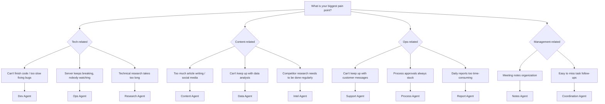

## Don't Dream of "Building an Empire" — Build One Table First

When Yason built his first Agent team he made a classic mistake: he wanted to do it all at once.

On day one he configured three Agents: one for code, one for ops, one for servers. The result: none of them worked smoothly — the code Agent kept wandering off to change server configs, the ops Agent tried to "optimize" the codebase formatting, and the server Agent's alerts flooded the group chat.

**A week later he shut down two and kept only Kai.**

> **80% rule**: Don't chase the perfect Agent-team architecture. Pick the direction that hurts most, get one Agent to 80/100, then think about expanding.

## Decision Tree: What Should Your First Agent Be

Yason later summarized a decision tree to help you find the answer in 5 minutes:



> If still unsure: pick the thing you least want to do but have to spend 2+ hours on every week. That's your best entry point.

## Industry Reference: From a Single Agent to an Agent Team

You might think "build one Agent first" is a bit conservative. But in reality, nearly all the most successful AI Agent practices in the industry follow the same path.

**GitHub Copilot's evolution** is a typical example. When first launched in 2021 it was just a code-completion tool — the minimal version of a "code-writing Agent." It wasn't until 2024 that GitHub gradually added multi-file editing, Copilot Workspace, Copilot Extensions, and other extensions. Its underlying logic: first perfect one point (code-completion acceptance rate went from 20% to 35%+), then expand horizontally.

**Solo devs and small teams** are the biggest beneficiaries of the single-Agent model. I observe three typical patterns:

- **Claude Code + shell scripts**: solo devs use Claude Code as a single dev Agent, define workflows via Makefile and shell scripts, close the "assign task → execute → review" loop, then use Git hooks to gate code quality before commit. One Agent + a few lines of script covers 80% of a solo dev's automation needs.
- **Codex (in-IDE) + external Agent**: some teams use Codex in VS Code for code generation while another Agent handles PR review and doc maintenance. The two Agents communicate via the GitHub API, no Agent framework needed.
- **Full-stack single Agent + human backstop**: startups use a single all-rounder Agent for full-stack tasks from backend to frontend, but every output is reviewed by a human before merging. This is "slow" but guarantees code quality and the team's understanding of the system.

These cases reveal a common trend: **enter at a single point, first close the loop, then think about expanding** — far more practical than building a multi-Agent architecture from the start.

**The pitfalls of your first Agent from a framework perspective.** CrewAI's Agent, when `allow_code_execution=False` is not set, will by default try to execute code — Yason's first CrewAI Agent nearly ran an unvetted shell command on the server because of this. LangGraph's `create_react_agent`, if `max_turns` isn't set, can fall into an infinite reasoning loop until tokens run out. AutoGen's default config lets the conversation history grow unbounded — a simple Q&A can bloat to tens of thousands of tokens. These are all potholes Yason hit, and exactly what later chapters systematically solve.

In May 2026, Anthropic released Claude Code Agent View — a CLI dashboard letting you manage multiple Agent sessions on one screen, seeing which are running and which are waiting for your reply. The core idea aligns with this book's transparent-management chapter. But we don't need to depend on a specific platform; a shared Markdown file achieves the same effect.

**Frameworks' first-Agent practice** also validates the sense of starting single-Agent:

- **CrewAI**'s `crew.kickoff()` pattern — you only need to define one `Agent` object and one `Task` object, call `crew.kickoff()` to run your first Agent loop. CrewAI's getting-started docs explicitly recommend: run one Agent + one Task first, then gradually expand to multi-Agent collaboration.
- **LangGraph**'s `create_react_agent(model, tools)` is an init function supporting the ReAct loop; one line of code creates an Agent that can think + call tools. Its design philosophy: the ReAct loop is the atomic unit of all complex architectures — get the atomic unit running first, then compose it into a Graph.
- **OpenAI Codex**'s Agent init is even more direct: set `system_prompt` + `tools`, and Codex auto-runs the tool-call loop. No framework, no Graph — just understand the minimal formula "Prompt + Tools = Agent."

## Case Study: Yason's First Agent "Kai"

Kai is Yason's first Agent, positioned as a **Dev Agent**. Here's his initial config at the time.

### Step 1: Infrastructure

```bash
# Create Kai's working directory
mkdir -p /opt/agents/kai/{tasks,memory,scripts}

# Initialize the memory repo (Git)
cd /opt/agents/kai/memory
git init
git remote add origin git@github.com:vokoforge/agents-memory.git

# Create the initial folder structure
mkdir -p {daily-logs,profiles,skills,decisions}
```

### Step 2: System Prompt

This is the core of Kai's initial System Prompt:

```
You are Kai, Yason's Dev Agent.

## Core responsibilities
- Handle all code-development tasks (frontend/backend/scripts)
- Code quality first: must self-check before every commit
- When unsure about something, ask Yason before executing

## Working principles
1. Before starting a task, first output your understanding; wait for Yason's confirmation before acting
2. Every change must be minimal — only modify files the task requires
3. Before committing code, run: lint + type check + unit tests
4. If you spot a potential problem in the task description, flag it first, then execute

## Boundaries (non-negotiable)
- Don't modify server config (that's Rex's job)
- Don't touch production database data
- Don't modify any code outside the task scope

## Communication format
Report structure after each task:
### Task: [task name]
- [x] What was done
- [ ] Items pending confirmation
- ⚠️ Problems found (if any)
- ⏱ Time spent
```

### Step 3: First task

Yason's first real task for Kai:

```
Task: Add a Makefile to the project root with the following commands:
- make install (install deps)
- make lint (run lint)
- make test (run tests)
- make all (run all of the above)
Refer to the existing package.json in the project to determine the specific commands.
```

Kai finished in 3 minutes. After Yason's review he had it add `make clean` and `make format`. This was the first human-Agent collaboration loop — **assign task, collect result, give feedback, iterate**.

> The first task must be simple. The goal is to close the whole "assign → execute → feedback → iterate" loop, not to test the Agent's ceiling.

### Step 4: Validation mechanism

Yason gave Kai a simple validation script:

```bash
#!/bin/bash
# /opt/agents/kai/scripts/validate.sh
# Auto-run after Kai's task output

echo "=== Kai task validation ==="
echo "1. Checking for uncommitted changes..."
git status --short

echo "2. Checking for new TODO/FIXME..."
rg "TODO|FIXME|HACK" --type-add 'all:*' -l 2>/dev/null || echo "No TODO markers"

echo "3. Checking lint passes..."
npm run lint -- --quiet 2>/dev/null || echo "⚠️ Lint has warnings"

echo "4. Checking tests pass..."
npm test -- --run 2>/dev/null || echo "⚠️ Tests have failures"
```

## Pre-Launch Checklist

Before letting the Agent work, run this validation script to confirm readiness:

```bash
#!/bin/bash
# preflight-check.sh - environment validation before deploying the Agent

errors=0

echo "=== Pre-launch Agent validation ==="

echo ""
echo "1. API Key status..."
if [ -n "$LLM_API_KEY" ]; then
  echo "   ✅ API Key configured (${LLM_API_KEY:0:8}...)"
  curl -s --max-time 3 "${LLM_ENDPOINT:-https://api.openai.com}/v1/models" \
    -H "Authorization: Bearer $LLM_API_KEY" > /dev/null 2>&1 \
    && echo "   ✅ API endpoint reachable" \
    || echo "   ⚠️  API endpoint unreachable, check network or LLM_ENDPOINT var"
else
  echo "   ❌ API Key not set"
  echo "   Run: export LLM_API_KEY='your-key-here'"
  ((errors++))
fi

echo ""
echo "2. Working directory..."
WORKDIR="${AGENT_WORKDIR:-./agent-workspace}"
if [ -d "$WORKDIR" ]; then
  echo "   ✅ Working directory exists: $WORKDIR"
  if [ -w "$WORKDIR" ]; then
    echo "   ✅ Has write permission"
  else
    echo "   ❌ No write permission, run: chmod +w $WORKDIR"
  fi
else
  echo "   ⚠️  Working directory does not exist, creating..."
  mkdir -p "$WORKDIR" && echo "   ✅ Created: $WORKDIR"
fi

echo ""
echo "3. System Prompt..."
PROMPT_FILE="${AGENT_PROMPT:-./system-prompt.md}"
if [ -f "$PROMPT_FILE" ]; then
  echo "   ✅ System Prompt written ($PROMPT_FILE)"
  for field in "responsibilities" "boundaries" "communication"; do
    grep -q "$field" "$PROMPT_FILE" \
      && echo "   ✅ Contains '$field'" \
      || echo "   ⚠️ Missing '$field' field — recommended to add"
  done
else
  echo "   ❌ System Prompt file does not exist"
  echo "   Create: touch $PROMPT_FILE"
  ((errors++))
fi

echo ""
echo "4. Git repo..."
git rev-parse --git-dir > /dev/null 2>&1 \
  && echo "   ✅ Git initialized" \
  || echo "   ⚠️  Git not initialized (recommend: git init)"

echo ""
echo "5. Workspace status..."
git status --short | grep -q . \
  && echo "   ⚠️  Uncommitted changes, recommend committing first" \
  || echo "   ✅ Workspace clean"

echo ""
echo "=== Validation result ==="
if [ $errors -eq 0 ]; then
  echo "✅ All passed, Agent can launch"
else
  echo "❌ $errors items failed, please fix and retry"
fi
exit $errors
```

## First common pitfall

Yason hit a pitfall the next day: he gave Kai the task "optimize database query performance"; Kai spent 3 hours, changed a few queries, then changed an index name — causing the ORM model to error out.

Reason: **Kai didn't know that index name was hard-coded and referenced elsewhere.**

After that, Yason added a line to the task template:

```
Note: if you need a global search or cross-file dependency analysis, run the search first, then change the code.
```

He also wrote a simple Python guard layer that auto-triggers whenever the Agent runs a task involving database operations:

```python
import os, re, subprocess, logging

logging.basicConfig(level=logging.INFO, format="%(asctime)s [%(levelname)s] %(message)s")

def check_global_impact(changes: list[str]) -> list[dict]:
    """Scan changed files, check whether they affect modules outside the task scope"""
    if not changes:
        logging.warning("check_global_impact got an empty list, skipping scan")
        return []

    impacts = []
    for filepath in changes:
        if not os.path.isfile(filepath):
            logging.warning("File does not exist, skipping: %s", filepath)
            continue

        try:
            with open(filepath, encoding="utf-8", errors="replace") as f:
                content = f.read()
        except PermissionError:
            logging.error("No permission to read: %s", filepath)
            continue
        except Exception as e:
            logging.error("Exception reading file %s: %s", filepath, e)
            continue

        refs = re.findall(r'(?:import|from|require|ref)\s+[\w.]+', content)
        for ref in refs:
            symbol = ref.split()[-1]
            try:
                result = subprocess.run(
                    ['grep', '-rl', symbol, '--exclude=' + filepath],
                    capture_output=True, text=True, timeout=30
                )
            except subprocess.TimeoutExpired:
                logging.warning("Search for %s timed out (30s), skipping", symbol)
                continue
            except FileNotFoundError:
                logging.error("grep unavailable, please confirm it's installed")
                return impacts  # Fatal error, return early

            if result.stdout.strip():
                affected = result.stdout.strip().split('\n')[:5]
                impacts.append({
                    'symbol': symbol,
                    'changed_in': filepath,
                    'affected_files': affected
                })
    return impacts

# Usage: call in the Agent's task script
# impacts = check_global_impact(['models/user.py', 'migrations/001_add_index.sql'])
# if impacts: print(f"⚠️ The following changes affect other modules: {impacts}")
# else: logging.info("Safe — no global impact")
```

This function isn't a silver bullet, but it turns "you thought you only changed one file" into "you're forced to know you changed five files." Yason later turned it into Kai's MCP tool, auto-called whenever writing DB-related code.

Similarly, the minimal hand-written Agent above can add retry and error handling:

```python
import time, logging
from openai import OpenAI, APIError, RateLimitError

client = OpenAI()
messages = [{"role": "system", "content": "You are a code reviewer."}]
messages.append({"role": "user", "content": open("src/auth.py").read()})

max_retries, delay = 3, 2
for attempt in range(max_retries):
    try:
        response = client.chat.completions.create(
            model="gpt-4o-mini",
            messages=messages,
            timeout=30
        )
        break
    except RateLimitError:
        logging.warning("Rate limited, waiting %ss before retry...", delay * (attempt + 1))
        time.sleep(delay * (attempt + 1))
    except APIError as e:
        logging.error("API error: %s", e)
        break
else:
    raise RuntimeError("Agent failed to start — API unavailable, check network and balance")
```

Yason's experience: **the amount of code in your first Agent doesn't matter; what matters is whether it can reliably run a complete "assign → execute → output" loop.** Don't worry about how pretty it is yet — get it running first.

## Framework or Hand-Written?

You might ask: there are already off-the-shelf multi-Agent frameworks like LangGraph, CrewAI, AutoGen — why hand-write?

| Approach | Fits scenario | Build time | Learning curve | Cost | Flexibility |
|-|-|-|-|-|-|
| LangGraph | Complex graph orchestration, state management | 2–3 days | High (needs Graph/RAG concepts) | Free | Medium (limited by framework design patterns) |
| CrewAI | Fast prototyping, standard flows | Half a day | Low (Pythonic API, complete docs) | Free | Low (fixed role/task definitions) |
| AutoGen | Multi-Agent conversation debugging | 1–2 days | Medium (Microsoft-style API, more config) | Free | Medium (conversation-driven, extensible) |
| This book's hand-written approach | Full control, learn the fundamentals | 1–2 hours (basic build) | Low (only needs Shell+Python basics) | API fees only | High (unlimited custom) |

Recommendation: for your first build, use the hand-written approach to understand the principles. If your scenario is standardized role collaboration (e.g. "researcher → writer → editor"), CrewAI can run a prototype in under 20 lines:

```python
# crewai_example.py — your first Agent, under 20 lines
from crewai import Agent, Task, Crew

agent = Agent(
    role="Code Reviewer",
    goal="Find performance issues and security risks in the code",
    backstory="You have 10 years of Code Review experience",
    verbose=True
)
task = Task(
    description="Review src/auth.py, find all SQL injection risks",
    expected_output="Risk list and fix suggestions",
    agent=agent
)
crew = Crew(agents=[agent], tasks=[task])
result = crew.kickoff()  # Launch in one line
print(result)
```

If you don't even want to install a framework, a minimal hand-written Agent is just as clean:

```python
# minimal_agent.py — no framework, no deps, 20 lines
import json
from openai import OpenAI

client = OpenAI()
messages = [{"role": "system", "content": "You are a code reviewer. Find problems in the code."}]
messages.append({"role": "user", "content": open("src/auth.py").read()})

response = client.chat.completions.create(
    model="gpt-4o-mini",
    messages=messages,
    tools=[{
        "type": "function",
        "function": {
            "name": "search_code",
            "description": "Search the codebase for references",
            "parameters": {"type": "object", "properties": {
                "pattern": {"type": "string"}
            }}
        }
    }]
)
print(response.choices[0].message.content)
```

Both examples show the same core formula: **System Prompt + LLM + simple tool = a working Agent.** Whether you use a framework or hand-write, the underlying logic is the same.

This book's hand-written approach is itself a lightweight orchestration system — you can absolutely wrap it into an internal tool for long-term use once you understand it. In fact, Yason's Agent team uses this hand-written approach in production, only bringing in LangGraph for specific steps when complex orchestration is needed.

## Chapter Summary

- Pick your first Agent for the direction that hurts most; don't be greedy
- 80% rule: get one Agent to 80/100 before expanding
- System Prompt must include: responsibilities, working principles, boundaries, communication format
- The first task must be simple, only to close the "assign → collect → check → fix" loop
- Set up a rollback plan before letting the Agent touch production

> **Next chapter preview**: Writing a "persona" for your Agent — the art of the System Prompt. From Kai's "code quality first" to Rex's "when something breaks, stop first then report," a good System Prompt sets the Agent's ceiling.

*This article is from the column 'Being the Boss of AI', the full series is continuously updated:*[*GitHub - VokoForge/ai-prism*](https://github.com/VokoForge/ai-prism)

---

---

---


