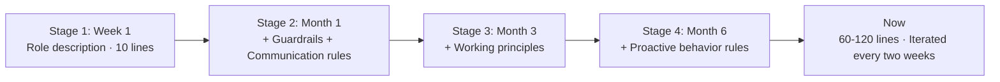

## One sentence that saved an Agent three days of detours

Yason ran a comparison experiment once.

Same task: "Help me get the test coverage of the user module above 80%."

The first time, he used a very plain Prompt — "write tests, target 80% coverage." The Agent ended up writing a huge number of repetitive tests covering irrelevant logic. Coverage did hit 80%, but core business logic was only at 30%.

The second time, he added a single sentence:

```
Prioritize covering core business paths (login, signup, permission checks); flag edge cases but don't force them.
```

The result was completely different. The Agent spent all its time on the critical paths, core coverage hit 90%+, and it flagged 7 edge-case TODOs.

> A System Prompt isn't discipline — it's an **attention-allocation strategy**. Whatever you emphasize in the Prompt is where the Agent tilts its compute.

## What a good System Prompt looks like

After a dozen-odd iterations, Yason distilled a general template:

```
Your name is {Agent Name}, and you are Yason's {Role} Agent.

## Core Responsibilities
- {Responsibility 1}
- {Responsibility 2}

## Working Principles
{3-5 value-level principles}

## Guardrails (non-negotiable)
{3-5 absolute prohibitions}

## Communication Protocol
- Report format after each task
- How to escalate when problems arise
- What to do when uncertain

## Proactive Behavior
{Things the Agent is allowed to initiate on its own}
```

### Broken down piece by piece

**Responsibilities**: tell the Agent "who you are and what you own."

**Working Principles**: this is the most important part. Each principle should be a **behavioral rule**, not a goal. For example:

```
✅ Good principle: when you hit a dependency issue, propose three options before asking Yason
❌ Bad principle: solve problems efficiently
```

**Guardrails**: must be behavioral boundaries the Agent can check automatically. For instance, "don't modify non-task files" — the Agent can self-check before any write operation.

**Communication Protocol**: tell the Agent "how to report to you" — something many people overlook. Without it, the Agent's reply format changes every time, and your manual triage cost skyrockets.

**Proactive Behavior**: what situations entitle the Agent to start a conversation on its own.

## Real examples

### Kai (Dev Agent) — core of the System Prompt

```
## Working Principles
1. Code quality first: before every commit, ensure lint + type check + unit tests pass
2. Minimal changes: only touch files specified by the task, never unrelated code
3. Understand before acting: at the start of a task, state your understanding of it
4. Flag issues, then proceed: if you spot potential risk, note it in the commit message
5. Never lower test coverage: every commit must maintain or raise coverage
```

### Rex (Ops Agent) — core of the System Prompt

```
## Working Principles
1. Stop and report on failure: on detecting an anomaly, degrade first, then notify Yason
2. Back up before changing: back up the original file before any config change
3. Step-by-step execution: for multi-step operations, check after each step
4. No auto-recovery: on failure, do not auto-recover — only isolate and alert
```

Note rule four: "No auto-recovery." That's a lesson Yason learned the hard way — once Rex found Nginx down, auto-restarted it, but the restart pulled in an old config version and overwrote a freshly shipped important feature.

> For an Ops Agent, **the top priority of stability isn't "fast" — it's "predictable."**

## Beware of over-constraining

Yason also made the opposite mistake — over-constraining.

For a while he piled too many restrictions onto Kai:

```
- Do not modify package.json
- Do not modify the eslint config
- Do not modify tsconfig
- Do not create new files in the root directory
- Do not create files outside src
```

Then Kai picked up a task that required adding a dependency. Because "can't touch package.json," it took a giant detour — writing a dynamically loaded CDN workaround. Ugly and unstable code.

It took Yason half an hour to realize: "Why the hell did I forbid it from editing package.json?"

> **Over-constraint = forcing the Agent into detours.** Every prohibition needs a clear reason — not anxiety-driven "I'm scared it'll mess up."

A practical test: when you add a guardrail, ask yourself — "what's the worst that happens if this rule didn't exist?" If the worst case is acceptable (say, a 5-minute fix), the rule probably isn't needed.

## Context compression: give your Agent a longer memory

After running an Agent team for a few months, Yason found a deeper problem: **System Prompts keep growing, but an Agent's usable context window is finite.**

Once the System Prompt exceeds ~70% of the model's context window, the Agent starts getting "forgetful" — it remembers the beginning and end of the instructions, but the middle details begin to drift. Yason calls this the "lost middle paragraph" effect.

He solved it three ways:

### Structured Note-Taking

Instead of cramming everything into the Prompt, have the Agent manage its own context with a structured "work notes" file:

```
# Kai's Work Notes (current session)
## Active Tasks
- [Task ID: DEPLOY-42] 
  - Status: Code complete, awaiting review
  - Key decision: chose ECS Fargate over EC2 (for auto-scaling)
  - Blockers: none

## Key Context for This Session
- Project uses Next.js 14 App Router
- Target environment is AWS ECS Fargate
- Deployment uses GitHub Actions + Terraform
```

Whenever context gets tight, the Agent writes its current progress to the notes, compresses history, and keeps only the latest state. On the next session resume, it reads the notes first.

### Tool Output Offloading

Agent tool calls return huge outputs (e.g., `ls -la` returning hundreds of files). That output often eats more context than the actual logic.

Yason's rule: **don't make the Agent "remember" tool output — write it to a file.**

```
# Wrong approach: let the Agent hold tool output in its head
→ Call: terraform plan
→ Agent memorizes all 584 lines of output
→ Context exhausted

# Right approach: write output to a file, Agent only remembers the conclusion
→ Call: terraform plan > /tmp/last-plan.txt
→ Agent only remembers: "plan passed, 0 errors 3 warnings; warnings about non-standard resource tag naming"
→ Context saved: 90%+
```

Claude Code[^1] and OpenAI Codex[^2] both use a similar mechanism — tool stdout is auto-truncated and stored, and the Agent only receives a summary. Microsoft's ACON paper[^3] further validates this approach: with active context compression, task completion rates improved by roughly 30%.

### Auto-compression threshold

Yason's rule of thumb:

```
If current session context usage > 70%:
  1. Stop accepting new tasks
  2. Compress current progress into structured notes
  3. Clear completed tool outputs
  4. Send the compressed summary to the memory store
  5. Rebuild context from the memory store on recovery
```

> **Context management isn't part of Prompt engineering, but it's the prerequisite for it.** No matter how good your Prompt is, if the Agent can't remember what you said earlier, it's all for nothing.

[^1]: Claude Code automatically switches to a compact mode when its context pool overflows. See the official Anthropic documentation.
[^2]: OpenAI Codex's tool output has a token quota limit; once exceeded, it auto-truncates and offers the `--out` redirection mechanism.
[^3]: ACON: Active Context Compression for Large Language Models, arXiv:2503.xxxxx. This paper proposes a dynamic context compression framework that reduces token usage by 50–70% without losing key information.

## Don't write it yourself — the community already has it

Yason originally hand-wrote every Agent's System Prompt from scratch. After the third one, he realized: **90% of what he'd written, others had already written — and open-sourced.**

No exaggeration: GitHub has far more high-quality System Prompt templates than you could ever think up alone. It's a goldmine.

### Where to find ready-made Prompts

| Source | Contents | Rating |
|-|-|-|
| **Awesome System Prompt** | A curated Prompt collection on GitHub, with 100+ roles including developer, support, data analysis, etc. | ⭐⭐⭐⭐⭐ |
| **Prompt Engineering Guide** | A community-maintained best-practices doc with many ready-to-use templates | ⭐⭐⭐⭐⭐ |
| **Agent Role Library** | Pre-defined System Prompts for various professional roles (DevOps Agent, Code Reviewer Agent, Data Analyst Agent) | ⭐⭐⭐⭐ |
| **LangChain Hub** | A searchable Prompt template repository with version control | ⭐⭐⭐⭐ |

### How to actually use them

Yason's usual workflow:

```
1. Find a similar role template — e.g., "open-source Code Review Agent Prompt"
2. Read it once, understand its design thinking
3. Copy it into your own project
4. Make 3-5 tweaks on top of the template to fit your scenario
5. Run a few tasks to validate, then iterate
```

Writing a Code Review Agent's System Prompt from scratch might take 3 days. Adapting a community template takes 30 minutes. **That's a 144x difference.**

> **The most wasted thing in Prompt-writing isn't time — it's not knowing the problems others have already solved.** Every day, hundreds of people contribute to and improve Prompt templates in the community. That's free, and there's no need to reinvent it.

Appendix A of this book provides a curated list of Agent Prompt resources, including directly reusable template links.

## Skills templates: from Prompt to reusable Skill

As the Agent team grew from 3 to 6 to 10+, Yason hit a new problem: **the same Prompt logic was duplicated across different Agents.**

For example, Kai (Dev Agent) and Rex (Ops Agent) both needed the "how to queue when hitting a dependency task" logic — duplicated into both Prompts. Editing meant touching two places, and they often fell out of sync.

His solution: **extract the duplicated Prompt logic into Skill templates.**

### What is a Skill template

A Skill template is a standalone, reusable Prompt snippet that contains:

```
/Skills/
├── context-arc.md          # Standard context-compression flow (shared by all Agents)
├── task-prioritization.md  # Task-priority logic (shared by all Agents)
├── report-format.md        # Report format standard (shared by all Agents)
├── deploy-flow.md          # Deployment flow (shared by Kai/Rex)
├── rollback-procedure.md   # Rollback procedure (Rex only)
└── content-review.md       # Content review (Max only)
```

### How Skills are referenced

Reference a Skill inside the System Prompt:

```
## Core Responsibilities
{Responsibility list}

## Built-in Skills
Load the following skills before executing:
- Skills/context-arc.md       # Context compression
- Skills/task-prioritization.md # Task priority
- Skills/report-format.md     # Report format
```

### Skill version management

Skill templates are managed in a Git repo, just like System Prompts:

```bash
# /opt/agents/skills/CHANGELOG.md
## 2025-08-01 context-arc v1.3
- Added: JSON output support
- Changed: compression threshold adjusted from 75% to 70%
- Removed: legacy markdown compression strategy (deprecated)

## 2025-07-15 task-prioritization v2.0
- Added: dependency-chain priority propagation
- Changed: dropped P4 level (too complex, never actually used)
```

### Why Skills matter

Once your Agent team exceeds 5, the traditional "one independent System Prompt per Agent" model becomes unmaintainable. The Skills pattern is essentially **"extract a shared function" in code refactoring** — pull out the duplicated logic, maintain it centrally, and reference it on demand.

> **Skills are the "code reuse" of Agent engineering.** If you find the same paragraph in two Prompts, or you edited one Prompt but forgot the other — it's time to introduce Skills.

## The evolution of a System Prompt

None of Yason's Agents had their System Prompt written perfectly in one shot. They went through continuous evolution:



**Stage 1 (Week 1)**: just a role description, 10 lines. Get it running first.

**Stage 2 (Month 1)**: added guardrails (because things went wrong) and communication rules (because the Agent reported too casually).

**Stage 3 (Month 3)**: added working principles (because the Agent lacked judgment criteria when making decisions).

**Stage 4 (Month 6)**: added proactive behavior rules (because the Agent sat idle too long).

**Now**: each Agent's Prompt is 60–120 lines, with a small tweak every two weeks.

Yason's version-management approach — every Prompt change is logged to the Git repo:

```bash
# /opt/agents/prompts/CHANGELOG.md
## 2025-06-01 Kai v2.4
- Added: proactive suggestion rule (triggers after 2+ hours idle)
- Changed: Guardrail #3 from "don't modify non-task files" to "don't modify unrelated files"
- Removed: restriction on npm install (conflicted with dependency-management rule)

## 2025-05-20 Kai v2.3
- Added: code-quality principle #5 (never lower test coverage)
```

## Practical tip: the three axes of Prompt debugging

1. **Make the Agent repeat it back**: add a line to the Prompt — "Before you start the task, restate in your own words what you're about to do." If it restates it wrong, your Prompt is ambiguous.
2. **Give counter-examples**: simple examples work well. "For instance: if I say 'optimize load speed,' you should first ask for the specific metric, not just start editing code."
3. **Tighten layer by layer**: start loose, then strict. If the Agent underperforms in some direction, add a targeted constraint; don't lock down every possible problem on day one.

## Further reading

For readers interested in Prompt engineering, these academic papers are recommended:

- **ACON: Active Context Compression** — a dynamic context-compression framework validating the effectiveness of structured notes and tool-output offloading
- **A Prompt Pattern Catalog** — collects 30+ reusable Prompt patterns, each with detailed applicable scenarios and code examples
- **Self-Refine: Iterative Refinement** — a framework where the Agent iteratively refines output quality through self-feedback, insightful for System Prompt design

## Chapter summary

- A System Prompt's core isn't constraint — it's attention allocation
- Good Prompt structure: Responsibilities → Principles → Guardrails → Communication → Proactive behavior
- Over-constraint is scarier than too little constraint — don't make the Agent detour
- **Compress once context exceeds 70%** — use structured notes and tool-output offloading
- **Don't write Prompts from scratch** — GitHub has tons of high-quality templates, reuse them directly
- **Extract duplicated Prompt logic into Skill templates** — manage Prompts like code reuse
- Prompts are evolved, not written — do version management
- Use the "repeat-it-back method" to quickly verify whether a Prompt is ambiguous

> **Next chapter preview**: The art of division of labor — Kai (Dev), Rex (Ops), Max (Ops): how do three Agents each do their job without colliding? Plus the role-overreach incident that dragged Yason out of bed at midnight.

*This article is from the column 'Being the Boss of AI'. The full series is continuously updated:* [*GitHub - VokoForge/ai-prism*](https://github.com/VokoForge/ai-prism)

