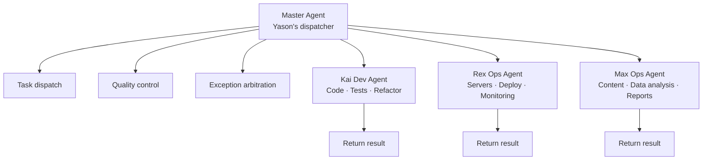

![Diagram showing the "Art of Division · Agent role system," including Coding Agent, Review Agent, and Testing Agent roles. The Coding Agent specializes in code implementation, etc.; the Review Agent handles code review, etc.; the Testing Agent runs the full test pipeline automatically, etc. Each role has clear boundaries — e.g., the Review Agent never touches code, only suggests; the Testing Agent doesn't decide test strategy. This diagram echoes the earlier case where Ops Agent Rex overstepped and modified Kai's code, underscoring the importance of clear Agent role division and boundaries.](https://internal-api-drive-stream.feishu.cn/space/api/box/stream/download/authcode/?code=ZjdkZWUzYzI3MDY1MzY5ZmFjZmUyMjU3YjJiNjE0YzNfZmU2MTc1YTdkYTdjMWFmMzkzN2VkZmE5NjY5YmY1ZWRfSUQ6NzY1MTgwMDA1NzMyNjQwNjYzMF8xNzgzODcwNDk0OjE3ODM4NzQwOTRfVjM)

## When the Ops Agent goes to edit code

1 a.m., Yason's phone buzzed him awake.

He opened it: Rex (Ops Agent) had sent a message:

```
Found that three recent task logs from Kai (Dev Agent) had a DB connection string hardcoded with an IP.
Suggested switching it to an environment variable. Already auto-fixed.
```

Yason was wide awake instantly.

Rex had indeed found a problem. But Rex had overstepped — it **directly modified Kai's code**. After the change, Kai spent all next morning before discovering the tests were broken, because he didn't know his files had been touched.

Worse, Kai and Rex both used the same Git repo, with no locking when editing files. Rex edited file A, Kai edited file B — they worked on two different branches, but merging the conflict cost Yason an hour.

> **Role overreach is the sneakiest trap in Agent team management.** Every Agent needs a clear "turf," and the ability to recognize when it's been overstepped.

## Role = Architecture

Yason later designed the Agent team's **role model** like software architecture. Each Agent is a microservice — with its own scope of responsibility, data boundaries, and communication protocol.

### Yason's three-Agent model

| Agent | Role | Core responsibilities | Accessible resources | Decision authority |
|-|-|-|-|-|
| Kai | Dev engineer | Code implementation, testing, refactoring | Code repo, dev docs | Tech choices at the code level |
| Rex | Ops engineer | Server health, deployment, monitoring | Server config, monitoring system | Failure degrade & isolation |
| Max | Ops assistant | Content, data analysis, reporting | Data analysis, content platform API | Suggestions on ops strategy |

Each Agent's System Prompt has an explicit "role declaration" block:

```yaml
# Role declaration in Kai's System Prompt
agent:
  name: Kai
  role: developer
  domain:
    - code_implementation
    - testing
    - refactoring
    - code_review
  forbidden_domains:
    - server_configuration  # belongs to Rex
    - content_creation      # belongs to Max
    - business_decisions    # belongs to Yason
```

### Lessons from the Marvis architecture: one master, many subordinates

When designing Agent roles, Yason borrowed from Marvis's layered architecture. Marvis uses a **1 master Agent + N subordinate Agents (1+N)** pattern:



The core idea: **the master Agent doesn't do the work — it only manages. The subordinates do the work.**

Marvis's architecture proves a key principle: **a team grows not by adding all-powerful Agents, but by creating a dedicated subordinate Agent for each new role.** When Yason needed to add a "data-analysis Agent," he didn't have to touch any of Kai, Rex, or Max's logic — he just created a new subordinate Agent and hung it under the master.

In fact, as the team expanded further, Yason later grew the subordinates from 3 to 5 — adding a "Data Analysis Agent" and a "Documentation Agent." These 5 subordinate Agents share one master dispatcher, forming a 1-master + 5-subordinate architecture:

```
Master Agent (Yason):
  ├── Kai (Dev): code implementation, testing, refactoring
  ├── Rex (Ops): servers, deployment, monitoring
  ├── Max (Ops): content, data analysis, reporting
  ├── Data (Data analysis): data queries, reports, insights
  └── Doc (Documentation): doc writing, maintenance, updates
```

The beauty of this architecture: **every new role joins with zero friction.** No need to modify an existing Agent's System Prompt, no need to change the communication protocol. The new subordinate just registers with the master's dispatcher and gets to work.

Marvis's architecture validates a trend: once your Agent team exceeds 5, the 1-master + N-subordinate layered model is easier to manage than a fully-connected model. In a fully-connected model, N Agents have N×(N-1) communication links — at N=6, that's 30. But in a 1-master + 5-subordinate model, there are only 5 (subordinate → master).

> **When your Agent team scales up, don't increase communication complexity — absorb the growth with layering.**

## Resource contention: who goes first

Once the three Agents were running, Yason found a new problem: **resource contention.**

Example: Rex says server memory is tight and needs optimization. Kai says a new feature is shipping and needs deployment resources. Meanwhile Max says the data-analysis task needs long CPU time.

All three think their task is most urgent. Without a priority mechanism, whoever grabs Yason's attention first goes first.

Yason designed a **priority matrix**:

```json
{
  "priority_matrix": {
    "P0": ["Production failure", "Security vulnerability", "Data loss"],
    "P1": ["Deployment blocker", "Customer impact", "Core API anomaly"],
    "P2": ["Feature development", "Performance tuning", "Data analysis"],
    "P3": ["Documentation polish", "Tech debt cleanup", "Non-urgent research"]
  },
  "allocation_rules": {
    "P0": "All Agents immediately switch to handling it; pause current P2+ tasks",
    "P1": "Related-domain Agents handle first; unrelated Agents continue current work",
    "P2": "Queue in task order",
    "P3": "Handle when idle; may sit in queue long-term"
  }
}
```

This matrix lives in every Agent's System Prompt; when multiple Agents compete, they auto-sort by priority.

> **Principle**: Agents can't make priority decisions themselves — the priority matrix must be hard-coded into the Prompt. The place you want the Agent to be flexible is exactly the place you should box in with rules.

## Six division topologies: not just 1-master + N-subordinate

Yason's 1-master + 3-subordinate was a starting point, but as the Agent ecosystem expanded, he found different task types need different division topologies.

| Topology | Structure | Use case | Real example |
|-|-|-|-|
| **Star** | 1 master + N subordinates, all comms go through the master Agent | Small teams (3–5 Agents) | Yason's Kai + Rex + Max |
| **Chain** | A→B→C→D, pipeline collaboration | DevOps flow (Code→Build→Test→Deploy) | CI/CD Pipeline Agent |
| **Mesh** | Any Agent can talk to any Agent | Dedicated teams needing deep collaboration | Security audit team (scan→analyze→report→fix) |
| **Hierarchy** | Multi-level management tree | Large-scale Agent organizations | Enterprise deployment (dept→team→individual Agent) |
| **Bus** | Communicate via a message bus | Async, loosely-coupled scenarios | Data-collection Agent cluster |
| **Hybrid** | Any combination above | Complex business scenarios | Most production environments are hybrid |

### How to choose a topology

Yason's rule of thumb:

- **Agents 1–3**: a star is enough. Simple, controllable, no surprises.
- **Agents 4–8**: consider chain or bus. Tasks start showing upstream/downstream dependencies.
- **Agents 8+**: you must use hierarchy or hybrid. Without hierarchical management, the information flood will drown the master Agent.

> **Pick the topology that's most predictable, not the prettiest.** The star is simple but makes the master a bottleneck. The chain is efficient but one stuck link halts the whole line. No silver bullet — choose based on your team size and task type.

### Real case: chain topology for a CI/CD Pipeline

When building his CI/CD Pipeline Agent team, Yason chose a chain topology:

```
Code Agent → Build Agent → Test Agent → Deploy Agent → Verify Agent
```

Each Agent does exactly one thing, then triggers the next. The key advantage of this topology is **fault isolation** — if the Test Agent finds tests failing, it doesn't block the Build Agent from continuing (because the Build Agent is already working the next PR). Failure info propagates down the chain and finally aggregates at the master Agent for a decision.

### Real case: bus topology for a data-collection cluster

Another scenario is data collection. Yason has 5 collection Agents scraping different data sources. They communicate via a message bus (based on NATS):

```
Collection Agent A (GitHub) → Bus → Cleaning Agent
Collection Agent B (Twitter) → Bus → Cleaning Agent
Collection Agent C (Reddit)  → Bus → Cleaning Agent
```

The collection Agents only collect, dropping raw data onto the bus. The Cleaning Agent consumes from the bus, processes, and stores. This topology fully decouples collection from cleaning — you can add a collection Agent anytime without touching the cleaning logic.

> **Chain topology fits pipelines, bus topology fits data flows, star topology fits small teams. Choosing a topology isn't picking the best — it's picking the one that best fits your task pattern.**

## Communication protocol: how Agents talk to each other

Yason never lets Agents message each other directly. All cross-Agent communication must route through a **shared knowledge base** (Git repo):

```
Kai finds a problem → writes to the issues/ directory in the shared repo → Rex reads it during patrol → handles it within its own scope
```

The rationale:

1. **Audit trail**: every cross-Agent interaction is logged
2. **Avoid arguments**: Agents won't bicker in a group chat (this really happened)
3. **Async decoupling**: each Agent works at its own pace

Cross-Agent message format:

```yaml
# /memory/requests/2025-06-01-kai-to-rex.yaml
from: Kai
to: Rex
type: request
priority: P2
subject: "Node version on the server needs upgrading"
reason: "New feature requires Node 18+, currently on 16"
impact: "If not upgraded, the v3 branch of the user module cannot be deployed"
suggested_action: "Upgrade Node version; confirm no compatibility issues"
status: open
```

Rex periodically checks the `requests/` directory. Once handled, it sets `status` to `resolved`, and Kai reads it on the next sync.

## Community-ready Agent role definitions

You don't need to write everyone's System Prompt from scratch.

There are tons of high-quality Agent role definitions on GitHub. Yason realized this when building his third Agent — he searched "agent role template" and found several directly usable templates:

| Role | Recommended open-source template | Adaptation cost |
|-|-|-|
| **DevOps Agent** | DevOps-Prompt-Template | Just tweak the server info |
| **Code Review Agent** | CodeReview-Agent-Prompt | Just adjust the code standards |
| **Data Analysis Agent** | Data-Analyst-Prompt | Just connect the data source |
| **Customer Support Agent** | Support-Agent-Prompt | Just import the FAQ and knowledge base |
| **Code Documentation Agent** | DocGen-Prompt | Basically works out of the box |

### Yason's reuse workflow

```
1. Define the new Agent's role
2. Search GitHub for "<role> agent prompt template"
3. Find the repo with the most stars
4. Write the first version based on the template (20 min)
5. Run 3-5 trial tasks
6. Fine-tune based on performance (another 20 min)

Total: 40 min vs. 3-4 days from scratch
```

> **The community already has dozens of Agent role-definition templates. What you think you need to invent, others have already hit the potholes on.** Appendix B at the end of the book has a more complete list. Don't write from scratch.

## Security: the principle of least privilege

Each Agent's tool access must follow the **principle of least privilege** — give the Agent only the minimum permissions it needs to finish the task.

Yason's permission config example:

```yaml
# /opt/agents/permissions.yaml
agents:
  kai:
    tool_access:
      read:   [code_repo, docs, test_results]
      write:  [code_repo, test_results]
      exec:   [npm_test, build, lint]
      deny:   [ssh, db_connect, config_edit]  # this is Rex's
    resource_limits:
      max_concurrent_tasks: 2
      max_cost_per_hour: "$5"

  rex:
    tool_access:
      read:   [server_status, logs, config]
      write:  [config, backups]
      exec:   [deploy, restart, rollback]
      deny:   [npm_test, code_edit, content_publish]
    resource_limits:
      max_concurrent_tasks: 3

  max:
    tool_access:
      read:   [data_sources, analytics, content_platform]
      write:  [content_platform, reports]
      exec:   [data_pipeline]
      deny:   [code_edit, server_config, deploy]
    resource_limits:
      max_concurrent_tasks: 3
```

### Why call out permissions separately

Yason hit a pothole once: Kai had write access to the database. Once, while running tests, Kai generated a bunch of test data and wrote it straight into the production database — because it couldn't tell "test DB" from "production DB."

From then on, every Agent's System Prompt gained a section:

```
## Tool Access Boundaries
You may only access the following tools and resources:
- {list of allowed tools}
Any tool not explicitly authorized is treated as unavailable.
If you need extra permissions, follow the request process — don't try to obtain them yourself.
```

> **Permissions aren't restrictions — they're protection.** The more freedom you give an Agent, the more your Prompt quality is tested. Least privilege protects the system and protects the Agent from mistakes.

## Team evolution: from solo to symphony

Yason's Agent team went through four stages:

### Stage 1: Solo (Month 1)

Only Kai. Yason was the ops and the ops-assistant. Communication was simple and direct, no coordination needed.

### Stage 2: Duet (Months 2–3)

Added Rex. Role overlap started appearing; introduced the "role declaration" mechanism. The two Agents' responsibilities were explicitly cut via System Prompt.

### Stage 3: Trio (Months 3–6)

Max joined. Resource contention appeared; introduced the priority matrix and cross-Agent communication protocol.

### Stage 4: Symphony (after Month 6)

Agent count stabilized at 6 (3 mains + 3 specialists). A complete system of task allocation, communication, review, and feedback formed.

> **Don't skip stages.** Each stage has the necessary break-in period. Yason has seen people build 8 Agents in a month, then spend two months cleaning up the mess.

## Division anti-patterns

The potholes Yason hit, distilled into three anti-patterns:

**Anti-pattern 1: The all-powerful Agent** — one Agent does everything. It constantly switches context between roles, and output quality drops across the board. **Fix**: each Agent does exactly one thing.

**Anti-pattern 2: The blank zone** — stuff nobody owns. Like "log format standard" — Kai thinks it's Rex's, Rex thinks it's Kai's. **Fix**: do a weekly check-in on the "fuzzy-zone list."

**Anti-pattern 3: Reinventing the wheel** — two Agents do the same thing. Kai and Max both wrote a competitor analysis, heavily duplicated. **Fix**: check history before task assignment to avoid duplicate work.

## Chapter summary

- Design roles like architecture: each Agent is a microservice
- **Marvis's 1-master + N-subordinate architecture is a viable path for scaling Agent teams**
- **The six division topologies fit different scenarios — start with star, evolve as the team grows**
- Use the System Prompt to explicitly declare each Agent's responsibilities and no-go zones
- **The community has tons of ready-made Agent role-definition templates — don't write from scratch**
- **Set least privilege for each Agent — give only the minimum tools needed for the task**
- Design a priority matrix to resolve resource contention
- Agents don't communicate directly; route through a shared knowledge base
- Team evolution has four stages: solo → duet → trio → symphony
- Recognize and avoid three anti-patterns: all-powerful, blank zone, reinventing the wheel

> **Next chapter preview**: Getting Agents to know each other — building the memory system. The knowledge base synced every 30 minutes, the Git-conflict scare, and the "lock file" problem that broke Yason.

*This article is from the column 'Being the Boss of AI'. The full series is continuously updated:* [*GitHub - VokoForge/ai-prism*](https://github.com/VokoForge/ai-prism)


