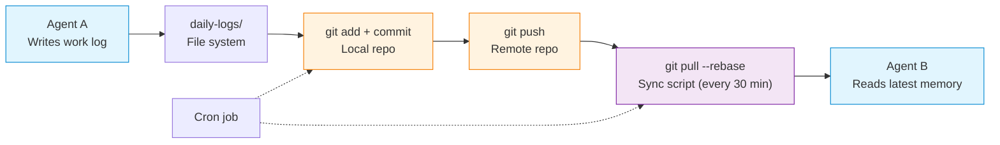

## The night a file got edited by two people at once

Kai and Rex worked on the same timeline.

Kai was writing `daily-log/2025-06-15.md`, logging the two code tasks finished today. At the same time, Rex was writing the same file, reporting today's server alert he handled.

The result is easy to guess — **the later write overwrote the earlier one.**

Kai's log content was lost. The next day Yason found Kai's daily report said "finished two tasks," but the log only had Rex's one entry.

This wasn't Kai's fault, nor Rex's. It was **the consequence of having no shared memory system.**

> An Agent's working memory is isolated by default. If nobody deliberately designs sharing, every Agent lives in its own world — no different from several people each writing their own docs and keeping their own notes on one project.

## Shared memory architecture design

Yason's solution sounds plain, but works great: **one Git repo, shared by all Agents.**

```
/memory/
├── daily-logs/          # Daily work logs
│   ├── 2025-06-15-kai.md
│   ├── 2025-06-15-rex.md
│   └── 2025-06-16-kai.md
├── profiles/            # Agent profiles
│   ├── kai.yaml
│   ├── rex.yaml
│   └── max.yaml
├── skills/              # Skill files
│   ├── deploy-flow.md
│   └── rollback-procedure.md
├── decisions/           # Decision records (ADR)
│   ├── agent-routing-decision-001.md
│   └── model-select-002.md
├── requests/            # Cross-Agent requests
│   └── 2025-06-16-kai-to-rex.yaml
└── knowledge/           # Shared knowledge
    ├── project-map.md
    └── common-issues.md
```



Every Agent loads the entire memory directory on startup, and knows:

- Which files are its own (write access)
- Which files belong to others (read-only)
- Which files are shared (read-write)

Permission config example:

```yaml
# /memory/.access-rules.yaml
agents:
  kai:
    write:
      - daily-logs/kai-*.md
      - skills/*.md
      - requests/*.yaml
    read:
      - daily-logs/*
      - profiles/*
      - decisions/*
      - knowledge/*
  rex:
    write:
      - daily-logs/rex-*.md
      - decisions/*.md
      - knowledge/common-issues.md
    read:
      - daily-logs/*
      - profiles/*
      - skills/*
```

## Cron sync: every 30 minutes

The memory-sync mechanism is straightforward — a scheduled task:

```bash
# Sync memory every 30 minutes
*/30 * * * * /opt/agents/sync-memory.sh

# Archive the previous day's logs every morning
0 1 * * * /opt/agents/archive-logs.sh
```

Core logic of the sync script:

```bash
#!/bin/bash
# /opt/agents/sync-memory.sh

MEMORY_DIR="/opt/agents/memory"
LOCK_FILE="/tmp/agent-memory-sync.lock"

# Guard against concurrent runs
if [ -f "$LOCK_FILE" ]; then
  echo "Another process is syncing, skipping"
  exit 0
fi

trap 'rm -f "$LOCK_FILE"' EXIT
touch "$LOCK_FILE"

cd "$MEMORY_DIR"

# Pull latest data
git pull --rebase origin main

# If any Agent wrote new content this cycle, commit it
if [ -n "$(git status --porcelain)" ]; then
  git add -A
  git commit -m "Memory sync $(date '+%Y-%m-%d %H:%M')"
  git push origin main
fi
```

> **Key detail**: use `git pull --rebase`, not `git pull`. Because if there's a conflict, rebase surfaces it in the sync script rather than making the Agent handle a Git conflict — Agents are terrible at handling Git conflicts.

## The lock problem: two Agents writing the same file

Yason used the simplest solution for concurrent writes: **write per-Agent files, not per-directory.**

Note the file-naming rule above: `daily-logs/2025-06-15-kai.md`, each Agent writes its own file. If Kai and Rex write logs at the same time, they're writing two different files and will never conflict.

But what if you really do need to share-write a file? Like `knowledge/common-issues.md`, which both Kai and Rex might update.

Yason's approach — **designate a "file owner":**

```yaml
# /memory/.file-ownership.yaml
files:
  knowledge/common-issues.md:
    owner: rex                # Rex owns this file
    contributors: [kai, max]  # Kai and Max may suggest changes, but only Rex writes
  skills/deploy-flow.md:
    owner: kai
    contributors: [rex]
```

The Agent's flow when writing a shared file:

1. If not the file owner, write the change to the `requests/` directory
2. The owner sees the request on the next sync
3. The owner reviews and decides whether to merge

It sounds a bit clunky, but Yason tried letting Agents edit shared files directly — conflicts within three days, guaranteed.

> **Shared writing is the Achilles' heel of Agent teams. The fix isn't technical — it's convention: everyone (every Agent) has their own notebook, and shared content is maintained by one person.**

## Memory query and retrieval

Storing alone isn't enough — you have to be able to find it.

Yason gave each Agent a simple retrieval tool — semantic search based on Embeddings:

```python
# /opt/agents/tools/memory_search.py
# Search the memory store via Embedding

import sys
import json
from pathlib import Path

MEMORY_DIR = Path("/opt/agents/memory")

def search(query: str, top_k: int = 5):
    """
    Search the memory store for content related to the query.
    Scope: daily-logs, decisions, knowledge, skills
    """
    # Use a local Embedding model for semantic search
    # Simple implementation: keyword match + sort by most recent modification
    results = []
    for f in MEMORY_DIR.rglob("*.md"):
        content = f.read_text()
        if query.lower() in content.lower():
            score = content.lower().count(query.lower())
            results.append({
                "file": str(f.relative_to(MEMORY_DIR)),
                "snippet": content[:200],
                "score": score
            })

    results.sort(key=lambda x: x["score"], reverse=True)
    return results[:top_k]

if __name__ == "__main__":
    q = sys.argv[1]
    print(json.dumps(search(q), indent=2, ensure_ascii=False))
```

Before executing a task, the Agent searches the memory store to see if there's already a relevant decision or piece of knowledge.

## The value of memory is in continuous accumulation

Yason's proudest achievement isn't how capable the Agents are — it's that **the memory store became the team's "second brain."**

After 6 months, the memory store held:

- 400+ daily logs (traceable to what happened each day)
- 37 decision records (ADR)
- 15 skill files (deployment, rollback, common-issue handling)
- 200+ shared knowledge entries

Any time a new Agent joins, just give it the memory store and it understands all the context from the previous 6 months within minutes.

> **The point of a memory store isn't storage — it's inheritance.** In a human team, onboarding takes weeks. In an Agent team, onboarding takes one `git clone`.

## Maintaining the memory system

Yason spends 15 minutes a week on memory-system maintenance:

1. **Clear expired info**: mark P3 decisions older than 3 months as "history"
2. **Merge duplicates**: check if multiple Agents recorded the same thing
3. **Fill missing decision records**: if something happened but wasn't logged, log it

The frequency needn't be high, but it must be done — otherwise the memory store turns into a junkyard where the Agent can't find anything valuable.

## From simple Git memory to RAG architecture

Once memory files passed a few hundred, Yason found simple keyword search stopped being enough. An Agent looking for "the decision about the DB connection pool three months ago," searching 400+ files for "DB connection pool" — returned far too many irrelevant results.

RAG (Retrieval-Augmented Generation) solves this. The core idea is simple:

```
Traditional search:
  Keyword match → return all files containing the term → Agent filters itself

RAG search:
  Embedding vectorization → semantic match → return the 3-5 most relevant files → Agent uses directly
```

### When to upgrade to RAG

Yason's rule of thumb:

| Metric | Threshold | Recommendation |
|-|-|-|
| Number of memory files | > 500 | Need a vector index |
| Single-search recall | < 60% | Embedding gives a big boost |
| Agent can't find history | ≥3 times/week | Must adopt RAG |
| Memory store size | > 100MB | Consider sharding and caching |

### Optional vector databases

| Database | Deployment | Best for | Ease of use |
|-|-|-|-|
| **Milvus** | Distributed | Large-scale production (millions of vectors) | Medium |
| **Chroma** | Embedded | Small-to-mid scale (tens of thousands of vectors), fast prototyping | Low |
| **Qdrant** | Single-node / distributed | Mid scale, Rust-based, high performance | Low |
| **Pgvector** | Plugin | Teams already on PostgreSQL | Low |

Yason's path: **prototype with Chroma → scale up to Qdrant → go Milvus when you need strong consistency and permission management.**

## Community open-source memory solutions

After building the first version of the Git memory system, Yason found the community already had mature open-source solutions ready to use. His hand-rolled Git repo + RAG worked, but the community solutions were far more complete in features and ecosystem.

### Mem0

[Mem0](https://github.com/mem0ai/mem0) is a memory layer built for AI Agents, supporting:

- **User memory management**: maintains an independent memory history per user
- **Semantic search**: built-in Embedding, works out of the box
- **Memory updates**: Agents can proactively update and refine memory
- **Memory enhancement**: automatically extracts key info from conversations to enrich memory

### LangMem

[LangMem](https://github.com/langchain-ai/langmem) is the memory component in the LangChain ecosystem, with strengths in:

- Deep integration with LangGraph, dropping seamlessly into existing Agent frameworks
- Supports multiple memory types (conversation memory, entity memory, summary memory)
- Mature memory persistence and retrieval APIs

### MemGPT (now called Letta)

[Letta](https://github.com/letta-ai/letta) (formerly MemGPT) is a more radical approach — it folds the LLM's own context management into the memory system:

- **Virtual context management**: the Agent's context window is "virtual," effectively infinite in practice
- **Layered memory**: working memory (current session) + archival memory (long-term storage)
- **Self-reflection**: the Agent automatically decides what's worth remembering and what can be forgotten

> Yason's summary: **Under 10 Agents, Git + RAG is enough. To scale up (10+ Agents, 1000+ files), pick a community solution directly — Mem0 for lightweight integration, Letta for deep memory management.**

### Open-source Embedding model comparison

The heart of RAG is the Embedding model. Yason tested several common open-source Embedding models:

| Model | Vector dim | Chinese quality | Recommended use |
|-|-|-|-|
| **BGE-small-zh-v1.5** | 512 | ⭐⭐⭐⭐ | Lightweight, low resource cost, runs on CPU |
| **BGE-base-zh-v1.5** | 768 | ⭐⭐⭐⭐⭐ | Best overall balance, recommended first choice |
| **BGE-large-zh-v1.5** | 1024 | ⭐⭐⭐⭐⭐ | Highest precision, but needs a GPU |
| **text2vec-base-chinese** | 768 | ⭐⭐⭐⭐ | Chinese-specific, active community |
| **gte-Qwen2-1.5B-instruct** | 1536 | ⭐⭐⭐⭐⭐ | Newest, based on Qwen2, excellent Chinese |

> **There's no absolutely best Embedding choice — only the most fitting one.** With ample resources, pick BGE-large or gte-Qwen2; on edge devices, pick BGE-small. Yason's experience: BGE-base-zh-v1.5 is the most balanced on the "precision / speed / resources" triangle.

## Chapter summary

- Shared memory is the Agent team's nervous system: one Git repo solves it
- Write per-Agent files to avoid concurrency conflicts
- For shared files, designate an owner; other Agents propose changes via requests
- Cron sync every 30 minutes; use rebase to avoid conflicts
- **Once files exceed 500, upgrade to RAG + vector database**
- **The community has mature open-source memory solutions like Mem0, LangMem, Letta — reuse first**
- **BGE-base-zh-v1.5 is the overall first choice among open-source Embedding models**
- The memory store is the team's second brain; a new Agent is productive after one git clone
- 15 minutes of maintenance per week keeps the memory store tidy

> **Next chapter preview**: The communication system — when Agents start reporting in group chat, @-mentioning, and sending cards, the group chat becomes a console. How to get Agents to "talk nicely," plus the rueful "model busy, try again later" story.

*This article is from the column 'Being the Boss of AI'. The full series is continuously updated:* [*GitHub - VokoForge/ai-prism*](https://github.com/VokoForge/ai-prism)

---

