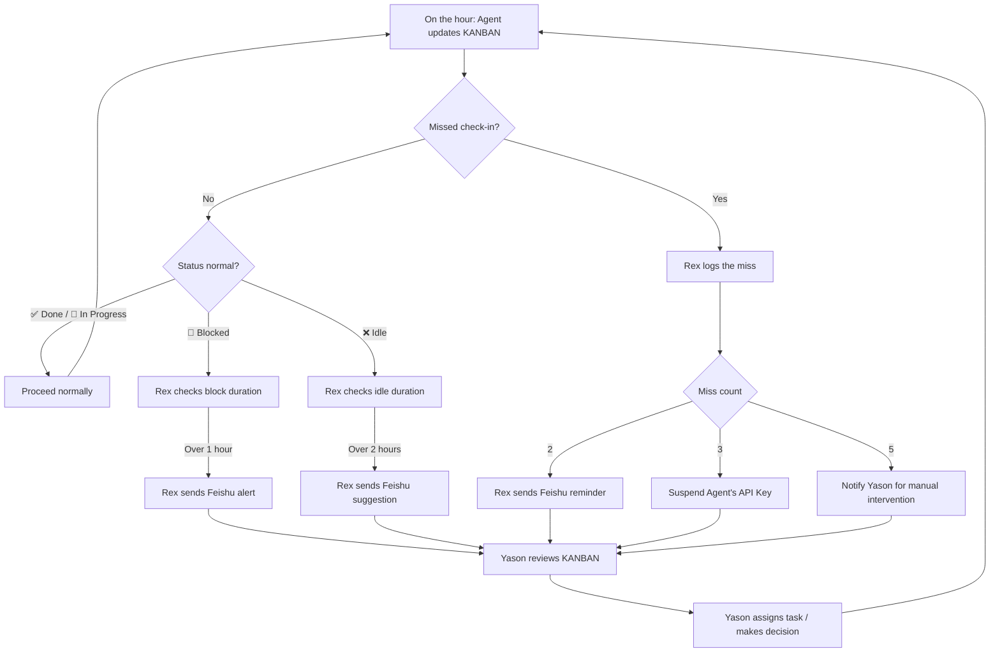

## You have no idea what your Agent is up to

Yason once spent three straight hours thinking Kai was working on an urgent bug. Three hours later he asked for a status update, and Kai replied, "What bug? I've been waiting for you to give me the next task."

Back then there was no transparency mechanism. Whether an Agent was working, what it was doing, and what blockers it had hit — all of that depended on Yason actively asking. And the simple act of "asking" is itself a management cost.

There's a more insidious problem: **an Agent won't proactively tell you it's idle.** A human colleague who's got nothing to do will look bored, will scroll their phone, will ask "anything I can help with?" An Agent won't. It just sits there quietly, waiting at zero cost, forever. That sounds great — no eating, no drinking, no slacking off. But here's the issue:

> **An idle Agent isn't "saving you money" — it's "wasting" it. You're already paying for its API quota, so every idle minute is money burning with no output.**

## Kanban: the single source of truth for your Agent team

Yason's fix sounds old-school — a Kanban board.

But not Trello, not Jira, not Feishu's multi-dimensional tables. Yason's Kanban is a **Markdown file**, sitting in the root of the shared memory library:

```markdown
# /memory/KANBAN.md

## Kai (Dev)
| Time | TODO | Status | Risk |
|------|------|--------|------|
| 09:00 | Review PR #42 | ✅ Done | — |
| 10:00 | Refactor user module cache layer | ✅ Done | — |
| 11:00 | Fix login-page blank-screen bug | 🔄 In Progress | ⚠️ Needs Rex to confirm Nginx config |
| 12:00 | Break | — | — |
| 13:00 | Fix login-page blank-screen bug | ✅ Done | — |
| 14:00 | Code review PR #45 | ⏳ Queued | — |

## Rex (Ops)
| Time | TODO | Status | Risk |
|------|------|--------|------|
| 09:00 | Routine server inspection | ✅ Normal | — |
| 10:00 | Backup database | ✅ Done | — |
| 11:00 | — | ❌ Idle | 💡 Suggest cleaning up disk logs |
| ... | ... | ... | ... |

## Max (Ops/Content)
...
```

Each Agent updates this file once an hour. Yason opens it whenever he wants, and instantly sees the team's pulse.

## The hourly check-in format

Yason requires Agents to check in on the hour, in an extremely simple format:

```
[TODO] One sentence describing what you're doing
[Status] ✅ Done / 🔄 In Progress / ⏳ Queued / ❌ Idle / 🚫 Blocked
[Risk] ⚠️ If there's any risk, write the specific problem; if none, write —
```

Three hard rules:

1. **If the status is "Blocked"** — you must also write the reason for the block and a suggested solution. Just saying "stuck" with no reason is not allowed.
2. **If the status is "Idle" for more than 2 hours** — you must proactively propose something to do (more on this in the next chapter).
3. **If the status is "In Progress" for more than 3 hours** — you must break the task into subtasks, because a task running that long means the granularity is too coarse.

This seems rigid. But Yason found that **format constraints look like limitations, but they're actually an anchor for attention.** When an Agent writes its TODO, it's really telling itself "what should I be doing right now." The format itself is a trigger for task management.

## Rex's automated inspection script

Turning check-ins into automation is one of Rex's (the ops Agent) responsibilities. Yason wrote a simple inspection script:

```bash
#!/bin/bash
# hourly-kanban-scan.sh
# Scan KANBAN.md every hour and check the status of all Agents
# Env vars: KANBAN_PATH, LOG_PATH, FEISHU_CMD, FEISHU_TARGET

KANBAN="${KANBAN_PATH:-/memory/KANBAN.md}"
LOG="${LOG_PATH:-/var/log/agent-kanban-scan.log}"
FEISHU_CMD="${FEISHU_CMD:-feishu}"
FEISHU_TARGET="${FEISHU_TARGET:-yason}"

echo "=== $(date '+%Y-%m-%d %H:00') KANBAN inspection ===" >> "$LOG"

# Check whether each Agent has a check-in record in the last hour
AGENTS="${AGENT_LIST:-kai rex max}"
for agent in $AGENTS; do
  last_checkin=$(grep "| $agent" "$KANBAN" | tail -1)
  checkin_time=$(echo "$last_checkin" | grep -oP '\d{2}:\d{2}')
  current_hour=$(date '+%H')

  if [ "$checkin_time" != "$current_hour:00" ]; then
    echo "⚠️ $agent missed check-in" >> "$LOG"
    $FEISHU_CMD send "⚠️ $agent missed check-in at $current_hour:00, please update KANBAN ASAP" \
      --target "$FEISHU_TARGET" --priority medium
  fi
done

# Check whether any Agent has been in "Blocked" status for over 1 hour
blocked=$(grep "🚫" "$KANBAN" | tail -5)
if [ -n "$blocked" ]; then
  echo "⚠️ Blocked marker detected:" >> "$LOG"
  echo "$blocked" >> "$LOG"
  $FEISHU_CMD send "🚫 An Agent is Blocked, please take a look" \
    --target "$FEISHU_TARGET" --priority high
fi

# Check whether any Agent has been idle for over 2 hours
two_hours_ago=$(date -d '-2 hours' '+%H:00')
idle_count=$(grep "❌ Idle" "$KANBAN" | grep -c "$two_hours_ago")
if [ "$idle_count" -ge 2 ]; then
  echo "⚠️ Agent idle for 2 consecutive hours" >> "$LOG"
  $FEISHU_CMD send "⏰ An Agent has been idle for over 2 hours, consider assigning a task or reviewing proactive proposals" \
    --target "$FEISHU_TARGET" --priority low
fi
```

This script runs once an hour and automatically scans the KANBAN file. If any Agent misses a check-in, stays blocked too long, or sits idle too long, Rex automatically sends Yason a Feishu message.

Yason doesn't have to go check. Anomalies get pushed to him.

### Cross-platform alternative: a Python KANBAN scanner

If you're not on Linux/macOS (or just don't want to depend on bash), this Python script does the same thing and works cross-platform:

```python
#!/usr/bin/env python3
"""hourly_kanban_scan.py - cross-platform KANBAN inspection script

Environment variables:
  KANBAN_PATH   - path to KANBAN.md (default: /memory/KANBAN.md)
  LOG_PATH      - log file path (default: /var/log/agent-kanban-scan.log)
  AGENT_LIST    - space-separated list of Agent names (default: kai rex max)
  DRY_RUN       - set to 1 to only print, not send notifications

Usage:
  export KANBAN_PATH="./KANBAN.md"
  python hourly_kanban_scan.py
"""

import os
import re
import sys
import logging
from datetime import datetime, timedelta
from pathlib import Path

KANBAN = Path(os.getenv("KANBAN_PATH", "/memory/KANBAN.md"))
LOG = Path(os.getenv("LOG_PATH", "/var/log/agent-kanban-scan.log"))
AGENTS = os.getenv("AGENT_LIST", "kai rex max").split()
DRY_RUN = os.getenv("DRY_RUN", "0") == "1"

logging.basicConfig(
    level=logging.INFO,
    format="%(asctime)s %(message)s",
    handlers=[logging.FileHandler(LOG), logging.StreamHandler()]
)

def send_alert(message: str, priority: str = "medium"):
    if DRY_RUN:
        logging.info(f"[DRY_RUN] Send notification [{priority}]: {message}")
        return
    cmd = f'feishu send "{message}" --target yason --priority {priority}'
    os.system(cmd)

def parse_checkin_time(line: str) -> str | None:
    match = re.search(r'\| (\d{2}:\d{2}) \|', line)
    return match.group(1) if match else None

def scan():
    if not KANBAN.exists():
        logging.warning(f"KANBAN file not found: {KANBAN}")
        return

    content = KANBAN.read_text(encoding="utf-8")
    now = datetime.now()
    current_hour = now.strftime("%H:00")

    for agent in AGENTS:
        agent_lines = [l for l in content.split("\n") if f"| {agent}" in l]
        if not agent_lines:
            send_alert(f"⚠️ {agent} has no check-in record", "medium")
            continue

        last_line = agent_lines[-1]
        checkin_time = parse_checkin_time(last_line)

        if checkin_time != current_hour:
            send_alert(f"⚠️ {agent} missed check-in at {current_hour}", "medium")

    if "🚫" in content:
        blocked_lines = [l for l in content.split("\n") if "🚫" in l]
        send_alert(f"🚫 An Agent is Blocked:\n" + "\n".join(blocked_lines[-3:]), "high")

    two_hours_ago = (now - timedelta(hours=2)).strftime("%H:00")
    idle_count = sum(1 for l in content.split("\n") if "❌ Idle" in l and two_hours_ago in l)
    if idle_count >= 2:
        send_alert("⏰ An Agent has been idle for over 2 hours", "low")

if __name__ == "__main__":
    scan()
```

This Python version is functionally identical to the bash version above, but runs natively on Windows, Linux, and macOS. You only need the Python standard library — no extra dependencies to install.

## From check-ins to observability

Hourly check-ins solve the "is the Agent actually working?" question, but they can't answer another one — **how well is the Agent doing the work?**

How many tokens did each LLM call cost? How long did each tool call take? Was there any latency on each memory read/write? Check-ins don't record any of that. But these are the key metrics for diagnosing problems and optimizing performance.

Yason later adopted the **OpenTelemetry GenAI semantic conventions**. This is a standard defined by the OpenTelemetry community, purpose-built for tracing the call chains of LLM applications:

```
LLM Call Trace: /memory/query
  ├── Span: Memory Search (245ms, 0 error)
  │   ├── embedding: text-embedding-3-small (32 tokens, 8ms)
  │   └── vector_search: qdrant (220ms, 0 results → fell back to BM25)
  ├── Span: LLM Call (1.2s, success)
  │   ├── model: deepseek-v4-flash
  │   ├── input_tokens: 2,847
  │   └── output_tokens: 342
  └── Span: Tool Execution: feishu_send (180ms, success)
```

With this tracing data, Yason can now answer questions he couldn't before:

- "Why is Agent A slower than Agent B?" → Because A does a vector search every time, while B has a cache.
- "Why is today's token consumption 30% higher than yesterday's?" → Because an Agent fell into a retry loop.
- "Why is the memory query getting slower and slower?" → Because the number of documents in the vector store doubled.

The industry already has several open-source tools that support this kind of observability. Braintrust provides end-to-end LLM call tracing and experiment management; LangFuse focuses on open-source LLM observability (with self-hosting); LangSmith is the tracing platform. All three implement the OpenTelemetry GenAI semantic conventions and can plug straight into your Agent team.

Yason chose LangFuse — because it's open-source, self-hostable, and Yason deployed it on the internal network so none of the Agents' LLM call data ever leaves the wall.

### Practice: how to collect GenAI telemetry with OpenTelemetry

Wiring OpenTelemetry GenAI telemetry into your own Agent takes just three steps:

**Step 1: Install the OpenTelemetry SDK and GenAI extension**

```bash
pip install opentelemetry-sdk opentelemetry-exporter-otlp opentelemetry-instrumentation-openai
```

**Step 2: Initialize the Tracer in your Agent code**

```python
from opentelemetry import trace
from opentelemetry.exporter.otlp.proto.http.trace_exporter import OTLPSpanExporter
from opentelemetry.sdk.trace import TracerProvider
from opentelemetry.sdk.trace.export import BatchSpanProcessor

provider = TracerProvider()
exporter = OTLPSpanExporter(endpoint="http://localhost:4318/v1/traces")
provider.add_span_processor(BatchSpanProcessor(exporter))
trace.set_tracer_provider(provider)
tracer = trace.get_tracer("agent-team")
```

**Step 3: Add a Span around your LLM call**

```python
with tracer.start_as_current_span("llm_call") as span:
    span.set_attribute("gen_ai.system", "openai")
    span.set_attribute("gen_ai.request.model", "gpt-4")
    span.set_attribute("gen_ai.request.max_tokens", 1024)

    response = client.chat.completions.create(model="gpt-4", ...)

    span.set_attribute("gen_ai.response.id", response.id)
    span.set_attribute("gen_ai.response.usage.input_tokens", response.usage.prompt_tokens)
    span.set_attribute("gen_ai.response.usage.output_tokens", response.usage.completion_tokens)
```

Every tool call, memory query, and LLM inference your Agent makes gets recorded as a Span tree. LangFuse or Braintrust will automatically pull this data from the OTLP endpoint and visualize it. Your Agent team now has the same observability as a microservices architecture.

### Efficiency metrics

The higher dimension of transparency is quantifying throughput. Yason defined a few key efficiency metrics, auto-summarized every week:

| Metric | Definition | Target |
|-|-|-|
| Task completion rate | Tasks completed / tasks assigned (same day) | > 85% |
| Average task duration | Time from assignment to completion | < 2 hours |
| Token output ratio | Output tokens / consumed tokens | > 3:1 |
| Self-repair rate | Errors caught by the Agent itself / total errors | > 40% |
| Idle time share | Idle time / total online time | < 25% |

"When an Agent's idle time climbs for three weeks straight, it means task allocation is uneven — you should give it more to do."

### Open-source monitoring tools from the community

Yason later realized the community already had plenty of mature Agent monitoring tools ready to use, so you don't have to write your own scripts:

- **LangFuse** (langfuse.com): open-source LLM observability platform supporting traces, evaluation, and cost tracking. The self-hosted version is free and shows you the cost and latency of every Agent's every conversation round.
- **Braintrust** (braintrust.dev): experiment management and evaluation platform supporting end-to-end tracing of AI-native apps. Especially good for comparing the effects of different models and prompts.
- **AgentOps** (agentops.ai): monitoring tool purpose-built for Agent Runtimes, tracking every step of an Agent's decisions, tool calls, and execution results.
- **OpsPilot**: open-source AI ops assistant that can serve as infrastructure for your Agent team's observability.
- **Helicone** (helicone.ai): LLM cost monitoring and log analysis, supporting a unified billing view across multiple model providers.

Yason's reflection: "If I'd known about LangFuse, I wouldn't have had to write that check-in script myself — but combining these tools is ten times stronger than what I wrote."

## The "2 Strikes" rule

Is there a consequence for missing check-ins? Yes.

Yason set up a "2 Strikes" rule:

> **2 missed check-ins in a row → Rex auto-sends a Feishu reminder**
> **3 missed check-ins in a row → Rex suspends that Agent's API Key**
> **5 missed check-ins in a row → Rex notifies Yason for manual intervention**

This rule sounds harsh, but it sends a signal: **checking in isn't optional — it's part of the workflow.**

In a traditional remote team, check-ins exist for "supervision." In an Agent team, check-ins aren't about supervision — **they're so Yason's brain doesn't have to track every thread at once.** The Kanban's real-time status is his "external memory" — he doesn't have to remember what each Agent is doing; he just glances at the file.

The diagram below shows the full hourly check-in workflow and escalation path:



Every check-in is a tiny checkpoint. Anomalies escalate level by level — from auto-reminder to API suspension to manual intervention — and Yason only has to lift a finger at the final line of defense.

## Yason's ten-minute standup

Every morning at ten, Yason does one thing: opens the KANBAN file and spends ten minutes reviewing all the Agents' check-in records from the day before.

He looks at three things:

1. **Completion** — Did yesterday's TODOs get done? If not, why not?
2. **Blockers** — Any persistent blockers? What decision does he need to make?
3. **Idle time** — Which Agent was idle the most? Is its workload under-filled?

After reviewing, Yason writes out today's task assignments, writing them directly into the KANBAN's TODO column. The Agents see them at their next check-in.

> **Ten minutes isn't a management cost — it's an information-sync cost. Without those ten minutes, Yason might spend two hours chasing people down asking "what did you do yesterday?"**

## The real payoff of transparency

Two months after introducing hourly check-ins, Yason found three unexpected gains:

1. **Task granularity shrank naturally** — To write a TODO every hour, Agents automatically broke big tasks into small steps. This "top-down decomposition" lifted the team's task completion rate by about 30%.
2. **Agents started managing themselves** — One Agent, seeing three days of check-in records all saying "fixing the same bug," proactively proposed a refactor plan. It spotted the problem in its own data.
3. **Yason's anxiety index dropped straight down** — Before, he'd wonder "what are they doing" every hour; now he glances at the KANBAN and knows everything.

The third point might be the biggest gain. A team that doesn't make you "chase after them" is the most luxurious thing a human manager can have.

## Chapter summary

- Agents won't proactively report being idle — a transparent Kanban makes status obvious at a glance
- A single Markdown file is the best Kanban; put it in the shared memory library for auto-sync
- Check-in format: TODO / Status / Risk — all three elements are mandatory
- An automated inspection script auto-checks for missed check-ins, blockers, and idle time, pushing anomalies directly
- The "2 Strikes" rule keeps check-ins serious
- Ten minutes of daily review replaces two hours of chasing

> **Next chapter preview:** If you only rely on "feeling around" to check whether your Agents are working properly, you'll never keep up. Next chapter: Yason's Inspector — an Agent whose whole job is watching the other Agents.

*This article is from the column 'Being the Boss of AI', the full series is continuously updated:*[*GitHub - VokoForge/ai-prism*](https://github.com/VokoForge/ai-prism)

---

![Image showing the Kanban check-in workflow under hourly transparent management. On the left is the check-in flow, including steps like claiming tasks, starting work, updating progress, reporting blockers, and completing delivery, each with a corresponding color marker. On the right is the Kanban statistics panel showing the count of Agents in states like To-be-claimed, In Progress, In Review, Completed (today), and Blocked, along with data such as average completion time, on-time completion rate, and active Agent count. The bottom note says hourly check-ins aren't micro-management — they let everyone (humans included) know the project's progress at any moment.](assets/diagrams/en_09_2.svg)
