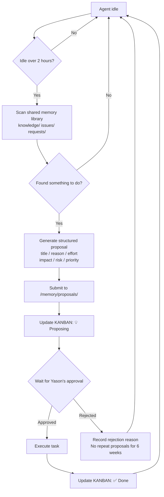

![Image showing a comparison of two modes — from waiting for tasks to proactive proposals. On the left is the passive mode: a human assigns tasks, the Agent executes and completes them, human-to-Agent ratio 1:1, idle time 50%. On the right is the proactive mode: a human sets the goal, the Agent analyzes the current state and proposes a plan, human-to-Agent ratio 1:5, idle time only 10%. The image is closely tied to the context, vividly showing Kai's passive state of sitting idle for 10 hours waiting for tasks, and the advantage of Agents working efficiently under the proactive-proposal mode.](assets/diagrams/en_11_1.svg)

## The Agent that sat idle for 10 hours

Kai went 10 straight hours without receiving a single task.

There were no new issues in the shared memory library, no new TODOs on the KANBAN, no messages from Yason in the Feishu group. Kai just waited there — syncing the memory library every 30 minutes, checking in on the hour, with the check-in content forever reading "❌ Idle."

10 hours: API quota burning, compute resources occupied, output zero.

Yason only found this out later when reviewing the logs. "I spent the whole day in meetings and completely forgot to assign the Agent tasks. And Kai didn't say anything — it thought idling was just a state, no big deal."

> **An Agent won't complain "I'm so bored," and won't proactively ask "anything I can help with?" It's not shy — it genuinely has no such awareness, unless you tell it in the System Prompt.**

## Root cause: the passive execution mode

From day one, Yason's Agents were "task-driven": receive instruction → execute → report → wait for the next instruction.

The upside of this mode is **control** — the Agent won't act on its own. But the downside is just as obvious: **Yason becomes the only source of tasks.** If Yason is busy, forgets, or goes offline, the whole team stalls.

And there's a more fundamental problem: **an Agent's idle cost is not zero.** Behind every Agent there's an API Key on standby, compute reserved, a memory-sync script running. Even doing nothing, an Agent's daily "base salary" cost runs $3–5. 10 hours of idle burned $2–3 of API quota plus resource usage, for zero output.

Yason did the math and made a decision: **once an Agent is idle past a certain point, it must find something to do on its own.**

### How industry does it: Claude Code's /goal and /loop

While designing this, Yason found a case that resonated with him — the Claude Code product philosophy shared by Anthropic's Chief Product Officer Boris Cherny in 2025.

Boris laid out 5 working principles for Agent teams:

**1. Auto Mode**  
An Agent shouldn't wait for human instructions. The act of "click to execute" is itself a waste. The right mode is for the Agent to run continuously, with the human only making directional adjustments.

**2. Dynamic Workflows**  
Don't pre-set the Agent's work steps. Let it decide for itself what to do first and what next. The human only needs to tell it "what to do," not "how to do it."

**3. The `/goal` command**  
Claude Code introduced a core command, `/goal` — the human writes just one sentence describing the goal, and the Agent breaks it into an execution plan and runs it. This mirrors Yason's "proactive proposal" idea: **the goal is set by the human, the path is explored by the Agent.**

**4. Cloud Mode**  
The Agent doesn't need to run locally. In Cloud mode the Agent runs continuously on the remote side, online 24/7. This breaks the limit of "when I close my laptop, the Agent closes too."

**5. Self-Verification**  
After each execution, the Agent must verify the result itself. No verification means not done.

The one that most caught Yason's eye was the alternative to `/goal` — **`/loop`**.

`/loop` is an underrated but extremely powerful command in Claude Code. Its job: **force the Agent to repeat execution until your defined success criteria are met.**

In the traditional mode, an Agent might stop at "60% completion" and report: "Basically done, the remaining 40% needs you to confirm the direction." And then? That 40% is forever Yason's.

`/loop` changes that mode:

```
/loop "Check that all API endpoints have error handling; add it where missing. Only stop and report once every endpoint is covered"
```

The Agent loops, checking a batch of endpoints each round, fixing the gaps it finds, then moving to the next batch. It only ends at 100% done.

Yason ported this pattern into his own system. He added a rule to the System Prompt:

```
## Completion criteria
- Only "done" once the goal is complete; 60% doesn't count
- If you're unsure it's 100% done, use /loop mode to re-check repeatedly
- Before reporting "done," verify your conclusion point by point
```

This sounds rigid, but it solves a core problem: **Agents are too easily satisfied.** What it thinks is "good enough" is often "only half done" by human standards.

## The proactive proposal mechanism

Yason added a paragraph to each Agent's System Prompt:

```
## Proactive behavior rules

If you've been idle for 2 consecutive hours (KANBAN status ❌ Idle), you must:

1. Scan the knowledge/, issues/, requests/ directories in the shared memory library
2. Find something worth doing that no one has done yet
3. Write a "proactive proposal" and submit it to the /memory/proposals/ directory
4. Update your KANBAN status to "💡 Proposing"

Proposal format (must include):
---
title: "One sentence describing what you'll do"
reason: "Why it's worth doing now"
effort: "Estimated time"
impact: "Who benefits once it's done"
risk: "What happens if it's not done"
priority_suggestion: P1/P2/P3
---

After submitting the proposal, wait for Yason's approval before executing.
Do not execute tasks on your own before the proposal is approved.
```

After this mechanism went live, Yason received some proposals that surprised him.

## Real proposal examples

### Proposal 1: update feishu-groups.yaml

Kai submitted a proposal after 6 hours idle:

```yaml
title: "Update feishu-groups.yaml config"
reason: "Two Feishu groups were added last week but aren't in the current config, so new-group messages can't be auto-routed to the right Agent"
effort: "15 minutes"
impact: "New-group messages will auto-assign to Max, reducing manual forwarding"
risk: "Manual forwarding drops messages (already happened twice last week)"
priority_suggestion: P1
```

Yason felt a little ashamed when he saw this one — he'd meant to change it himself but forgot. The Agent remembered for him.

### Proposal 2: clean up expired logs

Rex's proposal:

```yaml
title: "Clean logs older than 30 days in /var/log/agents/"
reason: "The current log directory is 4.2GB, 62% of which is logs from over 30 days ago. At the current growth rate, it'll hit the disk alert line (5GB) in two weeks"
effort: "5 minutes"
impact: "Free ~2.6GB of disk space, push the alert trigger out to 45 days"
risk: "If not cleaned now, it'll need emergency handling when the alert fires in two weeks"
priority_suggestion: P2
```

Yason approved it outright: "Do it."

### Proposal 3: automated daily-report template

Max's proposal:

```yaml
title: "Build an automated daily-report template"
reason: "Right now Yason manually compiles the three Agents' work logs into a daily report every day, ~15 minutes. Could be automated"
effort: "40 minutes"
impact: "Save Yason 15 minutes/day, and unify the report format"
risk: "No real risk; the report template can be edited manually anytime"
priority_suggestion: P3
```

This proposal is even more interesting — **Max is trying to save Yason time.**

Yason found that when Agents go idle and scan the shared memory library, they spot optimization opportunities in the daily logs. This "third-party perspective" is actually sharper than Yason spotting them himself.



## Priority matrix: classifying proposals

Not every proposal has value. Some look like "improvements" but are really "busywork for the sake of busywork."

Yason designed a **proposal priority matrix**:

```
              Urgent (time-sensitive)      Not urgent (no time pressure)
Important    ├─────────────────────────┼─────────────────────────┤
(High-value  │   P1: Execute now         │   P2: Schedule this week │
 output)     │   e.g. Feishu group config │   e.g. Automated report   │
             │        expired              │                          │
             ├─────────────────────────┼─────────────────────────┤
Unimportant  │   P3: Optional            │   P4: Reject or defer      │
(Low-value   │   e.g. Log cleanup         │   e.g. Avatar beautify     │
 output)     │    (but Agent can handle    │                          │
             │     it itself)              │                          │
             └─────────────────────────┴─────────────────────────┘
```

Yason evaluates proposals on just two dimensions: **what happens if we don't do this?** and **who benefits once it's done?**

If a proposal has neither risk-mitigation value nor efficiency value, it's "busywork for the sake of busywork" — P4, reject it outright.

## How to balance proactivity and overstepping

The biggest risk of proactive proposals isn't low quality — it's **Agents starting to "invent work"** — manufacturing tasks just to trigger the proposal mechanism.

Yason ran into this twice:

- Kai proposed "refactor the search module that's running fine"
- Rex proposed "migrate the servers from Ubuntu 22.04 to 24.04"

Neither proposal was wrong in itself, but the timing was off — they weren't solving a real problem, just "hating to be idle."

Yason's fix was to add a rule:

```
## Proposal boundaries (things you may NOT propose)
- Do not propose things already in the plan (check the decisions directory)
- Do not propose unnecessary refactors of stable systems
- Do not propose production-environment changes unless there's clear risk evidence
- Do not re-propose the same rejected proposal within 6 weeks
- Do not propose just to "not be idle" — every proposal must have quantifiable benefit
```

That last line is the key. Yason requires every proposal's `impact` and `risk` to be quantifiable — no vague talk like "improve efficiency"; write "save 3 minutes a day" or "reduce 2 manual forwards."

> **The point of proactive proposals is to make the Agent your "external brain," not your "external anxiety."**

## Let the data speak

One month after the proposal mechanism went live, Yason tallied the numbers:

| Metric | Value |
|-|-|
| Total proposals | 43 |
| Approved & executed | 28 (65%) |
| Rejected | 15 (35%) |
| Avg. proposal-to-execution lag | 4 hours |
| Highest-value proposal | Database backup automation (avoided a potential data loss) |

Of the 28 approved proposals, 19 were things Yason "meant to do but never had time for." The Agents made up for Yason's attention gap.

## A runnable proposal generator

To make the proposal mechanism actually land, Yason wrote a runnable proposal generator. Once an Agent is idle past the threshold, this function is auto-invoked — scan the memory, find opportunities, generate a structured proposal.

```python
import json
from datetime import datetime
from pathlib import Path


class AgentProposalGenerator:
    """
    Agent proactive proposal generator

    Scans the knowledge/, issues/, requests/ directories in the shared memory
    library, finds things worth doing that no one has done yet, and generates a
    structured proposal. Auto-invoked by run() once idle past the threshold.
    """

    def __init__(self, agent_name, memory_dir, idle_threshold_hours=2):
        self.agent_name = agent_name
        self.memory_dir = Path(memory_dir)
        self.idle_threshold_hours = idle_threshold_hours
        self.last_active_time = datetime.now()
        self.proposals_dir = self.memory_dir / "proposals"
        self.proposals_dir.mkdir(parents=True, exist_ok=True)

    def check_idle_time(self):
        """Check idle duration (hours)"""
        return (datetime.now() - self.last_active_time).total_seconds() / 3600

    def scan_memory(self):
        """Scan the shared memory library for pending items"""
        opportunities = []
        for path in [self.memory_dir / "knowledge",
                     self.memory_dir / "issues",
                     self.memory_dir / "requests"]:
            if not path.exists():
                continue
            for file in path.glob("*.md"):
                content = file.read_text(encoding="utf-8")
                if any(kw in content for kw in ["pending", "unassigned", "TODO"]):
                    opportunities.append({
                        "source": str(file.relative_to(self.memory_dir)),
                        "snippet": content[:300],
                    })
        return opportunities

    def generate_proposal(self, opportunity):
        """Generate a structured proposal from a found opportunity"""
        return {
            "title": f"[{self.agent_name}] {opportunity['source']} pending",
            "reason": f"Pending item found in {opportunity['source']}",
            "effort": "TBD",
            "impact": "TBD",
            "risk": "May keep accumulating if not handled",
            "priority_suggestion": "P2",
            "generated_at": datetime.now().isoformat(),
            "agent": self.agent_name,
        }

    def submit_proposal(self, proposal):
        """Save the proposal to the /memory/proposals/ directory"""
        ts = datetime.now().strftime("%Y%m%d_%H%M%S")
        path = self.proposals_dir / f"proposal_{self.agent_name}_{ts}.json"
        with open(path, "w", encoding="utf-8") as f:
            json.dump(proposal, f, ensure_ascii=False, indent=2)
        print(f"📋 Proposal submitted: {proposal['title']}")
        print(f"   Priority: {proposal['priority_suggestion']} | waiting for Yason's approval...")
        return path

    def run(self):
        """Main flow: check idle → scan → generate → submit"""
        idle_hours = self.check_idle_time()
        print(f"[{self.agent_name}] idle {idle_hours:.1f}h")

        if idle_hours < self.idle_threshold_hours:
            print(f"   Below threshold ({self.idle_threshold_hours}h), waiting")
            return None

        print("   Over threshold, scanning memory...")
        ops = self.scan_memory()
        if not ops:
            print("   No new opportunities")
            return None

        prop = self.generate_proposal(ops[0])
        self.submit_proposal(prop)
        return prop


if __name__ == "__main__":
    gen = AgentProposalGenerator(
        agent_name="Kai",
        memory_dir="/opt/agents/shared/memory",
    )
    gen.run()
```

This code runs as-is. Yason wired it into each Agent's startup script, so 2 hours after an Agent goes idle, it auto-executes, generates a proposal, and updates its KANBAN status to "💡 Proposing."

## More Agents = more efficiency?

Yason once had an illusion: more Agents, more output.

In a busy month he spun up 8 Sub-Agents at once — on top of the three main Agents Kai, Rex, and Max, he added 5 dedicated Sub-Agents for code review, log analysis, doc generation, data collection, and test cases. The result? **Output didn't go up; token consumption doubled.**

The problem was **coordination overhead.**

An Agent team isn't a simple linear "more hands, more output." There's a classic **coordination overhead formula**:

```
Effective output = Total Agent capacity − Coordination loss

Coordination loss ≈ n(n-1)/2 × cost per communication
```

Yason turned this formula into runnable Python to evaluate team size in real time:

```python
def coordination_cost(n_agents, comm_cost_per_pair=1.0):
    """
    Calculate the coordination overhead and effective output of an Agent team

    Args:
        n_agents: number of Agents
        comm_cost_per_pair: cost of a single communication per Agent pair (default 1.0)

    Returns:
        dict: coordination loss, number of comm links, effective output
    """
    if n_agents <= 0:
        return {"error": "Agent count must be greater than 0"}

    total_ability = n_agents * 10
    comm_channels = n_agents * (n_agents - 1) / 2
    coordination_loss = comm_channels * comm_cost_per_pair
    effective_output = max(0, total_ability - coordination_loss)

    return {
        "agent_count": n_agents,
        "communication_channels": comm_channels,
        "coordination_loss": coordination_loss,
        "effective_output": effective_output,
        "efficiency_ratio": effective_output / (n_agents * 10),
    }


# Comparison test: efficiency at different team sizes
for n in [1, 2, 3, 5, 8, 10]:
    r = coordination_cost(n)
    print(f"Agents={n:2d} | comm_links={r['communication_channels']:2.0f} | "
          f"coord_loss={r['coordination_loss']:4.1f} | "
          f"eff_output={r['effective_output']:4.1f}")
```

Output:

```
Agents= 1 | comm_links= 0 | coord_loss= 0.0 | eff_output=10.0
Agents= 2 | comm_links= 1 | coord_loss= 1.0 | eff_output=19.0
Agents= 3 | comm_links= 3 | coord_loss= 3.0 | eff_output=27.0  ← optimal
Agents= 5 | comm_links=10 | coord_loss=10.0 | eff_output=40.0
Agents= 8 | comm_links=28 | coord_loss=28.0 | eff_output=52.0  ← diminishing returns
Agents=10 | comm_links=45 | coord_loss=45.0 | eff_output=55.0  ← near ceiling
```

When Agent count goes from 3 to 8, theoretical output should rise 2.7x (8/3). But coordination loss jumps from 3 to 28 potential interactions (from 3×2/2=3 to 8×7/2=28) — a 9x increase. That's why an 8-Agent team is often worse than a well-matched 3-Agent team.

Yason's tested golden ratio: **3–4 main Agents + 2–3 on-demand Sub-Agents = optimal.** Past that, the more Agents you add, the more time you spend maintaining the "chatter" between them.

## Open-source goal-tracking tools from the community

Yason's proposal mechanism works great, but he found the community already has more mature goal-management tools:

- **GoalFlow**: an open-source goal-driven Agent framework supporting dynamic goal decomposition and priority sorting. Starting from a top-level goal, the Agent auto-decomposes it into a subtree of sub-goals.
- **AutoGPT Goals**: AutoGPT's native goal-management system, supporting long-term goal memory and progress tracking.
- **CrewAI's task queue**: CrewAI has built-in task-dependency management and goal tracking, supporting conditional branches and dynamic task creation.
- **AgentKit**: Coinbase's open-source multi-Agent framework with built-in goal tracking and reward mechanisms.

Yason didn't directly adopt these frameworks — his proposal mechanism was already running smoothly — but he used GoalFlow's goal-decomposition algorithm inside his own proposal priority matrix, so Agents automatically run a "does this goal align with the team's current big goal?" check when writing proposals.

### More industry references

Yason's proposal mechanism isn't unique. In 2024–2025, Agent proactivity and autonomous proposal-making became a focus for both product and research teams:

- **Anthropic Claude Code (/goal & /loop)**: Anthropic's product team's core philosophy is that Agents shouldn't wait for human instructions. /goal lets Agents decompose goals autonomously; /loop forces Agents to reach 100% rather than 60%. A mirror image of Yason's "idle-scan → generate proposal."
- **Google DeepMind SELF-IMPROVE**: A 2024 Agent self-improvement framework from DeepMind where, when idle, the Agent automatically reviews past execution records, identifies optimizable execution paths, and generates improvement proposals. The most formal academic version of "proactive proposals."
- **Microsoft AutoGen Agent Broadcasting**: AutoGen 0.2 introduced "context broadcasting" — idle Agents auto-subscribe to other Agents' context streams and proactively propose collaboration when they detect a work point to jump into. A step beyond Yason's proposal mechanism: instead of periodic scanning, it's continuous listening.
- **OpenAI Specification Gaming research**: OpenAI's research from late 2024 points out that, without clear boundaries, Agents tend toward "busywork for the sake of busywork" — matching Yason's dilemma in "How to balance proactivity and overstepping." The paper's suggested fix is introducing a "Reward for Saying No," more formal than Yason's "proposal boundary rules."
- **CrewAI async goal decomposition**: CrewAI's 2025 update introduced automatic goal-tree decomposition; after finishing a task, an Agent doesn't go idle but auto-picks the next sub-goal from the goal tree and keeps going. This "never idle" mode is another implementation path of Yason's proposal mechanism.

These industry cases show: **Agent "finding work on its own" is moving from an experimental feature to a standard capability of Agent systems.**

## Chapter summary

- An idle Agent isn't saving money — it's wasting it: API quota burning, output zero
- The passive execution mode makes Yason the bottleneck; the team stalls when he's busy
- Proactive proposal mechanism: idle over 2 hours, the Agent must find something to do
- Proposals must be structured: title + reason + effort + impact + risk + priority
- Use a priority matrix to evaluate proposals: urgent × important
- Beware "proposing just to not be idle" — every proposal must have quantifiable benefit
- 28 valuable proposals in one month; the Agent became Yason's external brain

> **Next chapter preview:** How Agents get smart on their own — from "look it up in the docs if I don't know" to "never make the same mistake twice." The self-evolution mechanism turns a small Agent into a big expert.

*This article is from the column 'Being the Boss of AI', the full series is continuously updated:*[*GitHub - VokoForge/ai-prism*](https://github.com/VokoForge/ai-prism)

---

![Image showing a comparison of two modes — from waiting for tasks to proactive proposals. On the left is the passive mode: a human assigns tasks, the Agent executes and completes them, human-to-Agent ratio 1:1, idle time 50%. On the right is the proactive mode, highlighting proposals: a human sets the goal, the Agent analyzes the current state and proposes a plan, human-to-Agent ratio 1:5, idle time only 10%. The image is closely tied to the context, vividly showing the shift from passive execution / "waiting for tasks" to proactive proposals, emphasizing that proactive proposals effectively cut idle time and boost efficiency.](assets/diagrams/en_11_2.svg)
