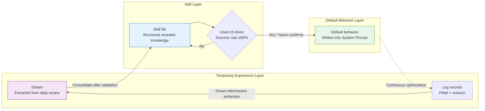
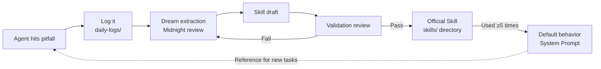

## The same problem, tripped over again the second time

Kai made a mistake that looked pretty dumb.

Doing task A, it needed to install an npm package, and used `npm install` to do it. Two hours later, doing task B, it needed the same package again — and Kai ran `npm install` all over again, same version, same dependencies, re-downloaded.

When Yason saw the logs he was torn between laughing and crying: "Didn't you just install it once?"

Kai replied: "I don't remember."

This isn't Kai's fault. **An Agent's working memory is one-shot by default.** Every task starts with a "clean brain" — it doesn't remember what the last task did, doesn't remember what pitfall it hit last time, doesn't remember which approach got rejected.

If no one actively stores the knowledge, the Agent will keep stepping in the same hole.

> **An Agent's "smart" isn't innate — it's fed. Every pitfall, every optimization, every decision — if you don't store it, it's as if it never happened.**

## Kimi Agent Swarm: 300 concurrent Agents

While designing the self-evolution mechanism, Yason read an industry report that floored him — Moonshot AI's K2.6 model, released at the end of 2025, supports **300 concurrent Sub-Agents** working together.

Not 3, not 30 — **300.**

This isn't a lab demo; it's a real, usable product capability. K2.6's Agent Swarm architecture lets a developer spin up up to 300 Sub-Agents in a single task, each independently executing a different subtask, with a central coordinator merging the results. The whole system can orchestrate 4,000+ steps of multi-step collaboration.

Even more stunning is its benchmark performance — on BrowseComp (a complex web-browsing and comprehension benchmark), K2.6 Swarm hit 86.3% accuracy. For comparison, GPT-5.4 scored 78.4% on the same task. **For the first time, an open-source model beat a closed-source model on Agent tasks.**

It made Yason think: no matter how strong a single Agent is, it can't beat the collaboration of a swarm. Swarm Intelligence isn't theory — it's something already happening in 2026.

## Swarm intelligence: from ant colonies to Agent fleets

Inspired by K2.6, Yason read a few swarm-intelligence papers and found a fascinating concept — **Stigmergy (traces / pheromones)**.

The concept comes from insect behavior: when ants search for food, they leave pheromones on the path they walk. Other ants smell it and tend to follow the strongest-pheromone path. **No commander, no map — each ant just does one thing: follow the pheromones.**

And the result? The whole colony finds the food.

Yason mapped Stigmergy onto his Agent team:

- "Pheromones" = the decision records, success logs, and warning markers an Agent leaves in the shared memory library
- "Follow the pheromones" = when an Agent hits a problem, it first searches for a solution "someone else already succeeded with"
- "Swarm intelligence" = each Agent independently optimizes its own local task, and through the "traces" in the shared environment naturally reaches a global optimum

This framework explains why Yason's shared memory library spontaneously produces swarm intelligence — the "traces" each Agent leaves unintentionally are pheromones for the others: Kai writes in a log "the root cause of this bug is X," and the next day Rex, hitting a similar problem, searches out that record and skips the trial-and-error step entirely. **The essence of those 300 concurrent Agents is 300 independent trial-and-error individuals reaching collective intelligence through a shared environment.**

```
Individual Agent optimizes → leaves pheromones (logs / Skills / decision records)
       ↓
Other Agents read the pheromones → avoid repeating the pitfall
       ↓
Collective intelligence emerges → the whole team's decision quality rises
       ↓
(feedback loop) new experience settles again as new pheromones
```

"You don't need a 'super-brain' to command everyone. You just need every Agent to leave traces in the shared environment — and collective intelligence emerges naturally." Yason wrote in his notes.

## The Dream Mechanism: the Agent's nightly review

Yason designed a system he calls the "Dream Mechanism."

Every night at 2 a.m., when all Agents are idle, a "review task" is triggered:

```bash
#!/bin/bash
# /opt/agents/scripts/daily-dream.sh
# Runs daily at midnight: the Agent reviews the day's tasks and extracts reusable knowledge

MEMORY_DIR="/opt/agents/memory"
SKILLS_DIR="$MEMORY_DIR/skills"
DREAMS_DIR="$MEMORY_DIR/.dreams"

mkdir -p "$DREAMS_DIR"

# Scan today's full logs
today=$(date '+%Y-%m-%d')
logs=$(find "$MEMORY_DIR/daily-logs" -name "*$today*" -type f)

if [ -z "$logs" ]; then
  echo "No task records today, skip review"
  exit 0
fi

echo "=== Daily review $today ==="

# Analyze each log entry, extract "reusable experience"
for log in $logs; do
  agent_name=$(basename "$log" | sed "s/$today-//" | sed 's/\.md$//')

  # Extract from the log: problems encountered, solutions, optimization suggestions
  problems=$(grep -i "problem|error|fail|blocked|pitfall" "$log")
  solutions=$(grep -i "solution|fix|approach|changed to|workaround" "$log")
  optimizations=$(grep -i "optimize|improve|suggestion|next time|better" "$log")

  if [ -n "$problems" ] && [ -n "$solutions" ]; then
    dream_file="$DREAMS_DIR/$today-$agent_name-dream.md"
    {
      echo "## Experience extraction - $agent_name - $today"
      echo ""
      echo "### Problem"
      echo "$problems"
      echo ""
      echo "### Solution"
      echo "$solutions"
      echo ""
      echo "### Optimization suggestion"
      echo "$optimizations"
    } > "$dream_file"

    echo "  $agent_name: extracted $(echo "$problems" | wc -l) experiences"
  fi
done

# Check whether any experience is worth consolidating into a Skill
# If the same type of problem appears 3+ times, auto-generate a Skill draft
# (logic omitted)
```

This script does three things:

1. **Extract experience** — find "problem + solution" pairs from today's logs
2. **Consolidate skills** — if the same type of problem recurs, auto-generate a Skill draft
3. **Update memory** — write the new experience into the shared knowledge base

The next day, when Agents load memory, these "dreamed-up" skill files become part of their knowledge.

## From experience to skills: the structured sedimentation of knowledge

Yason divided Agent knowledge into three tiers:



**Temporary experience tier**: the experience notes "dreamed" each day. May have noise, not necessarily accurate.

**Skill file tier**: validated experience, written into the `skills/` directory, with a standard format:

```markdown
# /memory/skills/npm-cache-optimization.md

## Skill name
npm dependency cache strategy

## Applicable scenario
When you need to install npm dependencies

## Problem description
Running npm install multiple times in a short window, re-downloading the same dependencies every time, wasting time

## Solution
1. Check whether the node_modules directory exists
2. If it does, first check whether the needed package is already installed
    `npm ls <package-name> 2>/dev/null`
3. If installed, skip install
4. If not installed, run npm install <package-name>

## Notes
- Must re-install when package.json changes
- Not applicable to yarn or other package managers

## Source
Kai, 2025-06-15: re-installed the axios package twice within two hours
```

**Default behavior tier**: if a Skill is used more than 5 times, its core content gets written into the Agent's System Prompt and becomes default behavior.

This is an **automated knowledge-sedimentation pipeline**:



## Cross-Agent learning

A skill one Agent learns can become shared assets for all Agents.

For example, Kai found a Node.js version-compatibility issue while coding and wrote a `node-version-compat.md` Skill. Rex hit the same problem during deployment and searched out that Skill in memory, reusing the solution directly.

Yason didn't do anything special to configure this — **all Agents share the same memory library, so cross-Agent learning happens naturally.**

But he did hit one "knowledge pollution" problem. Max learned an ops-related trick and tagged it "applies to all Agents" — then Kai and Rex started "learning" the ops skill too, thinking it was universal.

Yason's fix was to add a `scope` field to each Skill file:

```yaml
# Metadata for skills/npm-cache-optimization.md
---
scope: [kai, rex]
applicable_roles:
  - developer
  - devops
not_applicable:
  - operator
---

# Subsequent content...
```

When loading a skill, an Agent checks `scope` and only loads skills that match its role.

## The evolution-trigger mechanism

Yason's Agents don't "dream" endlessly. The daily review has a cost — every "dream" burns tokens. Yason set a trigger condition: **the review only fires when the Agent completed 3+ tasks that day, or hit 1+ error.**

```yaml
# /opt/agents/config/evolution.yaml
evolution:
  dream_trigger:
    min_tasks_completed: 3
    min_errors_encountered: 1
    schedule: "0 2 * * *"  # Every day at 2 a.m.

  skill_promotion:
    min_usage_count: 3       # Used 3+ times
    min_confidence: 0.8      # Success rate 80%+
    review_required: true    # Requires Yason's manual confirmation

  system_prompt_update:
    min_skill_count: 5       # 5 related Skills → consider writing into System Prompt
    notify_yason: true
```

Note `review_required: true` — promoting from Skill to default behavior must pass Yason's confirmation. This isn't distrust; it's **to prevent "learning it wrong."**

## Open-source self-evolution frameworks from the community

Yason's "Dream Mechanism" was hand-written, but he later found the community already had plenty of open-source self-evolution frameworks ready to use:

- **AutoGen** (Microsoft): supports Agent conversation, code execution, and tool calls, with a built-in "reflection" mechanism. After each task, the Agent can auto-generate a "reflection note" that loads on the next similar task. AutoGen 0.4 introduced cross-session memory for multi-Agent teams.
- **CrewAI's learning mechanism**: CrewAI added "Experience Memory" in its autumn 2025 release. After each task, the Agent auto-generates an "experience record" stored in the shared memory library. In later tasks, the Agent auto-retrieves the most relevant historical experience based on the current task description.
- **MemGPT/Letta**: an open-source framework giving LLMs long-term memory. The Agent's context window is no longer static — it can "flip through" historical memory as needed, like a human flipping through a notebook.
- **AgentProtocol**: an open-source protocol standardizing Agent skill sharing, letting skills be imported and exported between different Agent frameworks.

Yason didn't replace his whole system, but borrowed AutoGen's "reflection note" format into his own Dream Mechanism — making the Agent's daily review more standardized in structure.

## The Skill lifecycle: from draft to sediment

Yason later organized the "Dream → Skill → default behavior" workflow into a formal **Skill lifecycle**:

```
Draft stage
  Agent finds a reusable experience and writes a draft
    ↓
Review stage
  Another Agent (or Yason) reviews the draft's quality
    ↓
Trial stage
  The Skill is tagged "trial" — the Agent can use it but with caution
    ↓
Mature stage
  The Skill is successfully referenced 5+ times and auto-upgrades to "official Skill"
    ↓
Default stage
  In a certain class of problems, the Skill's call rate exceeds 80%, consider writing into System Prompt
    ↓
Deprecated stage
  As the model upgrades or the environment changes, a Skill no longer applies and is auto-tagged expired
```

Yason's addition of a "deprecated stage" matters — as LLM models keep upgrading (say from DeepSeek V3 to V4), many problems that once needed a Skill the model now handles itself. If you don't deprecate old Skills, the Agent gets dragged down by outdated knowledge.

## The sprout of reinforcement learning

Yason doesn't run RL (reinforcement learning) in production — too complex, too costly. But he did something similar:

**Every time Yason rejects or corrects an Agent's output, that "rejection" is recorded as a negative sample.** The next time the Agent hits a similar scenario, it searches memory and sees "this approach was rejected last time."

It's not real RL, but it's a kind of **implicit preference alignment** — no large-scale training needed, just let the Agent remember "what Yason dislikes."

"Once the Agent team grows big enough to need fully automatic evolution, I'll consider RL. Until then, this 'memory-driven implicit alignment' is enough."

## Visualizing the evolution data

After three months of running, Yason saw a clear trend:

```
Month 1: rate of problems needing Yason's guidance when an Agent is stuck — 65%
Month 2: rate of problems needing Yason's guidance when an Agent is stuck — 35%
Month 3: rate of problems needing Yason's guidance when an Agent is stuck — 18%
```

Changes in the knowledge base:

```
Month 1: 0 Skill files
Month 2: 12 Skill files
Month 3: 34 Skill files (6 of which promoted to default behavior)
```

The Agents' decision quality is rising, and Yason's intervention frequency is falling. Not because the model got stronger — Kai, Rex, and Max have used the same model from start to finish. **What got stronger is the knowledge they accumulated.**

> **An Agent's evolution curve = the quality of your knowledge management × time. The model sets the starting point; knowledge sets the endpoint.**

## Chapter summary

- An Agent's working memory is one-shot — if you don't store it, it's as if it never happened
- The "Dream Mechanism": auto-review logs at midnight every day, extract reusable experience
- Three-tier knowledge architecture: temporary experience → Skill file → default behavior
- Cross-Agent learning: the shared memory library turns one Agent's experience into the whole team's asset
- Use the scope field to avoid knowledge pollution — different-role Agents learn different skills
- Promoting from Skill to default behavior needs Yason's confirmation, to prevent "learning it wrong"
- After three months, Yason's intervention rate dropped from 65% to 18%

> **Next chapter preview:** The biggest "invisible killer" of an Agent team — the API bill. One infinite loop burned a week's budget in half a day. How do you keep your Agent team working without burning money?

*This article is from the column 'Being the Boss of AI', the full series is continuously updated:*[*GitHub - VokoForge/ai-prism*](https://github.com/VokoForge/ai-prism)

---

---

