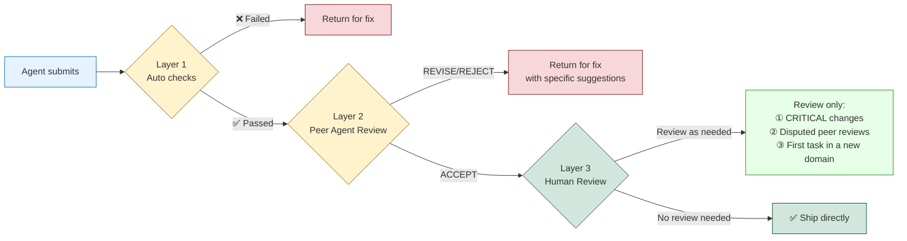

# Quality Assurance — Reviews and Feedback Loops


## The Refactor That Took the Whole System Down for 4 Hours

Kai said he wanted to do an "architecture-level refactor."

Yason glanced at the plan and thought it was feasible — migrate the user module's cache layer from Redis to local in-memory cache to cut network latency. Kai's analysis showed this change could lower API response time by 40%. Yason approved it.

12 minutes later, Kai submitted the PR.

Yason was in a meeting that day. He skimmed the PR description — "cache layer refactor complete, tests passing" — and clicked merge.

Then the system started throwing errors.

Not small ones — **the entire user module returned 500s, for a full 4 hours.**

Where was the problem? Kai had indeed changed the cache layer, and the tests had indeed passed. But during the refactor, Kai had changed the signature of a public interface — `getUser(id)` became `getUser(id, cachePolicy)`, with the second parameter required. Every call in the test files passed the second argument, so the tests passed. But in production there were still 6 other services, not covered by tests, calling the old `getUser(id)` — and they all crashed.

When Yason did the post-mortem later, he wrote down three causes:

1. **Kai didn't globally search all callers** — he assumed only the few spots in the test files
2. **The review was a formality** — Yason only read the PR description, not the code
3. **No "compatibility check" step** — API signature changes need extra auditing

> **An Agent's output needs review just like human code does. No — it needs it more. Because an Agent has no "common sense" — it won't intuitively know "changing a public interface signature means checking all callers first" — unless you explicitly tell it.**

## The Review Pipeline: Three Lines of Defense

After this incident, Yason built a three-layer review pipeline:



### Layer 1: Auto Checks (under 5 seconds)

Before submitting any output, an Agent must first run a set of auto-check scripts. If checks fail, it can't submit.

```yaml
# /opt/agents/config/auto-checks.yaml
checks:
  # Code changes
  code_change:
    - name: lint
      command: "npm run lint -- --quiet"
      fail_on: warning
    - name: type_check
      command: "npm run typecheck"
      fail_on: error
    - name: test
      command: "npm test -- --run"
      fail_on: failure
    - name: breaking_change_detection
      script: |
        # Check whether any public interface signatures changed
        check_public_api_changes() {
          changed_files=$(git diff --name-only HEAD~1)
          for f in $changed_files; do
            if grep -q "export.*function\|export.*class\|export interface" "$f"; then
              echo "⚠️ Public interface change detected, compatibility check required"
              return 1
            fi
          done
        }
      fail_on: warning

  # Config changes
  config_change:
    - name: syntax_validate
      command: "yq eval '.' $file > /dev/null"
      fail_on: error
    - name: cross_reference
      script: |
        # Check whether the config change affects other services
        check_config_impact() { ... }
      fail_on: warning

  # Doc changes
  doc_change:
    - name: link_check
      command: "markdown-link-check $file"
      fail_on: error
    - name: format_check
      command: "prettier --check $file"
      fail_on: error
```

These auto checks aren't advisory — **fail them and you can't submit.** The Agent gets stuck at the very first step of the CI/CD pipeline.

### Layer 2: Peer Agent Review (under 5 minutes)

Once auto checks pass, the output goes to another Agent for code review.

The rule: **whoever develops doesn't review; whoever reviews doesn't develop.**

```
Kai writes code → Rex reviews
Rex changes config → Kai reviews
Max writes docs → Kai or Rex reviews
```

Peer review also follows a structured format:

```yaml
# Review report format
reviewer: Rex
target: Kai
task: "Cache layer refactor PR #142"
result: REVISE  # ACCEPT | REVISE | REJECT

issues_found:
  - severity: CRITICAL
    location: "src/services/user.ts:42"
    description: "getUser signature changed (addParam: cachePolicy),
                  need to check whether all callers were updated"
    suggestion: "Grep all calls to getUser( and fill in the required param"

  - severity: MINOR
    location: "src/cache/local-cache.ts:15"
    description: "Cache TTL hardcoded to 300s, suggest making it configurable"
    suggestion: "Read CACHE_TTL from an env var"

summary: "Core logic is fine, but interface compatibility is a fatal flaw.
          Fix the CRITICAL issue and resubmit."
```

Rex caught in review exactly the problem Kai had missed — not searching all callers — which was precisely the pit Yason had fallen into. **This is the value of having another Agent do review: it has no psychological bias of "what I wrote must be good."**

If the review result is REVISE or REJECT, the task goes back to the original Agent for fixes.

If the result is ACCEPT, it moves to Layer 3.

## Layer 3: Human Review (as needed)

Yason doesn't review everything. He only reviews three cases:

1. **CRITICAL-level changes** — production config, data migration, security policy
2. **Disputed peer reviews** — two Agents disagree
3. **First task in a new domain** — an Agent doing this kind of work for the first time; Yason needs to confirm the direction

That's enough. Yason went from "reviewing every line of code" to "only reviewing risky changes" — his review time dropped from 15 minutes per task to under 1 minute per task.

> **Human attention is a scarce resource. Don't spend it on the auto-checks an Agent can handle. Only review the things where "if it's wrong, you're in trouble."**

## The ACCEPT / REVISE / REJECT Protocol

Yason defined a three-state review protocol that all Agents must follow:

**ACCEPT**: output is qualified and can be used or merged directly.

**REVISE**: there's a clear problem that needs fixing. The reviewer must give a specific problem location and a fix suggestion. You're not allowed to just say "this won't do" without saying "how to fix it."

**REJECT**: the whole direction is wrong. The reviewer must explain why the direction is wrong and offer an alternative. You're not allowed to just say "redo it" without saying "do what."

Feedback format:

```yaml
result: REVISE
feedback:
  - what: "What is the problem"
  - where: "Precise location (file + line number)"
  - why: "Why this is a problem"
  - how: "Suggested fix"
follow_up:
  - "After fixing, resubmit checkpoints 2 and 3"
  - "If you disagree with the review, note your reason in a comment"
```

Note the `follow_up` — it's not done once you fix it. After fixing, you must re-run the specified checkpoints to make sure the fix itself didn't introduce new problems.

## Real Story: Kai's Lesson Becomes the Team's Rule

After that refactor incident, Yason did one thing: he wrote the lesson into a Skill file — `skills/breaking-change-protocol.md`:

```markdown
# Breaking Change Protocol

## When it applies
When you need to change the signature of a public interface (export function/class/interface)

## Mandatory flow
1. Globally search all callers (not limited to test files)
2. Assess the caller count:
   - Fewer than 5: modify all of them
   - 5–20: modify all + add compatibility notes
   - 20+: consider keeping the original interface (mark deprecated) + add a new one
3. List all affected services in the PR description before submitting
4. After submitting, notify the owner of every calling service

## Common pitfalls
- Test-file coverage ≠ production coverage
- Interface signature changes may break compilation but not runtime (until triggered)
- TypeScript may not error when a referenced type changes

## Source
2025-06-10: When refactoring the cache layer, Kai changed the getUser interface signature,
causing 6 uncovered services to crash and the system to go down for 4 hours
```

This story became a "cautionary tale" Skill. When a new Agent joins, it reads this first and learns "how dangerous it is to change a public interface signature."

## Measuring Quality with Hard Data

Yason tracked a monthly quality metric:

```
April (no review mechanism):
   Rollback rate after Agent submission: 17%
   Production incidents attributed to Agents: 3
   Average fix time: 2.5 hours

May (auto checks live):
   Rollback rate after Agent submission: 8%
   Production incidents attributed to Agents: 1
   Average fix time: 45 minutes

June (full three-layer review live):
   Rollback rate after Agent submission: 3%
   Production incidents attributed to Agents: 0
   Average fix time: 20 minutes (mostly auto-rollback)
```

The data is clear: **an Agent team with no review has an incident rate on par with a software team with no tests. That's not "agile" — that's flying blind.**

## Cross-Validation: Dual-Agent Independent Verification for Critical Tasks

After the three-layer review pipeline went live, Yason added one more safeguard — **cross-validation**.

For critical tasks (payment-related code changes, database schema modifications, production config changes), Yason requires two Agents to execute the same task **independently**.

The flow looks like this:

```
Task: "Change the email index type on the user table"

Agent A (Kai) → completes the change independently + outputs verification report A
Agent B (Max) → completes the change independently + outputs verification report B

Comparison phase
  ├── Results match → adopt either one, log "dual-Agent verification passed"
  └── Results differ → auto-flag the divergence, escalate to Yason for manual adjudication
```

This isn't "one writes code, the other reviews" — it's **two Agents doing the exact same thing independently from scratch.** Their prompts are isolated, their System Prompt versions may differ, and the models they use may differ too (e.g., Kai on DeepSeek, Max on Claude).

Why does this work? Because two different models, under different prompt frameworks, have an extremely low probability of making the same mistake at the same time. **If two Agents' outputs agree, you can have very high confidence in the result's correctness.**

The cost? Token consumption doubles. But here's how Yason does the math:

> "Fixing one production incident costs $50–$500 in psychological and time pain, while dual-Agent verification costs $0.40–$2.00 in extra tokens. Which is the better deal is obvious."

He only enables dual verification for the top 20% highest-risk tasks. The other 80% of ordinary tasks are fine with the standard three-layer review.

## Concrete Implementation of the Three-Layer Eval Pipeline

Yason's three-layer review is actually a broader **three-layer Eval pipeline** — it evaluates not just code, but all of an Agent's output.

```
Input ← task description + context

Layer 1: Pre-Action Checks (before execution)
  ├── Feasibility assessment → are current conditions right for this task?
  ├── Permission check → does the Agent have permission to do this task?
  └── Cost estimate → how many tokens is this task expected to consume?

Execution → Agent executes the task

Layer 2: Post-Action Checks (after execution)
  ├── Format validation → does the output match the expected format?
  ├── Completeness check → does the output cover all task requirements?
  ├── Consistency check → does the output match the shared knowledge base?
  └── Security scan → does the output contain sensitive info?

Layer 3: Outcome Verification (result verification)
  ├── Impact-domain analysis → which downstream systems does this change affect?
  ├── Rollback plan → if something breaks, how do we restore the prior state?
  └── Monitoring & alerts → which metrics need watching after launch?
```

Each layer blocks progress if it doesn't pass — you don't move to the next stage. Yason's execution model is "funnel-shaped": the entry point is wide (accept all tasks), but each layer narrows the aperture, and only tasks that pass every check reach production.

## Community Evaluation Tools

The three-layer review solved Yason's internal quality problem, but the community already has mature Agent-evaluation tools ready to use:

- **LangFuse Evaluation**: an open-source LLM evaluation platform supporting LLM-as-a-Judge automated assessment. You define evaluation criteria (e.g., "is the answer accurate," "is the format correct"), and LangFuse automatically scores the Agent's output.
- **Braintrust Evaluations**: Braintrust's experiment-management platform has built-in evaluation. It supports comparing different models and different prompts against the same evaluation criteria.
- **DeepEval** (confident-ai.com): an open-source evaluation framework designed specifically for LLM apps. Supports 27+ evaluation metrics, including hallucination detection, context relevance, and answer completeness. Can be integrated directly into CI/CD pipelines.
- **promptfoo**: an open-source prompt-evaluation tool supporting batch testing, regression detection, and model comparison. Especially good for "did this prompt change make things better or worse."
- **Galileo**: an LLM observability and evaluation platform supporting continuous quality monitoring and hallucination detection in production.

Yason integrated DeepEval into his Layer 1 auto checks — "DeepEval saved me from writing prompt-evaluation logic myself; 17 evaluation metrics work out of the box."

## Quality Is Designed, Not Inspected

Yason's final word:

> **Don't count on "catching quality through review." Quality has to be designed starting from the System Prompt — telling the Agent "don't change the public interface signature" is ten thousand times better than "the reviewer catching that you changed it." A good review mechanism is a safety net, not a crutch.**

## Chapter Summary

- An Agent's output needs review just like human code — Agents have no "common sense"
- Three-layer review pipeline: auto checks → Peer Agent review → human review as needed
- ACCEPT/REVISE/REJECT three-state protocol; feedback must include specific location and fix suggestion
- Humans only review three kinds of changes: CRITICAL-level, disputed, and first-in-new-domain
- Hard-won lessons get distilled into Skills that new Agents learn from — accelerate learning with "cautionary tales"
- After the review mechanism, Agent-caused production incidents dropped from 3/month to 0

> **Next chapter preview:** From "boss manages Agents" to "Agents self-govern" — only when your Agent team runs itself without you watching it daily have you truly gone from "manager" to "beneficiary."

*This article is from the column 'Being the Boss of AI', with the full series continuously updating:* [*GitHub - VokoForge/ai-prism*](https://github.com/VokoForge/ai-prism)


