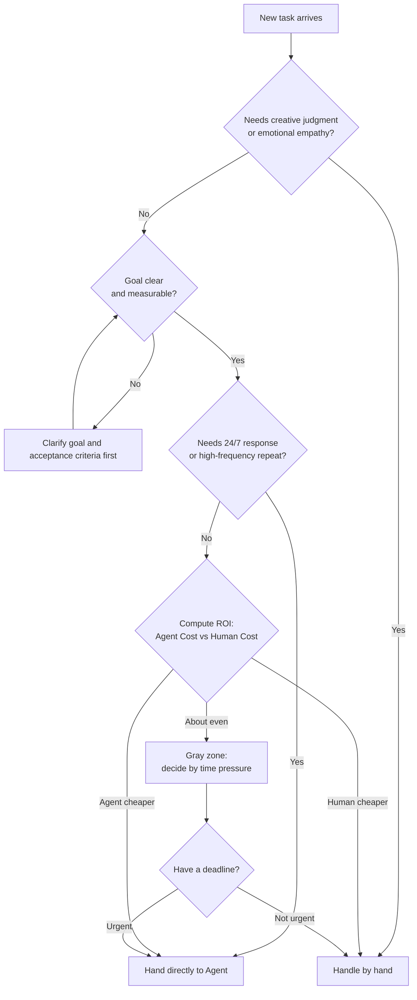

# Cost to Efficiency — Spend Money, Not Time

## The Bill That Made Yason Wince

The day last month's API bill came out, Yason stared at the number for five seconds.

$847.32.

In RMB, that's about ¥6,000.

"Six thousand bucks, just for some tokens?" Yason's first instinct was to optimize — cut models, lower frequency, run locally whatever you can instead of calling the API.

But he held back. He ran the numbers first.

Six thousand — if you converted it to labor cost? A junior engineer's monthly salary is ¥12k–¥15k; add social insurance and housing fund plus office overhead, and the real monthly spend is ¥18k–¥20k. And that's just "one person."

But ¥6,000 in API fees supports **three full-time Agents + five Sub-Agents** running day to day. They don't eat, sleep, or slack off, they're online 24 hours a day, and they handle 5–8 tasks in parallel.

> **Spend time or spend money? The real cost isn't the absolute number — it's the marginal cost per unit of output.**

## Token Cost vs Labor Cost

Yason drew his most-used comparison table:

| Dimension | Human team | Agent team |
|-|-|-|
| Monthly cost | ¥18k–¥20k/person | ¥2k–¥3k/person (API fees) |
| Working hours | 8h/day | 24h/day |
| Time off | All statutory holidays | Zero |
| Parallel capacity | 1–2 tasks | 5–8 tasks |
| Marginal cost | Linear growth | Near zero (within existing token capacity) |

But that's not the whole story. The Agent's real advantage isn't "cheap" — it's **efficiency conversion.**

Look at a real case. Yason had a task: do tech research for a new project, compare five message-queue options, and output a comparison report. If you handed this to a human — a week of research, two days to write the report, half a day for the presentation + discussion. Total time: about 40 hours.

Hand it to an Agent?

```
Yason → Kai: "Compare RabbitMQ, Kafka, Pulsar, NATS, Redis Streams
on these dimensions: throughput, latency, ops complexity, community activity.
Output a comparison table + a recommendation, with a demo code snippet for each option."
```

Kai spent 12 minutes reading the official docs of all 5 options, and 8 minutes generating the comparison table and demos. Total time: 20 minutes. API consumption: about $0.80.

40 hours vs 20 minutes, $1200 in salary vs $0.80 in tokens.

That's not "saving money" — that's a total mismatch of scale.

## When You Should "Waste" Tokens

With the data above, Yason developed a habit: **whenever spending money can save time, spend it.**

Take early-stage prompt debugging. Yason used to manually test every prompt after tweaking it, over and over. Later he just had the Agent iterate on its own — "write a prompt version, run it yourself and see the effect, analyze the gap, then write v2." One round might cost the Agent $0.50, but 10 rounds is only $5 — two orders of magnitude faster than manual tuning.

Yason calls this "productive waste" — tokens spent on exploration and iteration ultimately raise output quality, so total cost actually goes down.

But there's one kind of "waste" to watch out for.

```
# Bad example: the Agent grinds on one approach for an hour
Agent: "Let me try another way of writing it..."
Agent: "Still not working, try a different one..."
Agent: "Let me optimize it some more..."

# Good example: the Agent proactively reports after 3 failed attempts
Agent: "Tried 3 approaches (A took 2min, B took 3min, B2 variant took 5min),
all failed. Failure reason: missing X library permissions.
Suggested fix: Yason runs this command to grant permissions, then I'll continue."
```

> **Productive "waste" is exploration; unproductive "waste" is grinding. The difference is whether there's systematic trial-and-error, not random luck.**

The cost ceiling is here: once an Agent falls into "infinite-loop trial-and-error," token consumption grows exponentially. Yason's fix was a hard rule in every Agent's System Prompt:

```
## Cost control
- After 3 failed attempts on any task, auto-stop and output a failure report
- Before each API call, assess whether the call is truly needed (don't repeat calls you can cache)
- Execute complex tasks step by step; after each step, assess whether to continue
```

## A Real Story About the Cost Ceiling

For a while, Max (the ops Agent)'s API consumption suddenly spiked — from $5/day to $40/day.

Yason checked the logs and found the cause: Max was doing a competitor-research task, and the Agent called the heavy model for a summary on every single web page it viewed. 200 pages viewed, 200 calls. Most pages had only 3–5 lines of useful info.

Yason's fix: **layered processing.**

```
# Before optimization: call the heavy model for every page
for page in pages:
    summary = llm.summarize(page.content)  # 200 calls

# After optimization: filter with rules first, then call the heavy model
candidates = []
for page in pages:
    if page.has_keyword("pricing") or page.has_keyword("features"):
        candidates.append(page)

# Only call the heavy model on candidate pages
for page in candidates[:20]:
    summary = llm.summarize(page.content)  # at most 20 calls
```

This one simple filter layer dropped Max's daily API consumption from $40 back to $6, and the collected info was actually higher quality — because it filtered out 90% of the noise pages.

## The Four-Step Cost-Optimization Method

After months of hitting potholes, Yason distilled a four-step cost-optimization method:

1. **Build a baseline**: record each Agent's daily average token consumption, broken down by role. If you don't know where the money goes, you don't know where to save it.
2. **Price per task**: not every task needs the strongest model. DeepSeek V4 is enough for code review; architecture design is what needs an Opus-level model.

```
# Model routing config
tasks:
  code_review: deepseek-v4-flash    # cheap, good enough
  architecture: deepseek-v4-pro      # expensive, needs deep reasoning
  document: kimi                      # long context
  content: gpt-4o-mini               # balance cost and quality
```

3. **Cache repeated results**: the same prompt (e.g., "introduce this project") gets called repeatedly in different scenarios. Yason built a simple cache layer that returns cached results for repeated requests. This alone saved about 30% of token consumption.
4. **Set alert lines**: every Agent has a daily spend cap, with auto-alerts when exceeded. It's not about not letting it spend — it's about spending "with awareness."

```
# Cost alert config
alerts:
  kai:
    daily_limit: $15
    weekly_alert: $80
  max:
    daily_limit: $8
    weekly_alert: $50
  rex:
    daily_limit: $5
    weekly_alert: $30
```

## Yason's Underlying Logic

"Spend time, not money" sounds like a consumerist ad slogan. But in the Agent-team scenario, it's a validated efficiency formula.

In Yason's own words:

> **Human time is non-renewable. If you waste an hour today, you've lost that hour forever. Tokens are renewable — pay the API fee tomorrow and you have them again. Trading a renewable resource for a non-renewable one is always a good deal.**

The premise — you're spending tokens in the right direction. Spending tokens on exploration, iteration, and trial-and-error is investment. Spending tokens on infinite loops, redundant computation, and useless requests is waste.

## Efficiency Formula: Quantify Your Agent Team's Throughput

Yason later summarized a **team efficiency formula**:

```
Team effective output = Σ(each Agent's task value) - Σ(coordination overhead + token waste + error cost)

Each Agent's task value = task complexity × completion quality / time spent
Coordination overhead = shared-resource contention time + info-sync time
Token waste = retry consumption + useless calls + overlong context
Error cost = fix time × incident severity coefficient
```

Looking at token fees alone isn't enough — **an Agent that's cheap but constantly wrong is more expensive than one that's slightly pricier but gets it right the first time.**

Yason computed a "composite efficiency score" for each Agent:

```
Agent: Kai
  Avg task value: 8.5/10
  First-pass rate: 78%
  Avg fix time: 12 minutes
  Composite efficiency score: 7.2 (out of 10)

Agent: Rex
  Avg task value: 6.8/10
  First-pass rate: 92%
  Avg fix time: 3 minutes
  Composite efficiency score: 8.1 (out of 10)
```

Kai has high task value, but his first-pass rate and fix time drag him down. Rex's tasks are relatively simple, but he's stable. "The composite efficiency score helped Yason see clearly: **it's not the strongest Agent that's most valuable — it's the steadiest.**"

## Spend Money or Spend Time: An ROI Decision Formula

With the composite efficiency scores in hand, Yason still faced a real problem — every time a new task came in, was it worth using an Agent? He summarized an **ROI decision formula** and turned it into a runnable Python function:

```python
def should_use_agent(human_hours: float,
                     human_rate: float,
                     token_cost: float,
                     retry_factor: float = 1.2,
                     exchange_rate: float = 7.2
                     ) -> dict:
    """
    ROI decision: spend tokens or spend time?

    Formula:
      human_cost = human_hours * human_rate
      agent_cost = token_cost * exchange_rate * retry_factor
      roi = (human_cost - agent_cost) / human_cost * 100
      break_even = token_cost * exchange_rate / human_rate (hours)
    """
    human_cost = human_hours * human_rate
    agent_cost = token_cost * exchange_rate * retry_factor
    savings = human_cost - agent_cost
    roi = (savings / human_cost) * 100 if human_cost > 0 else 0
    break_even = (token_cost * exchange_rate) / human_rate if human_rate > 0 else 0

    if roi > 50:
        verdict = "Strongly recommend Agent — saves time and money"
    elif roi > 0:
        verdict = "Recommend Agent — slim margins but saves time"
    elif roi > -50:
        verdict = "Gray zone — recommend human unless special value"
    else:
        verdict = "Do it by hand — Agent isn't worth it"

    return {
        "verdict": verdict,
        "human_cost": round(human_cost, 2),
        "agent_cost": round(agent_cost, 2),
        "savings": round(savings, 2),
        "roi_percent": round(roi, 1),
        "break_even_hours": round(break_even, 2),
    }

hourly_rate = 80  # junior engineer hourly rate ~80

tasks = [
    ("5-option tech research", 40, 0.80),
    ("API integration doc", 8, 0.35),
    ("Code Review (medium PR)", 3, 0.60),
    ("DB migration script", 6, 1.20),
    ("Support email replies (200)", 8, 4.50),
]

for name, hours, cost in tasks:
    r = should_use_agent(hours, hourly_rate, cost)
    print(f"{name}: {r['verdict']} (ROI={r['roi_percent']}%)")
```

Output:

```
5-option tech research: Strongly recommend Agent — saves time and money (ROI=99.8%)
API integration doc: Strongly recommend Agent — saves time and money (ROI=99.6%)
Code Review (medium PR): Strongly recommend Agent — saves time and money (ROI=98.2%)
DB migration script: Strongly recommend Agent — saves time and money (ROI=98.2%)
Support email replies (200): Recommend Agent — slim margins but saves time (ROI=83.5%)
```

Note that "support email" has the lowest ROI — because its token consumption is large (200 emails means 200 API calls). But its **absolute savings are the highest. Yason's experience: ROI decides direction; absolute savings decide priority.**

## Task-Level Cost Comparison Table: Let the Real Numbers Speak

Most people's understanding of Agent cost stops at "saved a few bucks." Yason uses an actual operations-data table to make the point — and this table differs from the cost-control table in Ch13. Ch13 focuses on "how to spend less," while here the focus is **"is the time bought with that spend worth it"**:

| Task type | Human time | Human cost (¥) | Token consumption ($) | Agent cost (¥) | Savings (¥) | ROI |
|-|-|-|-|-|-|-|
| Tech research (5-option compare) | 40h | 3,200 | 0.80 | 6.9 | 3,193 | 99.8% |
| DB migration script | 6h | 480 | 1.20 | 10.4 | 470 | 98.2% |
| Code Review (medium PR) | 3h | 240 | 0.60 | 5.2 | 235 | 98.2% |
| API integration doc gen | 8h | 640 | 0.35 | 3.0 | 637 | 99.6% |
| Competitor launch monitoring (weekly) | 4h/week | 1,280/month | 2.10/week | 73/month | 1,207/month | 94.3% |
| Support email replies (200/day) | 8h/day | 6,400/month | 4.50/day | 1,166/month | 5,234/month | 81.8% |
| Page UI component dev (medium) | 6h | 480 | 1.80 | 15.6 | 464 | 96.8% |
| Production log anomaly analysis | 1h | 80 | 0.15 | 1.3 | 79 | 98.4% |

> Calculated at junior engineer hourly rate ¥80, $1 = ¥7.2, Agent retry factor 1.2. Note ROI is highest in high-frequency low-token scenarios (tech research) and lowest in low-unit-price high-token scenarios (support email).

## Agent vs Human Decision Flow

Yason turned this judgment process into a decision flowchart, running every new task through it:



The core idea of this flow: **first judge whether it can be done (goal and capability), then judge whether it's worth doing (cost and ROI).** The order can't be reversed — a task with sky-high ROI, if its goal is fuzzy, will only make the Agent produce garbage faster.

With this formula and decision flow, Yason no longer assigns tasks "by feel" — he **lets the data speak**:

> "Don't ask me if tokens are expensive. Ask me how many hours this task saved us."

## Real Case: From Cost Center to Profit Center

Yason found a real case worth sharing. A founder friend of his runs a cross-border standalone e-commerce site; the team is just two people, one on product development, one on operations. They used Agents to build a complete customer-support system:

- **Agent A**: auto-replies to emails, resolves common questions (template returns, logistics lookups)
- **Agent B**: monitors social-media comments, auto-replies to positive reviews, flags negative ones to Slack
- **Agent C**: analyzes support data, generates a "customer pain points report" every week

The three Agents cost $420/month. The results:

- Email reply time dropped from 24 hours to an average of 3 minutes
- Support headcount dropped from 2 full-time to 1 part-time reviewer
- Customer satisfaction rose from 82% to 91% (because replies got faster)
- The weekly "customer pain points report" helped the team spot 3 product-improvement opportunities, directly driving a 15% sales increase next quarter

"An Agent isn't your tool to 'save money' — it's your tool to 'amplify.'" said Yason's friend. **$420 in cost leveraged a 15% sales increase — however you run the numbers, that's a win.**

## Community Cost-to-Efficiency Tools

- **OpenRouter**: a unified LLM gateway that auto-routes to the most cost-effective provider. When DeepSeek raises prices, it auto-switches to a backup provider — no manual action from Yason.
- **LiteLLM**: an open-source multi-provider SDK supporting a unified interface across 100+ providers. Integrate once and switch between all models; cost optimization goes from "manually changing code" to "changing one config line."
- **Portkey**: an AI gateway with built-in caching, fallback, and retry strategies. All those token-optimization tricks Yason wrote himself (caching, retry limits, etc.)? Portkey ships them out of the box, with a slick dashboard to boot.
- **Helicone**: open-source LLM cost tracking, supports splitting cost by Agent, by task, by model. Yason's "auto-summarize cost in weekly report" feature? Helicone has it out of the box.

"Tools can save you 30% of your cost. But the remaining 70% comes from understanding the business — knowing when to use the expensive model and when the cheap one is good enough." said Yason.

Next chapter we'll talk about the exact opposite topic — when your Agent messes up, what do you do? It's not a question of "will it crash" but "how do you recover after it crashes."

## Chapter Summary

- Spend time, not money: replace low-value time with Agents, focus on high-value decisions
- ROI formula: Agent cost ÷ (time saved × output-quality gain) is the real ROI
- The open-source ecosystem offers OpenRouter, LiteLLM, and more — no need to reinvent the wheel
- An Agent isn't a money-saving tool, it's an amplifier — $420 in cost leveraged a 15% sales increase

*This article is from the column 'Being the Boss of AI', with the full series continuously updating:* [*GitHub - VokoForge/ai-prism*](https://github.com/VokoForge/ai-prism)

