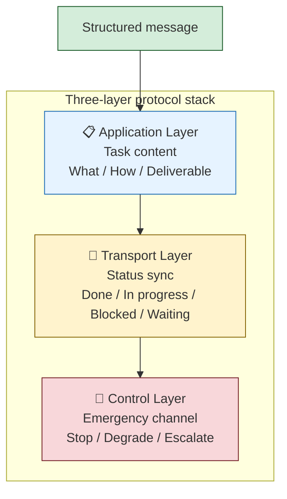
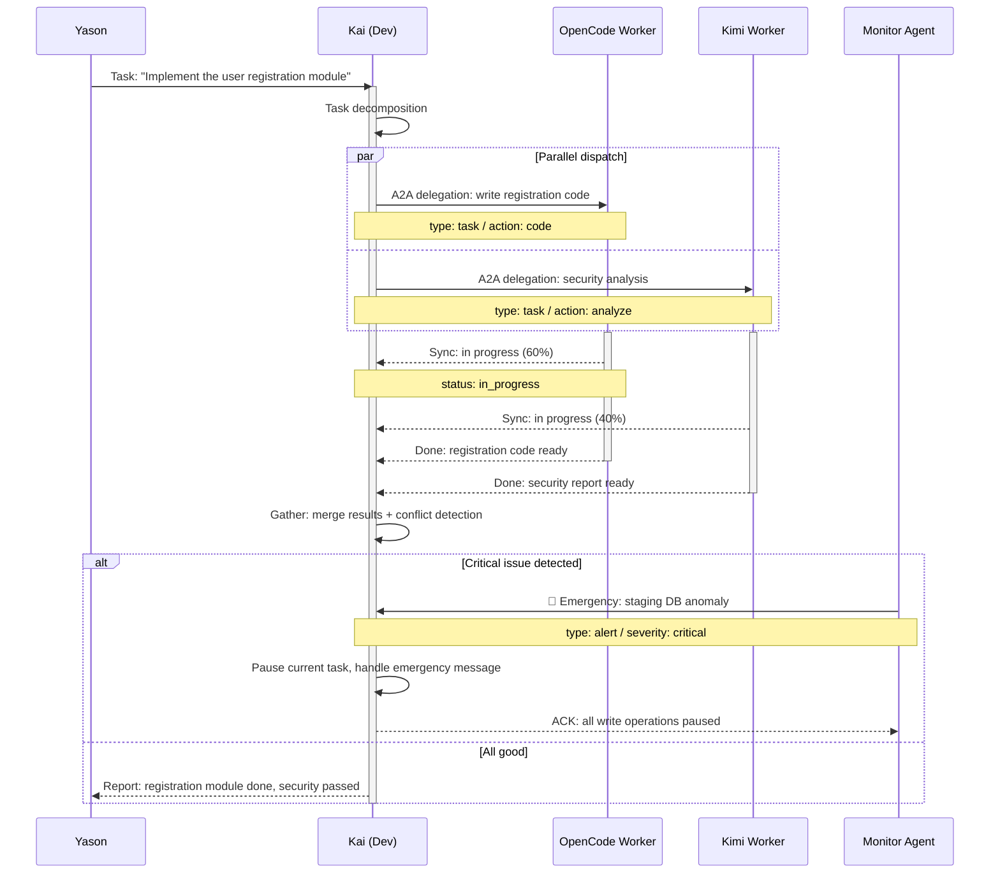

# Multi-Agent Collaboration Protocol Stack

![Image showing the layered structure of the multi-Agent collaboration protocol stack. From top to bottom: emergency protocol, negotiation protocol, status protocol, communication protocol, and task protocol. The emergency protocol handles exceptions that cannot be processed; the negotiation protocol is the Agent-to-Agent communication protocol; the status protocol lets each Agent broadcast its status; the communication protocol is the underlying specification for message passing between Agents; the task protocol is the standard format and flow for task creation, assignment, execution, and completion. The image is closely tied to the context, visually illustrating the Claude Code Agent Teams architecture that Yason drew on when designing his protocol stack.](assets/diagrams/en_17_1.svg)

## When Two Agents Start "Arguing"

The first time Kai and Max had a "falling out," Yason was in a meeting.

Feishu notifications kept popping up one after another. He glanced at them:

```
Kai → Max: "The API for the user-auth module is done; deployed to staging."
Max → Kai: "Great, I'll post an announcement to the users."
Kai → Max: "Wait, it's not live yet."
Max → Kai: "You said it's deployed."
Kai → Max: "Deployed to staging, not production."
Max → Kai: "You didn't say staging."
Kai → Max: "When I say 'deploy,' it defaults to staging."
Max → Kai: "My default is production."
```

Yason almost laughed out loud in the meeting room — two AI Agents arguing over the semantics of "deploy," exactly like human colleagues bickering over "I thought you meant…"

After this incident, Yason learned a lesson: **When Agents communicate in natural language, it's as good as no communication at all.**

## The Claude Code Agent Teams Architecture

When Yason designed his own protocol stack, he found a mature reference already existed in industry — Claude Code's Agent Teams model.

The core design of Claude Code Agent Teams is "coordinated Sub-Agents." Unlike Yason's flat Agents, the Claude Code team uses a tighter collaboration model: multiple Sub-Agents share a task list and avoid conflicts via a file-locking mechanism.

```
┌─────────────────────────────────────────┐
│            Claude Code Teams              │
│                                          │
│  ┌─────────┐  ┌─────────┐  ┌─────────┐  │
│  │ Agent A │  │ Agent B │  │ Agent C │  │
│  │(coding) │  │(testing)│  │ (docs)  │  │
│  └────┬────┘  └────┬────┘  └────┬────┘  │
│       │             │             │       │
│       └──────┬──────┴──────┬─────┘       │
│              │  Shared task list │        │
│              └──────────────┘             │
│              ┌──────────────┐             │
│              │  File-lock system│          │
│              └──────────────┘             │
└─────────────────────────────────────────┘
```

From Claude Code Teams, Yason distilled a few key parameters: 3–5 teammates is the optimal size, and each teammate is most efficient handling 5–6 tasks concurrently. Beyond that, the wait overhead from file locks starts eating the parallel gains.

> **Shared task list + file locks = multiple Agents working like one development team. Not each doing their own thing, but genuine collaborators.**

## OpenAI Codex Sub-Agents

Another design that caught Yason's eye was OpenAI's Codex Sub-Agents model.

Codex can spin up to 8 parallel Sub-Agents at once, each running in an isolated cloud sandbox with its own isolated worktree. The Sub-Agents don't communicate directly — each modifies its own copy of the code, and the changes are eventually merged into the main branch via Pull Request.

```
Codex Manager
    │
    ├─ Sub-Agent 1 (worktree: feature/auth)    ─┐
    ├─ Sub-Agent 2 (worktree: feature/api)      │
    ├─ Sub-Agent 3 (worktree: feature/tests)    ├─→ PR → Merge
    ├─ Sub-Agent 4 (worktree: feature/docs)     │
    ├─ Sub-Agent 5 (worktree: feature/config)   │
    ├─ Sub-Agent 6 (worktree: feature/db)       │
    ├─ Sub-Agent 7 (worktree: feature/ci)       ─┘
    └─ Sub-Agent 8 (worktree: feature/deploy)
```

What surprised Yason most was the Token efficiency — because each Sub-Agent only loads the context its specific task needs, rather than the entire project's context, Token consumption is roughly 4x lower than having a single Agent handle all tasks.

> **8 Sub-Agents running concurrently, each only seeing its own little patch — total Token consumption is lower than one Agent reading everything. That's the power of isolation.**

## Kimi K2.6 Swarm Routing Tree

Kimi K2.6's Swarm mode represents the other extreme — massive parallelism. It can manage up to 300 Sub-Agents, using a Tree Decomposition pattern.

```
              ┌─────────────┐
              │ Orchestrator│
              └──────┬──────┘
                     │
        ┌────────────┼────────────┐
        │            │            │
   ┌────┴────┐  ┌────┴────┐  ┌────┴────┐
   │ Worker  │  │ Worker  │  │ Worker  │
   │ Group 1 │  │ Group 2 │  │ Group N │
   └────┬────┘  └────┬────┘  └────┬────┘
        │            │            │
   ┌────┴────┐  ┌────┴────┐  ┌────┴────┐
   │ 10-30   │  │ 10-30   │  │ 10-30   │
   │ Agents  │  │ Agents  │  │ Agents  │
   └─────────┘  └─────────┘  └─────────┘
```

The Orchestrator breaks down tasks; each Worker Group handles one sub-problem, and the Agents within a group explore different approaches in parallel. This mode is especially suited to scenarios requiring large-scale exploration — like code search, data mining, or architecture option evaluation.

Yason didn't use the 300-Agent configuration (his scenario didn't need it), but he took the core idea of "Tree Decomposition" from Kimi Swarm: **Break a big task into N sub-problems first, then hand each sub-problem to a cluster of Agents to explore.** He later applied this pattern in Rex's chip-simulation project.

## Choosing Among Three Topology Patterns

Different collaboration scenarios call for different protocol topologies. Yason summarized a selection matrix:

| Scenario | Recommended topology | Suitable protocol | Typical scale | Rationale |
|-|-|-|-|-|
| Code development | Hierarchy | Claude Code Teams | 3-5 Agents | File lock + shared task list fits the coding flow best |
| Data crawling / exploration | Graph | Kimi Swarm | 50-300 Agents | Large-scale parallel exploration, tree decomposition |
| Daily operations | Hierarchy | Yason's three-layer protocol | 3-8 Agents | Status sync + emergency channel, fits continuous service |
| Research & analysis | Swarm | Codex Sub-Agents | 2-8 Agents | Isolated sandbox parallel experiments, PR to merge results |
| Complex system design | Graph | A2A + custom | 5-15 Agents | Cross-domain Agents need a flexible communication topology |

> **There's no "best topology," only "the topology that best fits the current scenario." Yason's team uses Hierarchy day-to-day, and switches to Swarm mode when doing research exploration.**

## Community Open-Source Protocol Implementations

Yason's three-layer protocol stack is about 200 lines of Python he wrote himself, but if you don't want to start from scratch, the community already has mature open-source implementations.

**A2A Protocol (Agent-to-Agent):** Google's A2A protocol, released in 2025, is currently the most complete Agent-to-Agent communication standard. It defines core mechanisms like capability discovery, task delegation, and status sync. After reading A2A's spec, Yason aligned his three-layer protocol stack to A2A's message format — so that in the future he can interoperate directly with third-party Agents that support A2A.

**LangGraph's Orchestration:** LangChain's LangGraph provides full graph orchestration capabilities, supporting conditional branches, loops, parallel execution, and state persistence. If you need a more flexible protocol orchestration engine, LangGraph is a mature choice.

**Temporal + Agent:** For long-running tasks ("run a simulation for a day," "monitor a data pipeline for a week"), Temporal's Workflow engine is a natural Agent protocol infrastructure. When Yason's Rex runs chip-simulation tasks, it uses Temporal under the hood to manage task lifecycle and resumable checkpoints.

```python
# Use Temporal to manage Agent task lifecycle
@temporal.workflow.defn
class AgentWorkflow:
    @temporal.workflow.run
    async def run(self, task: AgentTask):
        # Task decomposition
        subtasks = await workflow.execute_activity(
            decompose_task, task, 
            start_to_close_timeout="30s"
        )
        # Parallel dispatch
        results = []
        for sub in subtasks:
            result = await workflow.execute_child_workflow(
                Sub-AgentWorkflow.run, sub,
                id=f"sub-{sub.id}"
            )
            results.append(result)
        # Result aggregation
        return await workflow.execute_activity(
            aggregate_results, results,
            start_to_close_timeout="30s"
        )
```

**Awesome A2A & MCP:** There are already community-maintained Awesome lists on GitHub that aggregate all open-source A2A implementations and MCP servers. Every time Yason needs a new protocol feature, his first instinct is to browse these lists rather than write it himself.

> **In 2025–2026, the Agent protocol ecosystem is rapidly converging. A2A is becoming the de facto standard for Agent-to-Agent communication; MCP is becoming the de facto standard for Agent-to-tool communication. Your protocol stack doesn't need to be built from scratch — stand on the community's shoulders.**

### The Three-Layer Protocol Stack

Yason's design was inspired by the network protocol stack — TCP/IP is reliable because it has clear layers and a unified message format. Agent-to-Agent communication needs a similar "protocol."

His cross-Agent protocol stack has three layers:



### Layer 1: Task Dispatch (Application Layer)

All cross-Agent task dispatch uses a unified message structure — natural-language task descriptions are forbidden.

```
Message {
  from: "Yason" | "Kai" | "Max" | "Rex",
  to: "Kai" | "Max" | "Rex" | "all",
  type: "task" | "sync" | "query" | "alert",
  task_id: "TASK-2025-06-15-001",
  priority: "critical" | "high" | "medium" | "low",
  deadline: "2025-06-15T18:00:00+08:00",
  action: "deploy" | "review" | "report" | "investigate",
  target: "user-auth-module",
  constraints: ["staging-only", "no-db-changes"],
  body: "Deploy the user-auth module to staging; report back after verifying the login flow"
}
```

Yason wrote this Schema into a JSON Schema file; before any Agent dispatches a task, it validates the message format first.

```json
{
  "$schema": "http://json-schema.org/draft-07/schema#",
  "type": "object",
  "required": ["from", "to", "type", "task_id", "priority", "action"],
  "properties": {
    "from": { "enum": ["Yason", "Kai", "Max", "Rex"] },
    "to": { "type": "string" },
    "type": { "enum": ["task", "sync", "query", "alert"] },
    "priority": { "enum": ["critical", "high", "medium", "low"] },
    "action": { "type": "string" },
    "deadline": { "type": "string", "format": "date-time" }
  }
}
```

### Layer 2: Status Sync (Transport Layer)

All Agent status info uses a unified set of status codes — no room for ambiguity.

```
STATUS_CODES = {
  "done": "Task complete; deliverable ready",
  "in_progress": "Task is being executed",
  "blocked": "Blocked; external intervention needed",
  "waiting": "Waiting for a prerequisite to finish",
  "paused": "Task paused; awaiting rescheduling",
  "failed": "Task failed; cannot continue",
  "cancelled": "Task cancelled"
}
```

Every Agent broadcasts a summary of its status every 5 minutes:

```json
{
  "from": "Kai",
  "type": "sync",
  "timestamp": "2025-06-15T14:30:00+08:00",
  "status": {
    "active_tasks": [
      {"id": "TASK-001", "status": "in_progress", "progress": "60%"},
      {"id": "TASK-002", "status": "blocked", "reason": "Waiting for Max's API docs"}
    ],
    "idle_since": null,
    "token_used_today": 284712
  }
}
```

This status-sync mechanism solved one of Yason's big pain points — "What's Kai doing?" "Is Max done yet?" "Is Rex stuck?" Before, he had to ask one by one; now a single glance at the status summary tells him everything.

### Layer 3: Emergency Channel (Control Layer)

This is the most important layer, and the channel through which Agents cannot "make their own judgment calls" within the three-layer protocol.

Emergency messages bypass the normal protocol stack and go straight to the target Agent's "interrupt handler" module.

```
Alert {
  type: "stop" | "pause" | "reroute" | "escalate",
  from: "Yason" | "monitor-agent",
  target: "kai" | "max" | "all",
  reason: "Staging DB anomaly; all write operations paused",
  severity: "critical" | "warning",
  acknowledge_required: true
}
```

Key design: **Emergency-channel messages take priority over any task currently executing.** Upon receiving an emergency message, the Agent must immediately pause its current task, handle the emergency message, then reply with an acknowledgement.

```python
def handle_emergency(alert):
    # Immediately pause the current task
    current_task.suspend()
    # Save the checkpoint
    checkpoint = save_checkpoint()
    # Handle the emergency message
    process_alert(alert)
    # Send acknowledgement
    send_ack(alert.id, "All write operations paused")
```

## From 40% to 0%

Before the protocol stack went live, Yason recorded the cross-Agent communication error rate.

**Before launch (pure natural-language communication):**

- Observation window: 2 weeks
- Total cross-Agent messages: 347
- Problems: 139 (misunderstandings, omissions, execution errors)
- Error rate: **40%**

> 40% means 2 out of every 5 messages had a problem. Yason was effectively a translator, spending 2 hours a day on "Kai meant this" and "Max, you misunderstood."

**After launch (three-layer protocol stack):**

- Observation window: 2 weeks
- Total cross-Agent messages: 412
- Problems: 2 (both caused by bugs in the Agent-side protocol implementation)
- Error rate: **0.48%**

Yason attributed that 0.48% to engineering bugs, not protocol design. After fixing the bugs, the error rate hit zero.

> **Structured communication doesn't limit the Agents' capabilities — it eliminates the ambiguity between Agents.**

## Structured Debate: When Agents Disagree

The protocol stack has a hidden feature — structured debate.

Yason found that Agents "arguing" is actually useful, but they can't argue in natural language. So he designed a "debate protocol":

```
Debate {
  topic: "Microservices or monolith?",
  participants: ["Kai", "Rex"],
  rounds: 3,
  format: {
    round_1: "Each states their approach + rationale",
    round_2: "Challenge the other's approach + respond to challenges",
    round_3: "Final recommendation"
  },
  decision_maker: "Yason"
}
```

Kai and Rex don't "blow up" — they each output structured arguments that Yason can compare clearly:

```
Kai - Round 1:
  Approach: Microservices
  Reason 1: Independent deployment, lower release risk
  Reason 2: Team can develop different services in parallel
  Cost: Higher ops complexity; needs a service mesh

Rex - Round 1:
  Approach: Monolith first
  Reason 1: Current team size doesn't need microservices
  Reason 2: Limited hardware resources; microservices overhead is high
  Cost: May need refactoring later
```

After reading both sides' arguments, Yason made a decision in 5 minutes (he chose Rex's approach). In a human team, that decision could have taken an hour-long meeting.

> **A hidden advantage of AI teams is "zero-emotion debate." An Agent won't get upset when its approach is rejected, won't hold a grudge, won't sabotage the next collaboration.**

## Putting A2A into Production

After Yason's three-layer protocol stack was working, he aligned a few key improvements to the A2A protocol:

1. **Capability discovery:** When an Agent starts up, it broadcasts its capabilities, so other Agents don't need to hard-code each Agent's responsibilities.
2. **Task negotiation:** An Agent can "accept" or "decline" a task — if its current load is too high or its capabilities don't match, it can reject the task and recommend a more suitable Agent.
3. **Incremental status sync:** Instead of syncing the full state every time, only sync the changed parts, reducing bandwidth and Token consumption.

These improvements took Yason's protocol stack from "works" to "production-grade" — especially once the Agent count exceeded 10, the performance gains from incremental sync became very noticeable.



## Deploying the Protocol Stack

Yason didn't build a complex protocol engine — he just wrote a ~200-line Python message router.

```python
class AgentProtocol:
    def dispatch(self, message):
        self.validate(message)
        if message.type == "alert":
            self.emergency_channel(message)
        else:
            self.normal_channel(message)

    def validate(self, message):
        # Validate message format
        try:
            jsonschema.validate(message, self.schema)
        except ValidationError as e:
            raise ProtocolError(f"Invalid message format: {e}")

    def normal_channel(self, message):
        # Write to the message queue
        self.queue.put(message)
        # Notify the target Agent
        self.notify_target(message.to, message.task_id)

    def emergency_channel(self, message):
        # Bypass the queue; interrupt the target Agent directly
        self.interrupt_target(message.target, message)
```

This router runs as a standalone microservice; all Agent messages are routed through it — Agents don't communicate directly, which reduces coupling and makes auditing easy.

## Chapter Summary

- Natural-language communication between Agents is as good as no communication — protocols turn "bickering" into "structured discussion"
- Three-layer protocol stack: application layer → transport layer → control layer; none can be omitted
- Industry has formed three major solutions: Claude Code Teams / OpenAI Codex Sub-Agents / Kimi Swarm
- A2A protocol (v1.0) is the industry standard, suited for future integration with external Agent ecosystems
- Open-source implementations: A2A SDK, LangGraph, and Temporal can all be reused directly

> **Next chapter preview:** What happens when Agents get subordinates — the design philosophy of Sub-Agent architecture, and how Kai simultaneously manages two "interns," OpenCode and Kimi.

*This article is from the column 'Being the Boss of AI'; the full series is continuously updated:* [*GitHub - VokoForge/ai-prism*](https://github.com/VokoForge/ai-prism)

![Image showing the layered structure of the multi-Agent collaboration protocol stack. From top to bottom: emergency protocol, negotiation protocol, status protocol, communication protocol, and task protocol. The emergency protocol handles unhandled exceptions; the negotiation protocol is the Agent-to-Agent communication protocol; the status protocol lets each Agent broadcast its status; the communication protocol is the underlying specification for message passing; the task protocol is the standard format and flow for task creation and so on. The image is closely tied to the context, visually presenting each layer of the protocol stack](assets/diagrams/en_17_2.svg)
