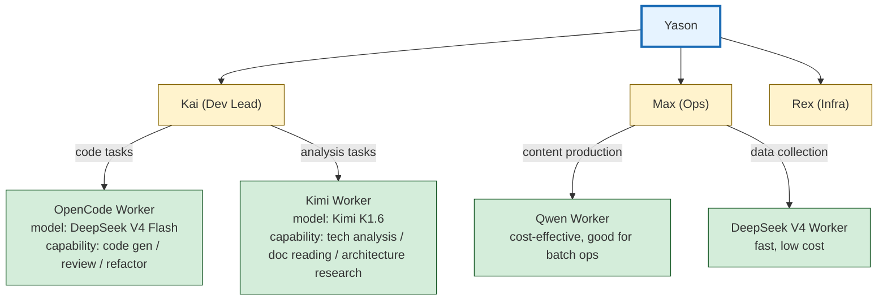

# Sub-Agent Architecture — Give Your Agents Subordinates

![Image showing the Sub-Agent architecture, with "Supervisor Agent" at the core, surrounded by multiple Sub-Agents such as Review Agent and Testing Agent, each Sub-Agent labeled with a count below it — Supervisor: 1, Main Agent: 4, total Sub-Agents: 11. Text below the image explains the power of the Sub-Agent architecture lies in "divide and conquer" — each Sub-Agent focuses on one domain, and combined they form a full-coverage team. The image is closely tied to the context, visually presenting the Sub-Agent architecture mentioned in the doc, and helping understand Kai's problem of getting stuck due to an insufficient context window.](https://internal-api-drive-stream.feishu.cn/space/api/box/stream/download/authcode/?code=ZGQyMjYxNDNlMmIxNzljNTQzMGU1YjFhZTFiYTUxZDZfNzczMGFmZTZiZjZlNGRmNjA1MmIyZGZlZjY2ZmUyNWNfSUQ6NzY1MTgwMDE2MjQxOTM0NjQwM18xNzgzODcwNTIyOjE3ODM4NzQxMjJfVjM)

## Kai, the One Person Who Couldn't Keep Up

Kai's efficiency problem surfaced in the third month.

Yason gave Kai a mid-sized task: refactor the user-notification module, write the API docs, and review another Agent's PR — all three in parallel.

Kai reacted exactly like a human colleague — "Okay, I'll get started."

Then Kai got stuck.

It wasn't a capability problem; it was **an insufficient context window**. Information from three tasks was crammed into one context, and Kai started mixing things up: "Is this API doc for the new module or the old one?" "Does the PR I'm reviewing conflict with the refactor task?"

Yason didn't realize the problem at the time, assuming Kai just needed more time. Until he looked at Kai's execution log:

```
09:00 - Start refactoring the notification module
09:15 - Switch to the API docs task (Yason said "ASAP")
09:20 - Switch to the PR review (new task takes priority)
09:45 - Back to the refactor, forgot the approach, re-read the code
10:00 - Switch to the API docs again
```

In one morning, Kai switched tasks 7 times, and every switch carried the cost of "reloading context."

> **Human multitasking has a "switching cost" — going from writing code to a meeting takes the brain ~15 minutes to get back into a flow state. Agents are the same — every time a task switches, the context must reload, and the Token cost doubles.**

## Industry Sub-Agent Practices

Before designing the Sub-Agent architecture, Yason studied patterns that industry had already proven out.

**OpenAI Codex's Manager-Worker model** was the most direct reference. Codex can create one Manager Agent and up to 8 Worker Agents, each Worker running in an isolated cloud sandbox with its own isolated worktree. The Manager handles task decomposition and assignment; the Worker only handles execution.

The key design is the **isolated worktree** — each Worker can only see its own copy of the code, with no interference. When all Workers finish, the Manager merges all changes via Pull Request.

```
Codex Manager (task decomposition + quality review)
  │
  ├─ Worker 1: implement login module (isolated worktree)
  ├─ Worker 2: implement registration module (isolated worktree)
  ├─ Worker 3: implement password reset (isolated worktree)
  ├─ Worker 4: write unit tests (isolated worktree)
  ├─ Worker 5: write API docs (isolated worktree)
  │
  └─ All changes → PR → human confirmation → merge
```

**Claude Code Agent Teams** offers another pattern — Sub-Agents **share** a workspace, avoiding conflicts via file locking. When one Agent edits a file, it locks it; other Agents can read but not write. This pattern fits tightly-coupled collaboration scenarios (e.g., multiple Agents refactoring one module together), but the Agent count shouldn't exceed 5.

From these two, Yason learned where each fits: **The Codex pattern fits "splitting up to execute independent tasks"; the Claude Code Teams pattern fits "collaboratively processing the same codebase."**

## The Birth of the Sub-Agent

Yason's solution: **One Agent is spread too thin — give it subordinates.**

The architecture went from flat to tree-shaped:



Kai is no longer just an executor. He became a "junior manager" — he owns the architecture decisions and task decomposition, and assigns the actual coding work to OpenCode and Kimi to execute.

**Why OpenCode and Kimi?**

This wasn't random. Yason found different models have their own talents on different tasks:

| Task type | Primary model | Sub-Agent | Rationale |
|-|-|-|-|
| Code generation | Kai | OpenCode | Strong code understanding, large context window |
| Technical reasoning | Kai | Kimi | Strong long-text reasoning, good for analysis |
| Ops content | Max | Qwen | Cost-effective, good for batch |
| Data collection | Max | DeepSeek V4 | Fast, low cost |

Each Parent Agent has multiple Child Agents. Sub-Agents have no decision-making power — they only execute specific tasks, and hand their output to the parent Agent for quality check and integration.

## Context Isolation for Each Sub-Agent

The most easily overlooked design in Sub-Agent architecture is **context isolation**.

Yason found many people make the same mistake when building Sub-Agents: the parent Agent passes the entire conversation history to the Sub-Agent. The result is the Sub-Agent's context gets polluted by irrelevant info, cost doubles, and quality doesn't improve.

The right approach: **Every time you create a Sub-Agent, give it a clean new context. The parent Agent only stores the Sub-Agent's "task intent" and "result summary" — not the Sub-Agent's full conversation history.**

```
# ❌ Wrong: pass everything
parent_context = {
    "full_history": [...],  # includes all of the parent's prior conversations
    "task": "write the user registration module",
    "child_context": full_history + task  # Sub-Agent gets polluted
}

# ✅ Right: context isolation
parent_context = {
    "active_tasks": {
        "child_1": {
            "task": "write the user registration module",  # only store intent
            "summary": "completed login, registration, password-reset functions",  # only store summary
            "token_cost": 4520
        },
        "child_2": {
            "task": "write unit tests",
            "summary": "92% coverage; 3 edge cases pending confirmation",
            "token_cost": 3810
        }
    }
}

# The Sub-Agent's own context is clean
child_context = {
    "task": "write the user registration module, requirements: ...",
    "conversation_history": []  # starts from scratch
}
```

This design is the key reason Yason's Agent team could scale from 3 Agents to 10. If the parent stored every Sub-Agent's full history, the context window would balloon at O(n) — every added Sub-Agent doubles the parent's Token consumption. With context isolation, the parent's Token consumption is O(1) — no matter how many Sub-Agents, the parent only stores intent and summary.

> **Context isolation is the cornerstone of Sub-Agent architecture. Without it, every Sub-Agent you add is one more "memory burden" on the parent. With it, the parent is like a project manager — it knows what everyone is doing and how well, but doesn't need to remember every word each person said.**

## Real Config: Kai + OpenCode + Kimi

Here's the Sub-Agent section of Yason's Kai config file:

```yaml
# /opt/agents/kai/config.yaml
agent:
  name: Kai
  role: dev-lead

  # Sub-Agent config
  children:
    - name: opencode-worker
      engine: opencode
      model: deepseek-v4-flash
      capabilities:
        - code_generation
        - code_review
        - refactoring
      max_retries: 3
      timeout: 300

    - name: kimi-worker
      engine: kimi
      model: kimi-k1.6
      capabilities:
        - technical_analysis
        - document_reading
        - architecture_research
      max_retries: 2
      timeout: 600

  # Task assignment rules
  routing:
    - match: type == "code" || type == "review"
      assign_to: opencode-worker
    - match: type == "research" || type == "analyze"
      assign_to: kimi-worker
    - match: type == "architecture" || type == "design"
      assign_to: self  # Kai does it himself
```

This config tells Kai: code tasks go to OpenCode, research/analysis goes to Kimi, architecture design he does himself.

## Parent Agent vs Sub-Agent: The Power Boundary

The most critical design in Sub-Agent architecture isn't "how to assign tasks" — it's **the power boundary between parent and Sub-Agent**.

Yason set a few clear rules:

**Parent Agent responsibilities:**

- Decompose tasks and assign them to the right Sub-Agents
- Check the quality of Sub-Agent output
- Integrate results from multiple Sub-Agents
- Handle Sub-Agent exceptions and failures
- Report the final result to Yason

**Sub-Agent responsibilities:**

- Receive tasks assigned by the parent Agent
- Execute specific operations (write code, analyze docs)
- Report results to the parent Agent
- Escalate errors it can't handle (don't try to power through alone)

---

One rule Yason keeps emphasizing: **Sub-Agents don't communicate directly with each other.**

```
# ❌ Not allowed: direct talk between Sub-Agents
OpenCode → Kimi: "Help me look at this API doc"
Kimi → OpenCode: "Sure, here's the doc content"

# ✅ Right: route through the parent Agent
OpenCode → Kai: "Need API doc support"
Kai → Kimi: "Provide this API doc to OpenCode"
Kimi → Kai: "Doc content below"
Kai → OpenCode: "Here's the doc, keep coding"
```

> **Peer-to-peer Sub-Agent communication → uncontrollable info flow → Agent misunderstandings rebound. Parent-Agent routing → traceable info flow → you know who to blame when something breaks.**

## Assignment Strategy: Not Just "Spread Evenly"

Assigning tasks to Sub-Agents isn't simply "throw it to whoever's idle." Yason uses a cost-aware dispatch logic:

```
def assign_task(task, children):
    # 1. Capability match (the Sub-Agent must be able to handle this task)
    candidates = [c for c in children if task.type in c.capabilities]

    # 2. Current load (no overloading)
    candidates = [c for c in candidates if c.current_load < c.max_load]

    # 3. Cost-optimal (if both can do it, pick the cheaper one)
    candidates.sort(key=lambda c: c.cost_per_task)

    # 4. Historical success rate (same model, pick the higher success rate)
    candidates.sort(key=lambda c: c.success_rate, reverse=True)

    # 5. Assign
    return candidates[0] if candidates else self.handle_self(task)
```

The beauty of this logic: it's not rigid round-robin. If DeepSeek V4's API is especially stable today, it gets more tasks; if some model starts erroring frequently, it's auto-downweighted.

## Fan-Out/Gather: The Sub-Agent Collaboration Pattern

Once Sub-Agent count exceeds 2, Yason found he needed a standard collaboration pattern to manage "one-to-many" task dispatch. He uses the Fan-Out/Gather pattern.

```mermaid
flowchart TD
    subgraph "Fan-Out phase"
        direction LR
        PA[Parent Agent<br>(task decomposition)] --> CA[Sub-Agent A<br>Module A impl]
        PA --> CB[Sub-Agent B<br>Module B impl]
        PA --> CC[Sub-Agent C<br>Module C impl]
    end

    subgraph "Gather phase"
        direction LR
        CA -->|Result A| PAG[Parent Agent<br>(result integration)]
        CB -->|Result B| PAG
        CC -->|Result C| PAG
    end

    PAG --> CHECK{Conflict detection}
    CHECK -->|Conflict| RESOLVE[Conflict resolution]
    CHECK -->|No conflict| MERGE[Result merge]
    RESOLVE --> MERGE
    MERGE --> FINAL[✅ Final deliverable]

    style PA fill:#cce5ff,stroke:#004085
    style PAG fill:#cce5ff,stroke:#004085
    style CA fill:#d4edda,stroke:#155724
    style CB fill:#d4edda,stroke:#155724
    style CC fill:#d4edda,stroke:#155724
    style CHECK fill:#fff3cd,stroke:#856404
    style RESOLVE fill:#f8d7da,stroke:#721c24
    style MERGE fill:#d1e7dd,stroke:#0f5132
    style FINAL fill:#d1e7dd,stroke:#0f5132,stroke-width:3px
```

Fan-Out phase: the parent Agent decomposes one big task into N independent subtasks and dispatches them to N Sub-Agents simultaneously.

Gather phase: once all Sub-Agents finish, the parent Agent collects results and does conflict detection and integration.

Yason's implementation:

```python
async def fan_out_gather(task, children):
    # Fan-Out: decompose the task
    subtasks = decompose_task(task, len(children))

    # Dispatch in parallel
    futures = []
    for i, child in enumerate(children):
        futures.append(execute_subtask(child, subtasks[i]))

    # Gather: wait for all Sub-Agents to finish
    results = await asyncio.gather(*futures, return_exceptions=True)

    # Check for conflicts
    conflicts = detect_conflicts(results)
    if conflicts:
        resolve_conflicts(conflicts, results)

    # Integrate results
    return integrate_results(results)
```

The key to this pattern is **independence** between subtasks — if subtasks depend on each other, Fan-Out/Gather doesn't apply (you'd switch to a Pipeline pattern). Yason's rule of thumb: **80% of coding tasks can be decomposed into independent subtasks, fitting Fan-Out/Gather. The remaining 20% need chained processing.**

## The Recursion Trap: When a Sub-Agent Gets Its Own Sub-Agent

The first anti-pattern Yason hit was the "recursion trap."

Someone asked Yason: "Since Kai can have his own Sub-Agents, can Kai's Sub-Agent have its own Sub-Agent?"

Yason tried it.

The result was a disaster.

```
Kai → OpenCode Worker → Sub-Worker-1 → Sub-Worker-2 → ...
```

A simple "generate the user registration page" task, after four levels of recursive dispatch, produced 42 intermediate messages, 17 temp files, and 2 conflict merges — and the final code quality was worse than if Kai had just written it directly.

> **Each level deeper a Sub-Agent goes, communication loss and decision latency grow exponentially. Yason's rule of thumb: at most one level of Sub-Agents, don't recurse further.**

## Community Sub-Agent Implementations

If you don't want to build Sub-Agent architecture from scratch, the community has several mature open-source options:

**Claude Code /agent:** The simplest Sub-Agent option. In Claude Code, typing `/agent "do X task"` creates a Sub-Agent to execute the specified task. The Sub-Agent has its own context window, and results return to the main session automatically when done. Yason often uses this for quick prototyping.

**LangGraph Sub-Graphs:** LangGraph supports nesting sub-graphs within one graph orchestration. Each sub-graph is an independent Agent with its own state management and node logic. Yason uses LangGraph's sub-graph feature in scenarios needing complex orchestration (e.g., multi-step data processing pipelines).

```python
from langgraph.graph import StateGraph, SubGraph

# Define a sub-graph Agent
sub_agent = StateGraph(AgentState)
sub_agent.add_node("analyze", analyze_node)
sub_agent.add_node("generate", generate_node)
sub_agent.add_edge("analyze", "generate")

# Embed the sub-graph in the main graph
main_graph = StateGraph(MainState)
main_graph.add_node("code_agent", SubGraph(sub_agent))
main_graph.add_node("test_agent", SubGraph(test_sub_agent))
```

**AutoGen's Sub-Agents:** Microsoft AutoGen supports nested Agent teams (Team-in-Team), where a Team can contain other Teams as child nodes. Fits scenarios needing multiple layers of abstraction.

Yason's advice: **Start simple. Try Claude Code /agent first to feel how Sub-Agents work, then migrate to a more complex framework as needed.**

## The Real-World Payoff of Sub-Agent Architecture

After a month of operation, Yason compared the KPIs before and after Sub-Agent architecture:

| Metric | Flat architecture | Sub-Agent architecture |
|-|-|-|
| Parallel tasks | 2-3 | 5-8 |
| Avg task completion time | 45 min | 22 min |
| Token cost / task | $1.20 | $0.85 |
| Yason interventions / day | 8-10 | 3-5 |

What surprised Yason most was that **cost actually went down** — he'd assumed an extra Agent layer would add overhead. But the reality: Sub-Agents use cheaper models for specialized tasks (e.g., code generation uses DeepSeek V4 flash instead of the Pro that Kai uses), so total cost dropped.

> **The value of Sub-Agent architecture isn't "doing more" — it's "using the right resource for each thing."**

## Chapter Summary

- Sub-Agent architecture isn't "adding manpower," it's "using the right resource for each thing"
- Flat architecture is simpler but scales poorly; hierarchical architecture scales well but is more complex
- Every Sub-Agent must have an isolated context window — the parent only stores intent + summary, never full history
- Fan-Out/Gather is the core pattern of Sub-Agent architecture: async execution + result merge
- The community has ready-made Sub-Agent implementations: Claude Code /agent, LangGraph Sub-Graphs, AutoGen

> **Next chapter preview:** Where are the Agents' capability boundaries — how the MCP toolchain turns Agents from "talkative AI" into "hands-on workers."

*This article is from the column 'Being the Boss of AI'; the full series is continuously updated:* [*GitHub - VokoForge/ai-prism*](https://github.com/VokoForge/ai-prism)


