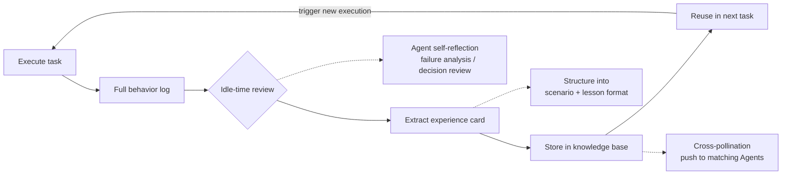

# Self-Evolution and Self-Repair — Agent Teams That Grow Smarter

![Image showing the Agent self-evolution and self-repair flow. From left to right: monitor, diagnose, repair, verify, learn. After an anomaly is detected, the core system is isolated automatically, a fix is generated, and once verification passes it's added to the knowledge base. It also shows data such as 15min average detection time, 3min auto-repair time, 96% auto-repair success rate, 87% recurrence reduction. The bottom note says the highest level of self-repair is not to never err, but to fix errors on your own and not repeat the same mistake next time.](https://internal-api-drive-stream.feishu.cn/space/api/box/stream/download/authcode/?code=MTViNjI0MzZhZWMxZGZmNzk0MDdjYTgzZmQ3ODVjY2RfNTYyOTVjZDQ4NjBlNTI5ODdmOGIwMDk5MDE1NWQwZjZfSUQ6NzY1MTgwMDE4MjI3OTExMzY5OV8xNzgzODcwNTIzOjE3ODM4NzQxMjNfVjM)

## Agents Don't "Remember" What They Did

There's a depressing fact Yason took two months to accept:

**After completing a task, an Agent doesn't learn anything from it.**

Not "learns slowly" — "doesn't learn at all." Kai steps in a rake today, and hits the same rake again tomorrow. Max learns a trick today, and still uses the old method tomorrow.

This isn't a problem with any particular Agent — it's common to all LLMs: **each conversation is independent; the context is wiped when the conversation ends. Agents have no long-term memory and no mechanism for "experience accumulation."**

Yason's Max once stepped in the same rake 21 times — on the 21st time, Max's log read "I think I've seen this error before," and then still chose the wrong solution.

> **An Agent team without memory isn't a team — it's an assembly line. No one's experience gets passed on; every day is a new hire's first day.**

## The Core Mechanism of Self-Evolution

Yason got tired of "teaching Kai the same thing every week," so he started building an Agent self-evolution mechanism.

The core of this mechanism is four words: **replay and review.**



### Step 1: Full Behavior Log

Every Agent's every task — from receiving the instruction to producing the result — is logged in full to a Git repo.

```bash
# /opt/agents/logs/kai/2025-06/
├── TASK-001-execution.log       # raw execution log
├── TASK-001-decisions.json      # decision records
├── TASK-001-failures.json       # failure records + resolution
├── TASK-002-execution.log
└── ...
```

The key is the "decision records" — every key decision an Agent makes must record "why this approach was chosen" and "were there other approaches that were rejected."

```json
{
  "task_id": "TASK-001",
  "decisions": [
    {
      "problem": "DB connection pool size config",
      "chosen": "connection_pool_size=20",
      "runner_up": "connection_pool_size=50",
      "reason": "Current expected load is ~1000 concurrent; 20 is enough. Larger wastes resources.",
      "result": "Correct; peak connections reached only 15"
    },
    {
      "problem": "Cache strategy",
      "chosen": "Redis + local cache, two layers",
      "runner_up": "Redis only",
      "reason": "High-frequency reads benefit from local cache to cut network IO",
      "result": "Correct; avg response time dropped from 120ms to 45ms"
    }
  ]
}
```

### Step 2: Idle-Time Review

Yason set up a cron job — every day at 3 AM, when all Agents are low-load, it triggers the review process.

```bash
# crontab - Agent daily review
0 3 * * * /opt/agents/scripts/review-today.sh

# review-today.sh contents
for agent in kai max rex; do
    echo "=== Reviewing $agent ==="
    # Analyze today's failure records
    today_fails=$(cat /opt/agents/logs/$agent/$(date +%Y-%m-%d)-failures.json)

    # Let the Agent look at its own failure records
    $agent --prompt="These are the failures you hit today. Analyze each one:
    1. Cause of failure
    2. Was the resolution correct?
    3. Is there a better resolution?
    4. What lesson can be extracted?
    Output in experience-card format."

    # Store the extracted experience in the knowledge base
    $agent --save-experience >> /opt/agents/knowledge/$agent-experience.yaml
done
```

The review isn't done by Yason manually — it lets the Agent "reflect" on its own day's work: the Agent reads its own logs, analyzes its own mistakes, and extracts lessons.

Yason found an interesting pattern: **When reviewing, the Agent analyzes its own day's errors more thoroughly than Yason could.** Because it can see every decision path, while Yason only sees the final result.

### Step 3: Experience Cards

The review results are distilled into "experience cards" — structured knowledge fragments stored in the knowledge base.

```yaml
# /opt/agents/knowledge/kai-experience.yaml
experiences:
  - id: EXP-042
    title: "Lock NPM dependency versions"
    scenario: "Installing a new dependency without locking the version"
    consequence: "CI builds produced different results at different times"
    lesson: "All new dependencies must be version-locked with the --save-exact flag"
    tags: ["nodejs", "dependency", "ci"]
    discovered: "2025-06-10"
    applied_count: 7

  - id: EXP-043
    title: "Don't use JSON for large files"
    scenario: "Tried to JSON.parse() a 500MB log file"
    consequence: "OOM, process killed"
    lesson: "Files over 100MB should be streamed, not loaded all at once"
    tags: ["performance", "memory"]
    discovered: "2025-06-11"
    applied_count: 4
```

The core design of experience cards is the "scenario + lesson" structure — not abstract rules, but **what problem was hit in what situation, and what to do.** When an Agent takes a new task, it first queries the knowledge base for matching experience.

### Step 4: Cross-Pollination

Can Agent A's experience be passed to Agent B? Yason's design: "yes, but not automatically."

```
Kai's experience card:
  EXP-042: "Lock NPM dependency versions"

Will Max hit this problem?
  ← Max doesn't use NPM → no need

Kai's experience card:
  EXP-038: "When rate-limited on an API, don't use fixed intervals — use exponential backoff"

Will Rex use APIs?
  ← Rex also calls external APIs → yes, needed

Rex's knowledge base receives EXP-038:
  "Experience shared from Kai: use exponential backoff when rate-limited... adopted"
```

Yason designed an "experience recommendation engine" — every week it auto-scans all knowledge bases, finds cross-Agent-applicable experience, and pushes it to the target Agents' knowledge bases.

```python
def cross_pollinate():
    all_experiences = load_all_experiences()
    for agent in agents:
        current_tags = agent.get_knowledge_tags()
        for exp in all_experiences:
            # If the experience tags match the target Agent's capabilities
            # and the Agent doesn't yet have this experience
            if exp.tags & agent.capability_tags and exp.id not in agent.knowledge:
                # Push it
                agent.knowledge.append(exp)
                log(f"{agent.name} got experience {exp.id} from {exp.source}")
```

## The Evolution of the Compaction Strategy

Experience cards are only part of Yason's memory system. The bigger challenge: as the Agent's conversation context grows longer, how do you compress it while keeping the core signal?

Yason's Compaction strategy went through four stages:

**Stage 1: Simple Truncation**  
The earliest approach — when context exceeded the limit, just cut off the earliest part.  
Cost: key decision info often got dropped. The Agent forgot what it was doing, then started "hallucinating."

**Stage 2: Structured Summarization**  
Summarize the early conversation into a structured summary:

```
Raw conversation (5000 tokens) → Summary (200 tokens)
- Decisions made: 3
- Pending items: 2 (PR review, DB migration)
- Current status: waiting for Max's API docs
```

Improvement: core info is preserved, but the detailed reasoning chain is lost.

**Stage 3: Anchored Iterative Summarization**  
Yason improved on Stage 2 — each summary "anchors" key decision nodes, ensuring their complete info isn't compressed. Also, before each summary the Agent asks itself: "Is this info still useful for my later decisions?" and keeps only what's useful.

**Stage 4: ACON (from a Microsoft paper)**  
At the end of 2025, Microsoft published a paper on Agent context compression — ACON (Adaptive Context Optimization for Agents). ACON's core idea: instead of a fixed compression strategy, dynamically choose the compression strategy based on the Agent's current task type and state.

```
ACON strategy selection:

Code generation task → keep function signatures, existing code snippets, test results
Doc writing task → keep outline, finalized terms, review comments
Analysis research task → keep hypotheses, dataset summaries, key findings
Debug fix task → keep error stack, attempted approaches, failure reasons
```

At the start of 2026, Yason upgraded his Compaction strategy to a simplified version of ACON — task-type recognition + dynamic compression-strategy selection. Compared to Stage 1 (simple truncation), Stage 4's Compaction preserved about 85% of the signal while using only 30% of the original Token consumption.

> **Compaction isn't "deleting things" — it's "knowing what can't be deleted." A good Compaction strategy keeps the Agent's context always holding only its most important current task.**

## The Emergence of Self-Healing: Swarm Intelligence

Yason noticed an interesting phenomenon — once the Agent count crosses a certain threshold (his experience: 5+), a "self-healing" capability emerges spontaneously.

He didn't design it — it **emerged.**

The concrete behavior: when an Agent shows abnormal behavior (e.g., Kai starts outputting unreasonable code), other Agents notice and react.

```
Scenario: Kai's code quality suddenly drops

09:32 Kai: submitted code with an unparameterized SQL query
09:33 Rex (monitoring Agent): detected SQL injection risk in Kai's commit,
      auto-created a Blocking PR Review
09:34 Max: noticed Rex's PR Review, paused tasks depending on Kai's output
09:35 Yason: received Rex's alert, "Kai's code quality abnormal, recommend check"
```

Yason wrote no code for "SQL injection detection." Rex could spot the problem because it had accumulated experience in daily monitoring of "what good code should look like" — when Kai's output deviated from that experience baseline, Rex raised the alarm.

This phenomenon is called **Stigmergy** in swarm intelligence — each Agent leaves "traces" in the environment (code commits, status updates, alerts), and other Agents sense those traces and react autonomously, with no central dispatch needed.

In Yason's team, this "self-healing" mechanism only started appearing stably in the third month. Preconditions:

1. At least 5 Agents (too few, no swarm effect)
2. Each Agent has its own monitoring perspective (not all Agents doing the same thing)
3. Information-sharing mechanisms in place (status sync, readable logs, subscribable alerts)

> **Self-healing isn't written — it's grown. When your Agent team has enough individuals, and each individual has a unique perspective, swarm intelligence emerges spontaneously.**

## The 30-Day Evolution Cycle

Yason's Agent team evolves on a 30-day cycle:

```
Days 1-7: Collection phase
  Agents log all behavior, build baseline data

Days 8-14: Analysis phase
  Review tool analyzes logs, extracts reusable experience

Days 15-21: Integration phase
  Experience cards written to knowledge base, System Prompt updated

Days 22-30: Validation phase
  Compare against baseline data, evaluate improvement effect
```

**Real data:** In the first cycle (days 1-30), Kai's task failure rate dropped from 22% to 9%; in the second cycle (days 31-60), it dropped further to 5%. By the third month, Kai basically no longer repeated the same mistakes on the same type of task.

> **The Agent team went from "starting over every time" to "standing on the shoulders of the last time." Every 30 days, the team levels up.**

## Automatic Knowledge Graph Construction

Experience cards are a linear knowledge-storage method, but Yason found that once the card count exceeded 200, retrieval efficiency started dropping — the Agent didn't know which card was more relevant to retrieve.

His solution was a **knowledge graph**: automatically extract entities and relations from Agent logs to build a structured knowledge network.

```python
def build_knowledge_graph(logs):
    graph = KnowledgeGraph()

    for log in logs:
        # Extract entities
        entities = extract_entities(log.text)
        # entity: "user-auth module", type: "module"
        # entity: "NPM dependency lock", type: "practice"
        # entity: "502 error", type: "incident"

        # Extract relations
        relations = extract_relations(log.text, entities)
        # relation: "user-auth module" → "uses" → "NPM dependency lock"
        # relation: "502 error" → "occurs in" → "user-auth module"

        graph.add_entities(entities)
        graph.add_relations(relations)

    return graph
```

This knowledge graph upgrades the Agent's retrieval from "keyword matching" to "path navigation." For example, when Kai handles a "user-auth module" task, it not only sees its own experience card, but can also navigate the graph to "502 error," "DB connection pool," "JWT implementation," and other contextual info linked to "user-auth module."

Yason found the knowledge graph improved recall by about 40% over pure keyword search, and Agents made fewer context-contradicting decisions.

## Versioning Skills

The biggest pitfall Yason hit in the experience system was **version chaos.**

By the third month, Kai's experience cards had a dozen-plus versions — some added, some modified, some deprecated. But nowhere in the system recorded this change history. Yason often found Kai using a two-month-old version of an experience — because the old version hadn't been replaced yet.

The lesson: **Skills are also code — they need version control.**

Yason's solution was simple — put the experience-card library under Git management:

```bash
# /opt/agents/knowledge/
├── README.md
├── kai/
│   ├── v1.0-experiences.yaml     # initial version
│   ├── v1.1-experiences.yaml     # added 5 experiences
│   ├── v2.0-experiences.yaml     # refactor: reclassified tags
│   └── current → v2.0-experiences.yaml  # symlink to current version
├── max/
│   └── ...
└── shared/                       # cross-Agent shared knowledge
    └── v1.0-general.yaml
```

Every experience update goes through the standard Code Review flow: update the YAML → create PR → Yason or Kai reviews → merge to main → symlink points to the new version. If the new version has issues, rollback is just changing the symlink.

Yason also built a simple automated test: after merging a PR, it auto-runs a regression task with the new experience cards and compares new vs. old completion quality. If quality drops, CI blocks the merge directly.

> **Experience is the Agent team's most important asset. The way to treat an asset should be: versioned, auditable, rollbackable. As serious as code.**

## The Community's Self-Evolution Ecosystem

Most of Yason's self-evolution system is self-built, but on key components the community's open-source solutions helped a lot.

**AutoGen's Reflection mechanism:** Microsoft AutoGen has built-in Agent self-reflection — after completing a task, the Agent auto-generates a "reflection report" analyzing its own performance. Yason's review process drew heavily on AutoGen's reflection pattern.

```python
# AutoGen's reflection pattern (simplified)
from autogen import Agent, ReflectionMixin

class ReflectiveAgent(Agent, ReflectionMixin):
    async def execute_and_reflect(self, task):
        result = await self.execute(task)
        # Auto-reflect
        reflection = await self.reflect(
            task=task,
            result=result,
            prompt="Analyze your execution: what went well? what could improve?"
        )
        # Save experience and reflection
        self.store_experience(reflection)
        return result
```

**LangGraph's Checkpoint/Resume:** LangGraph's persistence turns the Agent's evolution into a traceable process. Every time the Agent reaches a key node, it auto-creates a Checkpoint. If a later Agent finds a decision was wrong, it can roll back to any Checkpoint and redo. Yason uses this heavily in Rex's simulation tasks — a simulation runs 8 hours; if some parameter was set wrong midway, no need to rerun, just roll back to the error point.

**Community-shared Skill libraries:** There are already community-maintained Agent Skill repos on GitHub. Yason's team imported a dozen-plus preset Skills from the community Skill library — "code review spec," "API design guide," "CI/CD config templates." These are community-accumulated best practices, far more efficient than summarizing from scratch.

> **Don't reinvent the wheel. Experience accumulation isn't "every team groping from scratch" — it's "standing on the community's experience, and adding your own unique layer."**

## Memory Compression: From Logs to Skills

Logs are raw, detailed, noisy. Experience cards are distilled, structured, actionable. The transformation in between is "memory compression."

Yason's compression flow:

```python
def compress_logs_to_skill(logs):
    # 1. Filter noise
    relevant = [l for l in logs if l.level in ["ERROR", "WARNING"] or l.type == "decision"]

    # 2. Cluster similar events
    clusters = cluster_by_similarity(relevant)

    # 3. Extract general patterns
    skills = []
    for cluster in clusters:
        pattern = extract_pattern(cluster)
        skill = format_experience_card(pattern)
        skills.append(skill)

    return skills
```

This process isn't perfect — sometimes it distills overly specific experience ("how to fix this particular bug"), sometimes overly generic lessons ("watch your code quality"). Yason's approach: **distill coarsely first, then let the Agent filter during review.**

## The Bottleneck of Evolution

Self-evolution isn't omnipotent. Yason found three bottlenecks:

**Bottleneck 1: Data quality ceiling.** If the Agent's logs don't record correct decision info, the review can't distill good experience. "Garbage in, garbage out" — so Yason mandates that every Agent log its decision record during task execution.

**Bottleneck 2: Saturation of similar experience.** After three months, Kai's "common code errors" experience library was fairly complete; fewer and fewer new experiences were distilled, marginal benefit diminishing. At this point, the change in experience isn't adding new entries, but optimizing existing ones.

**Bottleneck 3: Hard cross-domain transfer.** Kai's experience in code is hard to directly transfer to Max's ops strategy. The benefit of experience sharing shows more at the "general methodology" level (e.g., "try several approaches before choosing") than at the specific-skill level.

> **The ultimate form of self-evolution isn't the Agent learning all skills, but the Agent learning "how to learn new skills." Turning "learning to learn" itself into a reusable capability — that's the real value of the experience system.**

## RL for Agents: Self-Play Optimization

In the final step of the self-evolution system, Yason started exploring a more ambitious direction — using Reinforcement Learning (RL) to optimize the Agent's decision quality.

The traditional RL idea is "the Agent acts in an environment, adjusts strategy based on a reward signal" — for an Agent team this has a natural mapping: every Agent decision ("choose plan A or plan B") is an action, and whether the task completes smoothly is a reward signal.

Yason's experiment method:

```python
def rl_optimize(agent, task_pool, episodes=100):
    for episode in range(episodes):
        task = random.choice(task_pool)

        # Agent executes the task
        result = agent.execute(task)

        # Compute reward
        reward = compute_reward(result)
        # Short completion time → +reward
        # High quality → +reward
        # Low Token consumption → +reward
        # Error → -reward

        # Update the Agent's decision strategy
        agent.update_strategy(reward, task, result)
```

This experiment is still early, but Yason has already observed an interesting pattern: after dozens of RL self-play rounds, the Agent starts favoring "conservative but reliable" plans over "risky but possibly better" ones — the Agent is trading off Tokens against its own success rate.

> **RL for Agents is still early, but it points to an ultimate direction: Agents can not only learn from past experience, but also proactively explore better strategies through "self-play." This direction may be the key step from Agents as "assistive tools" to "autonomous intelligence."**

## Chapter Summary

- Self-evolution isn't omnipotent — knowledge solidification, the forgetting curve, and the evaluation trap are three core bottlenecks
- The Compaction strategy has four evolution stages: truncation → structured summary → anchored iteration → ACON optimization
- Cross-monitoring among multiple Agents can produce emergent self-healing behavior (Stigmergy)
- Skills need version management like code — a full lifecycle of design, implementation, testing, and archival
- RL for Agents is the ultimate direction of self-evolution, but still early

> **Next chapter preview:** The future is here — when Agent teams become standard, how will work change? And Yason's last words to those wanting to start building an Agent team.

*This article is from the column 'Being the Boss of AI'; the full series is continuously updated:* [*GitHub - VokoForge/ai-prism*](https://github.com/VokoForge/ai-prism)

---


