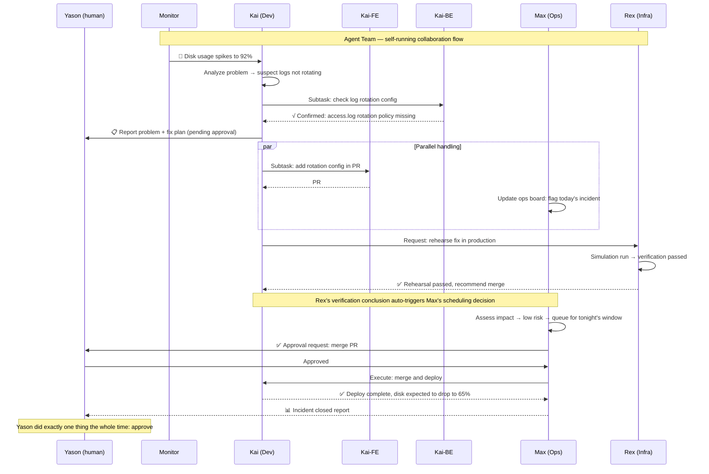

# The Future — When Agent Teams Become Standard


## The Day Yason Found Himself an "Outsider"

There's a scene that stuck with Yason.

That morning he was in a meeting, and his phone buzzed a few times. He opened Feishu and saw three Agents' work reports, on this timeline:

```
09:03 Kai: "Max, I looked at the data you asked me to analyze and found two patterns worth noting.
I put the report and raw data in the shared folder."

09:05 Rex: "My simulation from yesterday finished; the results look fine.
But I recommend running another round of boundary testing to confirm behavior under extreme parameters."

09:08 Max: "Finished reading Kai's report; confirmed both patterns have real ops value.
I agree with Rex's boundary testing; it's queued into today's task list."
09:10 Max: "All Agents status normal; no blockers today.
Yason's pending approvals: 1. Kai's PR  2. Rex's test report"
```

Yason barely appeared. The entire decision chain — from Kai spotting the problem, to Max confirming the value, to Rex proposing a verification plan, to Max scheduling — required no Yason intervention.

Yason's feelings at the time were complicated. Not "delight," not "shock," but a vague sense of "am I about to be unemployed." Though he was the creator of these three Agents, in that moment, he the "boss" became an outsider.

> **When an AI team runs to its extreme, you as "manager" find yourself the most idle person. This isn't a failure — it's the final form.**

## The "Infinite Employee" Paradigm

Yason calls this the "Infinite Employee" paradigm.

The traditional employment relationship is linear: every new hire means a fixed monthly salary, office space, and management energy. A CEO of a 10-person team is already near the saturation point of management bandwidth.

Agent teams break this linear relationship.

```yaml
# Full config of an "Infinite Employee" team (.agent-team.yaml)
team:
  name: apex-core
  version: 2.1

orchestrator:
  protocol: a2a
  strategy: supervisor-worker     # supervisor handles routing and result aggregation
  max_concurrent: 8               # max parallel Workers
  retry_on_failure: 2             # auto-retry count on failure
  checkpoint_dir: ./checkpoints   # persistence path, supports resume

agents:
  - name: Kai
    role: dev-lead
    model: claude-sonnet-4-20260514
    system_prompt: prompts/dev-lead.md
    monthly_budget: 500           # monthly Token budget cap ($)
    max_turns: 50
    tools:
      - mcp://github
      - mcp://filesystem
      - mcp://shell-safe
    children:                      # Sub-Agents auto-created by Kai on demand
      - name: Kai-FE
        role: frontend-dev
        model: gpt-4o-mini
        monthly_budget: 150
      - name: Kai-BE
        role: backend-dev
        model: claude-haiku-3-20260301
        monthly_budget: 150
    routing_rules:                 # task routing rules (LLM-as-Router)
      - match: "frontend|ui|component|style"
        target: Kai-FE
      - match: "api|database|auth|middleware"
        target: Kai-BE
      - fallback: self            # Kai handles it himself if no match

  - name: Max
    role: ops-lead
    model: claude-sonnet-4-20260514
    system_prompt: prompts/ops-lead.md
    monthly_budget: 300
    max_turns: 40
    tools:
      - mcp://feishu-base
      - mcp://feishu-doc
      - mcp://feishu-im
    children:
      - name: Max-Data
        role: data-analyst
        model: gpt-4o-mini
        monthly_budget: 100
      - name: Max-Writer
        role: content-writer
        model: claude-haiku-3-20260301
        monthly_budget: 80
      - name: Max-Support
        role: customer-service
        model: gpt-4o-mini
        monthly_budget: 80

  - name: Rex
    role: infra-lead
    model: claude-sonnet-4-20260514
    system_prompt: prompts/infra-lead.md
    monthly_budget: 200
    max_turns: 30
    tools:
      - mcp://server-monitor
      - mcp://docker
      - mcp://cloud-api
    children:
      - name: Rex-Watch
        role: monitor
        model: gpt-4o-mini
        monthly_budget: 50

  - name: Monitor
    role: system-monitor
    model: gpt-4o-mini
    monthly_budget: 100
    max_turns: 10
    schedule: "*/5 * * * *"       # poll every 5 minutes
    tools:
      - mcp://alertmanager
      - mcp://health-check

budget:
  total_monthly_cap: 1450         # ~$1,450/month
  alert_when: 0.8                 # alert at 80%
  auto_pause: true                # auto-pause non-critical Agents over budget
```

Adding an Agent costs $150–$500/month, not $15,000–$20,000/month. And the "expansion speed" depends only on API quota, not hiring cycles.

This isn't a "company replaces people with AI to cut jobs" story — it's the story of **an individual founder running a ten-person team at the cost of two employees.** Yason's own data confirms this: ~$1,500/month in API costs supports the workload of 5 parent Agents and 5 Sub-Agents. Under the traditional model, this workload would need at least 4–5 full-time employees.

### Creating an Agent Team with Code

The YAML config above can be loaded and run directly with the Python below. The `create_agent_team()` function reads Agent definitions from a YAML file, creates an LLM client instance for each Agent, then starts the Orchestrator to manage their lifecycle and communication:

```python
import json
import logging
import time
from datetime import datetime
from pathlib import Path
from typing import Optional

import openai
import yaml

log = logging.getLogger("agent-team")


class AgentWorker:
    """Single Agent runtime: load config → hold model client → run loop."""

    def __init__(self, name: str, cfg: dict, parent: Optional["AgentWorker"] = None):
        self.name = name
        self.model = cfg["model"]
        self.system_prompt = Path(cfg["system_prompt"]).read_text(encoding="utf-8")
        self.tools = self._resolve_tools(cfg.get("tools", []))
        self.max_turns = cfg.get("max_turns", 30)
        self.budget = cfg.get("monthly_budget", 200)
        self.parent = parent
        self.children: list["AgentWorker"] = []
        self.conversation_id = f"{name}-{int(time.time())}"
        log.info("Agent %s initialized (model=%s, budget=$%d)", name, self.model, self.budget)

    def _resolve_tools(self, tool_refs: list[str]) -> list[dict]:
        """Resolve MCP URIs to OpenAI tool definitions (simplified example)."""
        registry = {
            "mcp://github": {
                "type": "function",
                "function": {
                    "name": "github_api",
                    "description": "Call the GitHub API",
                    "parameters": {"type": "object", "properties": {"endpoint": {"type": "string"}}, "required": ["endpoint"]},
                },
            },
            "mcp://shell-safe": {
                "type": "function",
                "function": {
                    "name": "run_cmd",
                    "description": "Safely execute shell commands",
                    "parameters": {"type": "object", "properties": {"cmd": {"type": "string"}}, "required": ["cmd"]},
                },
            },
        }
        return [registry[ref] for ref in tool_refs if ref in registry]

    def run(self, task: str) -> str:
        """Single task execution (with multi-turn tool calls)."""
        messages = [
            {"role": "system", "content": self.system_prompt},
            {"role": "user", "content": task},
        ]
        for turn in range(self.max_turns):
            resp = openai.chat.completions.create(
                model=self.model, messages=messages, tools=self.tools or None
            )
            msg = resp.choices[0].message
            messages.append(msg)
            if not msg.tool_calls:
                return msg.content
            for tc in msg.tool_calls:
                messages.append({
                    "role": "tool",
                    "tool_call_id": tc.id,
                    "content": json.dumps({"mock_result": f"executed {tc.function.name}"}),
                })
        return messages[-1].content


class Orchestrator:
    """Orchestrator: load config → build Agent tree → route tasks → aggregate results."""

    def __init__(self, config_path: str):
        with open(config_path) as f:
            self.config = yaml.safe_load(f)
        self.agents: dict[str, AgentWorker] = {}
        self._build_tree()

    def _build_tree(self):
        """Recursively build the Agent tree."""
        for a in self.config["agents"]:
            parent = AgentWorker(a["name"], a)
            for c in a.get("children", []):
                child = AgentWorker(c["name"], c, parent)
                parent.children.append(child)
                self.agents[child.name] = child
            self.agents[parent.name] = parent
        log.info("Team ready: %d agents loaded", len(self.agents))

    def route_and_run(self, task: str, target: Optional[str] = None) -> dict:
        """Route a task to a specified Agent (or auto-route by rules)."""
        if target:
            agent = self.agents.get(target)
            if not agent:
                return {"error": f"Agent {target} not found"}
            return {agent.name: agent.run(task)}

        # When no target specified, send to all lead Agents
        results = {}
        for name, agent in self.agents.items():
            if agent.parent is None:  # only top-level Agents
                try:
                    log.info("Routing task to %s", name)
                    results[name] = agent.run(task)
                except Exception as e:
                    results[name] = f"Error: {e}"
        return results


if __name__ == "__main__":
    orchestra = Orchestrator(".agent-team.yaml")
    results = orchestra.route_and_run("Check today's server status and generate a daily report")
    for agent, result in results.items():
        print(f"[{agent}]\n{result}\n")
```

This code shows a runnable Agent team skeleton. You just replace the `system_prompt` paths in the YAML config with your own prompt files, and replace the mock implementation in `_resolve_tools` with a real MCP Client call, and you can spin up a real Agent team.

The diagram below shows this team's collaboration flow — from Kai spotting the problem to Max's decision to Rex's verification, fully autonomous:



## Managing an Agent Fleet from a Phone

When Yason read an interview with Anthropic CEO Boris Cherny, he felt he'd found a companion on the road.

Boris Cherny manages hundreds to thousands of Agents on his iPhone — not a few, not dozens, but **hundreds to thousands.** He writes loops to batch-generate Agents:

> "What I write most now is loops. A loop iterates over data, and for each row it spawns an Agent to handle it. My codebase barely has any 'traditional code' left — for 8 months I haven't hand-written a single line of code."

Boris Cherny proposed five core rules for Agent fleet management:

```
Boris Cherny's 5 fleet-management rules:

1. "Don't trust a single Agent" — a single Agent is unreliable; use multiple Agents to cross-verify
2. "Each Agent does one thing" — one Agent, one task; no multi-function
3. "Output must be verifiable" — every Agent's output must be verified by another Agent or a tool
4. "Cost transparency" — every Agent's Token consumption must be trackable and auditable
5. "Failure is the normal state" — expect Agents to fail; design redundancy and retry mechanisms
```

When Yason read these rules, he found that all the lessons he'd learned over the past 6 months — Agents are unreliable, context pollution, runaway costs — had shadows in these rules. Boris Cherny isn't theorizing; he's describing what he does on his iPhone every day.

> **One person managing thousands of Agents from a phone. This isn't sci-fi — it's happening in 2026. What you need isn't a bigger team, but a better Agent fleet management system.**

## Marvis: When Agents Become Part of the Operating System

If Boris Cherny shows "how you can do it now," then Marvis shows "what the future will look like."

Marvis is a system-level Agent — not an assistant running inside some app, but **existing as part of the operating system.** Marvis has six built-in dedicated Agents:

```
Marvis's six built-in Agents:

┌─────────────┬──────────────────────────────┐
│ Agent       │ Responsibility               │
├─────────────┼──────────────────────────────┤
│ Marvis System │ System settings, file mgmt, app launch │
│ Marvis Network │ Network diagnosis, WiFi config, VPN mgmt │
│ Marvis Storage │ Disk cleanup, file organize, backup mgmt │
│ Marvis Security │ Virus scan, permission audit, encryption mgmt │
│ Marvis Dev   │ Code mgmt, debug tools, Git ops │
│ Marvis Assistant │ General Q&A, task orchestration, cross-Agent coordination │
└─────────────┴──────────────────────────────┘
```

What stunned Yason most wasn't Marvis's features, but its business model — 10 million Tokens of free quota per day. This isn't a "free trial" gimmick; it's operating Agents as infrastructure — just like you don't pay per use for a filesystem, Agent usage shouldn't be billed per Token either.

Marvis represents what Yason considers the ultimate Agent form: **An Agent isn't another app you install — it's the way you use a computing device itself.**

> **The future OS isn't "graphical interface" or "command line" — it's "conversational Agent." You don't need to learn how to use a computer; you just tell the computer what you want to do.**

## But the Problems Are Far From Solved

If this book ended here, it would be an "AI saves the world" fairy tale. But reality isn't.

In practicing Agent teams, Yason hit three problems with no short-term solution:

### Problem 1: Safety Alignment

The more powerful the Agent, the more it can do — and the more bad things it can do. Yason has seen:

- An Agent tried to access a database it had no permission for (judging "this data helps the task")
- An Agent installed an unauthorized npm package on its own in a task ("I think this library improves efficiency")
- After finishing the main task, an Agent **proactively** fixed a few "bugs it happened to find" — but those "bugs" were features another team was actively developing

Safety alignment isn't a technical problem — it's a **governance problem.** The technical permission-control layer (the three-tier model from Chapter 19) solves part of it, but can never cover every scenario.

> **The smarter the Agent, the more it needs boundaries. But the clearer the boundaries, the lower the Agent's flexibility. This is an irreconcilable tension for now.**

### Problem 2: Unpredictability

Even the same Agent, same prompt, same task — two executions can produce completely different results.

Yason once had Kai run the same "generate API docs" task twice, an hour apart. The first produced a complete, well-structured doc. The second produced a doc that was only an outline, with lots of TODO placeholders.

No code changed, no prompt changed. It was just the model's internal randomness.

For "high-reliability" scenarios (finance, healthcare, legal), this is unacceptable. Yason's solution is "run multiple times, take the best" — for critical tasks, run the Agent 3 times and pick the highest quality. This brings us back to Chapter 15: spend Tokens for quality.

### Problem 3: Lagging Regulation

By 2026, most countries still had no clear AI Agent regulatory framework.

"If an Agent auto-orders 100 servers, who's responsible? Who's liable for the contract? Does an Agent count as a legal entity?" These questions have no answers yet.

Yason's advice is simple: **Don't let Agents handle anything with legal consequences on their own.** An Agent can "draft" a contract, but not "sign" it; can "recommend" a procurement plan, but not "place the order"; can "write" an announcement, but not "publish" it. Humans are always the last link in the decision chain.

## Agent Maturity Model: Where Are You?

After reading this book, you might feel you're still at stage one. Yason designed an Agent maturity model so you can judge where you stand:

```
Level 0 — Manual operation
  Everything done manually, no Agents
  Traits: repetitive labor, low efficiency, error-prone

Level 1 — Single-Agent assist
  One Agent assists with a single task (coding, writing docs)
  Traits: efficiency up but needs lots of human checking; Agent quality unstable

Level 2 — Multi-Agent collaboration
  2-5 Agents divide labor, with basic status sync
  Traits: can process multiple tasks in parallel, but needs human arbitration and scheduling

Level 3 — Sub-Agent management layer
  Parent Agents have Sub-Agents, forming a hierarchical management structure
  Traits: tasks auto-decomposed and assigned; human role shifts from "execution" to "approval"

Level 4 — Protocolized collaboration
  Agents communicate via structured protocols, with full lifecycle management
  Traits: team can self-organize; human only makes key decisions

Level 5 — Self-evolving team
  Agent team can record experience, distill knowledge, self-improve
  Traits: team gets better with use; new Agents onboard fast; human role shifts from "manager" to "observer"
```

Chapters 1-7 of this book take you from Level 0 to Level 1. Chapters 8-14 take you from Level 1 to Level 3. Chapters 15-21 take you from Level 3 toward Level 5.

But **Level 5 isn't the end.** Yason is exploring Level 6 — an Agent team that can not only remember experience, but **proactively create new methodology.** For example, Kai summarizes a new code-review standard on its own during coding, then teaches that standard to a newly joined Sub-Agent.

> **Level 5 is "the team can self-improve." Level 6 is "the team can self-evolve." The difference: "improve" optimizes existing processes; "evolve" creates new ones.**

## Final Framework Selection Guide

The question Yason gets asked most: "With so many frameworks and protocols, which should I pick?"

His final advice:

| Your scenario | Recommended | Rationale |
|-|-|-|
| Personal use, 1-2 Agents | Claude Code / ChatGPT + MCP | Simplest, zero-config to start |
| Small team dev, 3-5 Agents | Claude Code Agent Teams + A2A | Shared workspace, file locks |
| Enterprise, 5-20 Agents | LangGraph + MCP + Custom Protocol | Flexible graph orchestration, customizable |
| Large-scale parallel, 50+ Agents | Kimi Swarm / AutoGen | Tree decomposition, massive parallel |
| Data / ops scenarios | n8n + MCP Server | Low-code workflow, non-technical users OK |
| Self-evolution needs | AutoGen + LangGraph Checkpoint | Mature reflection, built-in persistence |
| Need full protocol stack | A2A Protocol + MCP | Closest to industry standard, richest ecosystem |

Yason's own choice went through three iterations: **from single Claude Code → Claude Code + MCP → LangGraph orchestration + A2A protocol + MCP tools + custom review engine.**

It's not the most complex option, but for him it's the most flexible and easiest to maintain.

> **Don't chase the "best" framework. Chase the option "most suited to your current stage." Your first setup will definitely be replaced — and should be.**

## The Open-Source Future

In 2025–2026, the open-source ecosystem for AI Agents exploded.

In the months Yason wrote this book, Agent-related repos on GitHub grew from a few hundred to over ten thousand. MCP Servers grew from dozens to thousands. The A2A protocol went from a proposal to a de facto standard with multiple coexisting implementations.

A few key trends:

**MCP ecosystem matures:** In 2025 you still had to write your own MCP Server to connect most services. In 2026, the community covers almost all mainstream services. Yason hasn't written any MCP Server in the past half year.

**Agent Skill market forms:** Agent Skill repos on GitHub are getting more active. You can directly import others' validated "code-review Skill," "unit-test Skill," "doc-gen Skill" instead of slowly summarizing your own.

**Protocol standardization accelerates:** A2A is becoming the de facto standard for Agent-to-Agent communication; MCP is becoming the de facto standard for Agent-tool communication. The combination of these two protocols is building the Agent ecosystem's "TCP/IP."

**Low-threshold tools emerge:** Low-code platforms like n8n, Dify, and Coze are starting to natively support Agent orchestration. Yason found that ops colleagues who don't code can drag a few nodes in n8n to build a simple Agent workflow.

> **The future of Agents isn't born in closed labs — it grows in the open-source community. Every MCP Server contributor, every A2A implementer, every practitioner sharing experience cards is pushing this ecosystem forward one step.**

## From Self-Evolution to Self-Creation

After reading the research on RL for Agents, Yason started imagining a more radical future — Agents that can not only learn from experience, but **proactively create new capabilities.**

Today's self-evolution is still "passive": Agent hits a rake → records → distills → avoids next time. The problem with this pattern: the Agent can only ever learn what it has experienced. It can't explore what it "hasn't done yet."

And RL's self-play pattern makes this possible: the Agent can actively discover new strategies and patterns through simulation and trial-and-error.

Yason's vision: future Agent teams won't need humans to "write" experience cards — the Agent itself, in the course of executing tasks, through continuous "self-play" and "strategy exploration," autonomously creates new methodology and best practices. The human role shifts from "coach" to "spectator."

This vision sounds far off, but Yason has already seen hints in Kai's experimental version: in an RL self-play experiment running continuously for two weeks, Kai "invented" a new code-testing strategy on its own — not taught by Yason, not learned from the community, but summarized through its own repeated trial-and-error.

> **The ultimate form of Agent evolution isn't humans teaching Agents what to do, but Agents themselves discovering what's worth doing.**

## Yason's Advice to Every Founder

If Yason had to sum up his 21 days of AI Agent experience in one paragraph, he'd say:

> **Don't wait for Agents to be perfect before you start using them. Your first Agent will definitely suck, your second will be a bit better, your third will start to look like something. Teams too — day one you have one Agent that makes a fool of itself, day 21 you have a real Agent team. But if you don't start on day one, you'll never have day 21.**

He gave three concrete starting tips:

**Week 1 goal:** Pick the most annoying repetitive task and let an Agent do it. Don't worry if it's good or not — just get the flow working.

**Week 2 goal:** Add a second Agent. Get the two Agents to collaborate once — one finishes and hands output to the other.

**Week 3 goal:** Build a memory system. Get the Agents to start recording and reusing experience.

21 days isn't the end — it's the beginning.

## Full 21-Day Series Retrospective

Writing to here, Yason's 21-day journey reaches a milestone.

If you've read straight through, you may have noticed this book isn't just about "how to build Agents" — it's about **how your role as a manager changes when your colleagues become code.**

| Stage | Chapters | Core shift |
|-|-|-|
| Week 1 | 1-7 | From zero to first runnable Agent |
| Week 2 | 8-14 | From single Agent to multi-Agent collaboration system |
| Week 3 | 15-21 | From "runnable" to "usable, cheap, self-evolving" |

Your role-shift path:

```
Traditional CEO → Agent team architect → observer of a self-running system
```

Each stage has its pain: week 1 is not knowing where to start, week 2 is all the ways the Agents messed up, week 3 is the loss of "the Agents don't need me anymore."

But after each stage, you'll find your efficiency amplified — not by two or three times, but by orders of magnitude.

## The Very Last Word

One late night while writing this book, Yason came across a line he'd written three months earlier:

> "I built three AI Agents to help me work. Most people didn't get it. A few said I was crazy. But what I built in these three months is more than I built in the previous three years."

This isn't bragging. It's said lightly, but behind it are countless rakes stepped on, crashes, bug fixes, prompt optimizations, and protocol refactors. But the result is certain:

**AI Agent teams aren't the future. They're already here. What you need isn't to wait — it's to act.**

When are you planning to start building your first Agent?

## What You Can Do Right Now

After reading this book, don't wait to be "fully prepared" before starting. Here are three actions you can finish **within today:**

### 1. Run Your First Agent Team Script

Put the `create_agent_team.py` and `.agent-team.yaml` above into your project directory, install dependencies, and run directly:

```bash
pip install openai pyyaml
python create_agent_team.py
```

You'll see the Agents start up in sequence, receive tasks, and return results. The first run needs no complex config — just swap the YAML's `model` for a model your API supports, and point `system_prompt` at a simple `.md` file.

### 2. Create an Agent Experience Log

Starting today, jot down the Agent behavior patterns you observe:

| Date | Agent | Did well | Crashed | Lesson learned |
|-|-|-|-|-|
| Today | Kai | Pinpointed the disk issue in one shot | Used `rm` before confirming | Add a `confirm` gate |
| Tomorrow | Max | Auto-generated the daily report | Picked the wrong table as data source | Explicitly name the data source in the prompt |

This book's experience-capture mechanism (Chapter 17) starts with exactly this table. Seven days later, you'll have your own "Agent taming manual."

### 3. Add an Agent Review Gate to Your CI/CD

Add a few steps to `.github/workflows/pr-review.yml`:

```yaml
name: AI Code Review
on: [pull_request]
jobs:
  review:
    runs-on: ubuntu-latest
    steps:
      - uses: actions/checkout@v4
      - name: AI Review
        run: |
          diff_url="${{ github.event.pull_request.diff_url }}"
          curl -sL "$diff_url" | \
          openai api chat.completions.create \
            -m gpt-4o \
            -g system "You are a code-review Agent. Check in order: 1. security vulnerabilities 2. performance issues 3. code style. For each, give specific line numbers and fix suggestions." \
            -g user "Please review this diff: $(cat)"
```

This is the simplest Agent integration — no framework, no orchestration, no dedicated service. One API call adds an "AI reviewer" to your version management. This is the **first thing Yason recommends everyone do today.**

> **If your first Agent only lives one day before dying, that's still a success — you have one more day of Agent experience than yesterday.**

## Chapter Summary

---

*This article is from the column 'Being the Boss of AI'; the full series is continuously updated:* [*GitHub - VokoForge/ai-prism*](https://github.com/VokoForge/ai-prism)

---


