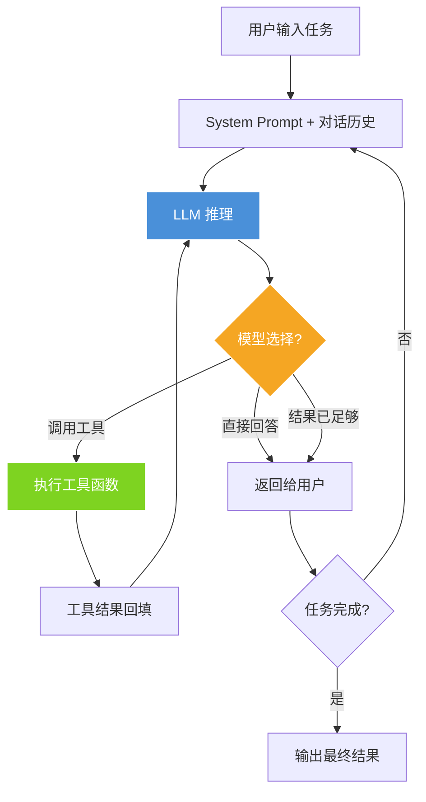

## 三个人，干不过一个Agent

2025年3月，Yason看着上个月的工资单和外包账单，沉默了。

团队3个人，月支出将近10万。但真正产出有效代码和业务的，折算下来大概只有1.5人份。不是大家不努力——开会、对齐、需求确认、设计评审、等待依赖、修环境、等审批……这些吃掉的时间，没人敢写在周报里。

更致命的是：**团队越大，沟通损耗呈指数级增长。**

3个人的时候，沟通链路是 3 条（A↔B, B↔C, A↔C）。但知识的缝隙远不止这些——A以为B知道，B以为C做了，C以为A在等。一天的时间就在这些"以为"里漏光了。

> 人的注意力是有限的，但Agent的注意力只取决于Token窗口。这是最根本的效率差异。

## 那个失眠的夜晚

Yason当时管理着三台服务器（Rex、Robot、Neo），日常运维靠人在盯。某天凌晨2点，一台服务器磁盘满了，监控告警发了，但没有值班的人。直到早上10点用户反馈"打不开"，大家才发现。

那天晚上Yason失眠了——他躺在床上想：**如果有一个Agent能24小时盯着，发现问题直接处理，甚至不需要人起床，会怎样？**

第二天，他开始动手。

## Agent != 工具

很多人把Agent当工具用：写个脚本跑定时任务，配个自动化流程。这没错，但格局小了。

工具是你敲一下动一下。Agent是给了目标自己想办法。

Yason第一次意识到这个区别，是他给Kai（第一个Agent）布置了一个任务："去排查一下为什么Rex的内存一直在涨。"

Kai不仅查了内存，还发现了一个日志文件没开轮转（log rotation）的问题，**顺手**写了个修复脚本，并且在下一次汇报里加了一节："Rex服务器健康检查建议"。

> 人的工作方式：等指令 → 完成任务  
> Agent的工作方式：理解目标 → 自主拆解 → 执行 → 主动反馈 → 建议优化

有一个经典的软件工程定律——Conway's Law：系统的架构会镜像生产它的组织的沟通结构。这条定律在Agent团队里同样成立：你的Agent团队的组织结构，决定了它能交付的系统形态。如果你用管人的方式管Agent（下指令、等结果、追进度），你得到的只是一个更便宜的劳动力池。只有用管CEO的方式管Agent（给目标、给资源、给边界），你才能得到真正的自驱团队。

这就是"Agent != 工具"的本质区别。

## 真实数据：70% vs 60%

3个月后，Yason算了一笔账（基于他管理的三台服务器实际运营数据，统计2月份全月）：

| 项目 | 人团队 | Agent团队 |
|-|-|-|
| 月支出 | \~10万 | \~3万 |
| 交付速度 | 5-7天/特性 | 2-3天/特性 |
| 覆盖时段 | 9小时/天 | 24小时/天 |
| 并行能力 | 1-2个任务 | 5-8个任务 |
| 离职风险 | 高 | 零 |

成本降低约70%，交付加速约60%。注意这些数字是基于Yason个人团队的对比，你的实际情况可能不同。关键不在于精确的数字，而在于**Agent释放了人的带宽，让人去做只有人能做的那30%。**

2026年6月，Anthropic的Claude Code负责人Boris Cherny在Fortune Brainstorm Tech大会上说了一句话，让整个开发者社区沉默了——他已经连续8个月没有亲手写过一行代码。取而代之的是，他每天早上从手机启动数百到数万个Agent在他睡觉时工作。这些Agent互相调用、互相审查代码、自动修复bug、甚至自己写Agent来管理其他Agent。这不是未来——这就是2026年的现实。本书要教你的，正是如何从零搭建你自己的Agent团队，哪怕你是从一台笔记本电脑开始的。

就在同一个月（2026年5月20日），腾讯发布了操作系统级AI助手Marvis（马维斯），内置6个Agent团队：1个主管Agent + 5个专项Agent（文件、系统、应用、浏览器、搜索），每天赠送1000万Token。国内用户打开电脑就能用上多Agent协作系统，这不再是小众技术。本书的架构思路和Marvis异曲同工——只是我们用的是更灵活、更可控的手动搭建方式。

同样值得关注的是，2026年Google I/O上，Google宣布Gemini即将获得"自主Agent能力"——用户可以直接让Gemini在后台执行跨应用任务，不需要实时盯着。Cognition Labs推出的Devin在2025-2026年间从"一个AI程序员"进化为"AI开发团队"，同一个会话中可以有Devin自动创建子Agent处理不同模块。开源方面，Microsoft的AutoGen 0.4版本引入了Agent间事件驱动通信协议，支持跨进程、跨机器的Agent编排。Kimi的Moonshot也在2026年推出了Swarm模式，允许Free手写拓扑结构的Agent舰队——树形分解、广播聚合、多轮辩论，全部在同一个Config文件中定义。

三个趋势汇聚成一个方向：**Agent团队正在从手工作坊进化为工业标准。**

## 你不需要当程序员的老板

Yason团队的情况你可能也遇到过：你懂业务、有想法、知道该做什么，但你要依赖程序员来实现。一个需求聊半天，做出来还不是你要的。改吧，人家说"代码层面不支持"。换个方向吧，人家说"这个要重新设计架构"。

Agent没有这种问题。

Agent不会跟你抬杠（除非你让它抬），不会摸鱼，不会说"这个做不了"然后去打游戏。Agent会说："这个方案我试了三种实现，推荐第三种，原因是..."

> 你不是要成为程序员，你是要成为Agent的CEO。

## 但这不意味着零成本

如果看完上面的数据你已经热血沸腾准备开始了，请先冷静几秒钟。

搭建Agent团队有两座山要翻：

1. **技术门槛**：虽然比写业务代码低，但还是要对API、Prompt、Git、命令行有基本概念
2. **思维转换**：从"管人"到"管Agent"，是完全不同的管理哲学

前者花几天就能补上。后者——有人花了一辈子也没转变过来。

这本书的21天，就是想帮你翻过这两座山。

## 你在哪个阶段？

经过大量实践，行业已形成Agent团队成熟度共识：

| 阶段 | 特征 | 实现要点 | 典型工具/框架 |
|-|-|-|-|
| L1: 单Agent | 一个Agent做固定的自动化任务，1人维护 | 单轮或短对话循环，固定System Prompt + 2-3个工具函数，无状态持久化 | OpenAI Assistants API / Claude API + MCP |
| L2: 多Agent协作 | 2-3个Agent分工，手动协调，1人管理 | 每个Agent独立进程/线程，通过文件或消息队列交换结果，人负责转发和仲裁 | Claude Code + shell脚本 / LangGraph passthrough |
| L3: Supervisor-Worker | 一个主管Agent调度多个Worker，1人监督 | Supervisor有路由逻辑（LLM-as-router），Worker按能力注册，结果聚合 | LangGraph Supervisor / CrewAI hierarchical |
| L4: Agent舰队 | 10+ Agent并行，有监察员、自动review，1人半监督 | Checkpoint持久化，审计日志，自动Review Agent对输出做质量门禁，成本追踪 | AutoGen / Kimi Swarm + Agent Monitor |
| L5: 自组织 | Agent自动拆解任务、分配、执行、复盘，无人值守 | 任务图自动生成，Agent自注册/自注销，执行后复盘写入经验库，动态优化 | LangGraph + Checkpoint + Custom Replay Engine |

本书的目标：21天内带你从L0走到L3。L4和L5是你后续的进化方向。



## 动手试试：一个生产级Agent

在进入正文之前，先让你感受一下定义一个Agent有多简单。下面的Python脚本是一个可以从开发直接用到线上的Agent——它有系统提示、工具定义、错误重试、日志追踪和完整的决策循环：

```python
import json
import logging
import subprocess
import time
from datetime import datetime
from typing import Any

import openai

logging.basicConfig(
    level=logging.INFO,
    format="%(asctime)s [%(name)s] %(levelname)s: %(message)s",
)
log = logging.getLogger("agent")

class RetryError(Exception):
    """所有重试耗尽后抛出的异常。"""

def with_retry(fn, max_retries=3, base_delay=1.0):
    """指数退避重试装饰器。"""
    for attempt in range(1, max_retries + 1):
        try:
            return fn()
        except Exception as e:
            log.warning("Attempt %d/%d failed: %s", attempt, max_retries, e)
            if attempt == max_retries:
                raise RetryError(f"All {max_retries} retries exhausted") from e
            time.sleep(base_delay * (2 ** (attempt - 1)))

def run_cmd(cmd: str, timeout: int = 30) -> dict:
    """安全执行 Shell 命令（禁止高危操作）。"""
    forbidden = ["rm -rf", "mkfs", "dd if=", "> /dev/"]
    if any(kw in cmd for kw in forbidden):
        return {"status": "rejected", "reason": "高危命令已拦截"}
    try:
        r = subprocess.run(
            cmd.split(), capture_output=True, text=True, timeout=timeout
        )
        return {
            "status": "ok" if r.returncode == 0 else "error",
            "stdout": r.stdout[-2000:],
            "stderr": r.stderr[-1000:],
            "returncode": r.returncode,
        }
    except subprocess.TimeoutExpired:
        return {"status": "error", "stdout": "", "stderr": f"Command timed out ({timeout}s)"}
    except FileNotFoundError:
        return {"status": "error", "stdout": "", "stderr": f"Command not found: {cmd}"}

TOOLS = [
    {
        "type": "function",
        "function": {
            "name": "run_cmd",
            "description": "执行 Shell 命令并返回输出",
            "parameters": {
                "type": "object",
                "properties": {
                    "cmd": {"type": "string", "description": "要执行的命令"},
                    "timeout": {"type": "integer", "description": "超时秒数", "default": 30},
                },
                "required": ["cmd"],
            },
        },
    }
]

def agent_loop(task: str, model: str = "gpt-4o", max_turns: int = 10) -> str:
    """多轮 Agent 决策循环。"""
    messages = [
        {
            "role": "system",
            "content": (
                "你是 YasonBot，一个运维 Agent。你的工作方式是：\n"
                "1. 分析用户的问题\n"
                "2. 如果需要执行命令，调用 run_cmd\n"
                "3. 分析命令输出，判断下一步行动\n"
                "4. 在确认问题已解决或无需操作时给出总结\n"
                "⚠️ 绝不要执行 rm -rf、mkfs 等破坏性操作"
            ),
        },
        {"role": "user", "content": task},
    ]

    for turn in range(max_turns):
        log.info("Turn %d, messages=%d", turn + 1, len(messages))

        def _call():
            return openai.chat.completions.create(
                model=model, messages=messages, tools=TOOLS
            )

        resp = with_retry(_call, max_retries=2)
        msg = resp.choices[0].message
        messages.append(msg)

        if not msg.tool_calls:
            return msg.content  # Agent 决定直接回复

        for tc in msg.tool_calls:
            args = json.loads(tc.function.arguments)
            log.info("Tool call: %s(%s)", tc.function.name, args)
            result = run_cmd(**args)
            log.info("Tool result: %s", result["status"])
            messages.append({
                "role": "tool",
                "tool_call_id": tc.id,
                "content": json.dumps(result, ensure_ascii=False),
            })

    return messages[-1].content or "Max turns reached without final answer."

# 测试
if __name__ == "__main__":
    print(agent_loop("服务器的磁盘使用率到了92%，怎么办？"))
```

这段代码有你在后面各章会反复看到的几项生产级设计：

| 关注点 | 实现方式 |
|-|-|
| 安全控制 | `run_cmd()` 内置高危命令过滤器，拒绝 `rm -rf` 等操作 |
| 错误处理 | 重试机制（指数退避），命令超时保护，`FileNotFoundError` 统一捕获 |
| 可观测性 | Python logging 模块输出每轮时间、调用内容、结果状态 |
| 可配置性 | `max_turns` 限制循环次数防失控，`model` 参数可选不同模型 |
| 工具签名 | 完整的 JSON Schema（含 `description`），让模型知道何时该用什么参数 |

5分钟之内，你已经有了第一个**接近生产可用**的Agent雏形——系统提示 + 安全工具 + 重试与日志 + 决策循环，这就是Agent的全部起点。后面的20章，都是在这个基础之上叠加真实世界的复杂度。

## 不要重复造轮子

在开始搭建之前，先说一句可能会改变你阅读方式的话：**这本书不是让你从零造一个Agent框架。**

GitHub上已经有大量可以直接用的Agent技能包、System Prompt模板、工具插件。比如Awesome System Prompt收录了上百种经过实战验证的Agent角色定义；OpenAI和Anthropic的Playground里有完整的Agent配置示例；社区维护的MCP Server列表覆盖了从GitHub到Slack到Postgres几乎所有常用服务的集成。你想节省Token？社区有成熟的上下文压缩库（context-compactor）。你想让Agent更听话？社区有Prompt优化工具（promptfoo、DeepEval）。

这本书教的是**如何把这些零件组装成一个高效运转的Agent团队**，而不是教你怎么自己造零件。遇到每个具体场景时，我都会告诉你去哪里找现成的工具，什么情况下自己写，什么情况下直接用社区的。

## 本章小结

- 小型团队的沟通损耗比想象中大得多，Agent能消除这个损耗
- Agent是目标驱动的自驱体，不是被动执行的工具
- 实际落地可以为团队节省50-70%成本，加速40-60%交付
- 你的角色转变：从带队老板 → Agent团队的CEO

---

> **下一章预告**：Agent团队能做什么，不能做什么——那个让Yason扶额的"把整个UI重设计了"的故事，以及边界管理的重要性。

*本文来自专栏《给AI当老板》，完整系列持续更新中：*[*GitHub - VokoForge/ai-prism*](https://github.com/VokoForge/ai-prism)