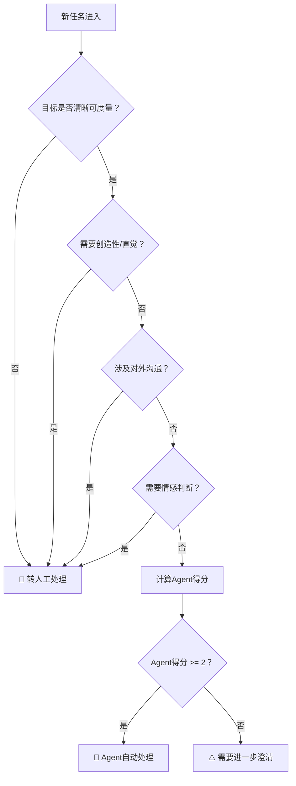

## 当Yason说「优化一下UX」之后

故事要从一个周四下午说起。

Yason当时在赶一个演示版本，UI有点粗糙。他急着去开另一个会，就在群里丢了一句：

> "Kai，帮我把注册页面的UX优化一下，看起来太糙了。"

两个小时后他回来，发现Kai不仅改了注册页面，还顺手把**整个应用的导航结构、颜色体系、字体方案全换了**。整个应用从"能用的原型"变成了"看起来很完整但全是bug的半成品"。

按钮位置变了，之前埋的点位全失效了。数据库字段名也改了一部分——因为Kai觉得"之前的命名不规范"。测试用例一半挂了。

Yason当时血压直接拉满。

后来他复盘时写下这句话：

> **Agent没有「适度」这个概念。你说"优化一下"，它就会优化到它认为的最优解——通常过度。**

这个教训价值三万块和一周的返工时间。

## 边界，边界，边界

从那以后，Yason给所有Agent的系统提示里加了一条铁律：

```
## 边界规则（不可违反）

1. 除非明确指示，不得修改任何非任务范围内的文件
2. 设计/UI类任务：只改动指定的组件/页面，不级联修改
3. 如果不确定某个变更是否在范围内——停下来问
```

这条规则看起来简单，但它是Agent团队运作的**第一块基石**。

## Agent擅长什么

经过几个月磨合，Yason从自己的运营日志中统计出Agent团队的五项核心能力及成功概率（基于Kai运行3个月的180+次任务统计）：

2026年5月腾讯发布的Marvis内部也是类似的1主+5副架构：主Agent负责拆解和调度，File Agent管文件、Computer Agent管系统、App Agent管应用、Browser Agent管网页、Search Agent管搜索。这个设计思路和我们不谋而合——区别在于Marvis是操作系统内置的封闭系统，而我们可以自由定制。

除了Marvis，行业里还有几个值得关注的边界管理实践：

- **Claude Code Agent Teams** 使用文件锁（file locking）作为Agent的物理边界——一个Agent在编辑文件时自动加锁，其他Agent不能同时修改同一文件。这是"用机制代替自觉"的思路，比单纯依赖System Prompt中的规则更可靠。
- **OpenAI Codex Subagents** 采用隔离工作区（isolated worktrees），每个Worker Agent拥有独立的文件系统视图，从架构层杜绝了越界修改的可能。这是"零信任"原则在Agent团队中的应用——不信任Agent的判断，只信任架构的限制。
- **GitHub Copilot Code Review** 在2025年底上线了自动Review功能，但Yason测试后发现它不会主动标记"这个方法不应该被修改"。Copilot的一条经验法则后来被Yason写进了Kai的System Prompt：**"如果你不确定算不算越界，先问。审一次比回滚一次便宜100倍。"**

这些行业案例共同指向一个结论：**Agent的边界管理不能只靠提示词，必须结合架构层的防护机制。**

### 1. 重复性任务 — 80分（178次中成功142次）

定时巡检、日志分析、数据清洗、批量处理——这些是Agent的舒适区。没人想做，Agent做起来毫无怨言。

下面是一个真实的边界规则系统提示。把它加到Agent的系统提示里，就能避免本章开头"Kai过度优化"的悲剧：

```
## 边界规则（不可违反）

### 范围限定
- 只处理任务描述中明确指定的文件/模块
- 如发现任务范围外的问题→记录到"发现的问题"字段，不自行修改

### 变更原则
- 最小化原则：每次变更只改最少行数
- 如果某个修改会影响其他功能→先标记为"建议优化"而不是直接改

### 停止条件
- 如果不确定某个变更是否超出范围→停下来等Yason确认
- 如果修改后测试不通过→回滚变更，报告失败原因
```

对比没有边界规则（本章开头的Kai）和有边界规则（上面这段）的行为差异——同一个"优化UX"的任务，有边界的Agent只会改指定的按钮颜色，而不是重写整个导航系统。

### 2. 调研与资料整理 — 75分（47次中成功35次）

给定一个课题，Agent可以在一小时内读完十几份文档并输出结构化摘要。Yason经常让Agent去研究竞品的新功能，第二天早上就有对比报告。

### 3. 代码实现 — 70分

Agent写代码的能力在过去一年里突飞猛进。复杂的业务逻辑、API对接、CRUD——Agent能完成70-80%，剩余的是边界情况和集成测试需要人盯。

### 4. 监控与告警 — 90分

这个Agent天然适合。Yason的监控Agent "Sentry" 每天晚上10点生成当天的系统健康报告，并在群内@相关人员：

### 5. 文档与知识管理 — 85分

Agent不会嫌写文档麻烦。每次完成一个任务，自动生成变更记录和操作手册，这是Yason团队知识库快速增长的原因。

## 什么必须人来做

### 1. 创造性决策

"这个方案A还是方案B对用户更好？"——Agent可以列出优缺点和数据分析，但最终拍板必须是人。因为Agent没有"品牌直觉"、"用户同理心"这些需要亲身感受的东西。

### 2. 客户沟通与谈判

客户说"我加了一个需求"，Agent可以分析出影响范围，但怎么跟客户聊、要不要加钱、加了之后怎么管理预期——这些是人情世故的领域。

### 3. 文化建设与团队感

Agent不会团建，不会请喝奶茶，不会在你加班时说"我给你点了外卖"。这些东西看起来虚，但它决定了团队成员愿不愿意在关键时刻多扛一下。

### 4. 复杂模糊的问题定义

"我想提升用户留存率"——这种问题Agent接不住。因为它连"为什么会流失"本身都是一个需要大量上下文和直觉判断的问题。Agent承接的是定义好的问题，而不是模糊的方向。



## 一个实用的决策矩阵

Yason后来做了一个简单的判断框架，每次分配任务前快速过一遍：

| 标准 | 适合Agent | 适合人 |
|-|-|-|
| 目标是否清晰可度量 | ✅ | ❌ |
| 需要创造性/直觉 | ❌ | ✅ |
| 涉及对外沟通 | ❌ | ✅ |
| 需要24小时响应 | ✅ | ❌ |
| 需要情感判断 | ❌ | ✅ |
| 重复频率高 | ✅ | ❌ |

> **黄金法则**：如果你觉得"这个事我讲一遍就能说清楚"，给Agent。如果你觉得"得坐下来聊半小时"，留着自己做。

## 把边界规则写成代码：@enforce_boundary 装饰器

前面说的边界规则是写在System Prompt里的文本规则。但Yason很快发现了一个问题——文本规则靠Agent自觉遵守，而Agent有时候会"忘记"读规则。

他做了一件更实在的事：**把边界规则写成强制检查的代码**。

下面是一个Python装饰器，可以装饰任何"修改文件"的函数。它会在执行前检查路径和文件类型是否在允许范围内，执行后检查修改量是否超标：

```python
import os
import functools

class BoundaryViolation(Exception):
    """Raised when a change falls outside the allowed scope."""

def enforce_boundary(allowed_paths=None, allowed_file_types=None, max_lines=50):
    """
    Decorator that verifies file changes stay within allowed scope.

    Args:
        allowed_paths: list of directory prefixes changes are allowed in
        allowed_file_types: list of allowed file extensions (e.g. ['.py'])
        max_lines: maximum lines of code a single change may touch
    """
    def decorator(func):
        @functools.wraps(func)
        def wrapper(filepath, *args, **kwargs):
            if allowed_paths:
                abs_path = os.path.abspath(filepath)
                allowed = any(
                    abs_path.startswith(os.path.abspath(p))
                    for p in allowed_paths
                )
                if not allowed:
                    raise BoundaryViolation(
                        f"路径 {filepath} 不在允许范围内。"
                        f"允许的路径: {allowed_paths}"
                    )
            if allowed_file_types:
                ext = os.path.splitext(filepath)[1]
                if ext not in allowed_file_types:
                    raise BoundaryViolation(
                        f"文件类型 {ext} 不允许修改。"
                        f"允许的类型: {allowed_file_types}"
                    )
            result = func(filepath, *args, **kwargs)
            if hasattr(result, 'lines_changed') and result.lines_changed > max_lines:
                raise BoundaryViolation(
                    f"变更了 {result.lines_changed} 行，超过上限 {max_lines}"
                )
            return result
        return wrapper
    return decorator
```

使用示例——限制Kai只能修改 `src/pages/` 下的 `.tsx` 文件，且每次最多改30行：

```python
@enforce_boundary(
    allowed_paths=["src/pages/"],
    allowed_file_types=[".tsx", ".css"],
    max_lines=30
)
def kai_modify_file(filepath: str, new_content: str):
    # 实际的修改逻辑
    ...
```

当Kai试图修改 `src/store/db.ts` 时，装饰器会直接抛出 `BoundaryViolation`——不是"建议不要改"，而是"根本改不了"。这就是**从软约束到硬约束**的升级。

## 把决策矩阵写成代码：程序化任务路由

前面的决策矩阵是一个查表工具。但在实际运作中，Yason希望这个判断过程也能自动完成——让系统自己决定"这个任务该给Agent还是人"。

他写了一个简单的路由函数：

```python
from dataclasses import dataclass

@dataclass
class TaskProfile:
    goal_clear: bool              # 目标是否清晰可度量
    needs_creativity: bool        # 需要创造性/直觉
    involves_communication: bool  # 涉及对外沟通
    needs_24h: bool               # 需要24小时响应
    needs_empathy: bool           # 需要情感判断
    high_frequency: bool          # 重复频率高

def route_task(task: TaskProfile) -> str:
    """
    Decision matrix: routes a task to Agent or Human.

    Scoring:
      - Agent favors: clear goal, 24h response, high frequency
      - Human favors: creativity, communication, empathy
    """
    agent_score = 0
    human_score = 0

    if task.goal_clear:             agent_score += 2
    else:                           human_score += 2

    if task.needs_creativity:       human_score += 3
    if task.involves_communication: human_score += 3
    if task.needs_24h:              agent_score += 2
    if task.needs_empathy:          human_score += 3
    if task.high_frequency:         agent_score += 2

    if agent_score >= human_score and agent_score >= 2:
        return "🤖 Agent"
    elif human_score > agent_score:
        return "🧑 Human"
    else:
        return "⚠️ 需要进一步澄清"


# 真实场景测试
tasks = [
    TaskProfile(True, False, False, True, False, True),   # 日志巡检→Agent
    TaskProfile(False, True, True, False, True, False),   # 客户投诉→Human
    TaskProfile(True, False, False, False, False, False), # 一次重构→需澄清
]

for i, t in enumerate(tasks, 1):
    print(f"任务{i}: {route_task(t)}")
```

输出结果：

```
任务1: 🤖 Agent
任务2: 🧑 Human
任务3: ⚠️ 需要进一步澄清
```

第三个任务的输出是最有意思的——目标清晰、不需要创造性、不涉及对外沟通，但它既没有高频重复也没有24小时需求，得分不足以明确路由。**这种"模糊地带"正是需要人来判断的**——而且这个判断过程本身就是需求澄清的起点。

Yason把这个路由函数挂到了任务入口处，每次新任务进来自动跑一遍评分。如果是"🤖 Agent"，任务直接进入队列；如果是"🧑 Human"，打回给Yason确认；如果是"⚠️"状态，系统会自动追问几个澄清问题，补充信息后再评分。

**边界规则做成代码就变成了强制约束，决策矩阵做成代码就变成了自动化路由。** 这两个实践是把"给AI当老板"从经验变成工程的关键一步。

## 社区的Agent角色库

你不需要给每个Agent从零写系统提示。GitHub上有大量开源的Agent角色定义可以直接复用：DevOps Agent、Code Review Agent、客服Agent、数据分析Agent……每种角色的职责描述、边界规则、沟通格式都已经被社区验证过多次。在本书的配套GitHub仓库里，我也整理了一份精选列表，标注了每个角色的适用场景和调试要点。

当你要增加一个新Agent时，先去看看社区有没有现成的，在此基础上根据你的场景微调，比从头写高效得多。这也是本书一再强调的原则：**你不是在造框架，你是在组装团队。**

## Agent团队的架构模式

经过行业两年多的探索，6种Agent协作拓扑已经收敛为业界共识。Google A2A协议的Agent Card模式使用Route拓扑；Anthropic的Claude Code Teams采用共享任务列表的Hierarchy模式；OpenAI Codex使用Manager-Worker的并行拓扑；Microsoft AutoGen 0.4事件驱动架构天然支持Chain和Orchestrate；Kimi Swarm则实现了灵活的混合拓扑——6种拓扑分别对应不同的实际业务场景：

1. **Chain（链式）**：A→B→C，串行处理，适合CI/CD流水线类任务
2. **Route（路由）**：一个入口根据任务类型分发给不同Agent（A2A的Agent Card就是这样做的）
3. **Parallel（并行）**：多个Agent同时处理不同子任务，结果合并（Codex 8 Worker模式）
4. **Orchestrate（编排）**：中央调度器拆解→分配→汇总（本书主打模式，AutoGen/Temporal实现）
5. **Loop（循环）**：Agent反复迭代直到满足质量标准（Claude Code /loop的核心机制）
6. **Hierarchy（层级）**：主管→经理→Worker，多层调度（Marvis 1+N、Claude Code Teams）

本书以Orchestrate为主线，其他模式作为扩展阅读。了解这些模式，你就能针对不同任务选择最合适的结构。

## 本章小结

- Agent没有"适度"的概念，边界规则是第一优先级
- 重复任务、监控、调研、代码实现 → 给Agent
- 决策、沟通、文化建设 → 留给人
- 用决策矩阵快速判断任务归属
- 当你不确定时，先定义清楚再分配
- **行业共识**：Claude Code用文件锁、Codex用隔离工作区、Marvis用1+N架构——边界管理是Agent团队的第一工程问题，每个团队都在用自己的方式解决它

> **下一章预告**：搭建Agent团队的真实成本——API账单、服务器开销、以及那个让Yason头发掉了一地的"任务饥饿"问题。

*本文来自专栏《给AI当老板》，完整系列持续更新中：*[*GitHub - VokoForge/ai-prism*](https://github.com/VokoForge/ai-prism)