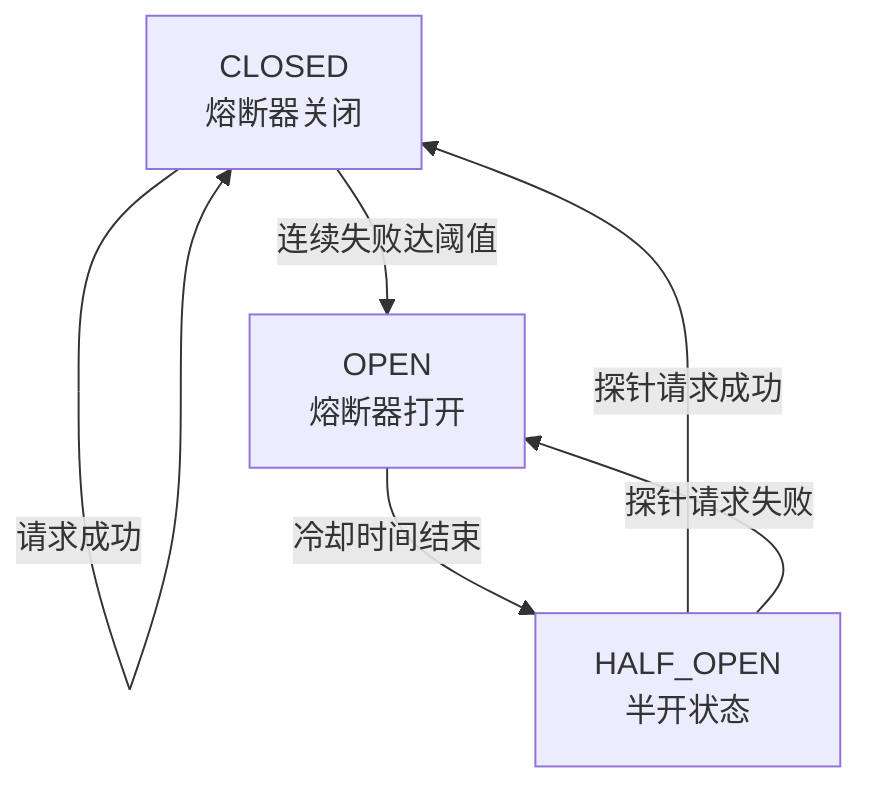

## 当你的API Key「爆」了

Yason永远不会忘记那天。

周末他在外面吃饭，手机突然疯狂震动——Rex服务器上的一个Agent「qclaw」一直在报错。他打开终端一看，**qclaw绑定的API Key余额用完了，但Agent并不知道自己没钱了**。

它做了什么呢？

它一直在重试。每30秒一次。每小时120次。从凌晨3点到中午12点——整整9个小时，几千次失败请求。

更离谱的是，Yason明明在凌晨4点在群里发了消息说"qclaw先停掉"，但Agent没有读到那条消息。因为没有人把它设计成去读群消息。

等到他发现的时候，账单已经从$50飙到了$230。

> **隐藏成本1：失败重试不是免费的。Rate limit、超时、认证错误——每次失败都在烧钱。**

这个Bug修复起来很简单：加一个熔断机制。下面是Yason事后加上的保护层，如果早一天加上就能省下\$180：



```python
class CircuitBreaker:
    """熔断器：防止Agent在失败时无限重试烧钱"""
    def __init__(self, max_retries=3, cooldown=300, budget_limit=50):
        self.max_retries = max_retries
        self.cooldown = cooldown       # 冷却时间（秒）
        self.budget_limit = budget_limit  # 单次任务预算上限（美元）
        self.failures = 0
        self.open = False

    def call(self, func, *args, **kwargs):
        if self.open:
            raise Exception("⛔ 熔断器已打开：请稍后重试")

        for attempt in range(self.max_retries):
            try:
                result = func(*args, **kwargs)
                self.failures = 0  # 成功后重置
                return result
            except (APIError, RateLimitError) as e:
                self.failures += 1
                if self.failures >= self.max_retries:
                    self.open = True
                    threading.Thread(target=self._cooldown).start()
                    raise Exception(f"熔断！连续失败{self.failures}次，等待{self.cooldown}秒")
                time.sleep(2 ** attempt)  # 指数退避

    def _cooldown(self):
        time.sleep(self.cooldown)
        self.open = False
        self.failures = 0

# 使用：breaker = CircuitBreaker(max_retries=3, budget_limit=50)
# result = breaker.call(api.chat.completions.create, ...)
```

但教训是深刻的——Agent的"坚韧"在没钱的场景下变成了"自杀式袭击"。

## 成本构成拆解

### 1. API调用费 — 最大头的显性成本

以Yason三台服务器（Rex、Robot、Neo）的配置为例，他用的混合模型策略：

| 模型 | 用途 | 成本/百万Token | 月均消耗(入/出) | 月费用(估算) |
|-|-|-|-|-|
| Claude Sonnet | 核心代码生成 | \$3 / \$15（入/出） | 100M入 + 20M出 | \~\$600 |
| GPT-4o | 复杂推理 | \$5 / \$15 | 40M入 + 20M出 | \~\$500 |
| 本地模型（DeepSeek） | 简单任务/格式化 | 电费 | \~500M tokens | \~\$50（电费） |
| Embedding模型 | 记忆检索 | \~\$0.13/1M | \~20M tokens | \~\$3 |

> 估算方法：Yason从API账单日志中统计的平均值。Claude Sonnet月均100M输入token（每次任务约8K输入×约12,500次调用），20M输出token（每次输出约1.6K），按$3/$15单价计算为\$600。GPT-4o同理。

来看2026年工业界的真实数据。Claude Code目前单人单session日均消耗约$13，3个并行Agent约$30-40/天，5-10个Agent舰队约\$50-130/天（CloudZero 2026年5月分析）。OpenAI Codex的token效率大约是Claude Code的4倍——同样的任务Codex消耗1.5M token，Claude Code消耗6.2M token（来源：morphllm.com 2026年2月Figma-to-code基准测试）。这意味着选择底层模型对你的月度账单有数倍的影响。

成本最大的隐藏杀手是上下文膨胀。Agent每执行一步，对话历史都会增长。一个简单的调研任务可能在50轮交互后消耗超过10万token。业界的解法是context compaction（上下文压缩）：当对话超过上下文窗口的70%时，让Agent自动总结中间结果，丢弃冗余的工具输出，只保留关键决策和未完成任务。Claude Code内置了auto-compact机制，OpenAI Codex使用tool output offloading（把大型工具输出存到外部存储，只在上下文中保留引用指针）。这两种做法我们都可以在搭建章节具体落地。

（以上数据来自CloudZero 2026年5月发布的AI Agent成本分析，是目前最公开的行业基准。）

**月均API总费用：约\$1,150/月**，按当时汇率约8,000人民币。

> 省钱技巧：把简单任务（格式化、提取、分类）路由给本地模型，能省60-70%的API费用。

配置示例——模型路由规则（JSON）：

```json
{
  "router": {
    "rules": [
      {
        "pattern": ".*code.*generate|.*implement.*",
        "model": "claude-sonnet-4",
        "priority": 1
      },
      {
        "pattern": ".*analyze|.*reason.*|.*debug.*",
        "model": "gpt-4o",
        "priority": 2
      },
      {
        "pattern": ".*summarize|.*format|.*extract|.*classify",
        "model": "local-deepseek",
        "priority": 3
      }
    ],
    "fallback": "local-deepseek",
    "circuit_breaker": {
      "max_retries": 3,
      "cooldown_minutes": 5,
      "budget_warning_at": 0.8
    }
  }
}
```

### 2. 基础设施费

| 项目 | 配置 | 月费用 |
|-|-|-|
| 海外服务器（Rex） | 8C/16G, 200G SSD | \~\$80 |
| 海外服务器（Robot） | 4C/8G, 100G SSD | \~\$40 |
| 国内服务器（Neo） | 4C/8G, 100G SSD | \~\$100 |
| 共享存储（记忆系统） | Git repo, 500MB | \$0 |
| 域名 + CDN | 2个域名 + 基础CDN | \~\$20 |

**月基础设施费用：约\$240/月，约1,700人民币。**

### 3. 时间投入 — 隐性成本

Yason每周在Agent团队上投入大约6-8小时：

- Prompt调优和迭代：2-3小时
- 审核Agent产出：2小时
- 修复Agent搞砸的东西：1-2小时
- 设计和分配新任务：1小时

按他的时薪折算，这部分大概值3000-5000元/月。

## 那个让人头秃的「任务饥饿」

Agent没有任务的时候，它是闲置的。闲置意味着两件事：

1. 你还在为它付API钱（心跳检测、连接保持、状态同步）
2. 它不会主动找事做——除非你配置了"主动建议"机制

Yason有一次去休假三天，回来发现有三个Agent已经**超过10小时没有收到任何任务**。它们就那么干等着。配置的CPU在空转，Token在空耗，而Yason在沙滩上喝椰子水。

后来他在Agent系统提示里加了一条：

```
## 主动建议

如果你连续超过2小时没有收到新任务：
1. 检查当前所有项目的状态
2. 识别潜在的改进点或未完成项
3. 向Yason发送一条"主动建议"消息（格式：建议标题 + 原因 + 预估工作量）
4. 等待确认后再执行
```

这条规则让Agent从"等待指令的打工仔"变成了"会发现问题并提建议的伙伴"。

> **隐藏成本2：Agent不会主动找事做，除非你明确告诉它可以。**

## 总成本汇总

| 成本项 | 月均费用 |
|-|-|
| API调用（混合模型） | \~8,000元 |
| 基础设施 | \~1,700元 |
| 时间投入（折算） | \~4,000元 |
| 合计 | \~13,700元 |

3个Agent，每人（每个Agent）成本约4,500元/月。对比雇一个初级工程师的最小成本（15,000元+社保），**Agent成本约是人的1/3**。

## 开源工具帮你省钱

社区里已经有大量开源的Agent成本优化工具，不需要自己造：

- **OpenRouter**：一个API网关，自动在40+模型提供商之间路由请求，根据价格和性能自动选择最优模型
- **LiteLLM**：统一接口对接100+模型，切换提供商只需改一行配置
- **Helicone / Portkey**：开源的成本监控和日志追踪，实时看每个Agent花了多少钱
- **context-compactor**：开源库，自动管理上下文窗口，到80%阈值自动压缩

这些工具可以帮你省掉大量的开发和调优时间。记住：**成本控制这件事，社区已经帮你踩了很多坑。**

## 省钱锦囊

1. **本地模型兜底**：简单任务不要走付费API
2. **熔断机制**：失败3次以上必须停等，不要无限重试
3. **共享记忆库用Git**：一个私有仓库托管所有Agent的记忆文件，零成本
4. **定时任务定时器**：非工作时间让Agent进入低功耗模式（仅检查关键告警）

## 本章小结

- Agent团队月成本约1.4万，是同等人力成本的1/3
- API调用是最大头，用好模型路由能省60%+
- 失败重试是隐藏杀手，必须配熔断机制
- Agent不会主动找事做——给它"主动建议"权
- 算清楚成本再做，别让惊喜变成惊吓

> **下一章预告**：选定你的第一个Agent——从零开始，怎么选、怎么配、怎么让Agent开始干活的完整路线图。

*本文来自专栏《给AI当老板》，完整系列持续更新中：*[*GitHub - VokoForge/ai-prism*](https://github.com/VokoForge/ai-prism)

---

---

