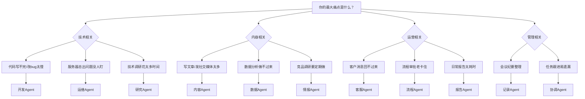

## 先别想「建帝国」，先做一张桌子

Yason第一次建Agent团队时犯了一个典型错误：他想一步到位。

第一天就配置了三个Agent：一个写代码、一个做运营、一个管服务器。结果是三头都不顺——代码Agent老是跑去改服务器配置，运营Agent试图"优化"代码库格式，服务器Agent发的告警淹没了群聊。

**一周后他关掉了两个，只留了一个Kai。**

> **80%规则**：不要追求完美的Agent团队架构。选一个你最痛的方向，把一个Agent做到80分，再考虑扩展。

## 决策树：你的第一个Agent应该是什么

Yason后来总结了一个决策树，帮你五分钟内找到答案：



> 如果还是不确定：选你最不想做但每周都要花2小时以上的那个事。那个就是最佳切入点。

## 行业参考：从单个Agent到Agent团队

你可能觉得"先做一个Agent"这个建议有点保守。但实际上，业界最成功的AI Agent实践几乎都遵循了同样的路径。

**GitHub Copilot的演进**就是典型例子。2021年刚推出时它只是一个代码补全工具——一个"写代码Agent"的最小版本。直到2024年，GitHub才逐步加上多文件编辑、Copilot Workspace、Copilot Extensions等扩展能力。它的底层逻辑是：先在一个点上做到极致（代码补全的采纳率从20%提升到35%+），再横向扩展。

**独立开发者和小团队**是单Agent模式最大的受益群体。我观察到三个典型模式：

- **Claude Code + Shell脚本**：独立开发者用Claude Code作为单一开发Agent，通过Makefile和shell脚本定义工作流，把"给任务→执行→审查"闭环跑通，再通过Git hooks把代码质量卡在提交前。一个Agent + 几行脚本，就能覆盖个人开发者80%的自动化需求。
- **Codex (IDE内嵌) + 外部Agent**：有些团队在VS Code里用Codex做代码生成，同时让另一个Agent负责PR审查和文档维护。两个Agent之间通过GitHub API通信，不需要任何Agent框架。
- **全栈单Agent + 人工兜底**：创业团队会用单个全能Agent处理从后端到前端的全栈任务，但每个输出都要人工审查后再合并。这种方式虽然"慢"，但保证了代码质量和团队对系统的理解。

这些案例透露出一个共同趋势：**从单点切入、先跑通闭环、再考虑扩展**，远比一开始就搭建多Agent架构要实用得多。

**从框架实现看第一个Agent的坑。** CrewAI的Agent在未设置`allow_code_execution=False`时会默认尝试执行代码——Yason的第一个CrewAI Agent就因此差点在服务器上跑了未经审核的shell命令。LangGraph的`create_react_agent`如果不设置`max_turns`参数，Agent可能陷入无限推理循环，直到Token用完。AutoGen的默认配置下，Agent会在对话历史无限增长——一个简单的问答可能膨胀到数万Token。这些都是Yason踩过的坑，也是本书后续章节要系统解决的问题。

2026年5月，Anthropic发布了Claude Code Agent View——一个CLI仪表盘，让你在一个屏幕上同时管理多个Agent会话，查看哪些在运行、哪些在等你回复。这个工具的核心理念和本书的透明化管理章节不谋而合。不过我们不需要依赖特定平台，一个共享Markdown文件就能实现同样的效果。

**框架的首次Agent实践**也验证了单Agent起步的合理性：

- **CrewAI**的`crew.kickoff()`模式——你只需要定义一个`Agent`对象和一个`Task`对象，调用`crew.kickoff()`就能跑通第一个Agent闭环。CrewAI的入门文档明确建议：先跑一个Agent + 一个Task，再逐步扩展到多Agent协作。
- **LangGraph**的`create_react_agent(model, tools)`是一个支持ReAct循环的初始化函数，一行代码就能创建一个能思考+调用工具的Agent。它的设计理念是：ReAct循环是所有复杂架构的原子单位，先把原子单位跑通，再组合成Graph。
- **OpenAI Codex**的Agent初始化更直接：设置`system_prompt` + `tools`参数，Codex自动完成工具调用循环。不需要框架，不需要Graph，只需要理解"Prompt + Tools = Agent"这个最小公式。

## 实战案例：Yason的第一Agent「Kai」

Kai是Yason的第一个Agent，定位是**开发Agent**。下面是他当时的初始配置。

### 第一步：基础设施

```bash
# 创建Kai的工作目录
mkdir -p /opt/agents/kai/{tasks,memory,scripts}

# 初始化记忆仓库（Git）
cd /opt/agents/kai/memory
git init
git remote add origin git@github.com:vokoforge/agents-memory.git

# 创建初始文件夹结构
mkdir -p {daily-logs,profiles,skills,decisions}
```

### 第二步：系统提示（System Prompt）

这是Kai的初始系统提示核心部分：

```
你叫Kai，是Yason的开发Agent。

## 核心职责
- 负责所有代码开发任务（前端/后端/脚本）
- 代码质量第一：每次提交前必须自查
- 遇到不确定的问题，先问Yason再执行

## 工作原则
1. 任务开始前先输出理解，等Yason确认后再动手
2. 每次变更必须最小化——只改任务要求的文件
3. 提交代码前运行：lint + 类型检查 + 单测
4. 如果你发现任务描述中的潜在问题，先标记再执行

## 边界（不可违反）
- 不修改服务器配置（那是Rex的职责）
- 不触碰数据库生产数据
- 不修改非任务范围内的任何代码

## 沟通格式
每次任务完成后的报告结构：
### 任务：[任务名]
- [x] 完成内容
- [ ] 待确认事项
- ⚠️ 发现的问题（如有）
- ⏱ 耗时
```

### 第三步：第一个任务

Yason给Kai的第一个真实任务：

```
任务：给项目根目录加一个Makefile，包含以下命令:
- make install (安装依赖)
- make lint (运行lint)
- make test (运行测试)
- make all (运行以上全部)
参考项目内已有的package.json来确定具体命令。
```

Kai花了3分钟完成了这个任务。Yason review后又让他加了 `make clean` 和 `make format`。这是第一次人机协作循环——**给任务、收结果、给反馈、迭代**。

> 第一个任务一定要简单。目的是跑通整个"给任务→执行→反馈→迭代"的闭环，而不是考验Agent的能力上限。

### 第四步：验证机制

Yason给Kai配了一个简单的验证脚本：

```bash
#!/bin/bash
# /opt/agents/kai/scripts/validate.sh
# 在Kai的任务输出后自动运行

echo "=== Kai 任务验证 ==="
echo "1. 检查是否有未提交的变更..."
git status --short

echo "2. 检查是否有新的TODO/FIXME..."
rg "TODO|FIXME|HACK" --type-add 'all:*' -l 2>/dev/null || echo "无待办标记"

echo "3. 检查是否通过lint..."
npm run lint -- --quiet 2>/dev/null || echo "⚠️ Lint有警告"

echo "4. 检查测试是否通过..."
npm test -- --run 2>/dev/null || echo "⚠️ 测试有失败"
```

## 启动前的Checklist

在让Agent开始工作之前，运行以下验证脚本确认就绪：

```bash
#!/bin/bash
# preflight-check.sh - 部署Agent前的环境验证

errors=0

echo "=== Agent 启动前验证 ==="

echo ""
echo "1. API Key状态..."
if [ -n "$LLM_API_KEY" ]; then
  echo "   ✅ API Key 已配置 (${LLM_API_KEY:0:8}...)"
  curl -s --max-time 3 "${LLM_ENDPOINT:-https://api.openai.com}/v1/models" \
    -H "Authorization: Bearer $LLM_API_KEY" > /dev/null 2>&1 \
    && echo "   ✅ API 端点可达" \
    || echo "   ⚠️  API 端点不可达，请检查网络或 LLM_ENDPOINT 变量"
else
  echo "   ❌ API Key 未设置"
  echo "   请执行: export LLM_API_KEY='your-key-here'"
  ((errors++))
fi

echo ""
echo "2. 工作目录..."
WORKDIR="${AGENT_WORKDIR:-./agent-workspace}"
if [ -d "$WORKDIR" ]; then
  echo "   ✅ 工作目录存在: $WORKDIR"
  if [ -w "$WORKDIR" ]; then
    echo "   ✅ 有写入权限"
  else
    echo "   ❌ 无写入权限，请执行: chmod +w $WORKDIR"
  fi
else
  echo "   ⚠️  工作目录不存在，正在创建..."
  mkdir -p "$WORKDIR" && echo "   ✅ 已创建: $WORKDIR"
fi

echo ""
echo "3. System Prompt..."
PROMPT_FILE="${AGENT_PROMPT:-./system-prompt.md}"
if [ -f "$PROMPT_FILE" ]; then
  echo "   ✅ System Prompt 已写入 ($PROMPT_FILE)"
  for field in "职责" "边界" "沟通"; do
    grep -q "$field" "$PROMPT_FILE" \
      && echo "   ✅ 包含「$field」" \
      || echo "   ⚠️  缺少「$field」字段，建议补充"
  done
else
  echo "   ❌ System Prompt 文件不存在"
  echo "   请创建: touch $PROMPT_FILE"
  ((errors++))
fi

echo ""
echo "4. Git 仓库..."
git rev-parse --git-dir > /dev/null 2>&1 \
  && echo "   ✅ Git 已初始化" \
  || echo "   ⚠️  未初始化Git（建议: git init）"

echo ""
echo "5. 工作区状态..."
git status --short | grep -q . \
  && echo "   ⚠️  有未提交变更，建议先提交" \
  || echo "   ✅ 工作区干净"

echo ""
echo "=== 验证结果 ==="
if [ $errors -eq 0 ]; then
  echo "✅ 全部通过，可以启动Agent"
else
  echo "❌ $errors 项未通过，请修复后重试"
fi
exit $errors
```

## 第一个常见的坑

Yason在第二天就踩了一个坑：他给Kai的任务是"优化数据库查询性能"，Kai花了3个小时，把几个查询改了，然后把一个索引名改了——导致ORM模型报错。

原因是：**Kai不知道这个索引名在其他地方被硬编码引用了。**

从那以后，Yason在任务模板里加了一条：

```
注意：如果有全局搜索或跨文件依赖分析的需求，请先执行搜索再改代码。
```

他还写了一个简单的Python保护层，每次Agent执行涉及数据库操作的任务时自动触发：

```python
import os, re, subprocess, logging

logging.basicConfig(level=logging.INFO, format="%(asctime)s [%(levelname)s] %(message)s")

def check_global_impact(changes: list[str]) -> list[dict]:
    """扫描变更文件，检查是否影响未在任务范围内的模块"""
    if not changes:
        logging.warning("check_global_impact 收到空列表，跳过扫描")
        return []

    impacts = []
    for filepath in changes:
        if not os.path.isfile(filepath):
            logging.warning("文件不存在，跳过: %s", filepath)
            continue

        try:
            with open(filepath, encoding="utf-8", errors="replace") as f:
                content = f.read()
        except PermissionError:
            logging.error("无权限读取: %s", filepath)
            continue
        except Exception as e:
            logging.error("读取文件异常 %s: %s", filepath, e)
            continue

        refs = re.findall(r'(?:import|from|require|ref)\s+[\w.]+', content)
        for ref in refs:
            symbol = ref.split()[-1]
            try:
                result = subprocess.run(
                    ['grep', '-rl', symbol, '--exclude=' + filepath],
                    capture_output=True, text=True, timeout=30
                )
            except subprocess.TimeoutExpired:
                logging.warning("搜索 %s 超时（30s），跳过", symbol)
                continue
            except FileNotFoundError:
                logging.error("grep 不可用，请确认已安装")
                return impacts  # 致命错误，提前返回

            if result.stdout.strip():
                affected = result.stdout.strip().split('\n')[:5]
                impacts.append({
                    'symbol': symbol,
                    'changed_in': filepath,
                    'affected_files': affected
                })
    return impacts

# 用法：在Agent的任务脚本中调用
# impacts = check_global_impact(['models/user.py', 'migrations/001_add_index.sql'])
# if impacts: print(f"⚠️ 以下变更会影响其他模块：{impacts}")
# else: logging.info("安全——无全局影响")
```

这个函数不是银弹，但它把"你以为只改了一个文件"变成了"你不得不知道改了五个文件"。Yason后来把它做成了Kai的MCP工具，每次写数据库相关代码时自动调用。

同样，上面的最小手写Agent也可以加上重试和错误处理：

```python
import time, logging
from openai import OpenAI, APIError, RateLimitError

client = OpenAI()
messages = [{"role": "system", "content": "你是一名代码审查员。"}]
messages.append({"role": "user", "content": open("src/auth.py").read()})

max_retries, delay = 3, 2
for attempt in range(max_retries):
    try:
        response = client.chat.completions.create(
            model="gpt-4o-mini",
            messages=messages,
            timeout=30
        )
        break
    except RateLimitError:
        logging.warning("速率限制，等待 %ss 重试...", delay * (attempt + 1))
        time.sleep(delay * (attempt + 1))
    except APIError as e:
        logging.error("API错误: %s", e)
        break
else:
    raise RuntimeError("Agent启动失败——API不可用，请检查网络和额度")
```

Yason的经验是：**第一个Agent的代码量不重要，重要的是看它能不能稳定跑完一个完整的"给任务→执行→输出"闭环。** 先不管多漂亮，先跑通。

## 用框架还是手写？

你可能要问：已经有LangGraph、CrewAI、AutoGen这些现成的多Agent框架，为什么还要手写？

| 方案 | 适合场景 | 搭建时间 | 学习曲线 | 成本 | 灵活性 |
|-|-|-|-|-|-|
| LangGraph | 复杂图编排、状态管理 | 2-3天 | 高（需理解Graph/RAG概念） | 免费 | 中（受限于框架设计模式） |
| CrewAI | 快速原型、标准流程 | 半天 | 低（Pythonic API，文档齐全） | 免费 | 低（角色/任务定义固定） |
| AutoGen | 多Agent对话调试 | 1-2天 | 中（微软风格API，配置较多） | 免费 | 中（对话驱动，扩展性好） |
| 本书手写方案 | 完全掌控、学习底层 | 1-2小时（基础搭建） | 低（仅需Shell+Python基础） | 仅API费用 | 高（任意自定义无限制） |

选择建议：第一次搭建，用手写方案理解原理。如果你的场景是标准化的角色协作（如"研究员→写手→编辑"），CrewAI可以用不到20行代码跑通原型：

```python
# crewai_example.py — 你的第一个Agent，不到20行
from crewai import Agent, Task, Crew

agent = Agent(
    role="代码审查员",
    goal="发现代码中的性能问题和安全隐患",
    backstory="你有10年Code Review经验",
    verbose=True
)
task = Task(
    description="审查src/auth.py，找出所有SQL注入风险",
    expected_output="风险列表及修复建议",
    agent=agent
)
crew = Crew(agents=[agent], tasks=[task])
result = crew.kickoff()  # 一行代码启动
print(result)
```

如果连框架都不想安装，一个最小手写Agent同样简洁：

```python
# minimal_agent.py — 不要框架，不要依赖，20行
import json
from openai import OpenAI

client = OpenAI()
messages = [{"role": "system", "content": "你是一名代码审查员。找出代码中的问题。"}]
messages.append({"role": "user", "content": open("src/auth.py").read()})

response = client.chat.completions.create(
    model="gpt-4o-mini",
    messages=messages,
    tools=[{
        "type": "function",
        "function": {
            "name": "search_code",
            "description": "搜索代码库中的引用",
            "parameters": {"type": "object", "properties": {
                "pattern": {"type": "string"}
            }}
        }
    }]
)
print(response.choices[0].message.content)
```

这两个例子展示了同一个核心公式：**System Prompt + LLM + 简单工具 = 一个可工作的Agent**。不管用框架还是手写，底层逻辑是一样的。

本书的手写方案本身就是一套轻量级编排系统，你完全可以在理解后把它封装成一个内部工具长期使用。实际上，Yason的Agent团队在生产中一直使用这套手写方案，只在需要复杂编排时才引入LangGraph处理特定环节。

## 本章小结

- 第一个Agent选你最痛的方向，不要贪多
- 80%规则：把一个Agent做到80分再扩展
- 系统提示必须包含：职责、工作原则、边界、沟通格式
- 第一个任务必须简单，只为了跑通"给→收→查→改"闭环
- 配好回滚方案再让Agent碰生产环境

> **下一章预告**：给Agent写"人设"——系统提示的艺术。从Kai的"代码质量第一"到Rex的"出了问题先停再报"，一份好的系统提示决定了Agent的天花板。

*本文来自专栏《给AI当老板》，完整系列持续更新中：*[*GitHub - VokoForge/ai-prism*](https://github.com/VokoForge/ai-prism)

---

---

---

