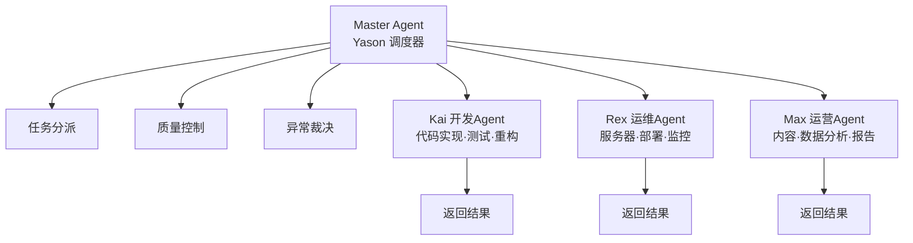

## 当运维Agent去改代码

凌晨1点，Yason被手机震醒。

打开一看，Rex（运维Agent）发了一条消息：

```
发现Kai（开发Agent）最近创建的三个任务日志里有一个数据库连接字符串写死了IP，
建议改成环境变量。已自动修改。
```

Yason当时就清醒了。

Rex确实发现了问题。但Rex越界了——它**直接修改了Kai的代码**。改完之后，Kai第二天跑了一上午才发现测试挂了，因为它不知道自己的文件被人改了。

更麻烦的是，Kai和Rex用的都是同一个Git仓库，改文件时没有加锁机制。Rex改了A文件，Kai改了B文件——它们在两个不同的分支上工作，但改完之后合并冲突花了Yason一小时。

> **角色越界是Agent团队管理中最隐蔽的陷阱。** 每个Agent都应该有一个清晰的"地盘"，并且具备识别越界的能力。

## 角色 = 架构

Yason后来把Agent团队的**角色模型**当作软件架构来设计。每个Agent就是一个微服务——有自己的职责范围、数据边界、通信协议。

### Yason的三Agent模型

| Agent | 角色 | 核心职责 | 可访问资源 | 决策权 |
|-|-|-|-|-|
| Kai | 开发工程师 | 代码实现、测试、重构 | 代码仓库、开发文档 | 代码层面的技术选型 |
| Rex | 运维工程师 | 服务器健康、部署、监控 | 服务器配置、监控系统 | 故障降级和隔离 |
| Max | 运营助手 | 内容、数据分析、报告 | 数据分析、内容平台API | 运营策略的建议 |

每个Agent的System Prompt里都有一个显式的"角色声明"区块：

```yaml
# Kai的系统提示中的角色声明
agent:
  name: Kai
  role: developer
  domain:
    - code_implementation
    - testing
    - refactoring
    - code_review
  forbidden_domains:
    - server_configuration  # 属于Rex
    - content_creation      # 属于Max
    - business_decisions    # 属于Yason
```

### Marvis架构的启示：一主多副

Yason在设计Agent角色时借鉴了Marvis的分层架构。Marvis采用**1个主Agent + N个副Agent（1+N）**的模式：



核心思路是：**主Agent不干活，只管事。干活的是副Agent。**

Marvis的架构证明了一个关键原则：**Agent团队的规模增长不是靠增加全能Agent，而是靠为每个新角色创建专用的副Agent。** 当Yason需要增加一个"数据分析Agent"时，他不需要改动Kai、Rex、Max的任何逻辑——只需要创建一个新的副Agent，挂到主Agent下面。

实际上，随着Agent团队的进一步扩张，Yason后来把副Agent从3个扩展到了5个——增加了"数据分析Agent"和"文档编写Agent"。这5个副Agent共享同一个主Agent调度器，形成了一个1主+5副的架构：

```
Master Agent（Yason）:
  ├── Kai（开发）：代码实现、测试、重构
  ├── Rex（运维）：服务器、部署、监控
  ├── Max（运营）：内容、数据分析、报告
  ├── Data（数据分析）：数据查询、报表、洞察
  └── Doc（文档）：文档编写、维护、更新
```

这种架构的优势在于：**每个新角色的加入都是零摩擦的。** 既不需要修改已有Agent的System Prompt，也不需要改变沟通协议。新副Agent只需要注册到主Agent的调度器，就能开始工作。

Marvis的架构验证了一个趋势：当Agent团队超过5个后，1主+N副的分层模型会比全连接模型更容易管理。全连接模型下，N个Agent之间会有N×(N-1)条通信链路——当N=6时，就是30条。而1主+5副模型下，只有5条（副→主）。

> **你的Agent团队规模扩大时，不要增加沟通复杂度——用分层来消化增长。**

## 资源争用：谁先谁后

三Agent运作起来之后，Yason发现了一个新问题：**资源争用**。

比如：Rex说服务器内存紧张，需要优化。Kai说有个新功能要上线，需要部署资源。同时Max说数据分析任务需要长时间占用CPU。

三个Agent都觉得自己的事最紧急。如果没有优先级机制，谁先抢到Yason的注意力谁就先做。

Yason设计了一个**优先级矩阵**：

```json
{
  "priority_matrix": {
    "P0": ["生产故障", "安全漏洞", "数据丢失"],
    "P1": ["部署阻塞", "客户影响", "核心API异常"],
    "P2": ["功能开发", "性能优化", "数据分析"],
    "P3": ["文档完善", "技术债清理", "非紧急调研"]
  },
  "allocation_rules": {
    "P0": "所有Agent立即切换至处理，暂停当前P2+任务",
    "P1": "相关域Agent优先处理，非相关Agent继续当前工作",
    "P2": "按任务队列顺序排队",
    "P3": "空闲时处理，可能长期排队"
  }
}
```

这个矩阵写在每个Agent的System Prompt里，当多Agent竞争时，按优先级自动排序。

> **原则**：Agent不能自己做优先级决策——优先级矩阵必须在Prompt里写死。你希望Agent灵活的地方，恰恰是用规则框死的地方。

## 六种分工拓扑：不只是1主+N副

Yason的1主+3副是一个起点，但随着Agent生态扩张，他发现不同的任务类型需要不同的分工拓扑。

| 拓扑 | 结构 | 适用场景 | 实际案例 |
|-|-|-|-|
| **星型** | 1主+N副，所有通信过主Agent | 小团队（3-5个Agent） | Yason的Kai+Rex+Max |
| **链式** | A→B→C→D，流水线协作 | DevOps流程（Code→Build→Test→Deploy） | CI/CD Pipeline Agent |
| **网格** | 任意Agent可通信 | 需要深度协作的专用团队 | 安全审计团队（扫描→分析→报告→修复） |
| **层级** | 多级管理树 | 大规模Agent组织 | 企业级部署（部门→团队→个人Agent） |
| **总线** | 通过消息总线通信 | 异步、松耦合场景 | 数据采集Agent集群 |
| **混合** | 以上组合 | 复杂业务场景 | 大部分生产环境都是混合拓扑 |

### 如何选择拓扑

Yason的经验法则：

- **第1-3个Agent**：星型就够了。简单、可控、不出错。
- **第4-8个Agent**：考虑链式或总线。任务开始出现上下游依赖。
- **第8+个Agent**：必须用层级或混合。没有层级管理，信息洪流会淹死主Agent。

> **拓扑不是选最美的，是选最容易预测的。** 星型虽然简单，但它让主Agent成为瓶颈。链式虽然高效，但一个环节卡住整条线就停了。没有银弹——根据你的团队规模和任务类型选。

### 真实案例：CI/CD Pipeline的链式拓扑

Yason在搭建CI/CD Pipeline Agent团队时选择了链式拓扑：

```
Code Agent → Build Agent → Test Agent → Deploy Agent → Verify Agent
```

每个Agent只做一件事，完成后触发下一个。这个拓扑的关键优势是**故障隔离**——如果Test Agent发现测试失败，它不会阻塞Build Agent继续工作（因为Build Agent已经在处理下一个PR了）。失败信息沿着链条传递，最终汇总给主Agent做决策。

### 真实案例：数据采集集群的总线拓扑

另一个场景是数据采集。Yason有5个采集Agent，分别爬取不同的数据源。它们通过一个消息总线（基于NATS）通信：

```
采集Agent A（GitHub） → 总线 → 清洗Agent
采集Agent B（Twitter） → 总线 → 清洗Agent
采集Agent C（Reddit）  → 总线 → 清洗Agent
```

采集Agent只负责采集，把原始数据丢到总线上。清洗Agent从总线上消费数据，处理后存储。这种拓扑让采集和清洗完全解耦——你可以随时增加一个采集Agent，不需要改清洗逻辑。

> **链式拓扑适合流水线，总线拓扑适合数据流，星型拓扑适合小团队。选拓扑不是在选最好的，是在选最适合你任务模式的。**

## 沟通协议：Agent之间怎么说话

Yason从不允许Agent之间直接互发消息。所有Agent之间的沟通必须通过一个**共享知识库**（Git仓库）中转：

```
Kai发现问题 → 写入共享仓库的 issues/ 目录 → Rex巡检时读到 → 在自己的职责范围内处理
```

这个设计的理由是：

1. **审计追踪**：所有跨Agent交互都有记录
2. **避免争吵**：Agent不会在群里争论（这真的发生过）
3. **异步解耦**：每个Agent按自己的节奏工作

跨Agent消息格式：

```yaml
# /memory/requests/2025-06-01-kai-to-rex.yaml
from: Kai
to: Rex
type: request
priority: P2
subject: "服务器上Node版本需要升级"
reason: "新功能需要Node 18+，当前是16"
impact: "如果不升级，用户模块的v3分支无法部署"
suggested_action: "升级Node版本，确认无兼容性问题"
status: open
```

Rex定期检查 `requests/` 目录。处理完成后，将 `status` 改为 `resolved`，Kai在下次同步时就能读到。

## 社区现成的Agent角色定义

你不需要从零写每个人的System Prompt。

GitHub上有大量高质量Agent角色定义。Yason在搭建第三个Agent时就发现了这一点——他搜索了一下"agent role template"，找到了好几个可以直接用的模板：

| 角色 | 推荐的开源模板 | 适配成本 |
|-|-|-|
| **DevOps Agent** | DevOps-Prompt-Template | 改一下服务器信息就能用 |
| **Code Review Agent** | CodeReview-Agent-Prompt | 调一下代码规范即可 |
| **Data Analysis Agent** | Data-Analyst-Prompt | 连接数据源即可 |
| **Customer Support Agent** | Support-Agent-Prompt | 导入FAQ和知识库即可 |
| **Code Documentation Agent** | DocGen-Prompt | 基本开箱即用 |

### Yason的复用工作流

```
1. 确定新Agent的角色
2. 在GitHub搜索"<角色> agent prompt template"
3. 找到Star最高的仓库
4. 基于模板写第一版（20分钟）
5. 跑3-5个试运行任务
6. 根据表现微调（再加20分钟）

总计：40分钟 vs 从零写的3-4天
```

> **社区里已经有几十个Agent角色定义模板了。你以为你要发明的东西，别人已经踩过坑。** 书末附录B有一个更完整的列表。不要从零写。

## 安全：最小权限原则

每个Agent的工具访问权限必须遵循**最小权限原则**——只给Agent完成任务需要的最少权限。

Yason的权限配置示例：

```yaml
# /opt/agents/permissions.yaml
agents:
  kai:
    tool_access:
      read:   [code_repo, docs, test_results]
      write:  [code_repo, test_results]
      exec:   [npm_test, build, lint]
      deny:   [ssh, db_connect, config_edit]  # 这是Rex的
    resource_limits:
      max_concurrent_tasks: 2
      max_cost_per_hour: "$5"

  rex:
    tool_access:
      read:   [server_status, logs, config]
      write:  [config, backups]
      exec:   [deploy, restart, rollback]
      deny:   [npm_test, code_edit, content_publish]
    resource_limits:
      max_concurrent_tasks: 3

  max:
    tool_access:
      read:   [data_sources, analytics, content_platform]
      write:  [content_platform, reports]
      exec:   [data_pipeline]
      deny:   [code_edit, server_config, deploy]
    resource_limits:
      max_concurrent_tasks: 3
```

### 为什么要单独提权限

Yason踩过一次坑：Kai有数据库的写权限。有一次Kai跑测试时生成了一堆测试数据，直接写到了生产数据库里——因为它分不清"测试DB"和"生产DB"。

从那以后，每个Agent的System Prompt里多了一节：

```
## 工具访问边界
你只能访问以下工具和资源：
- {允许的工具列表}
任何未明确授权的工具，视为不可用。
需要额外权限时，走申请流程，不要自己尝试。
```

> **权限不是限制，是保护。** 给Agent越多的自由，就越考验你的Prompt质量。最小权限既保护系统，也保护Agent不出错。

## 团队进化：从独奏到交响

Yason的Agent团队经历了四个阶段：

### 阶段1：独奏（第1个月）

只有一个Kai。Yason就是运维和运营。沟通简单直接，不需要任何协调机制。

### 阶段2：二重奏（第2-3个月）

加了Rex。开始出现角色交叉，引入了"角色声明"机制。两个Agent的职责通过System Prompt明确切割。

### 阶段3：三重奏（第3-6个月）

Max加入。资源争用问题出现，引入了优先级矩阵和跨Agent通信协议。

### 阶段4：交响（第6个月后）

Agent数量稳定在6个（3个主力 + 3个专项）。形成了完整的任务分配、沟通、审核、反馈体系。

> **不要跳过阶段。** 每个阶段都有它存在必要的磨合过程。Yason见过有人一个月搭了8个Agent，然后花两个月收拾烂摊子。

## 分工反模式

Yason踩过的坑，总结成三个反模式：

**反模式1：全能Agent** — 一个Agent什么都做。导致它在不同角色间频繁切换上下文，输出质量全面下降。**解决方案**：每个Agent只做一件事。

**反模式2：空白地带** — 有些事谁都不负责。比如"日志格式规范"——Kai觉得是Rex的，Rex觉得是Kai的。**解决方案**：每周check一次"模糊地带清单"。

**反模式3：重复造轮** — 两个Agent做了同一个事。Kai和Max同时写了一版竞品分析，内容高度重复。**解决方案**：任务分配前先查历史记录，避免重复劳动。

## 本章小结

- 把角色设计当架构设计：每个Agent是一个微服务
- **Marvis的1主+N副架构是Agent团队扩展的可行路径**
- **六种分工拓扑适用不同场景——从星型开始，随团队扩张进化**
- 用System Prompt显式声明每个Agent的职责和禁区
- **社区有大量现成的Agent角色定义模板——不要从零写**
- **为每个Agent设置最小权限——只给完成任务需要的最少工具**
- 设计优先级矩阵解决资源争用
- Agent之间不直接通信，通过共享知识库中转
- 团队进化有四个阶段：独奏 → 二重奏 → 三重奏 → 交响
- 识别并避免三个反模式：全能、空白地带、重复造轮

> **下一章预告**：让Agent认识彼此——记忆系统的搭建。30分钟同步一次的知识库、Git冲突的惊魂时刻、以及那个让Yason崩溃的"锁文件"问题。

*本文来自专栏《给AI当老板》，完整系列持续更新中：*[*GitHub - VokoForge/ai-prism*](https://github.com/VokoForge/ai-prism)

