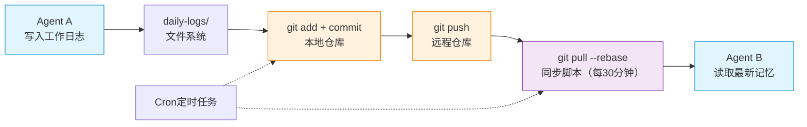

## 那个文件被同时编辑的夜晚

Kai和Rex在同一条时间线上工作了。

Kai在写 `daily-log/2025-06-15.md`，记录今天完成的两个代码任务。同时，Rex也在写同样一个文件，汇报今天处理了一次服务器告警。

结果可想而知——**后一个写入的覆盖了前一个**。

Kai的日志内容丢了。第二天Yason发现Kai在日报里说"完成了两个任务"，但日志里只记了Rex的那一条。

这不是Kai的问题，也不是Rex的问题。这是**没有共享记忆系统的后果**。

> Agent的工作记忆默认是隔离的。如果没有人主动设计共享，每个Agent都活在自己的世界里——这和几个人在一个项目里各写各的文档、各记各的事，没有任何区别。

## 共享记忆架构设计

Yason的方案听起来很朴素，但实际效果非常好：**一个Git仓库，所有Agent共享。**

```
/memory/
├── daily-logs/          # 每日工作日志
│   ├── 2025-06-15-kai.md
│   ├── 2025-06-15-rex.md
│   └── 2025-06-16-kai.md
├── profiles/            # Agent个人档案
│   ├── kai.yaml
│   ├── rex.yaml
│   └── max.yaml
├── skills/              # 技能文件
│   ├── deploy-flow.md
│   └── rollback-procedure.md
├── decisions/           # 决策记录（ADR）
│   ├── agent-routing-decision-001.md
│   └── model-select-002.md
├── requests/            # 跨Agent请求
│   └── 2025-06-16-kai-to-rex.yaml
└── knowledge/           # 共享知识
    ├── project-map.md
    └── common-issues.md
```



每个Agent在启动时都会加载整个记忆目录，并且知道：

- 哪些文件是自己的（写权限）
- 哪些文件是别人的（只读权限）
- 哪些文件是共享的（读写权限）

权限配置示例：

```yaml
# /memory/.access-rules.yaml
agents:
  kai:
    write:
      - daily-logs/kai-*.md
      - skills/*.md
      - requests/*.yaml
    read:
      - daily-logs/*
      - profiles/*
      - decisions/*
      - knowledge/*
  rex:
    write:
      - daily-logs/rex-*.md
      - decisions/*.md
      - knowledge/common-issues.md
    read:
      - daily-logs/*
      - profiles/*
      - skills/*
```

## Cron同步：每30分钟一次

记忆同步机制很直接——定时任务：

```bash
# 每30分钟同步一次记忆
*/30 * * * * /opt/agents/sync-memory.sh

# 每天凌晨归档前一天的日志
0 1 * * * /opt/agents/archive-logs.sh
```

同步脚本的核心逻辑：

```bash
#!/bin/bash
# /opt/agents/sync-memory.sh

MEMORY_DIR="/opt/agents/memory"
LOCK_FILE="/tmp/agent-memory-sync.lock"

# 防并发锁
if [ -f "$LOCK_FILE" ]; then
  echo "另一进程正在同步，跳过"
  exit 0
fi

trap 'rm -f "$LOCK_FILE"' EXIT
touch "$LOCK_FILE"

cd "$MEMORY_DIR"

# 拉取最新数据
git pull --rebase origin main

# 如果有Agent在本周期内写入了新内容，提交
if [ -n "$(git status --porcelain)" ]; then
  git add -A
  git commit -m "记忆同步 $(date '+%Y-%m-%d %H:%M')"
  git push origin main
fi
```

> **关键细节**：用 `git pull --rebase` 而不是 `git pull`。因为如果有冲突，rebase会让冲突暴露在同步脚本中，而不是让Agent去处理Git冲突——Agent处理Git冲突的能力非常差。

## 锁问题：两个Agent写同一个文件

Yason用了最简单的方案来解决并发写入问题：**按Agent分文件写入，而不是分目录**。

注意上面的文件名命名规则：`daily-logs/2025-06-15-kai.md`，每个Agent写自己的文件。如果Kai和Rax同时写日志，它们写的是两个不同的文件，永远不会冲突。

但如果确实需要共享写一个文件呢？比如 `knowledge/common-issues.md`，Kai和Rex都可能更新。

Yason的方案是——**指定一个"文件负责人"**：

```yaml
# /memory/.file-ownership.yaml
files:
  knowledge/common-issues.md:
    owner: rex                # Rex负责这个文件
    contributors: [kai, max]  # Kai和Max可以提交建议，但只能由Rex写入
  skills/deploy-flow.md:
    owner: kai
    contributors: [rex]
```

Agent在写入共享文件时的流程：

1. 如果不是文件owner，把变更写入 `requests/` 目录
2. owner在下次同步时看到请求
3. owner reviewer后决定是否合并

这听起来有点笨，但Yason试过让Agent直接修改共享文件——不出三天就会有冲突。

> **共享写是Agent团队的阿喀琉斯之踵。解决方式不是技术，是约定：每个人（每个Agent）有自己的本子，共用的内容由一个人负责维护。**

## 记忆的查询与检索

光存储不够，还得能查到。

Yason给每个Agent配了一个简单的检索工具——基于Embedding的语义搜索：

```python
# /opt/agents/tools/memory_search.py
# 通过Embedding搜索记忆库

import sys
import json
from pathlib import Path

MEMORY_DIR = Path("/opt/agents/memory")

def search(query: str, top_k: int = 5):
    """
    在记忆库中搜索与query相关的内容。
    搜索范围：daily-logs, decisions, knowledge, skills
    """
    # 使用本地Embedding模型做语义搜索
    # 简单实现：基于关键词 + 最近修改时间排序
    results = []
    for f in MEMORY_DIR.rglob("*.md"):
        content = f.read_text()
        if query.lower() in content.lower():
            score = content.lower().count(query.lower())
            results.append({
                "file": str(f.relative_to(MEMORY_DIR)),
                "snippet": content[:200],
                "score": score
            })

    results.sort(key=lambda x: x["score"], reverse=True)
    return results[:top_k]

if __name__ == "__main__":
    q = sys.argv[1]
    print(json.dumps(search(q), indent=2, ensure_ascii=False))
```

Agent在执行任务前会先搜索记忆库，看是否已有相关决策或知识。

## 记忆的价值在持续积累

Yason最得意的事不是Agent多能干，而是**记忆库变成了团队的"第二大脑"**。

6个月后，记忆库里有了：

- 400+ 条日常日志（可追溯每一天发生了什么）
- 37 个决策记录（ADR）
- 15 个技能文件（部署、回滚、常见问题处理）
- 200+ 条共享知识

任何时候新加入一个Agent，只需要给它装上记忆库，它就能在几分钟内了解之前6个月的所有上下文。

> **记忆库的意义不是存储，是传承。** 人的团队里，新人上手需要几周。Agent团队里，新人上手需要一次`git clone`。

## 记忆系统的维护

Yason每周花15分钟做记忆系统维护：

1. **清理过期信息**：超过3个月的P3决策标记为"历史"
2. **合并重复条目**：检查是否有多个Agent记录了同一件事
3. **补充缺失的决策记录**：如果有事发生了但没记，补上

维护频率不必高，但必须做——否则记忆库会变成一个垃圾场，Agent在里面找不到有价值的东西。

## 从简单Git记忆到RAG架构

当记忆文件超过几百个后，Yason发现简单的关键词搜索开始不够用了。一个Agent要找"三个月前关于数据库连接池的决策"，在400+个文件里搜索"数据库连接池"——返回了太多不相关的结果。

RAG（Retrieval-Augmented Generation）架构解决了这个问题。核心思路很简单：

```
传统搜索：
  关键词匹配 → 返回所有包含该词的文件 → Agent 自己筛选

RAG 搜索：
  Embedding 向量化 → 语义匹配 → 返回最相关的3-5个文件 → Agent 直接使用
```

### 什么时候该升级到RAG

Yason的经验法则：

| 指标 | 阈值 | 建议 |
|-|-|-|
| 记忆文件数量 | > 500 个 | 需要向量索引 |
| 单次搜索召回率 | < 60% | Embedding能显著提升 |
| Agent找不到历史记录 | 每周≥3次 | 必须上RAG |
| 记忆库体积 | > 100MB | 需要考虑分片和缓存 |

### 可选向量数据库

| 数据库 | 部署方式 | 适合场景 | 上手难度 |
|-|-|-|-|
| **Milvus** | 分布式 | 大规模生产环境（百万级向量） | 中 |
| **Chroma** | 嵌入式 | 中小规模（万级向量），快速原型 | 低 |
| **Qdrant** | 单机/分布式 | 中等规模，Rust实现，性能好 | 低 |
| **Pgvector** | 插件 | 已有PostgreSQL的团队 | 低 |

Yason的选择路径：**原型用Chroma → 规模大了上Qdrant → 需要强一致性和权限管理上Milvus。**

## 社区的开源记忆方案

搭建完第一版Git记忆系统后，Yason发现社区里已经有成熟的开源方案可以直接用。他自己动手搭的Git仓库+RAG方案虽然能用，但社区方案在功能和生态上要完善得多。

### Mem0

[Mem0](https://github.com/mem0ai/mem0) 是一个专为AI Agent设计的记忆层，支持：

- **用户记忆管理**：为每个用户维护独立的记忆历史
- **语义搜索**：内置Embedding，开箱即用
- **记忆更新**：Agent可以主动更新和完善记忆
- **记忆增强**：自动从对话中提取关键信息补充记忆

### LangMem

[LangMem](https://github.com/langchain-ai/langmem) 是LangChain生态中的记忆组件，优势在于：

- 与LangGraph深度集成，可以无缝接入已有Agent框架
- 支持多种记忆类型（会话记忆、实体记忆、摘要记忆）
- 有完善的记忆持久化和检索API

### MemGPT（现在叫Letta）

[Letta](https://github.com/letta-ai/letta)（原MemGPT）是更激进的方案——它把LLM本身的上下文管理也纳入了记忆系统：

- **虚拟上下文管理**：Agent的上下文窗口是"虚拟"的，实际可以无限长
- **分层记忆**：工作记忆（当前会话）+ 归档记忆（长期存储）
- **自我反思**：Agent自动决定什么值得记住、什么可以遗忘

> Yason的总结：**如果你在10个Agent以内，Git+RAG方案够用。如果要上规模（10+ Agent、1000+ 文件），直接选一个社区方案——Mem0适合轻量接入，Letta适合深度记忆管理。**

### 开源Embedding模型对比

RAG的核心是Embedding模型。Yason测试了几种常见的开源Embedding模型：

| 模型 | 向量维度 | 中文效果 | 推荐场景 |
|-|-|-|-|
| **BGE-small-zh-v1.5** | 512 | ⭐⭐⭐⭐ | 轻量级，资源消耗低，CPU可用 |
| **BGE-base-zh-v1.5** | 768 | ⭐⭐⭐⭐⭐ | 综合最优，推荐首选 |
| **BGE-large-zh-v1.5** | 1024 | ⭐⭐⭐⭐⭐ | 精度最高，但需要GPU |
| **text2vec-base-chinese** | 768 | ⭐⭐⭐⭐ | 中文专用，社区活跃 |
| **gte-Qwen2-1.5B-instruct** | 1536 | ⭐⭐⭐⭐⭐ | 最新，基于Qwen2，中文出色 |

> **Embedding选型没有绝对最好的——只有最合适的。** 资源充足的场景选BGE-large或gte-Qwen2，边缘设备上选BGE-small。Yason的经验是BGE-base-zh-v1.5在"精度/速度/资源"三角上最平衡。

## 本章小结

- 共享记忆是Agent团队的神经系统：一个Git仓库解决
- 按Agent分文件写入，避免并发冲突
- 共享文件指定的owner，其他Agent通过requests提变更
- 30分钟一次cron同步，用rebase避免冲突
- **文件超过500个时，升级到RAG+向量数据库**
- **社区有Mem0、LangMem、Letta等成熟开源记忆方案，优先复用**
- **BGE-base-zh-v1.5是开源Embedding模型的综合首选**
- 记忆库是团队的第二大脑，新人（新Agent）一次git clone就能上手
- 每周15分钟维护，保持记忆库的整洁

> **下一章预告**：沟通体系——当Agent开始在群里汇报、艾特、发卡片，群聊变成了控制台。如何让Agent"好好说话"，以及那个哭笑不得的"模型繁忙，请稍后再试"故事。

*本文来自专栏《给AI当老板》，完整系列持续更新中：*[*GitHub - VokoForge/ai-prism*](https://github.com/VokoForge/ai-prism)

---

