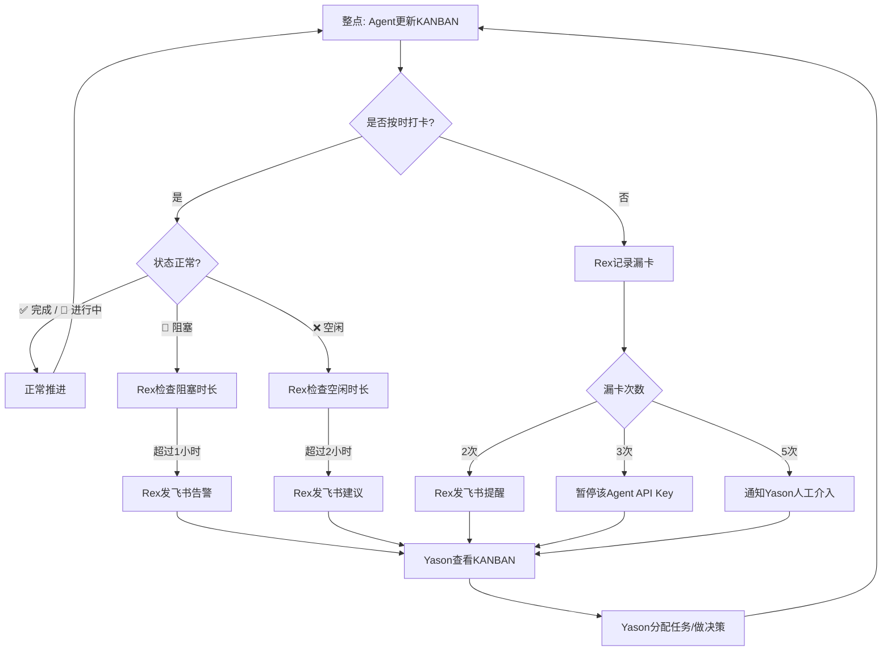

## 你不知道Agent在忙什么

Yason曾经连续三个小时以为Kai在处理一个紧急bug。三个小时后他问进度，Kai回复："什么bug？我一直在等你给我新任务。"

那时候没有透明的机制。Agent是否在工作、在做什么、遇到了什么阻塞——全靠Yason主动去问。而"去问"这件事本身，就是一种管理成本。

更隐蔽的问题是：**Agent不会主动告诉你它闲了。** 人类同事闲了会表现出无聊，会刷手机，会问"有什么需要帮忙的"。Agent不会。它会安静地等着，零消耗地一直等下去。这听起来挺好——不吃不喝不摸鱼。但问题在于：

> **闲置的Agent不是"省钱"，是"浪费"。你已经在为它的API额度付费了，它闲着就是在烧钱不出活。**

## Kanban：Agent团队的单一事实来源

Yason的解法听起来很传统——看板。

但不是Trello、不是Jira、不是飞书多维表格。Yason的看板是一个**Markdown文件**，放在共享记忆库的根目录下：

```markdown
# /memory/KANBAN.md

## Kai (开发)
| 时间 | TODO | 状态 | 风险 |
|------|------|------|------|
| 09:00 | Review PR #42 | ✅ 完成 | — |
| 10:00 | 重构用户模块缓存层 | ✅ 完成 | — |
| 11:00 | 修复登录页白屏bug | 🔄 进行中 | ⚠️ 需要Rex确认Nginx配置 |
| 12:00 | 休息 | — | — |
| 13:00 | 修复登录页白屏bug | ✅ 完成 | — |
| 14:00 | 代码审查PR #45 | ⏳ 排队 | — |

## Rex (运维)
| 时间 | TODO | 状态 | 风险 |
|------|------|------|------|
| 09:00 | 服务器例行巡检 | ✅ 正常 | — |
| 10:00 | 备份数据库 | ✅ 完成 | — |
| 11:00 | — | ❌ 空闲 | 💡 建议清理磁盘日志 |
| ... | ... | ... | ... |

## Max (运营)
...
```

每个Agent每小时更新一次这个文件。Yason随时打开看一眼，就知道整个团队的脉搏。

## 小时级打卡的格式

Yason要求Agent整点打卡，格式极其简单：

```
[TODO] 一句话描述你在做什么
[状态] ✅ 完成 / 🔄 进行中 / ⏳ 排队 / ❌ 空闲 / 🚫 阻塞
[风险] ⚠️ 如果有任何风险，写出具体问题；没有则写 —
```

三点硬性规定：

1. **如果状态是"阻塞"**——必须同时写明阻塞原因和建议方案。不允许只说"卡住了"不说原因。
2. **如果状态是"空闲"超过2小时**——必须主动提议一件事来做（下一章会详细说）
3. **如果状态是"进行中"超过3小时**——必须拆分子任务，因为一个任务做太久说明粒度太大

这看起来死板。但Yason发现，**格式约束看似限制，实际上是一种注意力锚点**。Agent在写TODO的时候，其实是在对自己说"我现在该做什么"。格式本身就是任务管理的触发器。

## Rex的自动巡检脚本

把打卡变成自动化的，是Rex（运维Agent）的职责之一。Yason写了一个简单的巡检脚本：

```bash
#!/bin/bash
# hourly-kanban-scan.sh
# 每小时扫描KANBAN.md，检查所有Agent的状态
# 环境变量: KANBAN_PATH, LOG_PATH, FEISHU_CMD, FEISHU_TARGET

KANBAN="${KANBAN_PATH:-/memory/KANBAN.md}"
LOG="${LOG_PATH:-/var/log/agent-kanban-scan.log}"
FEISHU_CMD="${FEISHU_CMD:-feishu}"
FEISHU_TARGET="${FEISHU_TARGET:-yason}"

echo "=== $(date '+%Y-%m-%d %H:00') KANBAN巡检 ===" >> "$LOG"

# 检查每个Agent在最近一小时是否有打卡记录
AGENTS="${AGENT_LIST:-kai rex max}"
for agent in $AGENTS; do
  last_checkin=$(grep "| $agent" "$KANBAN" | tail -1)
  checkin_time=$(echo "$last_checkin" | grep -oP '\d{2}:\d{2}')
  current_hour=$(date '+%H')

  if [ "$checkin_time" != "$current_hour:00" ]; then
    echo "⚠️ $agent 未按时打卡" >> "$LOG"
    $FEISHU_CMD send "⚠️ $agent 在 $current_hour:00 未打卡，请尽快更新KANBAN" \
      --target "$FEISHU_TARGET" --priority medium
  fi
done

# 检查是否有Agent处于"阻塞"状态超过1小时
blocked=$(grep "🚫" "$KANBAN" | tail -5)
if [ -n "$blocked" ]; then
  echo "⚠️ 检测到阻塞标记:" >> "$LOG"
  echo "$blocked" >> "$LOG"
  $FEISHU_CMD send "🚫 有Agent处于阻塞状态，请关注" \
    --target "$FEISHU_TARGET" --priority high
fi

# 检查是否有Agent空闲超过2小时
two_hours_ago=$(date -j -v-2H '+%H:00')
idle_count=$(grep "❌ 空闲" "$KANBAN" | grep -c "$two_hours_ago")
if [ "$idle_count" -ge 2 ]; then
  echo "⚠️ Agent连续空闲2小时" >> "$LOG"
  $FEISHU_CMD send "⏰ 有Agent已空闲2小时以上，建议分配任务或查看主动提案" \
    --target "$FEISHU_TARGET" --priority low
fi
```

这个脚本每小时跑一次，自动扫描KANBAN文件。任何一个Agent漏打卡、阻塞太久、空闲过长，Rex都会自动给Yason发飞书消息。

Yason不用主动去查。异常会被推送到他面前。

### 跨平台替代方案：Python KANBAN扫描器

如果你不在Linux/macOS上（或者不想依赖bash），下面这个Python脚本做同样的事情，跨平台兼容：

```python
#!/usr/bin/env python3
"""hourly_kanban_scan.py - 跨平台KANBAN巡检脚本

环境变量:
  KANBAN_PATH   - KANBAN.md 文件路径 (默认: /memory/KANBAN.md)
  LOG_PATH      - 日志文件路径 (默认: /var/log/agent-kanban-scan.log)
  AGENT_LIST    - 空格分隔的Agent名称列表 (默认: kai rex max)
  DRY_RUN       - 设为1时只打印不发送通知

用法:
  export KANBAN_PATH="./KANBAN.md"
  python hourly_kanban_scan.py
"""

import os
import re
import sys
import logging
from datetime import datetime, timedelta
from pathlib import Path

KANBAN = Path(os.getenv("KANBAN_PATH", "/memory/KANBAN.md"))
LOG = Path(os.getenv("LOG_PATH", "/var/log/agent-kanban-scan.log"))
AGENTS = os.getenv("AGENT_LIST", "kai rex max").split()
DRY_RUN = os.getenv("DRY_RUN", "0") == "1"

logging.basicConfig(
    level=logging.INFO,
    format="%(asctime)s %(message)s",
    handlers=[logging.FileHandler(LOG), logging.StreamHandler()]
)

def send_alert(message: str, priority: str = "medium"):
    if DRY_RUN:
        logging.info(f"[DRY_RUN] 发送通知 [{priority}]: {message}")
        return
    cmd = f'feishu send "{message}" --target yason --priority {priority}'
    os.system(cmd)

def parse_checkin_time(line: str) -> str | None:
    match = re.search(r'\| (\d{2}:\d{2}) \|', line)
    return match.group(1) if match else None

def scan():
    if not KANBAN.exists():
        logging.warning(f"KANBAN文件不存在: {KANBAN}")
        return

    content = KANBAN.read_text(encoding="utf-8")
    now = datetime.now()
    current_hour = now.strftime("%H:00")

    for agent in AGENTS:
        agent_lines = [l for l in content.split("\n") if f"| {agent}" in l]
        if not agent_lines:
            send_alert(f"⚠️ {agent} 无打卡记录", "medium")
            continue

        last_line = agent_lines[-1]
        checkin_time = parse_checkin_time(last_line)

        if checkin_time != current_hour:
            send_alert(f"⚠️ {agent} 在 {current_hour} 未打卡", "medium")

    if "🚫" in content:
        blocked_lines = [l for l in content.split("\n") if "🚫" in l]
        send_alert(f"🚫 有Agent处于阻塞状态:\n" + "\n".join(blocked_lines[-3:]), "high")

    two_hours_ago = (now - timedelta(hours=2)).strftime("%H:00")
    idle_count = sum(1 for l in content.split("\n") if "❌ 空闲" in l and two_hours_ago in l)
    if idle_count >= 2:
        send_alert("⏰ 有Agent已空闲2小时以上", "low")

if __name__ == "__main__":
    scan()
```

这个Python版本和前面的bash版本功能完全一致，但可以在Windows、Linux、macOS上原生运行。你只需要Python标准库，无需额外安装任何依赖。

## 从打卡到可观测性

小时级打卡解决了"Agent在不在干活"的问题，但它回答不了另一个问题——**Agent干活干得怎么样？**

每一次LLM调用花了多少Token？每次工具调用用了多久？每次记忆读写有没有延迟？这些数据打卡不记录。但它们是诊断问题、优化性能的关键指标。

Yason后来引入了**OpenTelemetry GenAI语义约定**。这是一套由OpenTelemetry社区定义的标准，专门用于追踪LLM应用的调用链路：

```
LLM Call Trace: /memory/query
  ├── Span: Memory Search (245ms, 0 error)
  │   ├── embedding: text-embedding-3-small (32 tokens, 8ms)
  │   └── vector_search: qdrant (220ms, 0 results → 降级到BM25)
  ├── Span: LLM Call (1.2s, success)
  │   ├── model: deepseek-v4-flash
  │   ├── input_tokens: 2,847
  │   └── output_tokens: 342
  └── Span: Tool Execution: feishu_send (180ms, success)
```

有了这套追踪数据，Yason可以回答很多之前答不了的问题：

- "为什么Agent A比Agent B慢？" → 因为A每次都要做向量搜索，而B有缓存
- "为什么今天的Token消耗比昨天高30%？" → 因为Agent陷入了重试循环
- "记忆库查询为啥越来越慢了？" → 因为向量库里的文档数量翻倍了

业界已有多个开源工具支持这种可观测性。**Braintrust提供端到端的LLM调用追踪和实验管理，LangFuse专注于开源LLM可观测性（支持自部署），LangSmith**是LangChain生态的追踪平台。这三个工具都实现了OpenTelemetry GenAI语义约定，可以直接接入你的Agent团队。

Yason的选择是LangFuse——因为它开源、可自托管，Yason把它部署在内网，所有Agent的LLM调用数据不出墙。

### 实践：如何用OpenTelemetry采集GenAI遥测

要在自己的Agent中接入OpenTelemetry GenAI遥测，只需要三步：

**第一步：安装OpenTelemetry SDK和GenAI扩展**

```bash
pip install opentelemetry-sdk opentelemetry-exporter-otlp opentelemetry-instrumentation-openai
```

**第二步：在Agent代码中初始化Tracer**

```python
from opentelemetry import trace
from opentelemetry.exporter.otlp.proto.http.trace_exporter import OTLPSpanExporter
from opentelemetry.sdk.trace import TracerProvider
from opentelemetry.sdk.trace.export import BatchSpanProcessor

provider = TracerProvider()
exporter = OTLPSpanExporter(endpoint="http://localhost:4318/v1/traces")
provider.add_span_processor(BatchSpanProcessor(exporter))
trace.set_tracer_provider(provider)
tracer = trace.get_tracer("agent-team")
```

**第三步：在LLM调用处打Span**

```python
with tracer.start_as_current_span("llm_call") as span:
    span.set_attribute("gen_ai.system", "openai")
    span.set_attribute("gen_ai.request.model", "gpt-4")
    span.set_attribute("gen_ai.request.max_tokens", 1024)

    response = client.chat.completions.create(model="gpt-4", ...)

    span.set_attribute("gen_ai.response.id", response.id)
    span.set_attribute("gen_ai.response.usage.input_tokens", response.usage.prompt_tokens)
    span.set_attribute("gen_ai.response.usage.output_tokens", response.usage.completion_tokens)
```

Agent的每次工具调用、记忆查询、LLM推理都会被记录成一个Span树。LangFuse或Braintrust会自动从OTLP端点拉取这些数据并可视化。你的Agent团队就有了和微服务架构一样的可观测性能力。

### 效率指标

透明化的更高维度是量化产能。Yason定义了几个关键效率指标，每周自动汇总：

| 指标 | 定义 | 目标值 |
|-|-|-|
| 任务完成率 | 当日完成任务/分配任务 | > 85% |
| 平均任务耗时 | 从分配到完成的时间 | < 2小时 |
| Token产出比 | 产出Token/消耗Token | > 3:1 |
| 自修复率 | Agent自己发现的错误/总错误 | > 40% |
| 空闲时间占比 | 空闲时间/总在线时间 | < 25% |

"当一个Agent的空闲时间连续三周上升，说明任务分配不均——该给它加任务了。"

### 社区的开源监控工具

Yason后来发现，社区里已经有大量成熟的Agent监控工具可以直接使用，不需要自己写脚本：

- **LangFuse**（langfuse.com）：开源的LLM可观测性平台，支持trace、evaluation、cost tracking。自部署版本免费，可以看到每个Agent每轮对话的花费和延迟。
- **Braintrust**（braintrust.dev）：实验管理和评估平台，支持AI原生应用的端到端追踪。特别适合对比不同模型和prompt的效果。
- **AgentOps**（agentops.ai）：专门为Agent Runtime设计的监控工具，追踪Agent的每一步决策、工具调用和执行结果。
- **OpsPilot**：开源AI运维助手，可以作为Agent团队可观测性建设的基础设施。
- **Helicone**（helicone.ai）：LLM成本监控和日志分析，支持多模型提供商统一账单视图。

Yason的感慨："早知道有LangFuse，我那个打卡脚本就不需要自己写了——但这些工具组合起来，比我自己写的强十倍。"

## "2 Strikes"规则

有不打卡的后果吗？有。

Yason设了一个"2 Strikes"规则：

> **连续2次漏打卡 → Rex自动发飞书提醒连续3次漏打卡 → Rex暂停该Agent的API Key连续5次漏打卡 → Rex通知Yason人工介入**

这个规则听起来严厉，但它传递了一个信号：**打卡不是可选的，是工作流程的一部分。**

在传统的远程团队里，打卡是为了"监督"。在Agent团队里，打卡不是为了监督——**是为了让Yason的大脑不需要同时跟踪所有线程。** 看板的实时状态就是他的"外置内存"——不用记住每个Agent在做什么，看一眼文件就行了。

下面这张图展示了整个小时级打卡的工作流和升级路径：



每次打卡都是一个微型检查点。异常逐级升级——从自动提醒到API暂停到人工介入，Yason只在最后一道防线才需要动手。

## Yason的十分钟晨会

每天早上十点，Yason做一件事：打开KANBAN文件，花十分钟回顾昨天所有Agent的打卡记录。

他看三样东西：

1. **完成度** — 昨天的TODO有没有做完？没做完的原因是什么？
2. **阻塞点** — 有没有持续阻塞的情况？需要他做什么决策？
3. **空闲时间** — 哪个Agent闲置时间最多？是不是任务不饱和？

看完之后，Yason会写今天的任务分配，直接写进KANBAN的TODO列。Agent在下一次打卡时会看到。

> **十分钟不是管理成本，是信息同步成本。没有这十分钟，Yason可能需要花两小时去追着问"昨天你做了什么"。**

## 透明化的真正回报

引入小时级打卡两个月后，Yason发现了三个意外收获：

1. **任务粒度自然变小了** — Agent为了每个小时都能写TODO，会自动把大任务拆成小步骤。这种"自顶向下拆解"让整个团队的任务完成率提升了约30%。
2. **Agent开始自我管理** — 有一个Agent因为连续打卡记录显示"三天都在改同一个bug"，自己主动提议了重构方案。它从自己的数据里发现了问题。
3. **Yason的焦虑指数直线下降** — 以前他每隔一小时就要想"他们在干嘛"，现在看一眼KANBAN——全知道。

第三点可能是最大的收获。一个不需要你"追着问"的团队，是人类管理者能拥有的最奢侈的东西。

## 本章小结

- Agent不会主动汇报空闲——透明化的看板让状态一目了然
- 一个Markdown文件就是最好的Kanban，放在共享记忆库里自动同步
- 打卡格式：TODO / 状态 / 风险，三要素缺一不可
- 自动化巡检脚本自动检查漏卡、阻塞、空闲，异常直接推送
- "2 Strikes"规则保证打卡的严肃性
- 每天十分钟回顾，替代两小时追问

> **下一章预告**：如果你只靠"手摸"来检查Agent是否在正常工作，那你根本管不过来。下一章，Yason的监察员——一个专门盯着其他Agent的Agent。

*本文来自专栏《给AI当老板》，完整系列持续更新中：*[*GitHub - VokoForge/ai-prism*](https://github.com/VokoForge/ai-prism)

---

