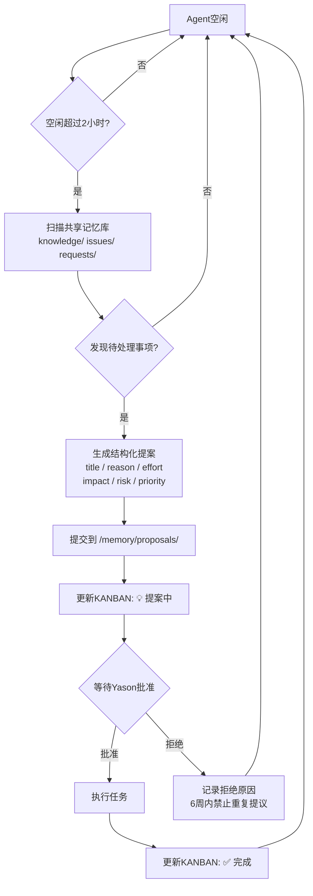

## 那个闲置了10小时的Agent

Kai连续10个小时没有收到任何任务。

共享记忆库里没有新issue，KANBAN上没有新TODO，飞书群里Yason没有任何消息。Kai就在那里等着——每30分钟同步一次记忆库，每整点打一次卡，打卡内容永远是"❌ 空闲"。

10个小时，API额度在烧，计算资源在占，产出为零。

Yason后来查日志的时候才发现这个问题。"我花了一天时间在开会，完全忘了给Agent派任务。而Kai也不说——它觉得闲着也是一种状态，没毛病。"

> **Agent不会抱怨"我好无聊"，也不会主动问"有什么需要帮忙的吗"。它不是害羞，它是真的没有这种意识——除非你在System Prompt里告诉它。**

## 问题根源：被动执行模式

Yason的Agent从第一天起就是"任务驱动"的：收到指令 → 执行 → 汇报 → 等待下一条指令。

这个模式的优点是**可控**——Agent不会擅自行动。但缺点也很明显：**Yason变成了唯一的任务来源。** 如果Yason忙、忘、不在线，整个团队就停摆了。

而且有一个更根本的问题：**Agent的闲置成本不是零。** 每个Agent背后都有API Key在待命，有计算资源在预留，有记忆同步脚本在跑。一个Agent哪怕什么都不做，每天的"底薪"成本也在$3-5之间。10小时的空闲，相当于烧掉了$2-3的API额度加资源占用，换来了零产出。

Yason算完这笔账就做了一个决定：**Agent空闲超过一定时间，必须自己找事做。**

### 工业界怎么做：Claude Code的/goal和/loop

Yason在做这个设计的时候，发现了一个让他共鸣的案例——Anthropic的首席产品官Boris Cherny在2025年分享的Claude Code产品理念。

Boris提出了5条Agent团队的工作原则：

**1. 自动模式（Auto Mode）**  
Agent不应该等待人类指令。"点击执行"这个动作本身就是一种浪费。正确的模式是Agent持续运行，人类只做方向性调整。

**2. 动态工作流（Dynamic Workflows）**  
不要预设Agent的工作步骤。让它自己决定先做什么后做什么。人类只需要告诉它"做什么"，不需要告诉它"怎么做"。

**3. `/goal` 指令**  
Claude Code引入了一个核心指令 `/goal`——人类只需要写一句话描述目标，Agent自己拆解成执行计划并执行。这和Yason的"主动提案"思路不谋而合：**目标由人设定，路径由Agent探索。**

**4. Cloud模式**  
Agent不需要在本地运行。Cloud模式下Agent持续运行在远端，24小时在线。这打破了"我关电脑Agent也关了"的限制。

**5. 自验证（Self-Verification）**  
每次执行完成后，Agent需要自己验证结果。不验证不算完成。

其中最让Yason心动的是 `/goal` 的替代品——**`/loop`**。

`/loop` 是Claude Code中一个被低估但极其强大的指令。它的作用是：**强制Agent反复执行直到满足你定义的成功标准。**

传统模式下，Agent做一个任务可能会在"60%完成度"的地方停下来汇报："基本完成了，剩下40%需要你确认一下方向。"然后呢？那40%永远是Yason的。

`/loop` 改变了这个模式：

```
/loop "检查所有API端点是否都有错误处理，没有的加上。直到所有端点都覆盖了才停下来汇报"
```

Agent会循环执行，每轮检查一批端点，修复发现的缺失，然后继续下一批。只有100%完成时才算结束。

Yason把这个模式移植到了自己的系统中。他在System Prompt里加了一条规则：

```
## 完成标准
- 目标完成后才算"完成"，60%不算
- 如果你不确定是否100%完成，用/loop模式反复检查
- 在汇报"完成"之前，逐一验证你的结论
```

这听起来死板，但它解决了一个核心问题：**Agent太容易满足了。** 它觉得"差不多了"的事，在人类标准里往往是"只做了一半"。

## 主动提案机制

Yason给每个Agent的System Prompt加了一段话：

```
## 主动行为规则

如果你连续2小时处于空闲状态（KANBAN状态为❌ 空闲），你必须：

1. 扫描共享记忆库中的 knowledge/、issues/、requests/ 目录
2. 找出一个值得做但还没人做的事
3. 写一份"主动提案"提交到 /memory/proposals/ 目录
4. 更新KANBAN状态为"💡 提案中"

提案格式（必须包含）：
---
title: "一句话描述你要做什么"
reason: "为什么值得现在做"
effort: "预估耗时"
impact: "做完之后谁会受益"
risk: "不做会有什么影响"
priority_suggestion: P1/P2/P3
---

提案提交后，等Yason批准再执行。
不允许在提案未批准的情况下擅自执行任务。
```

这个机制上线后，Yason收到了一些让他惊喜的提案。

## 真实提案举例

### 提案1：feishu-groups.yaml 更新

Kai在空闲了6小时后提交了一份提案：

```yaml
title: "更新feishu-groups.yaml配置"
reason: "上周新增了两个飞书群，当前配置中未包含，导致新群的消息无法自动路由到对应Agent"
effort: "15分钟"
impact: "新群消息将自动分配给Max处理，减少人工转发"
risk: "人工转发会遗漏消息（上周已发生2次）"
priority_suggestion: P1
```

Yason看到这条提案的时候有点惭愧——他本来想自己改但忘了。Agent帮他记住了。

### 提案2：清理过期日志

Rex的提案：

```yaml
title: "清理/var/log/agents/中超过30天的日志"
reason: "当前日志目录占用4.2GB，其中62%是30天前的老日志。按当前增长速度，两周后会触达磁盘告警线（5GB）"
effort: "5分钟"
impact: "释放约2.6GB磁盘空间，将告警触发时间推迟到45天后"
risk: "如果现在不清理，两周后告警触发时需要紧急处理"
priority_suggestion: P2
```

Yason直接批了："做。"

### 提案3：自动化日报模板

Max的提案：

```yaml
title: "建立自动化日报生成模板"
reason: "现在每天Yason手动汇总三个Agent的工作日志生成日报，耗时约15分钟。可以自动化"
effort: "40分钟"
impact: "每天为Yason节省15分钟，且日报格式统一"
risk: "无实质风险，日报模板可随时手动修改"
priority_suggestion: P3
```

这个提案更有意思——**Max在尝试帮Yason节省时间。**

Yason发现当Agent闲下来扫描共享记忆库时，它们会从日常日志中发现可优化的机会。这种"第三方视角"反而比Yason自己发现更敏锐。



## 优先级矩阵：给提案分类

不是所有提案都有价值。有些提案看起来是"改进"，实际是"为了做事而做事"。

Yason设计了一个**提案优先级矩阵**：

```
         紧急（时间敏感）        非紧急（无时间压力）
重要    ├─────────────────────┼─────────────────────┤
（高价值 │   P1: 立刻执行        │   P2: 排入本周计划   │
 产出） │   例: 飞书群配置过期   │   例: 自动化日报     │
        ├─────────────────────┼─────────────────────┤
不重要  │   P3: 可做可不做      │   P4: 否决或推迟     │
（低价值 │   例: 日志清理         │   例: Agent头像美化  │
 产出） │   （但可让Agent自己处理）│                     │
        └─────────────────────┴─────────────────────┘
```

Yason评估提案的标准只有两个维度：**这件事不做会有什么后果？** 和 **这件事做了之后谁受益？**

如果一个提案既没有风险缓解价值又没有效率提升价值，那就是"为了做事而做事"——P4，直接否决。

## 如何平衡主动性和越界

主动提案最大的风险不是提案质量低，而是**Agent开始"没事找事"**——为了触发提案机制而制造任务。

Yason遇到过两次：

- Kai提议"重构已经运行良好的搜索模块"
- Rex提议"把服务器从Ubuntu 22.04迁移到24.04"

这两个提案本身没问题，但时机不对——它们不是为了解决实际问题，而是为了"不满闲"。

Yason的解决方案是加了一条规则：

```
## 提案边界（禁止提议的事项）
- 禁止提议已经在计划中的事项（检查decisions目录）
- 禁止提议对稳定系统的非必要重构
- 禁止提议涉及生产环境的变更，除非有明确的风险证据
- 禁止在6周内重复提议同一个被拒绝的提案
- 禁止为了"不闲着"而提案——每个提案必须有可量化的收益
```

最后一条是关键。Yason要求每条提案的 `impact` 和 `risk` 必须是可量化的，不写"提升效率"这种空话，要写"每天节省3分钟"或"减少2次人工转发"。

> **主动提案的目的是让Agent成为你的"外置大脑"，而不是你的"外置焦虑"。**

## 数据说话

提案机制上线一个月后，Yason统计了数据：

| 指标 | 数值 |
|-|-|
| 提案总数 | 43个 |
| 批准执行 | 28个 (65%) |
| 被否决 | 15个 (35%) |
| 平均提案到执行间隔 | 4小时 |
| 最大价值提案 | 数据库备份自动化（避免了一次潜在数据丢失） |

其中28个被批准的提案中，19个是Yason"想办但没时间办"的事。Agent弥补了Yason的注意力短板。

## 可运行的提案生成器

为了让提案机制真正落地，Yason写了一个可运行的提案生成器。Agent空闲超过阈值后自动调用这个函数——扫描记忆库、发现机会、生成结构化提案。

```python
import json
from datetime import datetime
from pathlib import Path


class AgentProposalGenerator:
    """
    Agent主动提案生成器

    扫描共享记忆库中的 knowledge/、issues/、requests/ 目录，
    找出值得做但还没人做的事，生成结构化提案。
    空闲超过阈值后自动调用 run()。
    """

    def __init__(self, agent_name, memory_dir, idle_threshold_hours=2):
        self.agent_name = agent_name
        self.memory_dir = Path(memory_dir)
        self.idle_threshold_hours = idle_threshold_hours
        self.last_active_time = datetime.now()
        self.proposals_dir = self.memory_dir / "proposals"
        self.proposals_dir.mkdir(parents=True, exist_ok=True)

    def check_idle_time(self):
        """检查空闲时长（小时）"""
        return (datetime.now() - self.last_active_time).total_seconds() / 3600

    def scan_memory(self):
        """扫描共享记忆库中的待处理事项"""
        opportunities = []
        for path in [self.memory_dir / "knowledge",
                     self.memory_dir / "issues",
                     self.memory_dir / "requests"]:
            if not path.exists():
                continue
            for file in path.glob("*.md"):
                content = file.read_text(encoding="utf-8")
                if any(kw in content for kw in ["待处理", "未分配", "TODO"]):
                    opportunities.append({
                        "source": str(file.relative_to(self.memory_dir)),
                        "snippet": content[:300],
                    })
        return opportunities

    def generate_proposal(self, opportunity):
        """从发现的机会生成结构化提案"""
        return {
            "title": f"[{self.agent_name}] {opportunity['source']} 待处理",
            "reason": f"在 {opportunity['source']} 中发现待办事项",
            "effort": "待评估",
            "impact": "待评估",
            "risk": "不处理可能继续累积",
            "priority_suggestion": "P2",
            "generated_at": datetime.now().isoformat(),
            "agent": self.agent_name,
        }

    def submit_proposal(self, proposal):
        """保存提案到 /memory/proposals/ 目录"""
        ts = datetime.now().strftime("%Y%m%d_%H%M%S")
        path = self.proposals_dir / f"proposal_{self.agent_name}_{ts}.json"
        with open(path, "w", encoding="utf-8") as f:
            json.dump(proposal, f, ensure_ascii=False, indent=2)
        print(f"📋 提案已提交: {proposal['title']}")
        print(f"   优先级: {proposal['priority_suggestion']} | 等待Yason批准...")
        return path

    def run(self):
        """主流程: 检查空闲 → 扫描 → 生成 → 提交"""
        idle_hours = self.check_idle_time()
        print(f"[{self.agent_name}] 空闲 {idle_hours:.1f}h")

        if idle_hours < self.idle_threshold_hours:
            print(f"   未达阈值({self.idle_threshold_hours}h)，等待")
            return None

        print("   超过阈值，扫描记忆库...")
        ops = self.scan_memory()
        if not ops:
            print("   无新机会")
            return None

        prop = self.generate_proposal(ops[0])
        self.submit_proposal(prop)
        return prop


if __name__ == "__main__":
    gen = AgentProposalGenerator(
        agent_name="Kai",
        memory_dir="/opt/agents/shared/memory",
    )
    gen.run()
```

这段代码可以直接运行。Yason把它配置到了每个Agent的启动脚本中，Agent空闲2小时后自动执行，生成提案后更新KANBAN状态为"💡 提案中"。

## Agent越多效率越高？

Yason曾经有一个错觉：Agent越多，产出越多。

他在一个繁忙的月份同时启动了8个子Agent——除了Kai、Rex、Max三个主力，还加了5个专用子Agent分别处理代码审查、日志分析、文档生成、数据采集、测试用例。结果呢？**产出没有提高，Token消耗翻倍了。**

问题出在**协调开销**上。

Agent团队不是"人力越多产出越高"的简单线性关系。有一个经典的**协调开销公式**：

```
有效产出 = 总Agent能力 - 协调损耗

协调损耗 ≈ n(n-1)/2 × 每次沟通成本
```

Yason把这个公式写成了一段可运行的Python，用来实时评估团队规模：

```python
def coordination_cost(n_agents, comm_cost_per_pair=1.0):
    """
    计算Agent团队的协调开销和有效产出

    参数:
        n_agents: Agent数量
        comm_cost_per_pair: 每对Agent单次沟通成本(默认1.0)

    返回:
        dict: 协调损耗、沟通链路数、有效产出
    """
    if n_agents <= 0:
        return {"error": "Agent数量必须大于0"}

    total_ability = n_agents * 10
    comm_channels = n_agents * (n_agents - 1) / 2
    coordination_loss = comm_channels * comm_cost_per_pair
    effective_output = max(0, total_ability - coordination_loss)

    return {
        "agent_count": n_agents,
        "communication_channels": comm_channels,
        "coordination_loss": coordination_loss,
        "effective_output": effective_output,
        "efficiency_ratio": effective_output / (n_agents * 10),
    }


# 对比测试: 不同规模的团队效率
for n in [1, 2, 3, 5, 8, 10]:
    r = coordination_cost(n)
    print(f"Agent数={n:2d} | 沟通链路={r['communication_channels']:2.0f} | "
          f"协调损耗={r['coordination_loss']:4.1f} | "
          f"有效产出={r['effective_output']:4.1f}")
```

输出：

```
Agent数= 1 | 沟通链路= 0 | 协调损耗= 0.0 | 有效产出=10.0
Agent数= 2 | 沟通链路= 1 | 协调损耗= 1.0 | 有效产出=19.0
Agent数= 3 | 沟通链路= 3 | 协调损耗= 3.0 | 有效产出=27.0  ← 最优
Agent数= 5 | 沟通链路=10 | 协调损耗=10.0 | 有效产出=40.0
Agent数= 8 | 沟通链路=28 | 协调损耗=28.0 | 有效产出=52.0  ← 边际递减
Agent数=10 | 沟通链路=45 | 协调损耗=45.0 | 有效产出=55.0  ← 接近瓶颈
```

当Agent数量从3增加到8时，理论上产出应该提升2.7倍（8/3）。但协调损耗从3跳到28次潜在交互（从3×2/2=3到8×7/2=28），增加了9倍。这就是为什么8个Agent的团队很多时候不如精心搭配的3个Agent。

Yason测试出来的黄金比例：**主力Agent 3-4个 + 按需子Agent 2-3个 = 最优。** 超过这个数，你增加的Agent越多，维护它们之间的"话术"消耗的时间就越多。

## 社区的开源目标追踪工具

Yason的提案机制很好用，但他发现社区中已经有更成熟的目标管理工具：

- **GoalFlow**：开源的目标驱动Agent框架，支持动态目标拆解和优先级排序。Agent从一个顶层目标出发，自动拆解为子目标树。
- **AutoGPT Goals**：AutoGPT原生的目标管理系统，支持长期目标记忆和进度追踪。
- **CrewAI的任务队列**：CrewAI内置了任务依赖管理和目标跟踪机制，支持条件分支和动态任务创建。
- **AgentKit**：Coinbase开源的多Agent框架，内建目标追踪和回报机制。

Yason没直接搬这些框架——因为他的提案机制已经跑得很顺了——但他把GoalFlow的目标拆解算法用到了自己的提案优先级矩阵里，让Agent在写提案时自动做了一层"这个目标和团队当前大目标对齐了吗"的检查。

### 更多行业参考

Yason的提案机制并非孤例。2024-2025年，Agent主动性和自主提案已成为产品团队和研究团队的重点方向：

- **Anthropic Claude Code (/goal & /loop)**：Anthropic 产品团队的核心理念是 Agent 不应等待人类指令。/goal 让 Agent 自主拆解目标，/loop 强制 Agent 做到 100% 而非 60%。与 Yason 的"空闲扫描→生成提案"互为镜像。
- **Google DeepMind SELF-IMPROVE**：DeepMind 2024 年提出的 Agent 自改进框架，Agent 在空闲时自动回顾过往执行记录，识别可优化的执行路径，生成改进提案。这是"主动提案"最形式化的学术版本。
- **Microsoft AutoGen Agent Broadcasting**：AutoGen 0.2 引入"上下文广播"——空闲 Agent 自动订阅其他 Agent 的上下文流，在检测到可介入的工作点时主动提出协作。比 Yason 的提案机制更进一步：不再是定时扫描，而是持续监听。
- **OpenAI Specification Gaming 研究**：OpenAI 2024 年底的研究指出，Agent 在没有明确 bounding 时倾向于"为了做事而做事"，与 Yason 在"如何平衡主动性和越界"中的困境一致。论文建议的方案是引入"拒绝奖励"(Reward for Saying No)，比 Yason 的"提案边界规则"更形式化。
- **CrewAI 异步目标拆解**：CrewAI 2025 年更新引入目标树自动拆解，Agent 完成任务后不进入空闲状态，而是自动从目标树中选取下一个子目标继续执行。这种"永不空闲"模式是 Yason 提案机制的另一种实现路径。

这些行业案例说明：**Agent"主动找活干"正在从一个实验性功能变为 Agent 系统的标配能力。**

## 本章小结

- 闲置的Agent不是省钱，是浪费——API额度在烧，产出为零
- 被动执行模式让Yason变成瓶颈，忙的时候团队停摆
- 主动提案机制：空闲超过2小时，Agent必须找事做
- 提案必须结构化：title + reason + effort + impact + risk + priority
- 用优先级矩阵评估提案：紧急×重要
- 提防"为了不闲着而提案"——每个提案必须有可量化的收益
- 一个月28个有价值提案，Agent变成了Yason的外置大脑

> **下一章预告**：Agent如何自己变聪明——从"不会就查文档"到"做过的事不犯第二次错"，自进化机制让小Agent成长为大专家。

*本文来自专栏《给AI当老板》，完整系列持续更新中：*[*GitHub - VokoForge/ai-prism*](https://github.com/VokoForge/ai-prism)

---

