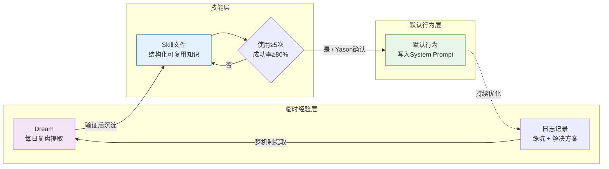
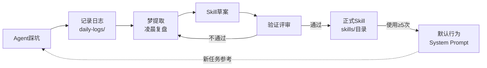

## 同样的问题，第二次还是踩坑

Kai犯了一个看起来很蠢的错误。

它在做任务A时需要安装一个npm包，用 `npm install` 装好了。两小时后做任务B，又需要同一个包，Kai重新 `npm install` 了一遍——同样的版本，同样的依赖，重复下载。

Yason看到日志的时候哭笑不得："你刚才不是装过一次吗？"

Kai回复："我没记住。"

这不是Kai的错。**Agent的工作记忆默认是一次性的。** 每个任务开始时它都是一个"干净的脑子"——不记得上一轮任务做了什么，不记得上次踩过什么坑，不记得哪个方案被否决过。

如果没有人主动把知识存起来，Agent就会反复踩同一个坑。

> **Agent的"聪明"不是天生的，是喂出来的。每一次踩坑、每一次优化、每一次决策——如果不存下来，就等于没发生过。**

## Kimi Agent Swarm：300个并发Agent

Yason在设计自进化机制时，读到了一份让他震撼的行业报告——Moonshot AI在2025年底发布的K2.6模型，支持**300个并发子Agent**协同工作。

不是3个，不是30个——**300个**。

这不是实验室里的Demo，这是真实可用的产品能力。K2.6的Agent Swarm架构允许开发者在一次任务中启动最多300个子Agent，每个子Agent独立执行不同的子任务，通过中央协调器合并结果。整个系统可以协调4000步以上的多步协作。

更惊人的是它的Benchmark表现——在BrowseComp（一个复杂的网页浏览和理解评测基准）上，K2.6 Swarm达到了86.3%的准确率。作为对比，GPT-5.4的同项得分是78.4%。**开源模型第一次在Agent任务上超越了闭源模型。**

这让Yason思考一个问题：单Agent能力再强，也强不过一群Agent的协作。群体智能（Swarm Intelligence）不是理论，是2026年已经在发生的事情。

## 群体智能：从蚁群到Agent舰队

Yason在K2.6的启发下去读了几篇群体智能的论文，发现了一个有趣的概念——**Stigmergy（迹信息素）**。

概念来自昆虫行为学：蚂蚁在寻找食物时，会在走过的路上留下信息素。其他蚂蚁闻到了，会倾向于走信息素最浓的路。**没有指挥官，没有地图，每只蚂蚁只做一件事——跟着信息素走。**

结果呢？整个蚁群找到了食物。

Yason把Stigmergy映射到Agent团队里：

- "信息素" = Agent在共享记忆库中留下的决策记录、成功日志、警告标记
- "跟着信息素走" = Agent在遇到问题时优先搜索"别人做成功过"的方案
- "群体智能" = 每个Agent独立优化自己的局部任务，通过共享环境的"痕迹"自然达成全局最优

这个框架解释了为什么Yason的共享记忆库能自发产生群体智能——每个Agent无意中留下的"痕迹"，都是其他Agent的信息素：Kai在日志里写了一段"这个bug的根因是X"，Rex第二天遇到类似问题时搜索到了这段记录，直接跳过了试错步骤。**这300个并发Agent的本质，就是300个独立试错的个体通过共享环境达成集体智能。**

```
个体Agent优化 → 留下信息素（日志/Skill/决策记录）
       ↓
其他Agent读取信息素 → 避免重复踩坑
       ↓
集体智能涌现 → 整个团队的决策质量提升
       ↓
（反馈循环）新的经验再沉淀为新的信息素
```

"不需要一个'超级大脑'来指挥所有人。只需要每个Agent都在共享环境里留下痕迹——集体智能就会自然涌现。"Yason在笔记里写道。

## 梦机制：Agent的夜间复习

Yason设计了一个被他称为"梦机制"（Dream Mechanism）的系统。

每天晚上凌晨2点，当所有Agent都空闲时，一个"复习任务"被触发：

```bash
#!/bin/bash
# /opt/agents/scripts/daily-dream.sh
# 每天凌晨执行：Agent复盘当天的任务，提取可复用的知识

MEMORY_DIR="/opt/agents/memory"
SKILLS_DIR="$MEMORY_DIR/skills"
DREAMS_DIR="$MEMORY_DIR/.dreams"

mkdir -p "$DREAMS_DIR"

# 扫描今天的全部日志
today=$(date '+%Y-%m-%d')
logs=$(find "$MEMORY_DIR/daily-logs" -name "*$today*" -type f)

if [ -z "$logs" ]; then
  echo "今天无任务记录，跳过复盘"
  exit 0
fi

echo "=== 日常复盘 $today ==="

# 逐条日志分析，提取"可复用的经验"
for log in $logs; do
  agent_name=$(basename "$log" | sed "s/$today-//" | sed 's/\.md$//')

  # 提取日志中的：遇到的问题、解决方案、优化建议
  problems=$(grep -i "问题|报错|error|fail|阻塞|踩坑" "$log")
  solutions=$(grep -i "解决|修复|方案|改为|workaround" "$log")
  optimizations=$(grep -i "优化|改进|建议|下次|better" "$log")

  if [ -n "$problems" ] && [ -n "$solutions" ]; then
    dream_file="$DREAMS_DIR/$today-$agent_name-dream.md"
    {
      echo "## 经验提取 - $agent_name - $today"
      echo ""
      echo "### 问题"
      echo "$problems"
      echo ""
      echo "### 解决方案"
      echo "$solutions"
      echo ""
      echo "### 优化建议"
      echo "$optimizations"
    } > "$dream_file"

    echo "  $agent_name: 提取了 $(echo "$problems" | wc -l) 条经验"
  fi
done

# 检查是否有可以沉淀为Skill的经验
# 同一类问题出现3次以上，自动生成Skill草稿
# (逻辑略)
```

这个脚本做了三件事：

1. **提取经验** — 从今天的日志中找出"问题 + 解决方案"对
2. **沉淀技能** — 如果同一类问题出现多次，自动生成一份Skill草案
3. **更新记忆** — 将新的经验写入共享知识库

第二天Agent加载记忆时，这些"做梦"生成的技能文件就成了它们知识的一部分。

## 从经验到技能：知识的结构化沉淀

Yason把Agent的知识分成了三个层级：



**临时经验层**：每天"做梦"生成的经验笔记。可能有噪音，不一定准确。

**技能文件层**：经过验证的经验，写入 `skills/` 目录，有标准格式：

```markdown
# /memory/skills/npm-cache-optimization.md

## 技能名称
npm依赖缓存策略

## 适用场景
当需要安装npm依赖时

## 问题描述
在短时间内容多次执行npm install，每次都下载相同的依赖，浪费时间

## 解决方案
1. 检查 node_modules 目录是否存在
2. 如果存在，先检查需要的包是否已安装
    `npm ls <package-name> 2>/dev/null`
3. 如果已安装，跳过 install
4. 如果未安装，执行 npm install <package-name>

## 注意事项
- 当 package.json 变更时必须重新 install
- 不适用于yarn或其他包管理器

## 来源
Kai, 2025-06-15: 两小时内重复安装axios包
```

**默认行为层**：如果一个Skill被反复使用超过5次，它的核心内容就会被写入Agent的System Prompt，成为默认行为。

这是一个**自动化的知识沉淀流水线**：



## 跨Agent学习

一个Agent学到的技能可以变成所有Agent的共有资产。

比如Kai在写代码时发现了一个Node.js版本兼容问题，写了一篇 `node-version-compat.md` Skill。Rex在部署时也遇到了同样的问题，他会在记忆中搜索到这篇Skill，直接复用解决方案。

Yason没有做什么特殊的配置——**所有Agent共享同一个记忆库，自然实现了跨Agent学习。**

但他确实遇到过一次"知识污染"的问题。Max学了一个运营相关的技巧，标记为"适用于所有Agent"——然后Kai和Rex也开始"学习"运营技能，以为那是通用的。

Yason的修复方案是在每个Skill文件里加了 `scope` 字段：

```yaml
# skills/npm-cache-optimization.md 的元数据
---
scope: [kai, rex]
applicable_roles:
  - developer
  - devops
not_applicable:
  - operator
---

后续内容...
```

Agent在加载技能时会检查 `scope`，只有匹配自己角色的技能才会加载。

## 进化触发机制

Yason的Agent不会无休止地"梦"。每天的复盘是有代价的——每次"做梦"都要消耗Token。Yason设置了一个触发条件：**只有当Agent当天执行了3个以上任务，或者遇到了1个以上报错，才触发复盘。**

```yaml
# /opt/agents/config/evolution.yaml
evolution:
  dream_trigger:
    min_tasks_completed: 3
    min_errors_encountered: 1
    schedule: "0 2 * * *"  # 每天凌晨2点

  skill_promotion:
    min_usage_count: 3       # 被使用3次以上
    min_confidence: 0.8      # 成功率80%以上
    review_required: true    # 需要Yason人工确认

  system_prompt_update:
    min_skill_count: 5       # 5个相关Skill → 考虑写入System Prompt
    notify_yason: true
```

注意 `review_required: true`——从Skill晋升为默认行为，必须经过Yason的确认。这不是不信任，而是**防止"学歪了"**。

## 社区的开源自进化框架

Yason的"梦机制"是自己手写的，但他后来发现社区中已经有不少开源自进化框架可以直接使用：

- **AutoGen**（微软）：支持Agent对话、代码执行、工具调用，内建了"反思"机制。Agent在每次任务后可以自动生成"反思笔记"，下次类似任务时加载。AutoGen 0.4版本引入了多Agent团队的跨会话记忆。
- **CrewAI的学习机制**：CrewAI在2025年秋季版本中加入了"经验记忆"（Experience Memory）。Agent每次执行完任务后，会自动生成一个"经验记录"存入共享记忆库。后续任务中，Agent会根据当前任务描述自动检索最相关的历史经验。
- **MemGPT/Letta**：让LLM拥有长期记忆的开源框架。Agent的上下文窗口不再是静态的——它可以根据需要"翻阅"历史记忆，就像人类翻笔记本一样。
- **AgentProtocol**：标准化Agent技能共享的开源协议，不同Agent框架之间的技能可以通过这个协议互相导入导出。

Yason没有全部替换自己的系统，但把AutoGen的"反思笔记"格式借鉴到自己的梦机制里——让Agent的每日复盘结构更标准化。

## Skill生命周期：从草稿到沉淀

Yason后来把"梦→Skill→默认行为"的工作流整理成了一个正式的**Skill生命周期**：

```
草稿阶段
  Agent发现一个可复用的经验，写一份草案
    ↓
评审阶段
  另一个Agent（或Yason）评审草案的质量
    ↓
试用阶段
  该Skill被标记为"试用"，Agent可以使用但需要谨慎
    ↓
成熟阶段
  该Skill被成功引用5次以上，自动升级为"正式Skill"
    ↓
默认阶段
  某一类问题中该Skill被调用率>80%，考虑写入System Prompt
    ↓
废弃阶段  
  随着模型升级或环境变化，某Skill不再适用，自动标记过期
```

Yason加了一个"废弃阶段"很重要——随着LLM模型不断升级（比如从DeepSeek V3到V4），以前需要Skill处理的很多问题模型自己就会了。不废弃老Skill，Agent会被过时的知识拖累。

## 强化学习的萌芽

Yason没在生产环境里跑RL（强化学习）——太复杂了，成本太高。但他做了一件类似的事：

**每次Yason拒绝或修正了一个Agent的输出，这个"拒绝"被记录为一个负面样本。** Agent在下次遇到类似场景时会通过搜索记忆看到"上次这种方案被否决了"。

这不算真正的RL，但它是一种**隐式的偏好对齐**——不需要大规模训练，只需要让Agent记住"Yason不喜欢什么"。

"等Agent团队规模大到需要全自动进化的时候，我会考虑RL。在那之前，这种'记忆驱动的隐式对齐'够用了。"

## 进化数据的可视化

运行了三个月后，Yason看到了一个清晰的趋势：

```
第1个月：Agent遇到问题时，需要Yason指导的比率 65%
第2个月：Agent遇到问题时，需要Yason指导的比率 35%
第3个月：Agent遇到问题时，需要Yason指导的比率 18%
```

知识库的变化：

```
第1个月：0 个 Skill 文件
第2个月：12 个 Skill 文件
第3个月：34 个 Skill 文件（其中6个被提升为默认行为）
```

Agent的决策质量在提升，Yason的介入频率在下降。这不是因为模型变强了——Kai、Rex、Max用的模型从头到尾没变过。**变强的是它们积累的知识。**

> **Agent的进化曲线 = 你投入的知识管理质量 × 时间。模型决定起点，知识决定终点。**

## 本章小结

- Agent的工作记忆是一次性的——不存下来就等于没发生过
- "梦机制"：每天凌晨自动复盘日志，提取可复用的经验
- 三层知识架构：临时经验 → Skill文件 → 默认行为
- 跨Agent学习：共享记忆库让一个Agent的经验成为全队的资产
- 用scope字段避免知识污染——不同角色的Agent学不同技能
- 从Skill到默认行为需要Yason确认，防止"学歪了"
- 三个月后，Yason的介入率从65%降到18%

> **下一章预告**：Agent团队最大的"隐形杀手"——API账单。一次死循环让Yason半天烧掉了一周的预算。如何让你的Agent团队既能干活又不烧钱？

*本文来自专栏《给AI当老板》，完整系列持续更新中：*[*GitHub - VokoForge/ai-prism*](https://github.com/VokoForge/ai-prism)

---

---

