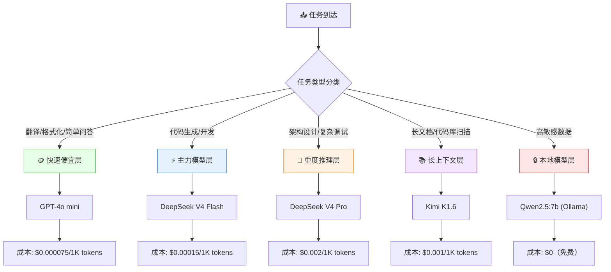

## 那个\$847的早晨

Yason打开API提供商的控制台，看到上个月的账单时，咖啡差点喷在屏幕上。

\$847.32。

他记得上个月是$412，上上个月是$380。翻倍了。

Yason开始翻明细。逐条看下来，一个大头引起了他的注意：

```
qclaw-agent:
  API calls: 28,432
  Total tokens: 14,217,000
  Cost: $312.44
```

等等。qclaw只是一个API路由Agent——它的职责是把请求转发到正确的模型。它不需要调用大模型，它只需要做路由决策。

但账单显示它调了28,432次大模型。

Yason查日志才发现爆炸的原因：qclaw的模型路由配置写错了，所有请求都被发到了一个付费模型上。更糟的是，这个配置错误触发了一个**死循环**——qclaw路由失败 → 自动重试 → 继续失败 → 继续重试。4小时内烧掉了\$312。

> **一个配置错误 + 一个死循环 = 半个月的API预算。Agent的"盲目执行"特性在成本上是一个巨大的隐患——它不会说"这个请求好像太贵了，你要不要确认一下？"**

## Token成本拆解：钱花在哪了

Yason在qclaw事故后坐下来做了一次全面的成本审计。他按Agent和任务类型拆解了token消耗：

```
Kai (开发) — 月均 $310
  ├─ 代码生成 (DeepSeek V4 Pro): 42% — $130.20
  ├─ 代码审查 (DeepSeek V4 Flash): 25% — $77.50
  ├─ 架构讨论 (Claude Opus): 20% — $62.00
  └─ 技术调研 (Kimi): 13% — $40.30

Rex (运维) — 月均 $85
  ├─ 日志分析 (DeepSeek V4 Flash): 50% — $42.50
  ├─ 告警处理 (GPT-4o mini): 30% — $25.50
  └─ 配置生成 (DeepSeek V4 Flash): 20% — $17.00

Max (运营) — 月均 $210
  ├─ 内容创作 (Claude Sonnet): 45% — $94.50
  ├─ 数据分析 (DeepSeek V4 Flash): 30% — $63.00
  └─ 调研报告 (Kimi): 25% — $52.50

基础设施 (路由、记忆同步、监控) — 月均 $102
其他 (测试、试错、重试) — 月均 $140
```

"其他"那一栏让他停了很久——\$140花了，但产出是零。全是试错、重试、死循环。

> **非产出消耗是Agent团队最大的隐性成本。它的占比通常在15-25%之间——如果你不做成本审计，你甚至不知道它在流血。**

## 模型路由：什么时候用什么模型

Yason的第一个成本优化动作是**配置模型路由**——不是所有任务都值得用最强模型。

```yaml
# /opt/agents/config/model-routing.yaml
models:
  # 主力模型 — 性价比最优
  default:
    provider: deepseek
    model: deepseek-v4-flash
    cost_per_1k_tokens: 0.00015

  # 重度推理 — 架构设计、复杂bug分析
  heavy_reasoning:
    provider: deepseek
    model: deepseek-v4-pro
    cost_per_1k_tokens: 0.002
    triggers:
      - task_type: architecture_design
      - task_type: complex_debug
      - error_count: "> 3"  # 简单模型失败3次后自动升级

  # 长上下文 — 文档分析、代码库扫描
  long_context:
    provider: kimi
    model: kimi-k1.6
    cost_per_1k_tokens: 0.001
    triggers:
      - input_length: "> 8000"  # 超过8000 tokens

  # 快速任务 — 简单问答、格式化、翻译
  fast_cheap:
    provider: openai
    model: gpt-4o-mini
    cost_per_1k_tokens: 0.000075
    triggers:
      - task_type: translation
      - task_type: formatting
      - task_type: simple_qa

  # 本地模型 — 敏感数据、离线任务
  local:
    provider: ollama
    model: qwen2.5:7b
    cost: 0  # 免费的
    triggers:
      - data_sensitivity: high
```

这套路由配置的核心逻辑只有一句话：**简单任务用便宜模型，复杂任务用好模型，本地能跑的不用远端。**



配置一个月后，Kai的月成本从$310降到了$180——降低了42%，但Kai自己完全没感觉到区别，因为路由切换是透明的。

## 预算告警和自动熔断

光路由优化不够，Yason还需要一个**保险丝**——当成本异常时自动切断。

```bash
#!/bin/bash
# /opt/agents/monitor/scripts/cost-fuse.sh
# 检查API消耗，超限时执行熔断

THRESHOLD_DAILY=40       # 单日全局上限 $40
THRESHOLD_AGENT_DAILY=15 # 单Agent单日上限 $15
LOG="/var/log/cost-fuse.log"

echo "=== $(date) 成本检查 ===" >> "$LOG"

# 获取当前消耗（通过API Provider的账单接口）
daily_cost=$(curl -s "https://api.provider.com/v1/billing/daily?key=$API_KEY" | jq '.total_cost')
kai_cost=$(curl -s "https://api.provider.com/v1/billing/daily?key=$API_KEY&agent=kai" | jq '.cost')
max_cost=$(curl -s "https://api.provider.com/v1/billing/daily?key=$API_KEY&agent=max" | jq '.cost')
rex_cost=$(curl -s "https://api.provider.com/v1/billing/daily?key=$API_KEY&agent=rex" | jq '.cost')

echo "  总消耗: \$$daily_cost" >> "$LOG"
echo "  Kai: \$$kai_cost, Max: \$$max_cost, Rex: \$$rex_cost" >> "$LOG"

# 熔断规则
if (( $(echo "$daily_cost > $THRESHOLD_DAILY" | bc -l) )); then
  echo "⚠️ CRITICAL: 单日总消耗超过 \$$THRESHOLD_DAILY，执行全局熔断！" >> "$LOG"
  /opt/agents/emergency-shutdown.sh "daily_cost_exceeded"
  feishu send "🚨 全局熔断已触发！今日API消耗 \$$daily_cost，超过上限 \$$THRESHOLD_DAILY" \
    --target yason --priority critical --phone
  exit 1
fi

# 单Agent超限
for agent in kai kai_cost rex rex_cost max max_cost; do
  name="${agent%%_*}"
  cost_var="${agent}_cost"
  cost="${!cost_var}"

  if (( $(echo "$cost > $THRESHOLD_AGENT_DAILY" | bc -l) )); then
    echo "⚠️ HIGH: $name 单日消耗 \$$cost，暂停该Agent" >> "$LOG"
    /opt/agents/pause-agent.sh "$name" "cost_exceeded"
    feishu send "🚨 $name 已暂停：今日消耗 \$$cost，超过上限 \$$THRESHOLD_AGENT_DAILY" \
      --target yason --priority high
  fi
done
```

这套脚本上线后，Yason心里踏实了很多。他做了一个形象的比喻：**"以前我的API账单像没有上限的信用卡，现在像预付费卡——刷完就停，不会超额。"**

## Token优化的实用技巧

除了模型路由和自动熔断，Yason还积累了7条Token优化技巧：

**1. 缓存重复请求**  
同一个prompt在不同场景下会被多次调用（比如"介绍一下这个项目"）。Yason建了一个简单的内存缓存，对完全相同的请求直接返回缓存结果。这一项省了约30%的IO消耗。

**2. Agent内省前先搜索记忆库**  
Agent每次遇到问题不要直接问大模型，先搜索 `knowledge/` 和 `skills/` 目录。Yason的统计显示：45%的问题在已有的Skill文件中有答案。

**3. 限制上下文窗口**  
Agent倾向于"把所有相关文件都塞进上下文"。Yason在System Prompt里写了一条规则：**每次加载的上下文不超过6000 tokens**。如果需要更多信息，按相关性排序分批加载。

**4. 分步执行的Token审计**  
复杂任务分步执行时，每完成一步记录一次Token消耗。如果某一步消耗异常（比如超出预算的2倍），暂停任务并报告。

**5. 用本地模型筛数据**  
在大模型调用前先用本地模型（Ollama）做一次粗筛。比如Max做网页分析时，先让本地模型判断页面是否相关，只有相关的页面才调用远端模型。

**6. 设定试错上限**  
每个Agent在System Prompt里有一条硬性规则："同一任务连续失败3次后停止，输出失败报告"。Yason发现死循环试错占了非产出消耗的60%。

**7. 周报自动汇总成本**  
每周一早上，Yason收到一封飞书卡片：

```
━━━━ 团队成本周报 ━━━━
上周总消耗: $187.32
环比: +12% (前周: $167.10)
预算剩余: 62%

角色排行:
🥇 Kai: $82.10 (43.8%)
🥈 Max: $61.20 (32.7%)
🥉 Rex: $24.02 (12.8%)

异常消耗:
- 6/14 Kai 连续重试消耗 $8.40 (已标记)
- 6/16 Max 模型路由错配消耗 $4.20 (已修复)
━━━━━━━━━━━
```

Yason不需要自己统计，成本报告是自动生成的。

## 社区的成本优化工具

Yason的成本控制体系跑通之后，他发现自己做的事情社区里已经有成熟的开源方案：

- **OpenRouter**（openrouter.ai）：一个统一的模型路由网关。所有模型调用通过OpenRouter中转，自动路由到当前负载最低/价格最优的模型提供商。Yason手工配置的模型路由策略，OpenRouter开箱即用，还会根据实时价格自动切换。
- **LiteLLM**（litellm.vercel.app）：开源的多模型提供商SDK。一行代码切换模型提供商——从OpenAI换到DeepSeek再换到Anthropic，不需要改任何业务代码。LiteLLM还内置了成本追踪和费率限制管理。
- **Portkey**（portkey.ai）：AI网关和成本管理平台，支持缓存、重试、费率限制和预算控制。免费版支持每月100万Token的追踪。
- **Helicone**：开源的LLM成本监控工具。Yason自己写的成本熔断脚本，Helicone开箱就有类似功能，还附带可视化仪表盘。

Yason后来把LiteLLM接入了自己的路由系统："以前每个模型提供商都要单独配置API Key和计费规则，用LiteLLM之后，配置从200行变成了20行。"

## 预算墙与速率限制管理

成本控制还有一个容易被忽视的维度——**速率限制（Rate Limit）**。

Yason遇到过不止一次：Agent突然停下来了，不是因为成本超限，而是因为API提供商返回了429（Too Many Requests）。Agent不懂429的语义，继续重试，结果触发了更高的限频惩罚。

解决方案是加了一个"预算墙+速率墙"的双层防护：

```yaml
# /opt/agents/config/budget-and-rate.yaml
budget_walls:
  agent_level:
    kai:
      daily_budget: 15.00
      hourly_budget: 3.00
      rate_limit: 60 rpm  # 每分钟最多60次请求
    rex:
      daily_budget: 5.00
      rate_limit: 30 rpm

  task_level:
    heavy_reasoning:
      max_cost_per_task: 2.00
      max_steps: 20
    simple_qa:
      max_cost_per_task: 0.05

rate_management:
  backoff_strategy: exponential  # 指数退避
  max_retries: 3
  retry_on_codes: [429, 503, 502]  # 只有这些状态码才重试
  circuit_breaker:
    error_threshold: 5  # 连续5次错误
    recovery_time: 60   # 暂停60秒
```

"预算墙防止你花超出限额的钱，速率墙防止你触达API提供商把你的账号封了。两堵墙之间，Agent可以自由驰骋。"

## APIs是消耗品，不是资产

Yason在团队Wiki里写了一句话：

> **把API费用当"消耗品预算"，不是"固定资产投入"。一个月花几千块Token费不心疼——花错了方向才心疼。定好规则、设好熔断、做好审计，剩下的让Agent放手干。**

这是他交了\$847学费之后学到的最重要的一课。

## 本章小结

- 一个死循环半天烧掉\$312——Agent的"盲目执行"是成本黑洞
- 定期做成本审计，拆解每个Agent的任务类型消耗
- 模型路由：简单任务用便宜模型，本地能跑的不用远端
- 自动熔断脚本：超限直接暂停，不等人发现
- 7个Token优化技巧：缓存、先搜后问、限制窗口、分步审计、本地预筛、失败上限、自动报告
- API费用是消耗品——花对了方向就不心疼

> **下一章预告**：AI团队生产的东西谁来保证质量？当你不再亲自review每一行代码，就需要一套自动化的质量保障体系——Kai的一次重构事故教会了Yason这一点。

*本文来自专栏《给AI当老板》，完整系列持续更新中：*[*GitHub - VokoForge/ai-prism*](https://github.com/VokoForge/ai-prism)

