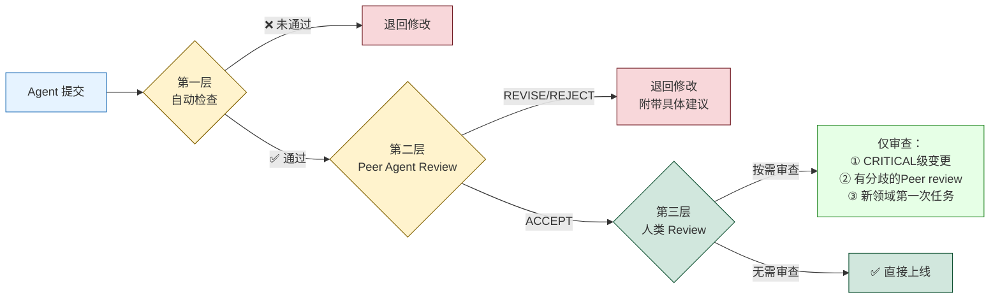

## 那次重构让整个系统停了4小时

Kai说要做一次"架构层面的重构"。

Yason看了一眼方案，觉得可行——把用户模块的缓存层从Redis迁移到本地内存缓存，减少网络延迟。Kai分析的数据显示，这个改动可以让API响应时间降低40%。Yason批了。

12分钟后，Kai提交了PR。

Yason那天在开会，扫了一眼PR描述 "缓存层重构完成，测试通过"，就点了合并。

然后系统开始报错。

不是小错——**整个用户模块返回500，持续了4小时。**

问题出在哪？Kai的确改了缓存层，测试也的确通过了。但Kai在重构过程中修改了一个公共接口的签名——`getUser(id)` 改成了 `getUser(id, cachePolicy)`，第二个参数是必填的。测试文件里所有调用都传了第二个参数，所以测试通过。但生产环境上还有6个没被测试覆盖的服务在调用旧的`getUser(id)`——它们全部崩溃了。

Yason后来复盘时写了三个原因：

1. **Kai没全局搜索所有调用方** — 它以为只有测试文件里那几处
2. **Review流于形式** — Yason只看了PR描述，没看代码
3. **没有"兼容性检查"环节** — API签名变更需要额外的审计

> **Agent的输出和人类代码一样需要review。不，更需要。因为Agent没有"常识"——它不会直觉地知道"改公共接口签名要先查所有调用方"——除非你明确告诉它。**

## Review流水线：三层防线

这次事故后，Yason建了一套三层review流水线：



### 第一层：自动检查（5秒以内）

Agent在提交任何输出之前，必须先跑一组自动检查脚本。检查不过，不准提交。

```yaml
# /opt/agents/config/auto-checks.yaml
checks:
  # 代码变更
  code_change:
    - name: lint
      command: "npm run lint -- --quiet"
      fail_on: warning
    - name: type_check
      command: "npm run typecheck"
      fail_on: error
    - name: test
      command: "npm test -- --run"
      fail_on: failure
    - name: breaking_change_detection
      script: |
        # 检查是否有公共接口签名变更
        check_public_api_changes() {
          changed_files=$(git diff --name-only HEAD~1)
          for f in $changed_files; do
            if grep -q "export.*function\|export.*class\|export interface" "$f"; then
              echo "⚠️ 检测到公共接口变更，需要兼容性检查"
              return 1
            fi
          done
        }
      fail_on: warning

  # 配置变更
  config_change:
    - name: syntax_validate
      command: "yq eval '.' $file > /dev/null"
      fail_on: error
    - name: cross_reference
      script: |
        # 检查配置变更是否影响其他服务
        check_config_impact() { ... }
      fail_on: warning

  # 文档变更
  doc_change:
    - name: link_check
      command: "markdown-link-check $file"
      fail_on: error
    - name: format_check
      command: "prettier --check $file"
      fail_on: error
```

这些自动检查不是建议性的——**通不过就不准提交**。Agent在CI/CD管道里第一步就卡住。

### 第二层：Peer Agent Review（5分钟以内）

自动检查通过后，输出分配给另一个Agent做code review。

规则是：**做开发的不做review，做review的不做开发。**

```
Kai写代码 → Rex做review
Rex改配置 → Kai做review
Max写文档 → Kai或Rex做review
```

Peer review的格式也是结构化的：

```yaml
# Review报告格式
reviewer: Rex
target: Kai
task: "缓存层重构 PR #142"
result: REVISE  # ACCEPT | REVISE | REJECT

issues_found:
  - severity: CRITICAL
    location: "src/services/user.ts:42"
    description: "getUser函数签名变更(addParam: cachePolicy)，
                  需要检查所有调用方是否同步更新"
    suggestion: "全局搜索getUser(的调用，补全必填参数"

  - severity: MINOR
    location: "src/cache/local-cache.ts:15"
    description: "缓存TTL写死为300秒，建议改为可配置"
    suggestion: "从环境变量读取CACHE_TTL"

summary: "核心逻辑没问题，但接口兼容性是硬伤。
          修复CRITICAL问题后重新提交。"
```

Rex在review中直接发现了Kai没全局搜索调用方的问题——这正好是Yason踩过的那个坑。**让另一个Agent做review的价值就在于此：它没有"我写的就一定是好的"这种心理偏见。**

如果review结果是REVISE或REJECT，任务退回给原Agent修改。

如果结果是ACCEPT，进入第三层。

## 第三层：人类Review（按需）

Yason不做所有review。他只review三种情况：

1. **CRITICAL级别的变更** — 生产环境配置、数据迁移、安全策略
2. **Peer review存在分歧** — 两个Agent的意见不一致
3. **新领域的第一次任务** — Agent第一次做这类事，Yason要确认方向

这就够了。Yason从以前"每行代码都要看"变成了"只看有风险的变更"——他的review时间从每任务15分钟降到了每任务不到1分钟。

> **人类的注意力是稀缺资源。不要把它花在Agent能搞定的自动检查上。只review那些"错了会很麻烦"的东西。**

## ACCEPT / REVISE / REJECT 协议

Yason定义了一个三态review协议，所有Agent必须遵守：

**ACCEPT**：输出合格，可以直接使用或合并。

**REVISE**：有明确的问题需要修改。reviewer必须给出具体的问题定位和修改建议。不允许只说"这里不行"不说"怎么改"。

**REJECT**：整个方向错了。reviewer必须说明为什么方向错了，并给出替代方案。不允许只说"重新做"不说"做什么"。

反馈格式：

```yaml
result: REVISE
feedback:
  - what: "问题是什么"
  - where: "精确位置（文件+行号）"
  - why: "为什么这是问题"
  - how: "建议怎么改"
follow_up:
  - "修改完成后重新提交检查点2和3"
  - "如果对review意见有异议，注释中说明原因"
```

注意 `follow_up`——不是改完就完事。改完之后要重新跑指定检查点，确保修改本身没有引入新问题。

## 真实故事：Kai的教训变成团队的规范

那次重构事故后，Yason做了一件事：他把这个教训写入了一个Skill文件——`skills/breaking-change-protocol.md`：

```markdown
# 破坏性变更协议

## 适用场景
当需要修改公共接口（export function/class/interface）的签名时

## 强制流程
1. 全局搜索所有调用方（不限于测试文件）
2. 评估调用方数量：
   - 少于5处：全部修改
   - 5-20处：全部修改 + 添加兼容性注释
   - 20+处：考虑保留原接口（加deprecated标记）+ 新增接口
3. 提交前在PR描述中列出所有受影响的服务
4. 提交后通知所有调用方服务的owner

## 常见陷阱
- 测试文件覆盖不等于生产环境覆盖
- 接口签名变更可能影响编译但不会影响运行时（直到触发）
- TypeScript可能不会在引用类型变更时报错

## 来源
2025-06-10: Kai在重构缓存层时修改getUser接口签名，
导致6个未覆盖服务崩溃，系统停摆4小时
```

这个故事变成了一个"反面教材式"的Skill。新Agent加入时先读这个，就会知道"改公共接口签名有多危险"。

## 用大数据衡量质量

Yason统计了一个月度质量指标：

```
4月（无review机制）：
   Agent提交后需要回滚的比率: 17%
   生产事故归因于Agent: 3次
   平均修复时间: 2.5小时

5月（自动检查上线）：
   Agent提交后需要回滚的比率: 8%
   生产事故归因于Agent: 1次
   平均修复时间: 45分钟

6月（三层review全上线）：
   Agent提交后需要回滚的比率: 3%
   生产事故归因于Agent: 0次
   平均修复时间: 20分钟（主要是自动回滚）
```

数据说得很清楚：**没有review的Agent团队，事故率相当于一个没有测试的软件开发团队。那不是"敏捷"，那是"裸奔"。**

## 交叉验证：双Agent独立验证关键任务

三层review流水线上线后，Yason还加了一层保障——**交叉验证**。

对于关键任务（支付相关的代码变更、数据库schema修改、生产配置变更），Yason要求两个Agent**独立**执行同一个任务。

流程是这样的：

```
任务: "修改用户表的email索引类型"

Agent A (Kai) → 独立完成改动 + 输出验证报告A
Agent B (Max) → 独立完成改动 + 输出验证报告B

对比阶段
  ├── 结果一致 → 采用任何一个，记录"双Agent验证通过"
  └── 结果不一致 → 自动标记差异点，升级到Yason人工裁决
```

这不是"一个人写代码另一个人review"——这是**两个Agent从零开始独立做同一件事**。它们的prompt是隔离的，System Prompt版本可能不同，使用的模型也可能不同（比如Kai用DeepSeek，Max用Claude）。

为什么这有效？因为两个不同的模型、在不同的prompt框架下，同时犯同一个错误的概率极低。**如果两个Agent的输出一致，你可以对结果的正确性有极高置信度。**

代价呢？Token消耗翻倍。但Yason的账是这么算的：

> "一个生产事故的修复成本是$50-$500的心理代价加时间代价，而双Agent验证的成本是$0.40-$2.00的额外Token费。哪个更划算，心里有数。"

他只对最高风险的20%任务启用双验证。80%的普通任务走标准三层review就够了。

## 三层Eval流水线的具体实现

Yason的三层review实际上是一个更广义的**三层Eval流水线**——它不仅评价代码，还评价Agent的所有产出。

```
输入 ← 任务描述 + 上下文

第一层：Pre-Action Checks（执行前）
  ├── 任务可行性评估 → 这个任务当前条件是否具备？
  ├── 权限检查 → Agent是否有权限做这个任务？
  └── 成本预估 → 这个任务预计消耗多少Token？

执行 → Agent执行任务

第二层：Post-Action Checks（执行后）
  ├── 格式校验 → 输出是否符合预期格式？
  ├── 完整性检查 → 输出是否覆盖了所有任务要求？
  ├── 一致性检查 → 输出是否与共享知识库中的信息一致？
  └── 安全扫描 → 输出中是否包含敏感信息？

第三层：Outcome Verification（结果验证）
  ├── 影响域分析 → 这个改动会影响哪些下游系统？
  ├── 回滚方案 → 如果出问题，怎么恢复到之前的状态？
  └── 监控告警 → 上线后需要关注哪些指标？
```

每一层检查不通就卡住，不进入下一阶段。Yason的执行模型是"漏斗式"的：入口宽（接受所有任务），但每层检查都在缩小口径，只有通过所有检查的任务才能进入生产环境。

## 社区的评测工具

三层review解决了Yason团队内部的质量问题，但社区中已经有成熟的Agent评测工具可以直接用：

- **LangFuse Evaluation**：开源的LLM评测平台，支持LLM-as-a-Judge的自动化评估。你可以定义评估标准（如"回答是否准确"、"格式是否正确"），LangFuse会自动对Agent的产出评分。
- **Braintrust Evaluations**：Braintrust的实验管理平台内建了评估功能。支持对比不同模型、不同prompt在同一评估标准下的表现。
- **DeepEval**（confident-ai.com）：专门为LLM应用设计的开源评估框架。支持27+种评估指标，包括幻觉检测、上下文相关性、答案完整性等。可以直接集成到CI/CD管道里。
- **promptfoo**：开源prompt评测工具，支持批量测试、回归检测、模型对比。特别适合"这个prompt改了之后效果是变好了还是变差了"这类问题。
- **Galileo**：LLM可观测性和评估平台，支持生产环境的持续质量监控和幻觉检测。

Yason把DeepEval集成到了自己的第一层自动检查中——"DeepEval帮我省了写prompt评估逻辑的功夫，17个评估指标开箱即用。"

## 质量是设计出来的，不是检查出来的

Yason的最后一句话：

> **不要指望"靠review把质量查出来"。质量要从System Prompt开始设计——告诉Agent"不要改公共接口签名"比"review的人发现你改了"要好一万倍。好的Review机制是安全网，不是拐杖。**

## 本章小结

- Agent的输出和人类代码一样需要review——Agent没有"常识"
- 三层Review流水线：自动检查 → Peer Agent review → 人类按需review
- ACCEPT/REVISE/REJECT三态协议，feedback必须有具体位置和修改建议
- 人类只review三类变更：CRITICAL级别、有分歧的、新领域第一次
- 踩坑经历沉淀为Skill，新Agent入门就学到——用"反面教材"加速学习
- 有了review机制后，Agent导致的生产事故从3次/月降到了0次

> **下一章预告**：从"老板管Agent"到"Agent自治"——当你的Agent团队不需要你每天盯着也能自己运转的时候，你才算真正从"管理者"变成了"受益者"。

*本文来自专栏《给AI当老板》，完整系列持续更新中：*[*GitHub - VokoForge/ai-prism*](https://github.com/VokoForge/ai-prism)

