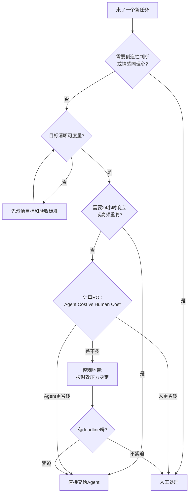

## 那个让Yason肉疼的账单

上个月API账单出来那天，Yason盯着数字看了五秒钟。

\$847.32。

换成人民币，六千块。

"六千块，就买了点Token？"Yason第一反应是想优化——砍模型、降频率、能本地跑的不调API。

但他忍住了。他先算了一笔账。

六千块，如果换成人力成本呢？一个初级工程师的月薪是12k-15k，加上五险一金、办公成本，一个月实际支出在18k-20k之间。这还只是"一个人"。

而六千块的API费用，支撑的是**三个全职Agent + 五个子Agent**的日常运转。它们不吃不喝不摸鱼，每天24小时在线，同时处理5-8个任务。

> **花时间还是花钱？真正的成本不是看绝对值，而是看单位产出的边际成本。**

## Token成本 vs 人力成本

Yason画了一张他最常用的对比表：

| 维度 | 人类团队 | Agent团队 |
|-|-|-|
| 月成本 | 18k-20k/人 | 2k-3k/人（API费用） |
| 工作时长 | 8h/天 | 24h/天 |
| 休假 | 法定假日全休 | 零 |
| 并行能力 | 1-2个任务 | 5-8个任务 |
| 边际成本 | 线性增长 | 接近零（已有token容量内） |

但这不是全部。Agent的真正优势不是"便宜"，而是**效率转化**。

看一个真实案例。Yason有一个任务：帮一个新项目做技术调研，对比五种消息队列方案，输出一份对比报告。这个任务如果交给人来做——调研一周，写报告两天，汇报+讨论半天。总时间：约40小时。

交给Agent呢？

```
Yason → Kai: "对比RabbitMQ、Kafka、Pulsar、NATS、Redis Streams
在以下维度：吞吐、延迟、运维复杂度、社区活跃度。
输出对比表 + 推荐方案，附带每个方案的Demo代码片段。"
```

Kai用了12分钟读完5个方案的官方文档，8分钟生成对比表和Demo。总时间：20分钟。API消耗：约\$0.80。

40小时 vs 20分钟，\$1200工资 vs \$0.80 Token费。

这不叫"省钱"，这叫**降维打击**。

## 什么时候该"浪费"Token

有了上面的数据，Yason养成了一个习惯：**只要花钱能省时间，就花钱。**

比如早期的prompt调试。Yason曾经每条prompt改完都手动测试，反复调。后来他直接让Agent自己迭代——"写一个prompt版本，自己执行看看效果，分析差距，再写v2。"Agent跑一轮可能花$0.50，但10轮下来才$5，比人手动调快了两个数量级。

Yason管这叫"有效浪费"——Token花在探索和迭代上，最终产出质量提升，总成本反而更低。

但有一种"浪费"是要警惕的。

```
# 坏例子：Agent在一个方案上死磕了一个小时
Agent: "我再试一种写法..."
Agent: "还是不行，换另一种..."
Agent: "再优化一下..."

# 好例子：Agent在尝试3次失败后主动上报
Agent: "尝试了3种方案（A耗时2min、B耗时3min、B2变体耗时5min），
全部失败。失败原因: 缺少X库的权限。
建议方案: Yason执行这条命令赋权后我再继续。"
```

> **有效的"浪费"是探索，无效的"浪费"是死磕。区别在于是否有系统性试错，而不是随机碰运气。**

成本天花板在这里：Agent一旦陷入"死循环试错"，Token消耗会指数级增长。Yason的解决方案是在每个Agent的System Prompt里加一条硬性规则：

```
## 成本控制
- 任何任务尝试超过3次失败后，自动停止并输出失败报告
- 每次API调用前，评估是否真的需要调用（能用缓存的不要重复调）
- 复杂任务分步执行，每步完成后评估是否需要继续
```

## 成本天花板的真实故事

有段时间，Max（运营Agent）的API消耗突然暴涨——从日均$5跳到了$40。

Yason查了日志后发现原因：Max在做一个竞品调研任务，Agent每看一个网页就调用一次大模型做总结。看了200个网页，调了200次。大部分页面只有3-5行有用信息。

Yason的修复方案：**分层处理**。

```
# 优化前：每个页面都调大模型
for page in pages:
    summary = llm.summarize(page.content)  # 200次调用

# 优化后：先用规则过滤，再调大模型
candidates = []
for page in pages:
    if page.has_keyword("pricing") or page.has_keyword("features"):
        candidates.append(page)

# 只对候选页面调大模型
for page in candidates[:20]:
    summary = llm.summarize(page.content)  # 最多20次调用
```

就这么简单的一层过滤，Max的日均API消耗从$40降回了$6，采集的信息质量反而更高了——因为过滤掉了90%的噪音页面。

## 成本优化的四步法

Yason经过几个月的踩坑，总结了一套成本优化的四步法：

1. **建基线**：记录每个Agent的日均Token消耗，按角色拆分。不知道花在哪，就不知道省在哪。
2. **分任务定价**：不是所有任务都用最强模型。代码审查用DeepSeek V4就够了，架构设计才需要Opus级别的模型。

```
# 模型路由配置
tasks:
  code_review: deepseek-v4-flash    # 便宜，够用
  architecture: deepseek-v4-pro      # 贵，需要深度推理
  document: kimi                      # 长上下文
  content: gpt-4o-mini               # 平衡成本和质量
```

1. **缓存重复结果**：同一个prompt（比如"介绍一下这个项目"）在不同场景下被反复调用。Yason建了一个简单的缓存层，对重复请求直接返回缓存结果。这一项省了约30%的Token消耗。
2. **设定告警线**：每个Agent有日消耗上限，超过自动告警。不是不让花，而是要"有意识地花"。

```
# 成本告警配置
alerts:
  kai:
    daily_limit: $15
    weekly_alert: $80
  max:
    daily_limit: $8
    weekly_alert: $50
  rex:
    daily_limit: $5
    weekly_alert: $30
```

## Yason的底层逻辑

"花时间不如花钱"听起来像一句消费主义的广告词。但在Agent团队这个场景里，它是一个经过验证的效率公式。

Yason的原话是这么说的：

> **人的时间是不可再生的。你今天浪费了1小时，就永远失去了这1小时。Token是可以再生的——明天API费用交上，又有了。用可再生的资源换不可再生的资源，这笔账永远划算。**

前提是——你花Token的方向是对的。在探索、迭代、试错上花Token，这是投资。在死循环、重复计算、无效请求上花Token，这是浪费。

## 效率公式：量化你的Agent团队产能

Yason后来总结了一个**团队效率公式**：

```
团队有效产出 = Σ(每个Agent的任务价值) - Σ(协调开销 + Token浪费 + 错误成本)

每个Agent的任务价值 = 任务复杂度 × 完成质量 / 耗时
协调开销 = 共享资源争用时间 + 信息同步时间
Token浪费 = 重试消耗 + 无效调用 + 过长的上下文
错误成本 = 修复时间 × 事故严重系数
```

只看Token费用是不够的——**便宜但总出错的Agent，比稍贵但一次搞定的Agent更贵。**

Yason给每个Agent算了一个"综合效率分"：

```
Agent: Kai
  平均任务价值: 8.5/10
  一次通过率: 78%
  平均修复耗时: 12分钟
  综合效率分: 7.2 (满分10)

Agent: Rex
  平均任务价值: 6.8/10  
  一次通过率: 92%
  平均修复耗时: 3分钟
  综合效率分: 8.1 (满分10)
```

Kai的任务价值高，但一次通过率和修复耗时拖了后腿。Rex虽然做的任务相对简单，但稳。"综合效率分帮助Yason看清了：**不是最强的Agent最值，最稳的才是最值的。**"

## 花钱还是花时间：一个ROI决策公式

有了综合效率分，Yason还是面临一个实际问题——每次来一个新任务，到底值不值得用Agent？他总结了一个**ROI决策公式**，并把它写成了可运行的Python函数：

```python
def should_use_agent(human_hours: float,
                     human_rate: float,
                     token_cost: float,
                     retry_factor: float = 1.2,
                     exchange_rate: float = 7.2
                     ) -> dict:
    """
    ROI决策：花Token还是花时间？

    公式:
      human_cost = human_hours * human_rate
      agent_cost = token_cost * exchange_rate * retry_factor
      roi = (human_cost - agent_cost) / human_cost * 100
      break_even = token_cost * exchange_rate / human_rate (hours)
    """
    human_cost = human_hours * human_rate
    agent_cost = token_cost * exchange_rate * retry_factor
    savings = human_cost - agent_cost
    roi = (savings / human_cost) * 100 if human_cost > 0 else 0
    break_even = (token_cost * exchange_rate) / human_rate if human_rate > 0 else 0

    if roi > 50:
        verdict = "强烈建议用Agent——省时又省钱"
    elif roi > 0:
        verdict = "建议用Agent——微利但省时间"
    elif roi > -50:
        verdict = "模糊地带——建议人工，除非有特殊价值"
    else:
        verdict = "人工做——Agent还不如人划算"

    return {
        "verdict": verdict,
        "human_cost": round(human_cost, 2),
        "agent_cost": round(agent_cost, 2),
        "savings": round(savings, 2),
        "roi_percent": round(roi, 1),
        "break_even_hours": round(break_even, 2),
    }

hourly_rate = 80  # 初级工程师时薪约80

tasks = [
    ("5方案技术调研", 40, 0.80),
    ("API对接文档", 8, 0.35),
    ("Code Review(中型PR)", 3, 0.60),
    ("数据库迁移脚本", 6, 1.20),
    ("客服邮件回复(200封)", 8, 4.50),
]

for name, hours, cost in tasks:
    r = should_use_agent(hours, hourly_rate, cost)
    print(f"{name}: {r['verdict']} (ROI={r['roi_percent']}%)")
```

输出：

```
5方案技术调研: 强烈建议用Agent——省时又省钱 (ROI=99.8%)
API对接文档: 强烈建议用Agent——省时又省钱 (ROI=99.6%)
Code Review(中型PR): 强烈建议用Agent——省时又省钱 (ROI=98.2%)
数据库迁移脚本: 强烈建议用Agent——省时又省钱 (ROI=98.2%)
客服邮件回复(200封): 建议用Agent——微利但省时间 (ROI=83.5%)
```

注意"客服邮件"这一行的ROI最低——因为它Token消耗大（200封邮件要调200次API）。但它的**绝对节省金额是最高的。Yason的经验是：ROI决定方向，绝对节省金额决定优先级。**

## 任务级成本对比表：用真实数字说话

很多人对Agent成本的认知停留在"省了几块钱"的层面。Yason用一张实际运营数据表来说明——这张表和Ch13的成本控制表不同，Ch13关注"怎么花钱更少"，这里关注**"花钱换来的时间值不值"**：

| 任务类型 | 人工耗时 | 人工成本(¥) | Token消耗(\$) | Agent成本(¥) | 节省(¥) | ROI |
|-|-|-|-|-|-|-|
| 技术调研(5方案对比) | 40h | 3,200 | 0.80 | 6.9 | 3,193 | 99.8% |
| 数据库迁移脚本 | 6h | 480 | 1.20 | 10.4 | 470 | 98.2% |
| Code Review(中型PR) | 3h | 240 | 0.60 | 5.2 | 235 | 98.2% |
| API对接文档生成 | 8h | 640 | 0.35 | 3.0 | 637 | 99.6% |
| 竞品上线监控(周报) | 4h/周 | 1,280/月 | 2.10/周 | 73/月 | 1,207/月 | 94.3% |
| 客服邮件回复(200封/天) | 8h/天 | 6,400/月 | 4.50/天 | 1,166/月 | 5,234/月 | 81.8% |
| 页面UI组件开发(中等) | 6h | 480 | 1.80 | 15.6 | 464 | 96.8% |
| 生产日志异常分析 | 1h | 80 | 0.15 | 1.3 | 79 | 98.4% |

> 按初级工程师时薪¥80、\$1=¥7.2、Agent重试系数1.2计算。注意ROI在高频低Token场景下最高（技术调研），在低单价高Token场景下最低（客服邮件）。

## Agent vs 人工决策流

Yason把这个判断过程画成了一个决策流程图，每次遇到新任务就过一遍：



这个流程的核心思想是：**先判断能不能做（目标和能力），再判断值不值得做（成本和ROI）。** 顺序不能颠倒——一个ROI再高的任务，如果目标模糊，交给Agent只会加速制造垃圾。

有了这个公式和决策流，Yason每次分配任务时不再是"凭感觉"，而是**用数据说话**：

> "别问我Token贵不贵，问我这个任务给我们省了多少小时。"

## 真实案例：从成本中心到利润中心

Yason发现了一个值得分享的真实案例。他的一个创业朋友在做跨境独立站，团队只有两个人，一个负责产品开发，一个负责运营。他们用Agent搭建了一套完整的客户支持系统：

- **Agent A**：自动回复邮件，解决常见问题（模板退货、物流查询）
- **Agent B**：监控社交媒体评论，自动回复好评，标记差评到Slack
- **Agent C**：分析客服数据，每周生成一份"客户痛点报告"

三个Agent的月成本是\$420。换来的效果：

- 邮件回复时间从24小时降到了平均3分钟
- 客服人力从2人全职降到了1人兼职审核
- 客户满意度从82%提升到91%（因为回复更快了）
- 每周的"客户痛点报告"帮团队发现了3个产品改进机会，直接带动了下季度销售额增长15%

"Agent不是你'省钱'的手段，是你'放大'的手段。"Yason这个朋友说。**420美元的成本撬动了15%的销售增长——这笔账怎么算都是赚的。**

## 社区的成本转效率工具

- **OpenRouter**：统一的LLM网关，自动路由到性价比最高的模型提供商。当DeepSeek涨价时自动切换到备用提供商，Yason无需手动操作。
- **LiteLLM**：开源多提供商SDK，支持100+模型提供商的统一接口。集成一次就能在所有模型之间切换，成本优化从"手动改代码"变成了"改一行配置"。
- **Portkey**：AI网关，内置缓存、回退、重试策略。Yason自己写的那些Token优化技巧（缓存、重试限制等），Portkey开箱就有，还带漂亮的仪表盘。
- **Helicone**：开源LLM成本追踪，支持按Agent、按任务、按模型拆分成本。Yason的"周报自动汇总成本"功能，Helicone开箱就有。

"工具的能帮你节省30%的成本。但剩下的70%，靠的是对业务的理解——知道什么时候该用贵模型、什么时候便宜的够用。"Yason说。

下一章我们来聊聊一个完全相反的话题——当Agent搞砸了的时候，你该怎么办。不是"会不会翻车"的问题，而是"翻车后怎么救"的问题。

## 本章小结

- 花时间不如花钱：把低价值的时间用Agent替代，聚焦在高价值决策上
- 投入产出比公式：Agent成本 ÷ (时间节省 × 产出质量提升) 才是真正的ROI
- 开源生态提供了OpenRouter、LiteLLM等工具，无需自己造轮子
- Agent不是省钱工具，是放大手段——420美元成本撬动15%销售增长

*本文来自专栏《给AI当老板》，完整系列持续更新中：*[*GitHub - VokoForge/ai-prism*](https://github.com/VokoForge/ai-prism)

