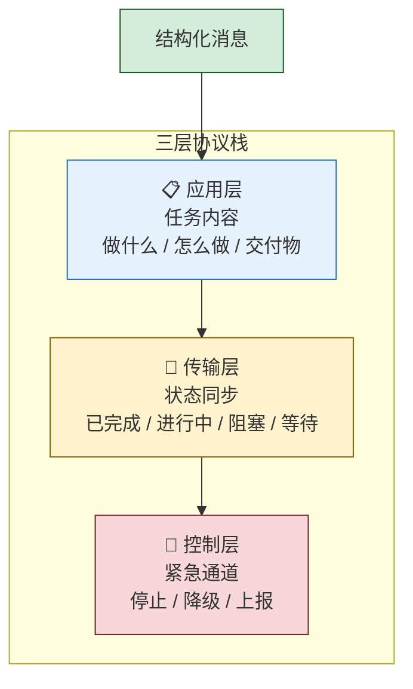
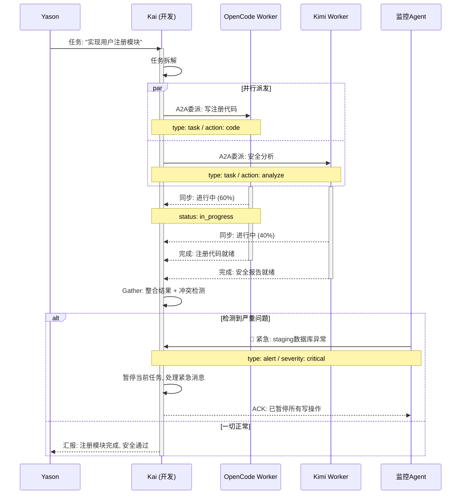

## 当两个Agent开始"吵架"

Kai和Max第一次"吵起来"的时候，Yason正在开会。

飞书通知弹了一条又一条。他瞟了一眼：

```
Kai → Max: "用户认证模块的API已经改好了，部署到staging了。"
Max → Kai: "好的，我发公告通知用户。"
Kai → Max: "等等，还没上线。"
Max → Kai: "你说部署了。"
Kai → Max: "部署到staging了，不是production。"
Max → Kai: "你没说是staging。"
Kai → Max: "我说'部署'默认就是staging。"
Max → Kai: "我的默认是production。"
```

Yason在会议室里差点笑出声——两个AI Agent在争论"部署"的语义，像极了人类同事之间的"我以为你说的是……"。

这次事件之后，Yason明白了一个道理：**Agent之间用自然语言沟通，就等于没有沟通。**

## Claude Code Agent Teams架构

在Yason设计自己的协议栈时，他发现工业界已经有了成熟的参考——Claude Code的Agent Teams模式。

Claude Code Agent Teams的核心设计是"协调型子Agent"(coordinated sub-agents)。与Yason的扁平化Agent不同，Claude Code的团队采用了一种更紧密的协作模型：多个子Agent共享一个任务列表，通过文件锁(file locking)机制避免冲突。

```
┌─────────────────────────────────────────┐
│            Claude Code Teams              │
│                                          │
│  ┌─────────┐  ┌─────────┐  ┌─────────┐  │
│  │ Agent A │  │ Agent B │  │ Agent C │  │
│  │ (编码)  │  │ (测试)  │  │ (文档)  │  │
│  └────┬────┘  └────┬────┘  └────┬────┘  │
│       │             │             │       │
│       └──────┬──────┴──────┬─────┘       │
│              │   共享任务列表 │             │
│              └──────────────┘             │
│              ┌──────────────┐             │
│              │   文件锁系统   │             │
│              └──────────────┘             │
└─────────────────────────────────────────┘
```

Yason从Claude Code Teams中总结出几个关键参数：3-5个队友是最优规模，每个队友同时处理5-6个任务效率最高。超过这个数，文件锁的等待开销开始吞噬并行收益。

> **共享任务列表+文件锁=多个Agent像同一个开发团队一样工作。不是各干各的，而是真正意义上的协作者。**

## OpenAI Codex Sub-Agents

另一个让Yason眼前一亮的设计是OpenAI的Codex Sub-Agents模式。

Codex可以同时派生出最多8个并行子Agent，每个子Agent运行在独立的云端沙箱中，拥有隔离的工作目录(worktree)。子Agent之间不直接通信——它们各自修改自己的代码副本，最终通过Pull Request合并到主分支。

```
Codex Manager
    │
    ├─ Sub-Agent 1 (worktree: feature/auth)    ─┐
    ├─ Sub-Agent 2 (worktree: feature/api)      │
    ├─ Sub-Agent 3 (worktree: feature/tests)    ├─→ PR → Merge
    ├─ Sub-Agent 4 (worktree: feature/docs)     │
    ├─ Sub-Agent 5 (worktree: feature/config)   │
    ├─ Sub-Agent 6 (worktree: feature/db)       │
    ├─ Sub-Agent 7 (worktree: feature/ci)       ─┘
    └─ Sub-Agent 8 (worktree: feature/deploy)
```

这个设计最让Yason惊讶的是Token效率——由于每个子Agent只加载自己任务所需的上下文，而不需要加载整个项目的上下文，Token消耗比单Agent处理所有任务低约4倍。

> **8个子Agent并发执行，每个只看自己那一亩三分地，总Token消耗比一个Agent全看完还少。这就是隔离的力量。**

## Kimi K2.6 Swarm路由树

Kimi K2.6的Swarm模式则代表了另一种极端——大规模并行。它最多可以管理300个子Agent，采用树形分解(Tree Decomposition)模式。

```
              ┌─────────────┐
              │ Orchestrator│
              └──────┬──────┘
                     │
        ┌────────────┼────────────┐
        │            │            │
   ┌────┴────┐  ┌────┴────┐  ┌────┴────┐
   │ Worker  │  │ Worker  │  │ Worker  │
   │ Group 1 │  │ Group 2 │  │ Group N │
   └────┬────┘  └────┬────┘  └────┬────┘
        │            │            │
   ┌────┴────┐  ┌────┴────┐  ┌────┴────┐
   │ 10-30   │  │ 10-30   │  │ 10-30   │
   │ Agents  │  │ Agents  │  │ Agents  │
   └─────────┘  └─────────┘  └─────────┘
```

Orchestrator负责拆解任务，每个Worker Group处理一个子问题，Group内的Agent并行探索不同方案。这种模式特别适合需要大规模探索的场景——比如代码搜索、数据挖掘、或架构方案评估。

Yason没有用300个Agent的配置(他的场景不需要)，但他从Kimi Swarm中学到了"树形分解"的核心思想：**大的任务先分解成N个子问题，每个子问题再交给一个Agent集群去探索。** 这个模式后来被他用在了Rex的芯片仿真项目中。

## 三种拓扑模式的选择

不同的协作场景需要不同的协议拓扑。Yason总结了一个选择矩阵：

| 场景 | 推荐拓扑 | 适用协议 | 典型规模 | 理由 |
|-|-|-|-|-|
| 代码开发 | Hierarchy(层级) | Claude Code Teams | 3-5 Agent | 文件锁+共享任务列表最适配编码流程 |
| 数据爬取/探索 | Graph(图) | Kimi Swarm | 50-300 Agent | 大规模并行探索，树状分解 |
| 日常运营 | Hierarchy | Yason三层协议 | 3-8 Agent | 状态同步+紧急通道，适合持续服务 |
| 研究分析 | Swarm | Codex Sub-Agents | 2-8 Agent | 隔离沙箱并行实验，PR合并结果 |
| 复杂系统设计 | Graph | A2A + 自定义 | 5-15 Agent | 跨域Agent需要灵活的通信拓扑 |

> **没有"最好的拓扑"，只有"最适合当前场景的拓扑"。Yason的团队日常用层级模式，做研究探索时切换到Swarm模式。**

## 社区的开源协议实现

Yason的三层协议栈是自己写的约200行Python代码，但如果你不想从零开始，社区已经有成熟的开源实现。

**A2A协议(Agent-to-Agent)**：Google在2025年发布的A2A协议，是目前最完整的Agent间通信标准。它定义了Agent的能力发现(capability discovery)、任务委派(task delegation)、状态同步(status sync)等核心机制。Yason在看了A2A的规范文档后，把自己的三层协议栈对齐到了A2A的消息格式上——这样未来可以直接与支持A2A的第三方Agent互通。

**LangGraph的Orchestration**：LangChain团队的LangGraph提供了完整的图编排能力，支持条件分支、循环、并行执行和状态持久化。如果你需要一个更灵活的协议编排引擎，LangGraph是一个成熟的选择。

**Temporal + Agent**：对于需要长时间运行的任务("跑一天的仿真""监控一周的数据管道")，Temporal的Workflow引擎是天然的Agent协议基础设施。Yason的Rex在执行芯片仿真任务时，底层就用了Temporal来管理任务生命周期和断点续传。

```python
# 用Temporal管理Agent任务生命周期
@temporal.workflow.defn
class AgentWorkflow:
    @temporal.workflow.run
    async def run(self, task: AgentTask):
        # 任务分解
        subtasks = await workflow.execute_activity(
            decompose_task, task, 
            start_to_close_timeout="30s"
        )
        # 并行派发
        results = []
        for sub in subtasks:
            result = await workflow.execute_child_workflow(
                Sub-AgentWorkflow.run, sub,
                id=f"sub-{sub.id}"
            )
            results.append(result)
        # 结果聚合
        return await workflow.execute_activity(
            aggregate_results, results,
            start_to_close_timeout="30s"
        )
```

**Awesome A2A & MCP**：GitHub上已经有社区维护的Awesome列表，汇总了所有开源A2A实现和MCP服务器。Yason每次需要新的协议功能时，第一反应是去翻这些列表，而不是自己写。

> **2025-2026年，Agent协议生态正在快速收敛。A2A正在成为Agent间通信的事实标准，MCP正在成为Agent与工具间通信的事实标准。你的协议栈不需要从零造——站在社区的肩膀上。**

### 三层协议栈

Yason的设计灵感来自网络协议栈——TCP/IP之所以可靠，是因为它有清晰的分层和统一的消息格式。Agent之间的通信也需要类似的"协议"。

他设计的跨Agent协议栈有三层：



### 第一层：任务派发(应用层)

所有跨Agent的任务派发使用统一的消息结构，禁止自然语言描述任务。

```
Message {
  from: "Yason" | "Kai" | "Max" | "Rex",
  to: "Kai" | "Max" | "Rex" | "all",
  type: "task" | "sync" | "query" | "alert",
  task_id: "TASK-2025-06-15-001",
  priority: "critical" | "high" | "medium" | "low",
  deadline: "2025-06-15T18:00:00+08:00",
  action: "deploy" | "review" | "report" | "investigate",
  target: "user-auth-module",
  constraints: ["staging-only", "no-db-changes"],
  body: "将用户认证模块部署到staging环境，验证登录流程后汇报结果"
}
```

Yason把这段Schema写成了一个JSON Schema文件，每次Agent要派发任务前，先验证消息格式。

```json
{
  "$schema": "http://json-schema.org/draft-07/schema#",
  "type": "object",
  "required": ["from", "to", "type", "task_id", "priority", "action"],
  "properties": {
    "from": { "enum": ["Yason", "Kai", "Max", "Rex"] },
    "to": { "type": "string" },
    "type": { "enum": ["task", "sync", "query", "alert"] },
    "priority": { "enum": ["critical", "high", "medium", "low"] },
    "action": { "type": "string" },
    "deadline": { "type": "string", "format": "date-time" }
  }
}
```

### 第二层：状态同步(传输层)

所有Agent的状态信息使用统一的状态码，没有歧义空间。

```
STATUS_CODES = {
  "done": "任务完成，交付物已就绪",
  "in_progress": "任务正在执行中",
  "blocked": "遇到阻碍，需要外部介入",
  "waiting": "等待前置条件完成",
  "paused": "任务已暂停，等待重新调度",
  "failed": "任务失败，无法继续",
  "cancelled": "任务已取消"
}
```

每个Agent每隔5分钟广播一次自己的状态汇总：

```json
{
  "from": "Kai",
  "type": "sync",
  "timestamp": "2025-06-15T14:30:00+08:00",
  "status": {
    "active_tasks": [
      {"id": "TASK-001", "status": "in_progress", "progress": "60%"},
      {"id": "TASK-002", "status": "blocked", "reason": "等待Max的API文档"}
    ],
    "idle_since": null,
    "token_used_today": 284712
  }
}
```

这个状态同步机制解决了Yason之前的一个大痛点——"Kai在干嘛？""Max忙完了没有？""Rex是不是卡住了？"以前只能一个个问，现在看一眼状态汇总就知道了。

### 第三层：紧急通道(控制层)

这是最重要的一层，也是当三层协议里Agent不能"自己判断"的通道。

紧急消息不经过正常协议栈，直接送达目标Agent的"中断处理"模块。

```
Alert {
  type: "stop" | "pause" | "reroute" | "escalate",
  from: "Yason" | "monitor-agent",
  target: "kai" | "max" | "all",
  reason: "staging数据库异常，所有写操作暂停",
  severity: "critical" | "warning",
  acknowledge_required: true
}
```

关键设计：**紧急通道的消息优先于任何正在执行的任务**。Agent收到紧急消息后，必须立即暂停当前任务，处理紧急消息，然后回复确认。

```python
def handle_emergency(alert):
    # 立即暂停当前任务
    current_task.suspend()
    # 记录断点
    checkpoint = save_checkpoint()
    # 处理紧急消息
    process_alert(alert)
    # 回复确认
    send_ack(alert.id, "已暂停所有写操作")
```

## 40%到0%的进化

协议栈上线前，Yason记录了Agent间的沟通失误率。

**上线前(纯自然语言沟通)**：

- 统计周期：2周
- 跨Agent消息总数：347条
- 出问题：139条(误解、遗漏、执行错误)
- 失误率：**40%**

> 40%意味着每5条消息里就有2条是有问题的。Yason相当于一个翻译，每天花2小时在"Kai说的是这个意思" "Max你理解错了"上。

**上线后(三层协议栈)**：

- 统计周期：2周
- 跨Agent消息总数：412条
- 出问题：2条(都是因为Agent端的协议实现有bug)
- 失误率：**0.48%**

Yason把这0.48%归因于工程bug，不是协议设计的问题。修复bug后，失误率归零。

> **结构化通信不是限制Agent的能力，而是消除Agent之间的歧义空间。**

## 结构化辩论：当Agent意见不合

协议栈还有一个隐藏功能——结构化辩论。

Yason发现Agent之间"吵架"其实有用，但不能用自然语言吵。他设计了一个"辩论协议"：

```
Debate {
  topic: "该用微服务还是单体架构？",
  participants: ["Kai", "Rex"],
  rounds: 3,
  format: {
    round_1: "各自陈述方案 + 理由",
    round_2: "质疑对方方案 + 回应质疑",
    round_3: "最终推荐"
  },
  decision_maker: "Yason"
}
```

Kai和Rex不会"吵起来"——它们会各自输出结构化的论点，Yason可以清晰对比：

```
Kai - Round 1:
  方案: 微服务
  理由1: 独立部署，减少发布风险
  理由2: 团队可以并行开发不同服务
  代价: 增加运维复杂度，需要服务网格

Rex - Round 1:
  方案: 单体优先
  理由1: 当前团队规模不需要微服务
  理由2: 硬件资源有限，微服务开销大
  代价: 后期可能需要重构
```

Yason看完两边的论点，5分钟就做了决定(选择了Rex的方案)。放到人类团队里，这个决策可能需要开一个小时的会。

> **AI团队的一个隐藏优势是"零情绪辩论"。Agent不会因为自己的方案被否了而不爽，不会记仇，不会在下次协作中使绊子。**

## A2A协议的工程落地

在Yason的三层协议栈跑通之后，他向A2A协议对齐了几个关键改进：

1. **能力发现**：Agent启动时广播自己的capabilities，其他Agent不需要硬编码每个Agent的职责
2. **任务协商**：Agent可以"接单"也可以"拒绝"——如果它当前负载过高或能力不匹配，可以拒绝任务并推荐更适合的Agent
3. **增量状态同步**：不再每次全量同步，而是只同步变化的部分，减少带宽和Token消耗

这些改进让Yason的协议栈从"能用"升级为"工程可用"——尤其在Agent数量超过10个后，增量同步带来的性能提升非常明显。



## 协议栈的落地

Yason没有造一个复杂的协议引擎——他只是写了一个约200行的Python消息路由器。

```python
class AgentProtocol:
    def dispatch(self, message):
        self.validate(message)
        if message.type == "alert":
            self.emergency_channel(message)
        else:
            self.normal_channel(message)

    def validate(self, message):
        # 验证消息格式
        try:
            jsonschema.validate(message, self.schema)
        except ValidationError as e:
            raise ProtocolError(f"消息格式错误: {e}")

    def normal_channel(self, message):
        # 写入消息队列
        self.queue.put(message)
        # 通知目标Agent
        self.notify_target(message.to, message.task_id)

    def emergency_channel(self, message):
        # 不经过队列，直接中断目标Agent
        self.interrupt_target(message.target, message)
```

这个路由器作为一个独立的微服务运行，所有Agent的消息都经过它中转——不直接通信，降低耦合，方便审计。

## 本章小结

- Agent之间用自然语言沟通等于没有沟通——协议是让'吵架'变成'结构化讨论'
- 三层协议栈：应用层 → 传输层 → 控制层，缺一不可
- 工业界已形成三大方案：Claude Code Teams / OpenAI Codex Sub-Agents / Kimi Swarm
- A2A协议（v1.0）是行业标准，适合未来接入外部Agent生态
- 开源实现：A2A SDK、LangGraph、Temporal都可以直接复用

> **下一章预告**：Agent有了手下会怎样——子Agent架构的设计哲学，以及Kai是怎么同时管理OpenCode和Kimi两个"实习生"的。

*本文来自专栏《给AI当老板》，完整系列持续更新中：*[*GitHub - VokoForge/ai-prism*](https://github.com/VokoForge/ai-prism)

