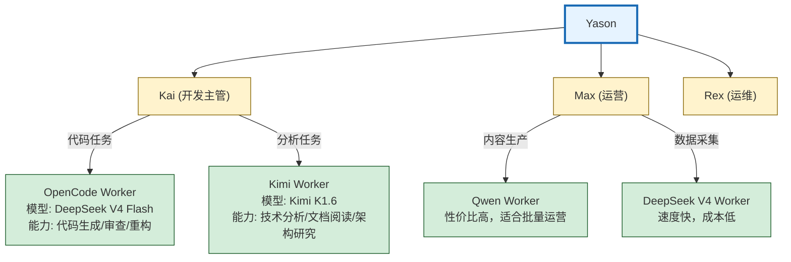
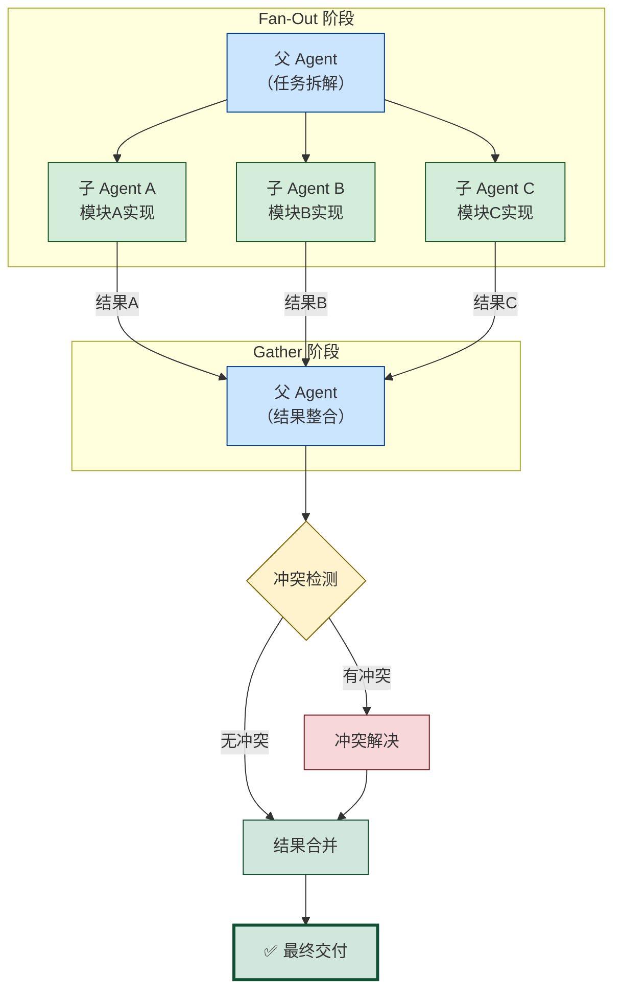

## 一个人忙不过来的Kai

Kai的效率问题发生在第三个月。

Yason给Kai布置了一个中型任务：重构用户通知模块，同时写API文档，同时Review另一个Agent的PR。三个任务并行。

Kai的反应跟人类同事一模一样——"好的，我开始做。"

然后Kai就卡住了。

它不是能力不够，是**上下文窗口不够**。三个任务的信息挤在一个上下文里，Kai开始混淆："这个API文档是给新模块写的还是给旧模块的？""我review的这个PR，跟重构任务冲突吗？"

Yason当时没意识到问题，以为Kai只是需要更多时间。直到他看了Kai的执行日志：

```
09:00 - 开始重构通知模块
09:15 - 切换到API文档任务（Yason说"尽快"）
09:20 - 切换到PR review（新任务优先）
09:45 - 回到重构，发现忘了重构思路，重新读代码
10:00 - 又切换到API文档
```

一上午，Kai切换了7次任务，每次切换都有"重新加载上下文"的成本。

> **人类的多任务切换有"切换成本"——从代码写到开会，大脑需要15分钟重新进入状态。Agent也一样——每次切换任务，上下文需要重新加载，Token成本翻倍。**

## 工业界的子Agent实践

Yason在设计子Agent架构之前，研究了工业界已经跑通的模式。

**OpenAI Codex的Manager-Worker模型**是最直接的参考。Codex可以创建一个Manager Agent和最多8个Worker Agent，每个Worker运行在独立的云端沙箱中，拥有隔离的工作目录（worktree）。Manager负责拆解任务和分配，Worker只负责执行。

关键设计是**隔离的工作目录**——每个Worker只能看到自己的代码副本，不会相互干扰。当所有Worker完成后，Manager通过Pull Request合并所有变更。

```
Codex Manager (任务拆解 + 质量审查)
  │
  ├─ Worker 1: 实现登录模块 (独立worktree)
  ├─ Worker 2: 实现注册模块 (独立worktree)
  ├─ Worker 3: 实现密码重置 (独立worktree)
  ├─ Worker 4: 写单元测试 (独立worktree)
  ├─ Worker 5: 写API文档 (独立worktree)
  │
  └─ 所有变更 → PR → 人工确认 → 合并
```

**Claude Code Agent Teams**则提供了另一种模式——子Agent之间**共享**工作区，通过文件锁（file locking）避免冲突。一个Agent在编辑文件时会给文件加锁，其他Agent可以读取但不能写入。这种模式适合需要紧密协作的场景（比如多个Agent一起重构一个模块），但Agent数量不宜超过5个。

Yason从这两者身上学到了各自适合的场景：**Codex模式适合"分头执行互不依赖的任务"，Claude Code Teams模式适合"协作处理同一份代码"。**

## 子Agent的诞生

Yason的解决方案：**一个Agent管太宽了，给它配手下。**

架构从扁平变成树形：



Kai不再是单纯的执行者。他变成了一个"小主管"——他自己负责架构决策和任务拆解，把具体的编码工作分配给OpenCode和Kimi来执行。

**为什么是OpenCode和Kimi？**

这不是随机选的。Yason发现不同的模型在不同任务上有各自的天赋：

| 任务类型 | 主模型 | 子Agent | 理由 |
|-|-|-|-|
| 代码生成 | Kai | OpenCode | 代码理解强，上下文窗口大 |
| 技术推理 | Kai | Kimi | 长文本推理强，适合分析 |
| 运营内容 | Max | Qwen | 性价比高，适合批量 |
| 数据采集 | Max | DeepSeek V4 | 速度快，成本低 |

每个主Agent（Parent Agent）拥有多个子Agent（Child Agent）。子Agent没有决策权——它们只负责执行具体任务，产出的结果交给父Agent做质量检查和整合。

## 每个子Agent的上下文隔离

子Agent架构中最容易被忽视的设计是**上下文隔离**。

Yason发现很多人在搭建子Agent时犯同一个错误：父Agent把整个对话历史传给子Agent。结果是子Agent的上下文被无关信息污染，成本翻倍，质量却没有提升。

正确的做法是：**每次创建子Agent时，只给它一个干净的新上下文。父Agent只存储子Agent的"任务意图"和"结果摘要"，不存储子Agent的完整对话历史。**

```
# ❌ 错误：全量传递
parent_context = {
    "full_history": [...],  # 包含父Agent之前的所有对话
    "task": "写用户注册模块",
    "child_context": full_history + task  # 子Agent被污染
}

# ✅ 正确：上下文隔离
parent_context = {
    "active_tasks": {
        "child_1": {
            "task": "写用户注册模块",  # 只存意图
            "summary": "已完成登录、注册、密码重置三个函数",  # 只存摘要
            "token_cost": 4520
        },
        "child_2": {
            "task": "写单元测试",
            "summary": "覆盖率达92%，3个边缘用例待确认",
            "token_cost": 3810
        }
    }
}

# 子Agent自己的上下文是干净的
child_context = {
    "task": "写用户注册模块，具体要求：...",
    "conversation_history": []  # 从零开始
}
```

这个设计是Yason的Agent团队能从3个Agent扩展到10个Agent的关键。如果父Agent存储所有子Agent的完整历史，上下文窗口会随子Agent数量近似线性增长（每个子Agent约使父Agent Token ×2）。有了上下文隔离，父Agent的Token消耗是O(1)——无论多少个子Agent，父Agent只存意图和摘要。

> **上下文隔离是子Agent架构的基石。没有它，你每加一个子Agent，父Agent就多一分"记忆负担"。有了它，父Agent就像项目经理——知道每个人在做什么、做得怎么样，但不需要记住每个人的每一句话。**

## 真实配置：Kai + OpenCode + Kimi

Yason的Kai配置文件中，子Agent部分是这样的：

```yaml
# /opt/agents/kai/config.yaml
agent:
  name: Kai
  role: dev-lead

  # 子Agent配置
  children:
    - name: opencode-worker
      engine: opencode
      model: deepseek-v4-flash
      capabilities:
        - code_generation
        - code_review
        - refactoring
      max_retries: 3
      timeout: 300

    - name: kimi-worker
      engine: kimi
      model: kimi-k1.6
      capabilities:
        - technical_analysis
        - document_reading
        - architecture_research
      max_retries: 2
      timeout: 600

  # 任务分配规则
  routing:
    - match: type == "code" || type == "review"
      assign_to: opencode-worker
    - match: type == "research" || type == "analyze"
      assign_to: kimi-worker
    - match: type == "architecture" || type == "design"
      assign_to: self  # Kai自己做
```

这个配置告诉Kai：代码类任务丢给OpenCode，研究分析类丢给Kimi，架构设计类自己来。

## 父Agent vs 子Agent：权力边界

子Agent架构最关键的设计不是"怎么分配任务"，而是**父Agent和子Agent之间的权力边界**。

Yason设计了几条清晰的规则：

**父Agent的职责**：

- 拆解任务，分配给合适的子Agent
- 检查子Agent的输出质量
- 整合多个子Agent的结果
- 处理子Agent的异常和失败
- 向Yason汇报最终结果

**子Agent的职责**：

- 接收父Agent分配的任务
- 执行具体操作（写代码、分析文档）
- 向父Agent汇报结果
- 遇到无法处理的错误时上报（不是自己硬扛）

---

有一条规则是Yason反复强调的：**子Agent之间不直接通信。**

```
# ❌ 不允许：子Agent之间直接对话
OpenCode → Kimi: "帮我看看这个API文档"
Kimi → OpenCode: "好，这是文档内容"

# ✅ 正确：通过父Agent中转
OpenCode → Kai: "需要API文档支持"
Kai → Kimi: "给OpenCode提供这份API文档"
Kimi → Kai: "文档内容如下"
Kai → OpenCode: "文档在这里，继续写代码"
```

> **子Agent平级通信 → 信息流不可控 → Agent之间的误解反弹。父Agent中转 → 信息流可追溯 → 出问题知道找谁。**

## 分配策略：不只是"平均分"

给子Agent分任务不是简单地"谁闲着就丢给谁"。Yason用了一套成本意识的分派逻辑：

```
def assign_task(task, children):
    # 1. 能力匹配（子Agent必须能处理这个任务）
    candidates = [c for c in children if task.type in c.capabilities]

    # 2. 当前负载（不能超载）
    candidates = [c for c in candidates if c.current_load < c.max_load]

    # 3. 成本最优（同样能做，选便宜的）
    candidates.sort(key=lambda c: c.cost_per_task)

    # 4. 历史成功率（同样的模型，选成功率高的）
    candidates.sort(key=lambda c: c.success_rate, reverse=True)

    # 5. 分配
    return candidates[0] if candidates else self.handle_self(task)
```

这套逻辑的妙处在于——它不是死板的轮询分配。如果今天DeepSeek V4的API特别稳定，它就被多分一些任务；如果今天某个模型开始报错频繁，自动降权。

## Fan-Out/Gather模式：子Agent的协作模式

当子Agent数量超过2个后，Yason发现需要一种标准的协作模式来管理"一对多"的任务派发。他用的就是Fan-Out/Gather模式。



Fan-Out阶段：父Agent将一个大任务拆解为N个独立子任务，同时派发给N个子Agent。

Gather阶段：所有子Agent完成后，父Agent收集结果，做冲突检测和整合。

Yason的实现代码：

```python
async def fan_out_gather(task, children):
    # Fan-Out: 拆解任务
    subtasks = decompose_task(task, len(children))

    # 并行派发
    futures = []
    for i, child in enumerate(children):
        futures.append(execute_subtask(child, subtasks[i]))

    # Gather: 等待所有子Agent完成
    results = await asyncio.gather(*futures, return_exceptions=True)

    # 检查冲突
    conflicts = detect_conflicts(results)
    if conflicts:
        resolve_conflicts(conflicts, results)

    # 整合结果
    return integrate_results(results)
```

这个模式的关键在于子任务之间的**独立性**——如果子任务之间有依赖关系，Fan-Out/Gather就不适用（需要改为Pipeline模式）。Yason的经验是：**80%的编码任务可以拆解为独立子任务，适合Fan-Out/Gather。剩下的20%需要链式处理。**

## 递归陷阱：当子Agent有了子Agent

Yason碰到的第一个反模式是"递归陷阱"。

有个人问Yason："既然Kai可以有自己的子Agent，那Kai的子Agent能不能有自己的子Agent？"

Yason试了。

结果是灾难性的。

```
Kai → OpenCode Worker → Sub-Worker-1 → Sub-Worker-2 → ...
```

一条简单的"生成用户注册页面"任务，经过四层递归派发后，产生了42条中间消息、17个临时文件、2次冲突合并——最终输出的代码质量还不如Kai直接写的。

> **子Agent每深一层，沟通损耗和决策延迟指数级增长。Yason的经验法则：子Agent最多一层深度，不要再往下递归。**

## 社区的子Agent实现

如果你不想从零搭建子Agent架构，社区有多个成熟的开源方案：

**Claude Code /agent**：这是最简单的子Agent方案。在Claude Code中，输入`/agent "完成X任务"`就能创建一个子Agent来执行指定任务。子Agent有自己的上下文窗口，完成后结果自动返回主会话。Yason经常用这个来做快速的原型验证。

**LangGraph Sub-Graphs**：LangGraph支持在一个图编排中嵌套子图（sub-graphs）。每个子图是一个独立的Agent，有自己的状态管理和节点逻辑。Yason在需要复杂编排的场景（比如多步骤的数据处理管道）中使用LangGraph的子图功能。

```python
from langgraph.graph import StateGraph, SubGraph

# 定义一个子图Agent
sub_agent = StateGraph(AgentState)
sub_agent.add_node("analyze", analyze_node)
sub_agent.add_node("generate", generate_node)
sub_agent.add_edge("analyze", "generate")

# 在主图中嵌入子图
main_graph = StateGraph(MainState)
main_graph.add_node("code_agent", SubGraph(sub_agent))
main_graph.add_node("test_agent", SubGraph(test_sub_agent))
```

**AutoGen的子Agent**：Microsoft AutoGen支持嵌套的Agent团队（Team-in-Team），一个Team中可以包含其他Team作为子节点。适合需要多层抽象的场景。

Yason的建议是：**从最简单的开始。先用Claude Code /agent感受一下子Agent的工作方式，再根据需要迁移到更复杂的框架。**

## 子Agent架构的实战收益

经过一个月的运营，Yason对比了子Agent架构前后的KPI：

| 指标 | 扁平架构 | 子Agent架构 |
|-|-|-|
| 并行任务数 | 2-3个 | 5-8个 |
| 任务平均完成时间 | 45分钟 | 22分钟 |
| Token成本/任务 | \$1.20 | \$0.85 |
| Yason介入次数/天 | 8-10次 | 3-5次 |

Yason最意外的是**成本反而降了**——他原以为多一层Agent会增加开销。但实际情况是：子Agent用更便宜的模型处理专有任务（比如代码生成用DeepSeek V4 flash替代Kai用的Pro），总成本反而下降了。

> **子Agent架构的价值不是"做更多事"，而是"用更合适的资源做每一件事"。**

## 本章小结

- 子Agent架构不是"加人手"，而是"用更合适的资源做每件事"
- 扁平架构更简单但扩展性差，层级架构扩展性好但复杂度高
- 每个子Agent必须有独立的上下文窗口隔离——主Agent只存意图+摘要，不存完整历史
- Fan-Out/Gather是子Agent架构的核心模式，异步执行 + 结果合并
- 社区有现成的子Agent实现：Claude Code /agent、LangGraph Sub-Graphs、AutoGen

> **下一章预告**：Agent的能力边界在哪里——MCP工具链如何让Agent从"会说话的AI"变成"能动手的工人"。

*本文来自专栏《给AI当老板》，完整系列持续更新中：*[*GitHub - VokoForge/ai-prism*](https://github.com/VokoForge/ai-prism)

