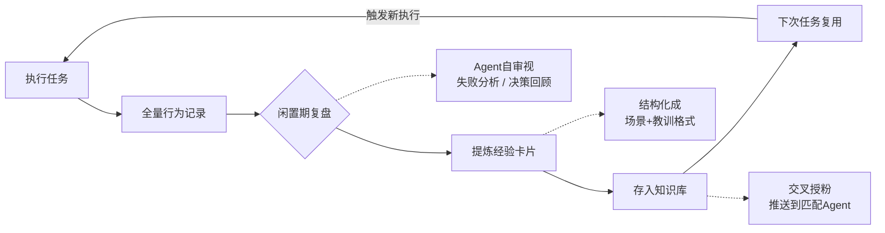

## Agent不会"记住"做过的事

有一个让人沮丧的事实，Yason花了两个月才接受：

**Agent做完一个任务后，不会从中学到任何东西。**

不是"学得慢"，是"根本不学"。Kai今天踩了一个坑，明天遇到同样的坑会再踩一遍。Max今天学了一个技巧，明天用的时候还是老办法。

这不是哪个Agent的问题，这是所有LLM的共性——**每次对话是独立的，上下文在对话结束时就被清空了。Agent没有长期记忆，也没有"经验积累"的机制。**

Yason的Max曾经重复踩同一个坑21次——第21次的时候，Max的日志里写着"这个错误我好像见过"，然后依然选择了错误的解决方案。

> **没有记忆的Agent团队，不是团队，是流水线。每个人的经验不会传递，每天都是新员工上班。**

## 自我进化的核心机制

Yason受够了"每周都要教Kai一遍同样的事"，他开始搭建一套Agent自我进化的机制。

这套机制的核心是四个字：**复盘重放**。



### 第一步：全量行为日志

每个Agent的每次任务，从收到指令到输出结果，全部记录到Git仓库。

```bash
# /opt/agents/logs/kai/2025-06/
├── TASK-001-execution.log       # 原始执行日志
├── TASK-001-decisions.json      # 决策记录
├── TASK-001-failures.json       # 失败记录+解决方式
├── TASK-002-execution.log
└── ...
```

关键是"决策记录"——Agent每做一个关键决策，都要记录"为什么选这个方案"和"有没有其他方案被否决"。

```json
{
  "task_id": "TASK-001",
  "decisions": [
    {
      "problem": "数据库连接池大小配置",
      "chosen": "connection_pool_size=20",
      "runner_up": "connection_pool_size=50",
      "reason": "当前用户量预计1000并发，20足够。太大浪费资源。",
      "result": "正确，峰值时连接数最高只到15"
    },
    {
      "problem": "缓存策略",
      "chosen": "Redis + 本地缓存双层",
      "runner_up": "仅Redis",
      "reason": "高频读取的数据本地缓存可减少网络IO",
      "result": "正确，平均响应时间从120ms降到45ms"
    }
  ]
}
```

### 第二步：闲置期复盘

Yason设置了一个cron任务——每天凌晨3点，所有Agent低负载时，触发复盘流程。

```bash
# crontab - Agent每日复盘
0 3 * * * /opt/agents/scripts/review-today.sh

# review-today.sh 内容
for agent in kai max rex; do
    echo "=== Reviewing $agent ==="
    # 分析今天的失败记录
    today_fails=$(cat /opt/agents/logs/$agent/$(date +%Y-%m-%d)-failures.json)

    # 让Agent自己看自己的失败记录
    $agent --prompt="这是你今天遇到的失败。分析每个失败：
    1. 失败原因
    2. 解决方式是否正确？
    3. 有没有更好的解决方式？
    4. 可以提炼成什么经验？
    输出为经验卡片格式。"

    # 将提炼的经验存入知识库
    $agent --save-experience >> /opt/agents/knowledge/$agent-experience.yaml
done
```

复盘不是Yason手动做，而是让Agent自己"反思"自己一天的工---Agent看自己的日志，分析自己犯的错误，提炼经验。

Yason发现一个有趣的模式：**Agent在复盘时，对自己当天的错误分析比Yason还透彻。** 因为它能看到每一个决策路径，而Yason只能看到最终结果。

### 第三步：经验卡片

复盘的结果被提炼成"经验卡片"——结构化的知识片段，存储在知识库中。

```yaml
# /opt/agents/knowledge/kai-experience.yaml
experiences:
  - id: EXP-042
    title: "NPM依赖版本锁定"
    scenario: "安装新依赖时，没有锁定版本号"
    consequence: "CI构建在不同时间产生不同结果"
    lesson: "所有新依赖必须用 --save-exact 参数锁定版本"
    tags: ["nodejs", "dependency", "ci"]
    discovered: "2025-06-10"
    applied_count: 7

  - id: EXP-043
    title: "大文件不要用JSON"
    scenario: "试图用JSON.parse()处理500MB的日志文件"
    consequence: "OOM，进程被kill"
    lesson: "超过100MB的文件用流式处理，不要一次性加载"
    tags: ["performance", "memory"]
    discovered: "2025-06-11"
    applied_count: 4
```

经验卡片的核心设计是"场景+教训"结构——不是抽象的规则，而是**在什么情况下遇到了什么问题，应该怎么做**。Agent在接到新任务时，会先检索知识库，看有没有匹配的经验。

### 第四步：交叉授粉

Agent A的经验可以传递给Agent B吗？Yason的设计是"可以，但不自动"。

```
Kai的经验卡片:
  EXP-042: "NPM依赖版本锁定"

Max会遇到这个问题吗?
  ← Max不用NPM → 不需要

Kai的经验卡片:
  EXP-038: "API限流时退避策略不要用固定间隔，要用指数退避"

Rex会用API吗?
  ← Rex也会调用外部API → 需要

Rex的知识库接收到EXP-038:
  "来自Kai分享的经验：API限流时用指数退避...已采纳"
```

Yason设计了一个"经验推荐引擎"——每周自动扫描所有知识库，找出跨Agent适用的经验，推送到目标Agent的知识库中。

```python
def cross_pollinate():
    all_experiences = load_all_experiences()
    for agent in agents:
        current_tags = agent.get_knowledge_tags()
        for exp in all_experiences:
            # 如果经验标签和目标Agent的能力匹配，且Agent还没有这条经验
            if exp.tags & agent.capability_tags and exp.id not in agent.knowledge:
                # 推送
                agent.knowledge.append(exp)
                log(f"{agent.name} 从 {exp.source} 获得了经验 {exp.id}")
```

## Compaction策略的演进

经验卡片只是Yason记忆系统的一部分。更大的挑战是：Agent的对话上下文越来越长，怎么压缩才能保留核心信号？

Yason的Compaction策略经历了四个阶段：

**阶段1：简单截断（Truncation）**  
最早的做法——上下文超过限制时，直接砍掉最早的部分。  
代价：关键决策信息经常被丢掉。Agent忘记了自己在做什么，然后开始"幻觉"。

**阶段2：结构化总结（Structured Summarization）**  
把早期的对话内容总结成结构化摘要：

```
原始对话（5000 tokens）→ 摘要（200 tokens）
- 已完成的决策：3个
- 待处理事项：2个（PR review, 数据库迁移）
- 当前状态：等待Max的API文档
```

改进：核心信息保留了，但失去了细节推理链。

**阶段3：锚定迭代总结（Anchored Iterative Summarization）**  
Yason在阶段2上做了改进——每次总结时"锚定"关键决策节点，保证这些节点的完整信息不被压缩。同时，Agent在每次总结前会先问自己："这条信息对我后续决策还有没有用？"只保留有用的。

**阶段4：ACON（来自Microsoft论文）**  
2025年末，Microsoft发表了一篇关于Agent上下文压缩的论文——ACON（Adaptive Context Optimization for Agents）。ACON的核心思想是：不用固定的压缩策略，而是根据Agent当前任务的类型和状态，动态选择压缩策略。

```
ACON的策略选择：

代码生成任务 → 保留函数签名、已有代码片段、测试结果
文档写作任务 → 保留提纲、已经确定的术语、审阅意见
分析研究任务 → 保留假设、数据集摘要、关键发现
调试修复任务 → 保留错误栈、已尝试的方案、失败原因
```

Yason在2026年初把他的Compaction策略升级到了ACON方案的简化版——任务类型识别 + 动态压缩策略选择。对比阶段1（简单截断），阶段4的Compaction方案保留了约85%的信号量，而Token消耗只有原来的30%。

> **Compaction不是"删东西"，而是"知道什么东西不能删"。好的Compaction策略，让Agent的上下文永远只装它当前最重要的事。**

## 自愈的涌现：群体智能

Yason发现了一个有趣的现象——当Agent数量超过一定阈值（他经验中是5个以上），一种"自愈"能力会自发涌现。

这不是他设计的，是**涌现出来的**。

具体表现是：当某个Agent出现异常行为（比如Kai开始输出不合理的代码），其他Agent会注意到并做出反应。

```
场景：Kai的代码质量突然下降

09:32 Kai: 提交了一段代码，SQL查询没有参数化
09:33 Rex (监控Agent): 检测到Kai的提交中有SQL注入风险，
     自动创建了一个Blocking PR Review
09:34 Max: 注意到Rex的PR Review，暂停了依赖Kai输出的任务
09:35 Yason: 收到Rex的警报，"Kai的代码质量异常，建议检查"
```

Yason没有为"SQL注入检测"写过任何代码。Rex之所以能发现这个问题，是因为它在日常监控中积累了"好的代码应该长什么样"的经验，当Kai的输出偏离了这个经验基线，Rex就会发出警报。

这种现象在群体智能领域被称为**Stigmergy（信息素协作）**——每个Agent在环境中留下"痕迹"（代码提交、状态更新、警报），其他Agent感知到这些痕迹后自主做出反应，不需要中央调度。

Yason的团队里，这种"自愈"机制到第三个月才开始稳定出现。前提条件是：

1. Agent数量至少5个（太少没有群体效应）
2. 每个Agent都有自己的监控视角（不是所有Agent做同样的事）
3. 信息共享机制到位（状态同步、日志可读、警报可订阅）

> \*\*自愈不是写出来的，是长出来的。当你的Agent团队有足够多的个体，并且每个个体都有独特的视角时，群体智能会自发涌现。"

## 30天进化周期

Yason的Agent团队进化按照30天一个周期运转：

```
第1-7天: 采集期
  Agent记录所有行为，建立基线数据

第8-14天: 分析期
  复盘工具分析日志，提取可复用的经验

第15-21天: 整合期
  经验卡片写入知识库，更新System Prompt

第22-30天: 验证期
  对比基线数据，评估改进效果
```

**真实数据**：第一个周期（第1-30天），Kai的任务失败率从22%降到了9%；第二个周期（第31-60天），再降到了5%。到了第三个月，Kai在处理同类型的任务时，基本不再犯同样的错误。

> **Agent团队从"每次都重新开始"变成了"站在前一次的肩膀上"。每30天，团队的水平就上一个台阶。**

## 自动知识图谱构建

经验卡片是一种线性的知识存储方式，但Yason发现当卡片数量超过200张后，检索效率开始下降——Agent不知道检索到哪张卡片更相关。

他的解决方案是**知识图谱**：从Agent日志中自动提取实体和关系，构建一个结构化的知识网络。

```python
def build_knowledge_graph(logs):
    graph = KnowledgeGraph()

    for log in logs:
        # 提取实体
        entities = extract_entities(log.text)
        # entity: "用户认证模块", type: "module"
        # entity: "NPM依赖锁定", type: "practice"
        # entity: "502错误", type: "incident"

        # 提取关系
        relations = extract_relations(log.text, entities)
        # relation: "用户认证模块" → "使用" → "NPM依赖锁定"
        # relation: "502错误" → "发生在" → "用户认证模块"

        graph.add_entities(entities)
        graph.add_relations(relations)

    return graph
```

这个知识图谱让Agent的检索从"关键词匹配"升级为"路径导航"。比如Kai在处理"用户认证模块"的任务时，不仅会看到自己的经验卡片，还能通过图谱看到"用户认证模块"关联的"502错误"、"数据库连接池"、"JWT实现"等上下文信息。

Yason发现知识图谱比纯关键词检索的召回率提高了约40%，而且Agent更少做出与上下文矛盾的决策。

## Skills的版本化

Yason在经验体系上踩过最大的坑是**版本混乱**。

Kai的经验卡片在第三个月更新了十几个版本，有些是新加的，有些是修改的，有些是废弃的。但系统里没有一个地方记录这些变更历史。Yason经常发现Kai在用一个两个月前的旧版经验——因为旧版还没被替换掉。

教训是：**Skills也是代码，需要版本控制。**

Yason的解决方案很简单——把经验卡片库放到Git仓库里管理：

```bash
# /opt/agents/knowledge/
├── README.md
├── kai/
│   ├── v1.0-experiences.yaml     # 初始版本
│   ├── v1.1-experiences.yaml     # 新增5条经验
│   ├── v2.0-experiences.yaml     # 重构：重新分类标签
│   └── current → v2.0-experiences.yaml  # 软链接指向当前版本
├── max/
│   └── ...
└── shared/                       # 跨Agent共享的知识
    └── v1.0-general.yaml
```

每次经验更新走标准的Code Review流程：更新YAML文件 → 创建PR → Yason或Kai review → 合并到main → 软链接指向新版本。如果新版本有问题，回滚只需要改一下软链接。

Yason还建了一个简单的自动化测试：合并PR后自动用新的经验卡片跑一轮回归任务，对比新旧版本的完成质量。如果质量下降，CI直接阻止合并。

> **经验是Agent团队最重要的资产。对待资产的方式应该是：版本化、可审计、可回滚。和代码一样严肃。**

## 社区的自进化生态

Yason的自进化系统大部分是自己搭的，但在关键组件上，社区的开源方案帮了大忙。

**AutoGen的反思机制（Reflection）**：Microsoft AutoGen内置了Agent自我反思的能力——Agent完成任务后自动生成一份"反思报告"，分析自己的表现。Yason的复盘流程很大程度上参考了AutoGen的反思模式。

```python
# AutoGen的反思模式（简化）
from autogen import Agent, ReflectionMixin

class ReflectiveAgent(Agent, ReflectionMixin):
    async def execute_and_reflect(self, task):
        result = await self.execute(task)
        # 自动反思
        reflection = await self.reflect(
            task=task,
            result=result,
            prompt="分析你的执行过程：哪些地方做得好？哪些地方可以改进？"
        )
        # 保存经验和反思
        self.store_experience(reflection)
        return result
```

**LangGraph的Checkpoint/Resume**：LangGraph的持久化机制让Agent的进化变成了一个可追溯的过程。每次Agent执行到关键节点时，自动创建Checkpoint。如果后续Agent发现决策有误，可以回滚到任意Checkpoint重来。Yason在Rex的仿真任务中大量使用这个功能——一次仿真跑8小时，中间某个参数设置错了，不需要重跑，回滚到出错点就行。

**Skill库的社区共享**：GitHub上已经有社区维护的Agent Skill仓库。Yason的团队从社区Skill库中直接导入了"代码审查规范""API设计指南""CI/CD配置模板"等十几个预置Skill。这些是社区积累的最佳实践，比自己从零总结高效得多。

> **不要重复造轮子。经验积累不是"每个团队都从零开始摸索"，而是"站在社区经验的肩膀上，补上自己独有的那一层"。**

## 记忆压缩：从日志到技能

日志是原始的、细节的、噪音大的。经验卡片是提炼的、结构化的、可执行的。中间的转化，就是"记忆压缩"。

Yason的压缩流程：

```python
def compress_logs_to_skill(logs):
    # 1. 过滤噪音
    relevant = [l for l in logs if l.level in ["ERROR", "WARNING"] or l.type == "decision"]

    # 2. 聚类类似事件
    clusters = cluster_by_similarity(relevant)

    # 3. 提取通用模式
    skills = []
    for cluster in clusters:
        pattern = extract_pattern(cluster)
        skill = format_experience_card(pattern)
        skills.append(skill)

    return skills
```

这个过程不是完美的——有时候会提炼出太过具体的经验（"这个特定的bug怎么修"），有时候会提炼出太过通用的教训（"要注意代码质量"）。Yason的方法是**先粗提炼，再在复盘时让Agent自己过滤**。

## 进化的瓶颈

自进化不是万能的。Yason发现三个瓶颈：

**瓶颈1：数据质量天花板。** 如果Agent的日志里没有记录正确的决策信息，复盘就提炼不出好的经验。"垃圾进，垃圾出"——所以Yason强制要求每个Agent在任务执行时记录决策日志。

**瓶颈2：同类经验饱和。** 三个月后，Kai的"代码常见错误"经验库已经比较完善了，新提炼的经验越来越少，边际效益递减。这时候经验的改变不是增加新条目，而是优化已有条目。

**瓶颈3：跨领域迁移困难。** Kai在代码上的经验，很难直接迁移到Max的运营策略上。经验共享的好处更多体现在"通用方法论"层面（比如"多尝试几种方案再选择"），而不是具体技能层面。

> **自进化的终极形态不是Agent学会所有技能，而是Agent学会"如何学会新技能"。把"学会学习"本身变成一种可复用的能力，这才是经验体系真正的价值。**

## RL for Agents：自对弈优化

在自进化体系的最后一步，Yason开始探索一个更具野心方向——用强化学习（RL）优化Agent的决策质量。

传统RL的思路是"Agent在环境中执行动作，根据奖励信号调整策略"，这对Agent团队来说有一个天然的映射——Agent的每个决策（"选方案A还是方案B"）都是一个动作，任务是否顺利完成就是一个奖励信号。

Yason的实验方法：

```python
def rl_optimize(agent, task_pool, episodes=100):
    for episode in range(episodes):
        task = random.choice(task_pool)

        # Agent执行任务
        result = agent.execute(task)

        # 计算奖励
        reward = compute_reward(result)
        # 完成时间短 → +reward
        # 质量高 → +reward
        # Token消耗少 → +reward
        # 出错 → -reward

        # 更新Agent的决策策略
        agent.update_strategy(reward, task, result)
```

这个实验还在早期阶段，但Yason已经观察到一个有趣的模式：经过几十轮RL自对弈后，Agent开始学会在选择方案时更倾向于"保守但可靠"的方案，而不是"冒险但可能更好"的方案——Agent在用Token和自己的成功率做权衡。

> **RL for Agents还在早期，但它指向了一个终极方向：Agent不仅能从过去的经验中学习，还能通过"自我对弈"主动探索更好的策略。这个方向可能是Agent从"辅助工具"走向"自主智能"的关键一步。**

## 本章小结

- 自进化不是万能的——数据质量天花板、同类经验饱和、跨领域迁移困难是三个核心瓶颈
- Compaction策略有四个演进阶段：截断 → 结构化概要 → 锚定迭代 → ACON优化
- 多个Agent的交叉监控可以产生自愈的涌现行为（Stigmergy）
- Skills像代码一样需要版本管理——设计、实现、测试、归档的完整生命周期
- RL for Agents是自进化的终极方向，但仍在早期

> **下一章预告**：未来已来——当Agent团队成为标配，工作方式会发生什么变化？以及Yason对想要开始搭建Agent团队的人说的最后一句话。

*本文来自专栏《给AI当老板》，完整系列持续更新中：*[*GitHub - VokoForge/ai-prism*](https://github.com/VokoForge/ai-prism)

---

