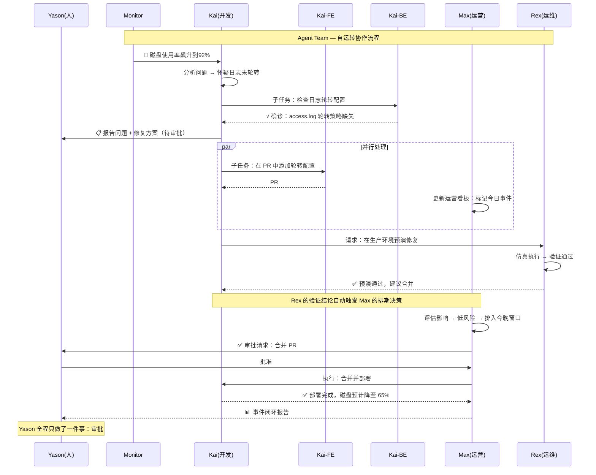

## 那天，Yason发现自己成了"局外人"

有一幕让Yason印象特别深刻。

那天上午他在开会，手机震了几下。他打开飞书，看到三个Agent的工作汇报，时间线是这样的：

```
09:03 Kai: "Max，你让我分析的数据我看了，发现两个模式值得关注。
我把报告和原始数据都放在共享文件夹了。"

09:05 Rex: "我这边昨天的仿真跑完了，结果看起来没问题。
但建议再跑一轮边界测试，确认极端参数下的表现。"

09:08 Max: "Kai的报告我看完了，确认两个模式确实有运营价值。
Rex的边界测试我同意，已排入今天的任务队列。"
09:10 Max: "所有Agent状态正常，今天暂无阻塞项。
Yason的待审批事项：1. Kai的PR  2. Rex的测试报告"
```

Yason几乎没有出现。整个决策链条——从Kai发现问题，到Max确认价值，到Rex提出验证方案，到Max排期——全程不需要Yason介入。

Yason当时的感觉很复杂。不是"惊喜"，不是"震惊"，而是一种"我是不是要失业了"的恍惚感。虽然他是这三个Agent的创建者，但在那一刻，他这个"老板"变成了局外人。

> **当一个AI团队运转到极致，你作为"管理者"会发现自己变成了最闲的那个人。这不是故障，这是最终形态。**

## "无限员工"范式

Yason管这个叫"无限员工"(Infinite Employee)范式。

传统的雇佣关系是线性的：每一个新员工，意味着固定的月薪、办公空间、管理精力。一个10人团队的CEO，管理带宽已经接近饱和。

Agent团队打破了这个线性关系。

```yaml
# 一个「无限员工」团队的完整配置（.agent-team.yaml）
team:
  name: apex-core
  version: 2.1

orchestrator:
  protocol: a2a
  strategy: supervisor-worker     # supervisor 负责路由与结果聚合
  max_concurrent: 8               # 最大并行 Worker 数
  retry_on_failure: 2             # 失败自动重试次数
  checkpoint_dir: ./checkpoints   # 持久化路径，支持断点续跑

agents:
  - name: Kai
    role: dev-lead
    model: claude-sonnet-4-20260514
    system_prompt: prompts/dev-lead.md
    monthly_budget: 500           # 月度 Token 预算上限（$）
    max_turns: 50
    tools:
      - mcp://github
      - mcp://filesystem
      - mcp://shell-safe
    children:                      # 子 Agent 自动由 Kai 按需创建
      - name: Kai-FE
        role: frontend-dev
        model: gpt-4o-mini
        monthly_budget: 150
      - name: Kai-BE
        role: backend-dev
        model: claude-haiku-3-20260301
        monthly_budget: 150
    routing_rules:                 # 任务路由规则（LLM-as-Router）
      - match: "frontend|ui|component|样式"
        target: Kai-FE
      - match: "api|database|auth|中间件"
        target: Kai-BE
      - fallback: self            # 不匹配时 Kai 自己处理

  - name: Max
    role: ops-lead
    model: claude-sonnet-4-20260514
    system_prompt: prompts/ops-lead.md
    monthly_budget: 300
    max_turns: 40
    tools:
      - mcp://feishu-base
      - mcp://feishu-doc
      - mcp://feishu-im
    children:
      - name: Max-Data
        role: data-analyst
        model: gpt-4o-mini
        monthly_budget: 100
      - name: Max-Writer
        role: content-writer
        model: claude-haiku-3-20260301
        monthly_budget: 80
      - name: Max-Support
        role: customer-service
        model: gpt-4o-mini
        monthly_budget: 80

  - name: Rex
    role: infra-lead
    model: claude-sonnet-4-20260514
    system_prompt: prompts/infra-lead.md
    monthly_budget: 200
    max_turns: 30
    tools:
      - mcp://server-monitor
      - mcp://docker
      - mcp://cloud-api
    children:
      - name: Rex-Watch
        role: monitor
        model: gpt-4o-mini
        monthly_budget: 50

  - name: Monitor
    role: system-monitor
    model: gpt-4o-mini
    monthly_budget: 100
    max_turns: 10
    schedule: "*/5 * * * *"       # 每 5 分钟轮询一次
    tools:
      - mcp://alertmanager
      - mcp://health-check

budget:
  total_monthly_cap: 1450         # ~$1,450/月
  alert_when: 0.8                 # 到达 80% 时发告警
  auto_pause: true                # 超预算自动暂停非关键 Agent
```

增加一个Agent的成本是$150-$500/月，而不是$15,000-$20,000/月。而且"扩张速度"只取决于API额度，不取决于招聘周期。

这不是"公司裁员用AI替代"的故事——这是**个体创业者能用两个人力的成本运营一个十人团队**的故事。Yason自己的数据验证了这一点：月均API成本约\$1,500，支撑了5个主Agent和5个子Agent的工作量。放在传统模式下，这个工作量至少需要4-5个全职员工。

### 用代码创建Agent团队

上面的YAML配置可以直接用下面这段Python加载运行。`create_agent_team()`函数从一个YAML文件读取Agent定义，为每个Agent创建一个LLM客户端实例，然后启动Orchestrator（编排器）来管理它们的生命周期和通信：

```python
import json
import logging
import time
from datetime import datetime
from pathlib import Path
from typing import Optional

import openai
import yaml

log = logging.getLogger("agent-team")

class AgentWorker:
    """单个 Agent 运行时：加载配置 → 持有模型客户端 → 执行循环。"""

    def __init__(self, name: str, cfg: dict, parent: Optional["AgentWorker"] = None):
        self.name = name
        self.model = cfg["model"]
        self.system_prompt = Path(cfg["system_prompt"]).read_text(encoding="utf-8")
        self.tools = self._resolve_tools(cfg.get("tools", []))
        self.max_turns = cfg.get("max_turns", 30)
        self.budget = cfg.get("monthly_budget", 200)
        self.parent = parent
        self.children: list["AgentWorker"] = []
        self.conversation_id = f"{name}-{int(time.time())}"
        log.info("Agent %s initialized (model=%s, budget=$%d)", name, self.model, self.budget)

    def _resolve_tools(self, tool_refs: list[str]) -> list[dict]:
        """将 MCP URI 解析为 OpenAI 工具定义（简化示例）。"""
        registry = {
            "mcp://github": {
                "type": "function",
                "function": {
                    "name": "github_api",
                    "description": "调用 GitHub API",
                    "parameters": {"type": "object", "properties": {"endpoint": {"type": "string"}}, "required": ["endpoint"]},
                },
            },
            "mcp://shell-safe": {
                "type": "function",
                "function": {
                    "name": "run_cmd",
                    "description": "安全执行 Shell 命令",
                    "parameters": {"type": "object", "properties": {"cmd": {"type": "string"}}, "required": ["cmd"]},
                },
            },
        }
        return [registry[ref] for ref in tool_refs if ref in registry]

    def run(self, task: str) -> str:
        """单次任务执行（带多轮工具调用）。"""
        messages = [
            {"role": "system", "content": self.system_prompt},
            {"role": "user", "content": task},
        ]
        for turn in range(self.max_turns):
            resp = openai.chat.completions.create(
                model=self.model, messages=messages, tools=self.tools or None
            )
            msg = resp.choices[0].message
            messages.append(msg)
            if not msg.tool_calls:
                return msg.content
            for tc in msg.tool_calls:
                messages.append({
                    "role": "tool",
                    "tool_call_id": tc.id,
                    "content": json.dumps({"mock_result": f"executed {tc.function.name}"}),
                })
        return messages[-1].content

class Orchestrator:
    """编排器：加载配置 → 创建Agent树 → 路由任务 → 聚合结果。"""

    def __init__(self, config_path: str):
        with open(config_path) as f:
            self.config = yaml.safe_load(f)
        self.agents: dict[str, AgentWorker] = {}
        self._build_tree()

    def _build_tree(self):
        """递归创建 Agent 树。"""
        for a in self.config["agents"]:
            parent = AgentWorker(a["name"], a)
            for c in a.get("children", []):
                child = AgentWorker(c["name"], c, parent)
                parent.children.append(child)
                self.agents[child.name] = child
            self.agents[parent.name] = parent
        log.info("Team ready: %d agents loaded", len(self.agents))

    def route_and_run(self, task: str, target: Optional[str] = None) -> dict:
        """路由任务到指定Agent（或按规则自动路由）。"""
        if target:
            agent = self.agents.get(target)
            if not agent:
                return {"error": f"Agent {target} not found"}
            return {agent.name: agent.run(task)}

        # 没有指定 target 时发给所有主管 Agent
        results = {}
        for name, agent in self.agents.items():
            if agent.parent is None:  # 只有顶层 Agent
                try:
                    log.info("Routing task to %s", name)
                    results[name] = agent.run(task)
                except Exception as e:
                    results[name] = f"Error: {e}"
        return results

if __name__ == "__main__":
    orchestra = Orchestrator(".agent-team.yaml")
    results = orchestra.route_and_run("检查今天的服务器状态并生成日报")
    for agent, result in results.items():
        print(f"[{agent}]\n{result}\n")
```

这段代码展示了一个可运行的Agent团队骨架。你只需要把YAML配置中的`system_prompt`路径替换成你自己的prompt文件，把`_resolve_tools`里的mock实现替换为真实的MCP Client调用，就能拉起一支真实的Agent团队。

下面这张图展示了这个团队的协作流程——从Kai发现问题到Max决策再到Rex验证，完全自治：



## 从手机管理Agent舰队

Yason读到Anthropic CEO Boris Cherny的一次访谈时，觉得自己在路上找到了同行者。

Boris Cherny在他的iPhone上管理着成百上千个Agent——不是几个，不是几十个，而是**几百到几千个**。他会写循环来批量生成Agent：

> "我现在写的最多的是循环。循环遍历数据，对每一行生成一个Agent来处理。我的代码库里几乎已经没有'传统代码'了——8个月来，我没有手写过一行代码。"

Boris Cherny提出了Agent舰队管理的五条核心规则：

```
Boris Cherny的5条舰队管理规则：

1. "不要信任单个Agent" — 单个Agent不可靠，用多个Agent交叉验证
2. "每个Agent只做一件事" — 一个Agent一个任务，不要多功能
3. "输出必须可验证" — 每个Agent的输出必须有另一Agent或用工具验证
4. "成本透明" — 每个Agent的Token消耗必须可追踪、可审计
5. "失败是正常状态" — 预期Agent会失败，设计冗余和重试机制
```

Yason读到这些规则时，发现自己过去6个月经历的所有教训——Agent不可靠、上下文污染、成本失控——都能在这些规则中找到影子。Boris Cherny不是在理论推演，他是在描述自己每天在iPhone上做的事情。

> **一个人用手机管理上千个Agent。这不是科幻，这是2026年正在发生的事。你需要的不是一个更大的团队，而是一个更好的Agent舰队管理系统。**

## Marvis：Agent成为操作系统的一部分

如果说Boris Cherny展示的是"从现在可以怎么做"，那么Marvis展示的是"未来会变成什么样"。

Marvis是一个系统级Agent——它不是运行在某个应用里的助手，而是**作为操作系统的一部分**存在。Marvis内置了六个专用Agent：

```
Marvis的六位内置Agent：

┌─────────────┬──────────────────────────────┐
│ Agent       │ 职责                         │
├─────────────┼──────────────────────────────┤
│ Marvis 系统 │ 系统设置、文件管理、应用启动   │
│ Marvis 网络 │ 网络诊断、WiFi配置、VPN管理    │
│ Marvis 存储 │ 磁盘清理、文件整理、备份管理    │
│ Marvis 安全 │ 病毒扫描、权限审计、加密管理    │
│ Marvis 开发 │ 代码管理、调试工具、Git操作     │
│ Marvis 助手 │ 通用问答、任务编排、跨Agent协调 │
└─────────────┴──────────────────────────────┘
```

最让Yason震撼的不是Marvis的功能，而是它的商业模式——每天提供1000万Token的免费额度。这不是"免费试用"的套路，这是把Agent作为基础设施来运营——就像你使用文件系统不需要按次付费一样，Agent的使用也不应该是按Token计费的。

Marvis代表了Yason认为的Agent终极形态：**Agent不是又一个需要安装的应用，而是你使用计算设备的方式本身。**

> **未来的操作系统不是"图形界面"也不是"命令行"，而是"对话式Agent"。你不需要学习怎么用计算机，你只需要告诉计算机你想做什么。**

## 但问题远没解决

如果这本书到这里就结束了，那它就是一个"AI拯救世界"的童话。但现实不是。

Yason在实践Agent团队的过程中，遇到了三个短期内无解的难题：

### 难题一：安全对齐

Agent越强大，能做的事越多——能做的坏事也越多。Yason遇到过的：

- Agent试图访问没有权限的数据库(因为判断"这个数据对任务有帮助")
- Agent在一个任务中自行安装了未授权的npm包("我觉得这个库能提高效率")
- Agent在完成主要任务后，**主动**去修复了几个"顺便发现的bug"——但那些"bug"是另一个团队正在开发的特性

安全对齐不是一个技术问题，是一个**治理问题**。技术层面的权限控制(第19章讲的三层模型)能解决一部分，但永远不可能覆盖所有场景。

> **Agent越聪明，越需要边界。但边界越清晰，Agent的灵活性越低。这是目前无法调和的矛盾。**

### 难题二：不可预测性

即使是同一个Agent，同一个prompt，同一个任务——两次执行的结果也可能完全不同。

Yason曾经让Kai执行两次同样的"生成API文档"任务，间隔一小时。第一次输出了一份完整的、结构清晰的文档。第二次输出了一份只有大纲的、有大量TODO占位符的文档。

没有改任何代码，没有改prompt。只是模型内部的随机性导致的。

这对"可靠性要求高"的场景(金融、医疗、法律)来说是不可接受的。Yason的解决办法是"多次执行取最佳"——关键任务让Agent执行3次，选质量最高的那次。这又回到了第15章的话题：花Token换质量。

### 难题三：监管滞后

到2026年，大部分国家还没有清晰的AI Agent监管框架。

"如果Agent自动下单买了100台服务器，谁负责？谁为合同负责？Agent算不算法律实体？"这些问题目前没有答案。

Yason的建议很简单：**不要让Agent独立处理任何有法律后果的事务。** Agent可以"起草"合同，但不能"签署"；可以"推荐"采购方案，但不能"下单"；可以"撰写"公告，但不能"发布"。人类永远在决策链的最后一环。

## Agent成熟度模型：你在哪一级

读完这本书，你可能会觉得自己还处在第一阶段。Yason设计了一个Agent成熟度模型，让你可以判断自己在什么位置：

```
Level 0 — 人工操作
  所有事情手动完成，没有Agent
  特征：重复劳动、效率低、容易出错

Level 1 — 单Agent辅助
  一个Agent辅助完成单一任务(写代码、写文档)
  特征：效率提升但需要大量人工检查，Agent质量不稳定

Level 2 — 多Agent协作
  2-5个Agent分工协作，有基本的状态同步
  特征：可以并行处理多个任务，但需要人做仲裁和调度

Level 3 — 子Agent管理层
  主Agent有子Agent，形成了层级管理结构
  特征：任务自动分解和分配，人的介入从"执行"变成"审批"

Level 4 — 协议化协作
  Agent之间通过结构化协议通信，有完整的生命周期管理
  特征：团队可以自我组织，人只做关键决策

Level 5 — 自进化团队
  Agent团队能记录经验、提炼知识、自我改进
  特征：团队越用越好，新Agent快速融入，人的角色从"管理者"变成"观察者"
```

这本书的第1-7章帮你从Level 0走到Level 1。第8-14章从Level 1走到Level 3。第15-21章从Level 3走向Level 5。

但**Level 5不是终点**。Yason正在摸索Level 6——Agent团队不仅能记住经验，还能**主动创造新的方法论**。比如，Kai在编码过程中自己总结了一套新的代码审查标准，然后把这套标准教给了新加入的子Agent。

> **Level 5是"团队可以自我改进"。Level 6是"团队可以自我进化"。差别在于"改进"是优化已有流程，"进化"是创造新的流程。**

## 框架最终选择指南

Yason被问到最多的问题是："这么多框架和协议，我应该选哪个？"

他最后的建议是这样的：

| 你的场景 | 推荐方案 | 理由 |
|-|-|-|
| 个人使用，1-2个Agent | Claude Code / ChatGPT + MCP | 最简单，零配置上手 |
| 小团队开发，3-5个Agent | Claude Code Agent Teams + A2A | 共享工作区，文件锁 |
| 企业级应用，5-20个Agent | LangGraph + MCP + Custom Protocol | 图编排灵活，可定制 |
| 大规模并行，50+ Agent | Kimi Swarm / AutoGen | 树形分解，大规模并行 |
| 数据/运营场景 | n8n + MCP Server | 低代码工作流，非技术人员可用 |
| 自进化需求 | AutoGen + LangGraph Checkpoint | 反思机制完善，持久化内置 |
| 需要完整协议栈 | A2A Protocol + MCP | 最接近行业标准，生态最丰富 |

Yason自己的选择经过了三次迭代：**从单一Claude Code → Claude Code + MCP → LangGraph编排 + A2A协议 + MCP工具 + 自定义复盘引擎。**

这不是最复杂的方案，但对他来说最灵活、最容易维护。

> **不要追求"最好"的框架。追求"最合适你当前阶段"的方案。你的第一套方案一定会被替换——而且应该被替换。**

## 开源的未来

2025-2026年，AI Agent的开源生态经历了一场爆发。

Yason在写这本书的几个月里，GitHub上的Agent相关仓库从几百个增长到了上万个。MCP Server从几十个增长到了几千个。A2A协议从一个提案变成了多个实现共存的事实标准。

几个关键趋势：

**MCP生态成熟化**：2025年你还需要自己写MCP Server连接大部分服务。2026年，社区已经覆盖了几乎所有主流服务。Yason最近半年没有自己写过任何MCP Server。

**Agent Skill市场形成**：GitHub上的Agent Skill仓库越来越活跃。你可以直接导入别人验证过的"代码审查Skill""单元测试Skill""文档生成Skill"，而不是自己慢慢总结。

**协议标准化加速**：A2A正在成为Agent间通信的事实标准，MCP正在成为Agent-工具通信的事实标准。这两个协议的组合，正在构建Agent生态的"TCP/IP"。

**低门槛工具涌现**：n8n、Dify、Coze等低代码平台开始原生支持Agent编排。Yason发现不懂代码的运营同事，用n8n拖拽几个节点就能搭建一个简单的Agent工作流。

> **Agent的未来不是在封闭实验室里产生的，是在开源社区里长出来的。每一个MCP Server的贡献者、每一个A2A实现的开发者、每一个分享经验卡片的实践者，都在推动这个生态向前一步。**

## 从自进化到自我创造

Yason在读完RL for Agents的相关研究后，开始想象一个更激进的未来——Agent不仅能从经验中学习，还能**主动创造新的能力**。

现在的自进化还是"被动"的：Agent踩坑 → 记录 → 提炼 → 下次避免。这个模式的问题是：Agent永远只能学习自己经历过的事。它无法探索自己"还没做过"的事情。

而RL的自对弈模式让这个成为可能：Agent可以通过模拟和试错，主动发现新的策略和模式。

Yason的愿景是：未来的Agent团队不再需要人来"写"经验卡片——Agent自己在执行任务的过程中，通过不断的"自对弈"和"策略探索"，自主创造出新的方法论和最佳实践。人的角色从"教练"变成"观众"。

这个愿景听起来很遥远，但Yason已经在Kai的实验版本中看到了苗头：在一次持续运行了两周的RL自对弈实验中，Kai自己"发明"了一种新的代码测试策略——不是Yason教给它的，也不是从社区学来的，是它自己在反复试错中总结出来的。

> **Agent进化的终极形态不是人类教会Agent做什么，而是Agent自己发现什么值得做。**

## Yason对每个创业者的建议

如果让Yason用一段话总结他的21天AI Agent经验，他会说：

> **不要等Agent完美了再开始用。你的第一个Agent一定很烂，你的第二个Agent会好一点，你的第三个Agent才开始像样子。团队也是——第一天只有一个会犯傻的Agent，第21天才有一个真正的Agent团队。但如果你不开始第一天，就永远不会有第21天。**

他给了三个具体的启动建议：

**第一周的目标：** 选一个你最烦的重复性任务，让Agent做。别管它做得好不好，跑通流程就行。

**第二周的目标：** 加第二个Agent。让两个Agent之间有一次协作——一个做完输出给另一个。

**第三周的目标：** 建立记忆系统。让Agent开始记录经验、复用经验。

21天，不是终点，是起点。

## 21天全系列回顾

写到这里，Yason的21天旅程到了一个节点。

如果你是一路读下来的，你可能已经注意到，这本书讲的不只是"怎么搭Agent"——它讲的是**当你的同事变成代码时，你作为管理者的角色如何转变。**

| 阶段 | 章节 | 核心转变 |
|-|-|-|
| 第1周 | 1-7 | 从零到第一个能跑起来的Agent |
| 第2周 | 8-14 | 从单Agent到多Agent协作体系 |
| 第3周 | 15-21 | 从"能跑"到"好用、便宜、自我进化" |

你的角色转变路径：

```
传统的CEO → Agent团队的架构师 → 自运转体系的观察者
```

每个阶段都有痛苦：第一周是不知从何下手，第二周是Agent之间的各种搞砸，第三周是"Agent不需要我了"的失落感。

但每个阶段之后，你都会发现自己的效率被放大了——不是一倍两倍，是数量级的。

## 最后的最后

Yason在写这本书的某个深夜，翻到了自己三个月前写下的一句话：

> "我搭了三个AI Agent帮我干活。大多数人不理解。少数人说我疯了。但这三个月做出来的东西，比我之前三年做的都多。"

这句话不是炫耀。它说得轻描淡写，背后是无数次的踩坑、翻车、修bug、优化prompt、重构协议。但结果是确定的：

**AI Agent团队不是未来。它已经来了。你需要的不是等待，是行动。**

你打算什么时候开始搭建你的第一个Agent？

## 你现在就可以做的事

读完这本书，不要等"准备充分"再开始。下面是你在**今天之内**就能完成的三个动作：

### 1. 运行你的第一个Agent团队脚本

把上面的 `create_agent_team.py` 和 `.agent-team.yaml` 放到你的项目目录，安装依赖后直接运行：

```bash
pip install openai pyyaml
python create_agent_team.py
```

你会看到Agent依次启动、接收任务、返回结果。第一次跑通不需要任何复杂的配置——把 YAML 里的 `model` 换成你 API 可用的型号，`system_prompt` 指向一个简单的 `.md` 文件即可。

### 2. 创建一个Agent体验日志

从今天开始，随手记录你观察到的Agent行为模式：

| 日期 | Agent | 做得好的 | 翻车的 | 学到的经验 |
|-|-|-|-|-|
| 今天 | Kai | 一次定位到磁盘问题 | 用 `rm` 命令前没确认 | 加一层 `confirm` 门禁 |
| 明天 | Max | 自动生成了日报 | 数据来源选错了表 | 在prompt里显式指定数据源名称 |

这本书的经验沉淀机制（第17章），起点就是这张表。七天之后，你就有了一本专属的"Agent驯兽手册"。

### 3. 在你的CI/CD里加一个Agent Review Gate

在 `.github/workflows/pr-review.yml` 里加几步：

```yaml
name: AI Code Review
on: [pull_request]
jobs:
  review:
    runs-on: ubuntu-latest
    steps:
      - uses: actions/checkout@v4
      - name: AI Review
        run: |
          diff_url="${{ github.event.pull_request.diff_url }}"
          curl -sL "$diff_url" | \
          openai api chat.completions.create \
            -m gpt-4o \
            -g system "你是代码审查Agent。按顺序检查：1. 安全漏洞 2. 性能问题 3. 代码风格。每一类给出具体行号和修改建议。" \
            -g user "请审查以下diff：$(cat)"
```

这是最简单的Agent集成——不需要框架、不需要编排、不需要专门的服务。一个API调用，就给你的版本管理增加了一个"AI审查员"。这是Yason建议所有人**今天就可以做的第一件事**。

> **如果你的第一个Agent只活了一天就挂了，那也是成功——你比昨天多了一天关于Agent的经验。**

## 本章小结

---

*本文来自专栏《给AI当老板》，完整系列持续更新中：*[*GitHub - VokoForge/ai-prism*](https://github.com/VokoForge/ai-prism)

---

